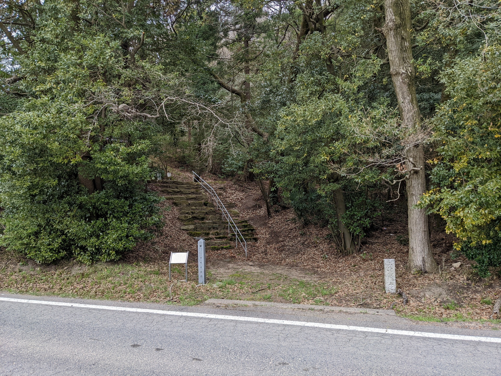
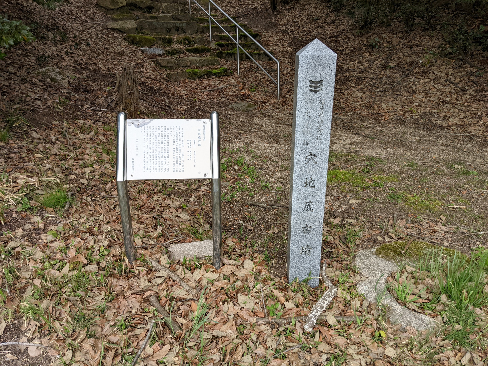
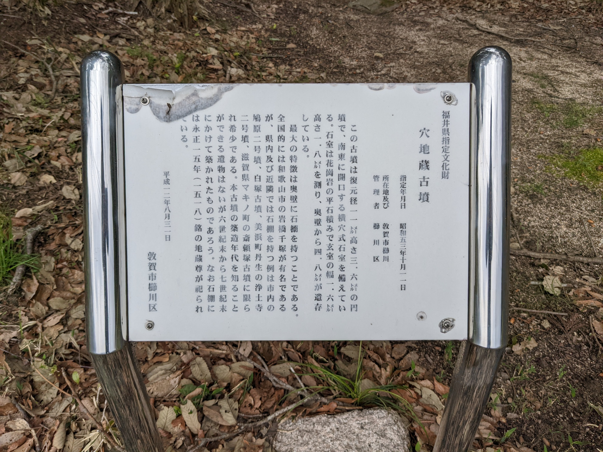

福井県の敦賀市で半日ほど時間が空いたので、レンタカーを借りて少し回りました。

検索するといくつか古墳が見つかったので、そこからいくつか確実に簡単に見れそうなところをピックアップして回りました。この穴地蔵古墳はその中のひとつです。

## アクセス

敦賀市街地からだと気比松原の方に向かい県道33号線を進み、井の口川を超えて交差点を左に曲がった山側にあります。車だと右側に注意しておくと石碑が道路脇にあって見えますのでわかりやすいと思います。駐車場はないので道端に止めることになるかと思います。

公共交通機関だとコミュニティバスの[②常宮線](https://www.city.tsuruga.lg.jp/communitybus/route/route02.html)で花城バス停が最寄だと思いますが、この線は1日3本ほどなのでちょうどの時間がない場合は[⑤松原線](https://www.city.tsuruga.lg.jp/communitybus/route/route07.html)で松葉町で降りても10〜15分程度歩くと着くのではないでしょうか。私は車だったのでわかりませんけど。



こんな感じで山側に見えます。

## 古墳

