この日巡った長岡京市の古墳の中で一番難易度が高かったのがこの長法寺七ツ塚古墳群（ちょうほうじななつづか）。本当に普通の住宅地にあります。近所の子供が遊び、その子供と一緒にいる親の間や、散歩しているご老人とすれ違いながら、「この見たことない人だれ？」という視線を受けながら古墳に向かうことになります（もしかしたら古墳見に来る人が多くて「あ、またか」って感じなのかも? 知らんけどw）。

道路から見える1号墳（私有地らしい）、公園の横にある5号墳、駐車場の真ん中にある6号墳はいいんですよ、すぐにわかるから。

まずはこの1号墳。地主らしき方が農作業してたし、まあ見たとおりなのでこれでいいかってことで近づいていません。そして駐車場の真ん中で居心地が悪そうに鎮座してるのが6号墳。

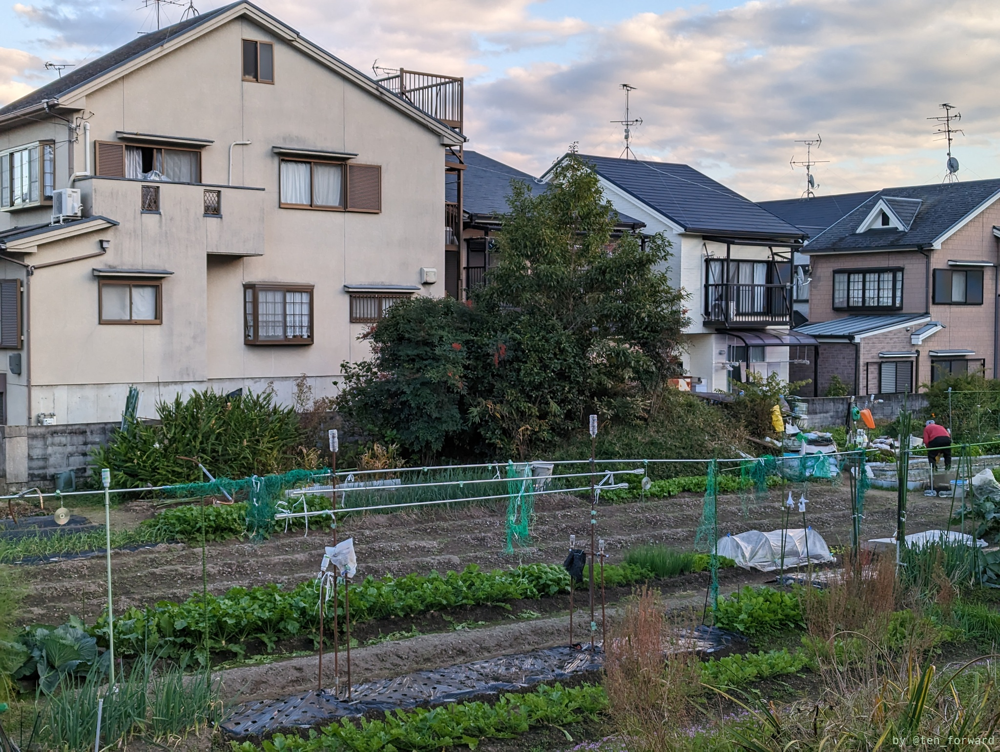
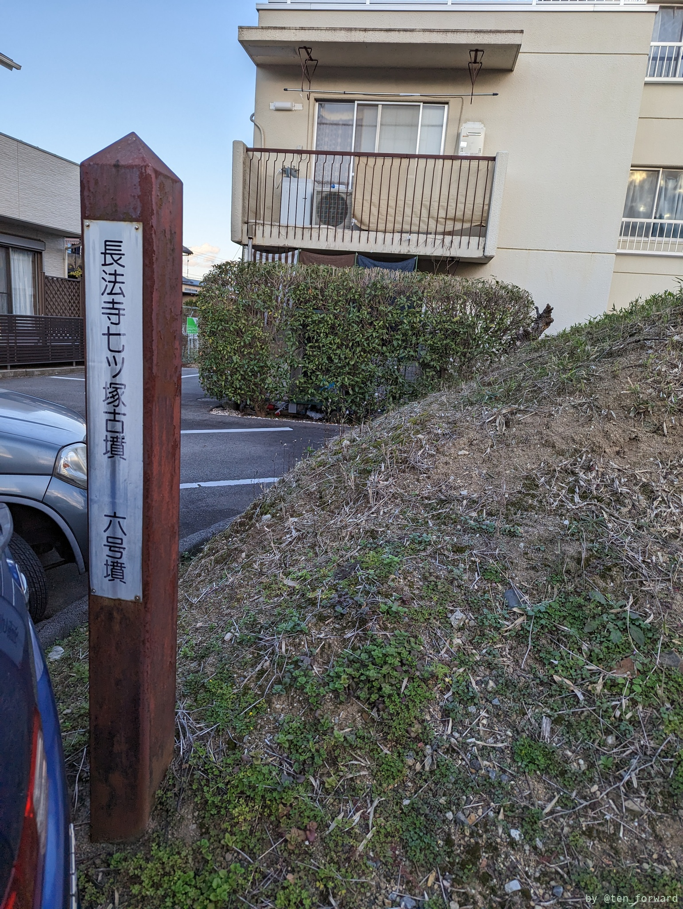

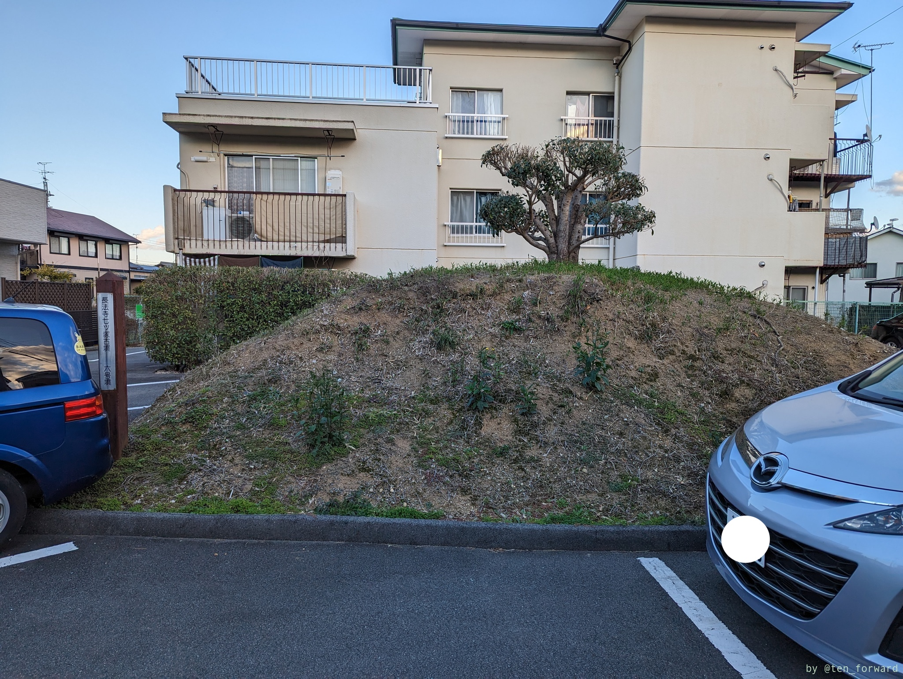
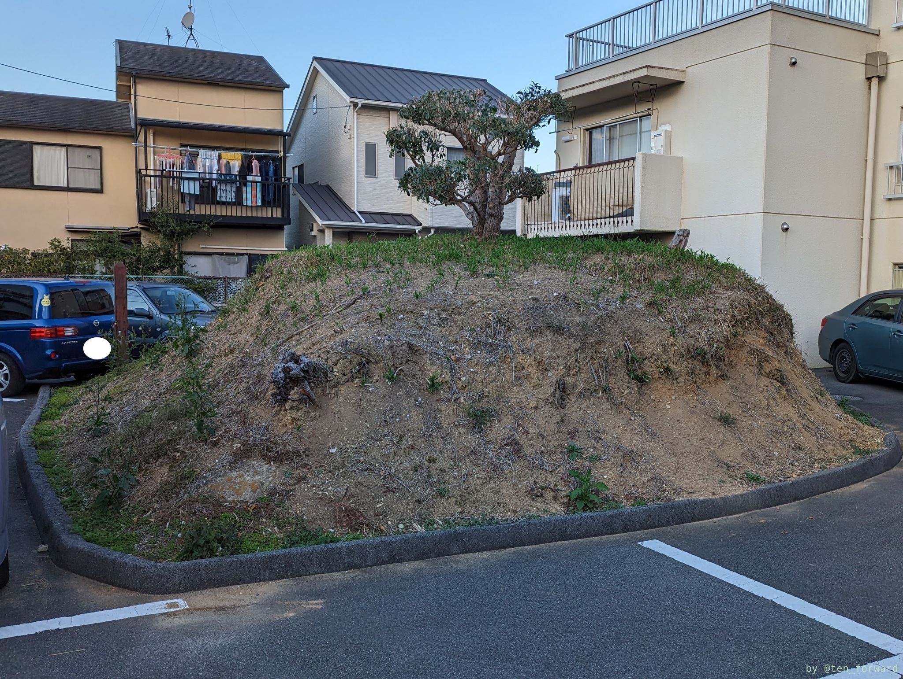

児童公園の横にあるのでアクセスも楽な方墳の5号墳。きれいに残ってますね。

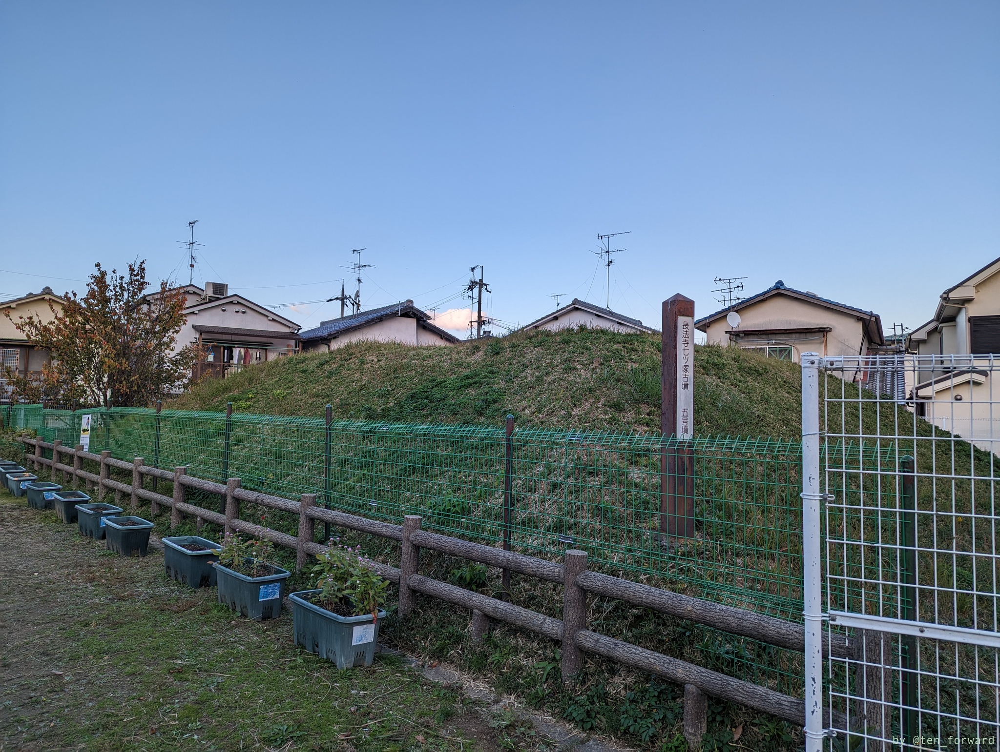
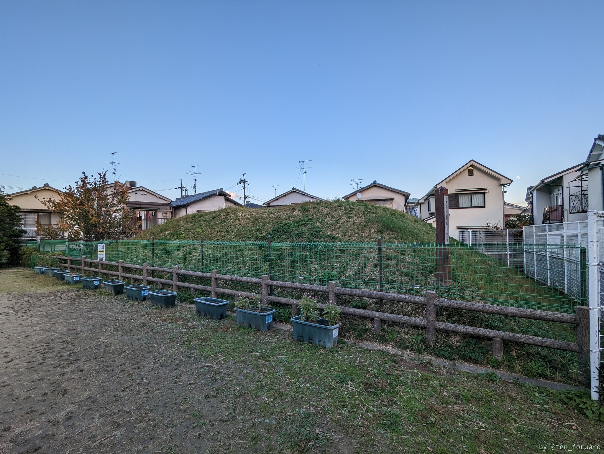

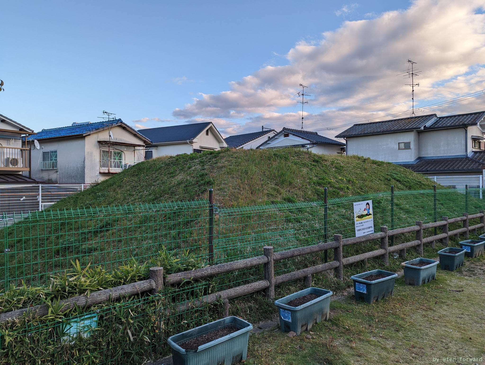
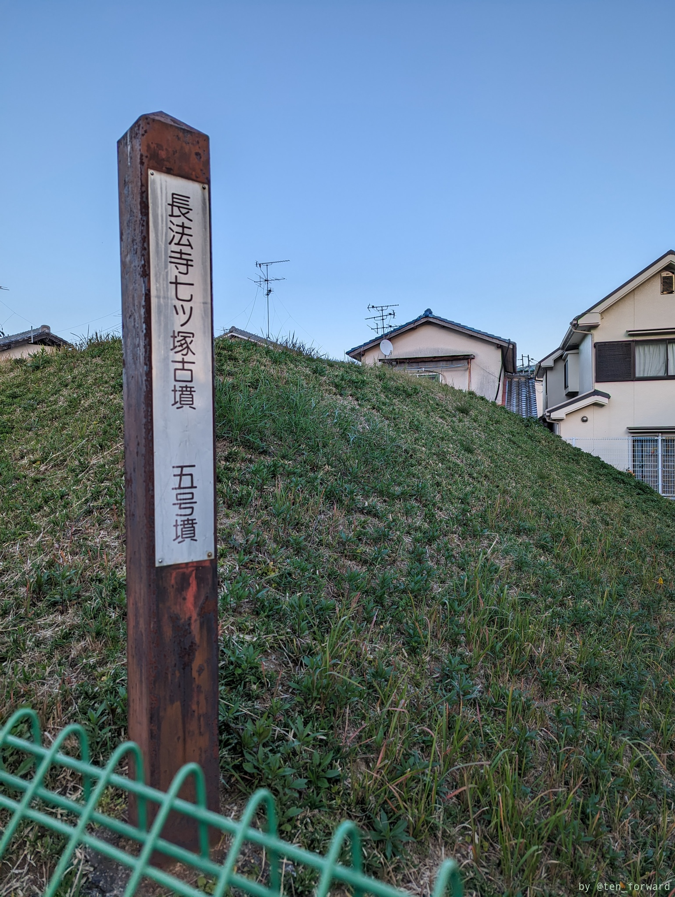

さて、アクセスはできるけど難関なのが 2 号墳です。まずアクセスの道がわからない。これは地図で矢印を書いたように行き止まりで家が並んでいるところの家と家の間を泥棒気分を味わいながら進みます。最後に曲がるところが、次の画像の入口の画像のような感じです。古墳の位置は Google Map の位置とは少しずれていて（修正の提案をしたので、そのうち正確な位置に移動してるかも?）、ここは表側の家があります。

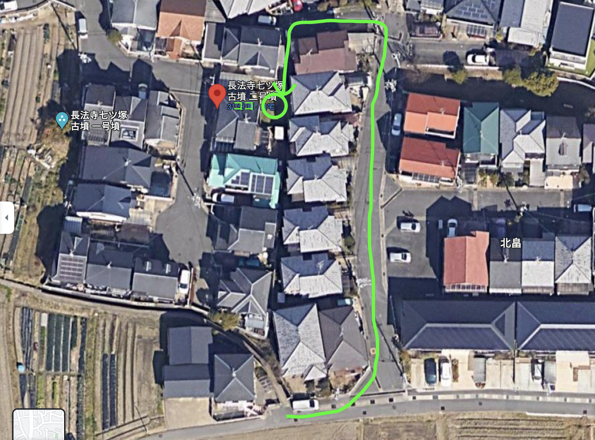
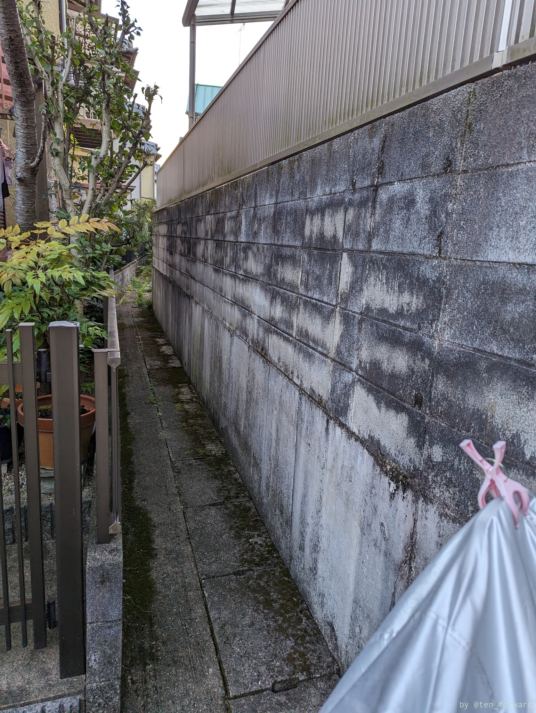

もう、横の家の窓から家の中が見えるくらいのところを歩きます。歩いてるときに通報されるのでは？と思いながら。で、出てきた 2 号墳は特に何があるというわけもない古墳です。案内板は裏から見ることになります。案内板の表は先ほど説明した表側の家のガレージ越しに見えます。もしくは古墳自体に上がれば。私が行ったときは雑草が茂っていて上には上がれる感じではありませんでした。

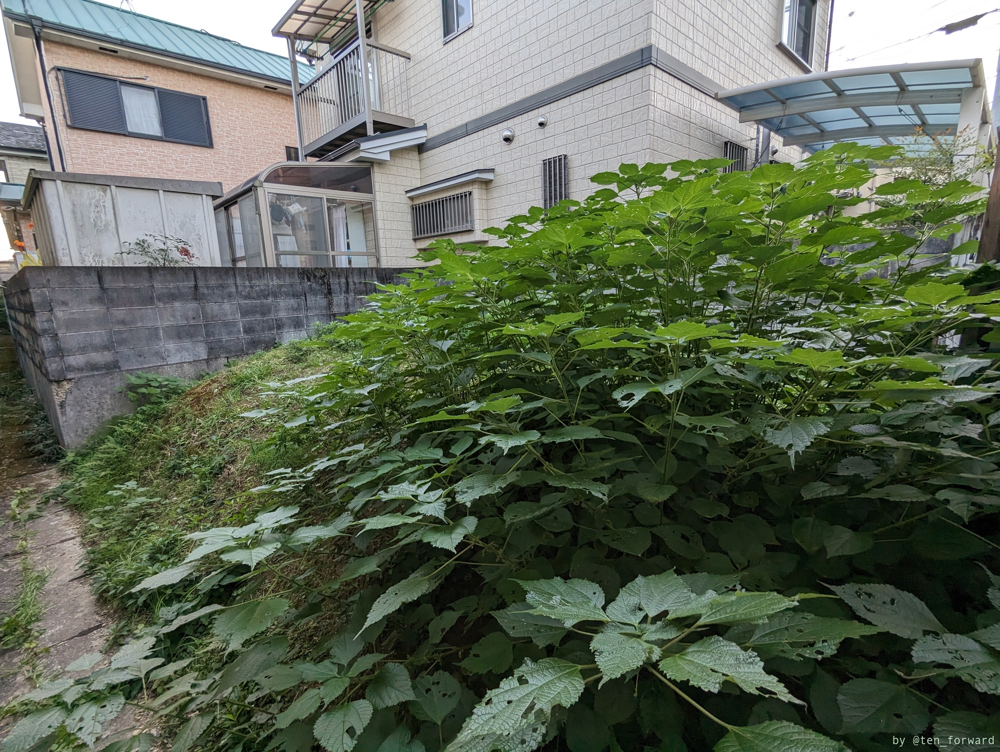
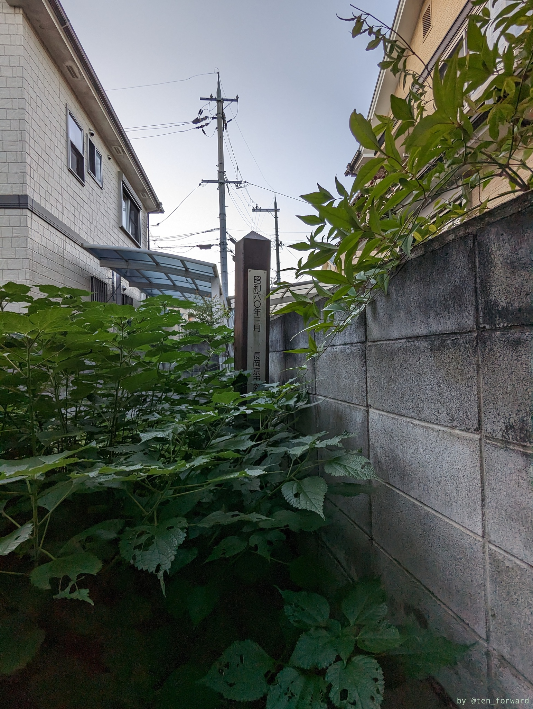

もっと難易度が高いのが 7 号墳です。本当に民家に囲まれていて、人の敷地内を通らなければアクセスできません。7 号墳自体も緑のシートで覆われており、案内板らしきポールもカバーが被せられています。囲まれていてアクセスできないからでしょうか。人の家のガレージを盗撮してる気分になるので撮影はしませんでした。7 号墳の情報自体は、Google で「長法寺七ツ塚古墳」で調べると 7 号墳の話も出てきます。

## 参考
* [長法寺七ツ塚古墳群(ちょうほうじななつづかこふんぐん)](http://nagaokakyo-maibun.or.jp/kofun-nanatuduka.html) （長岡京市埋蔵文化財センター）
* [長岡京裏百景](https://funakoshiya.net/urahyakkei/ura089.htm) （極楽page）
