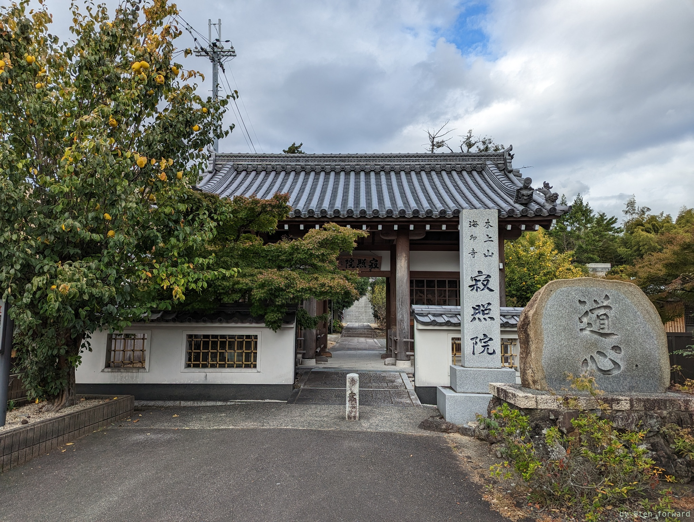
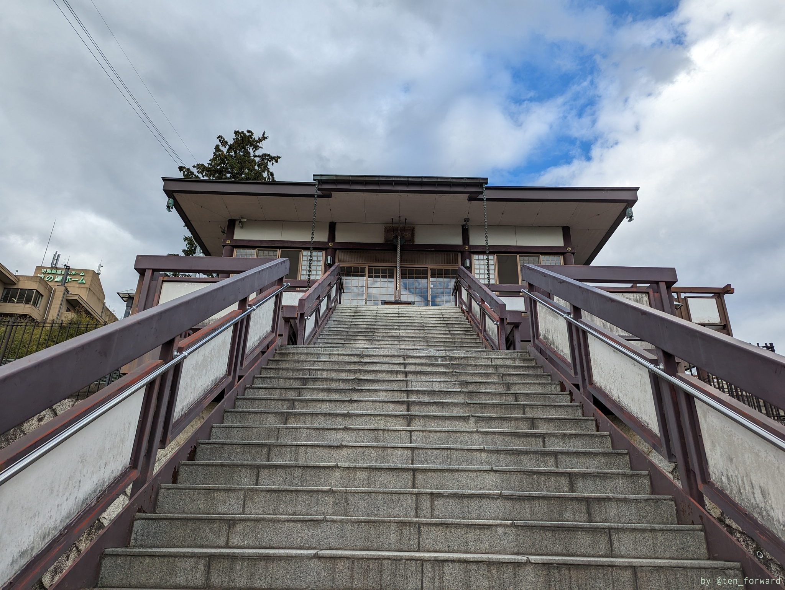
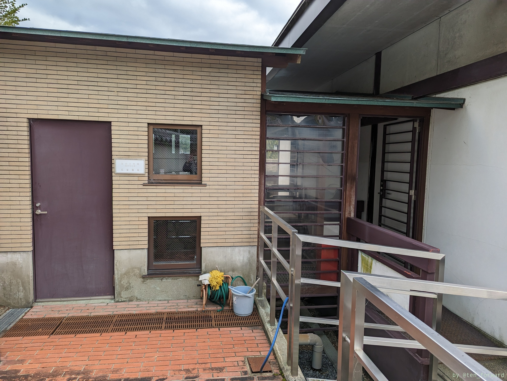
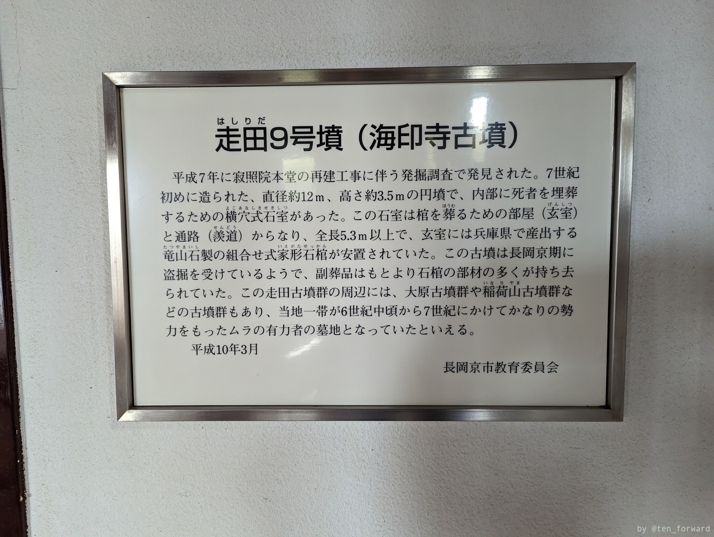
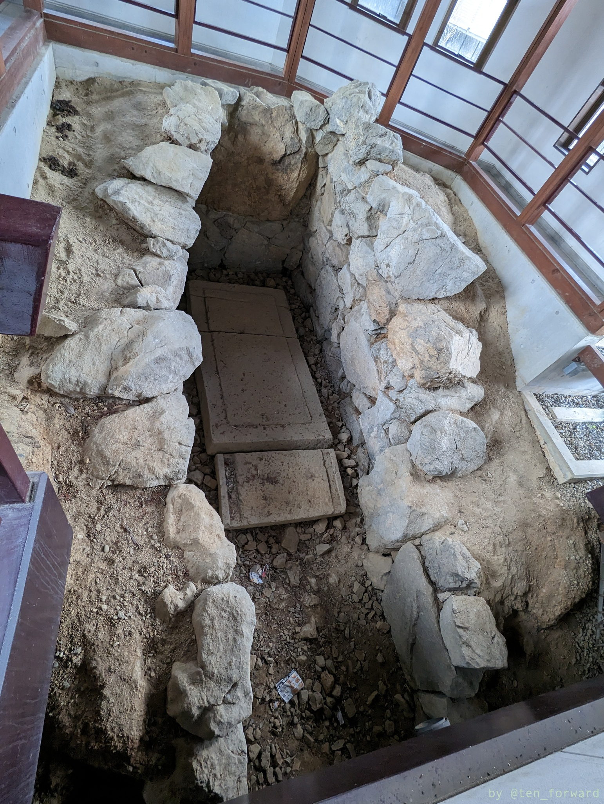
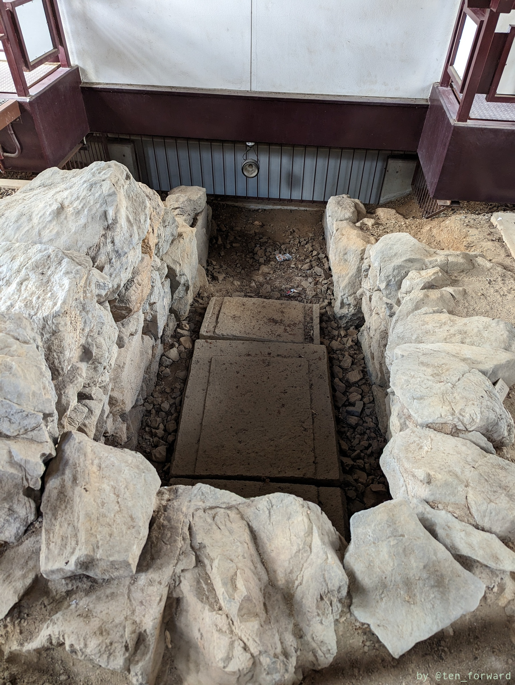
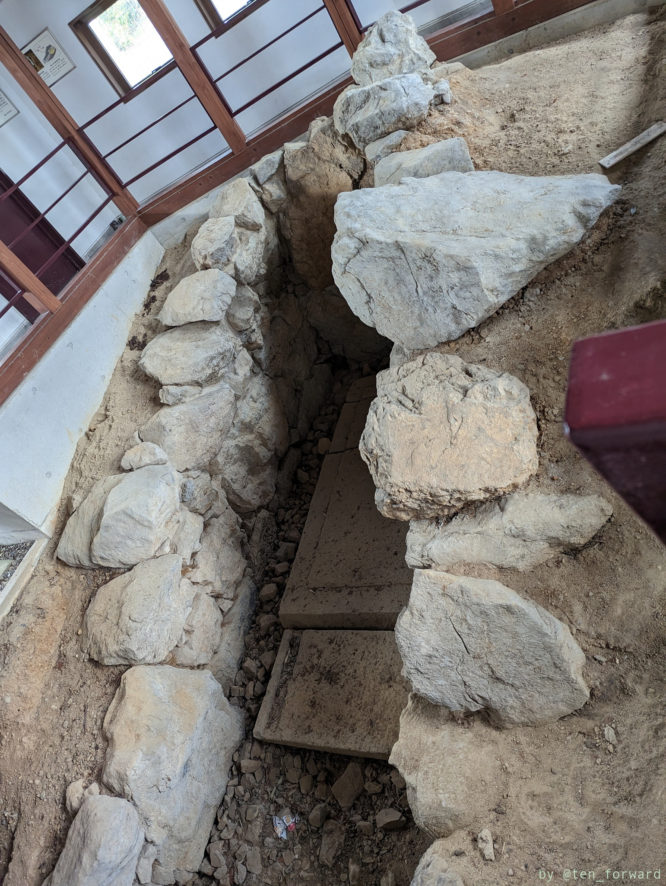
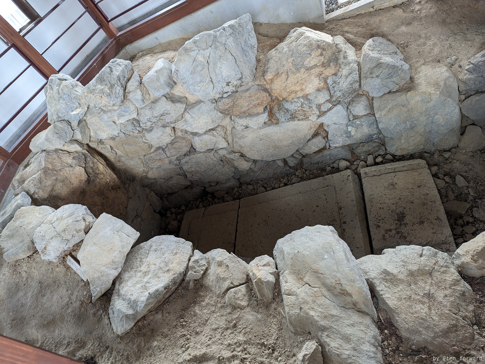
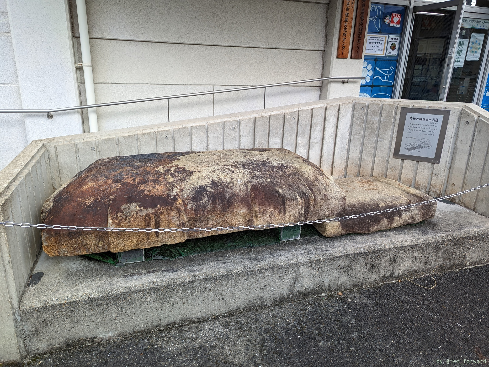
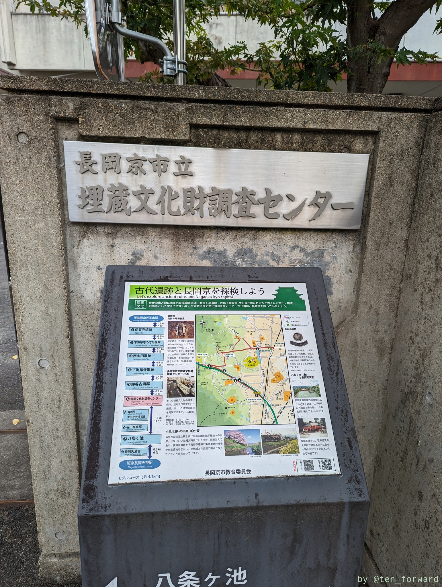

## 寂照院

[寂照院](https://www.city.nagaokakyo.lg.jp/0000001240.html)の中にある古墳です。寂照院は駐車場もあり、車でのアクセスも可能です。受付には特に人はおらず、拝観料100円と書いた箱が置いてあります。もちろんちゃんと入れましたよ。

古墳は本堂の階段を2階まで上がって横の階段を上がるか、3階まで上がっておまいりした後に横方向に進んで裏側に回り込むと、裏側に古墳用の部屋があります。

いい石室ですねー。

## 長岡京市埋蔵文化財調査センター

近くの長岡京市埋蔵文化財調査センターには走田古墳群（7号墳?）から出土した石棺が展示されています。

埋蔵文化財調査センターは展示も見学できますよ。
