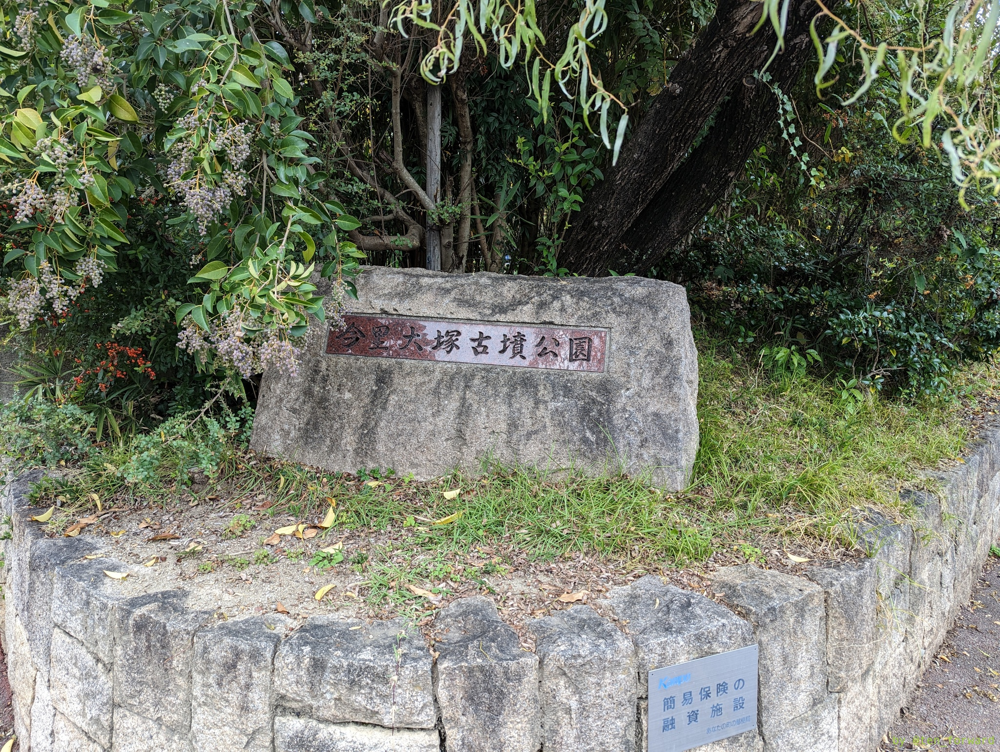
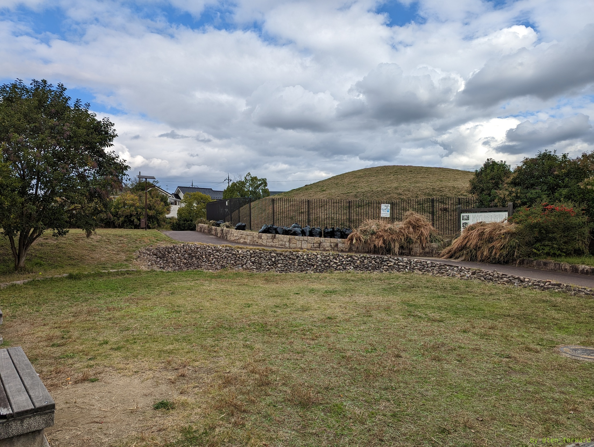
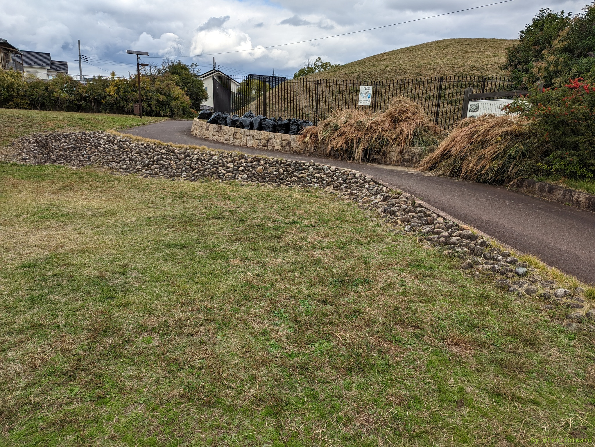
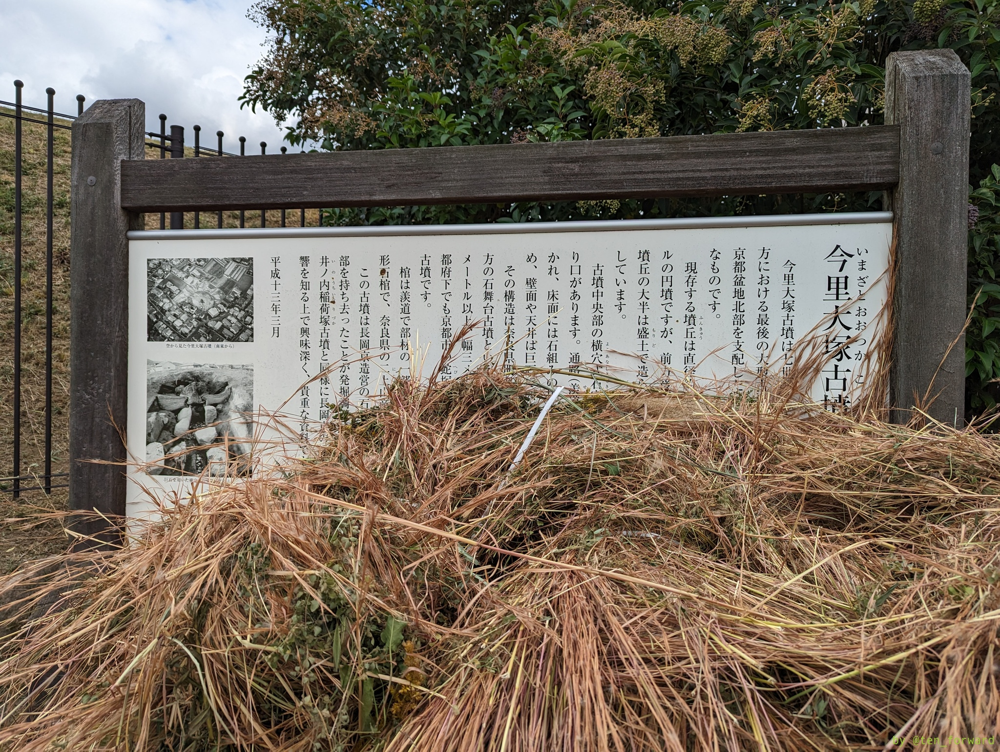
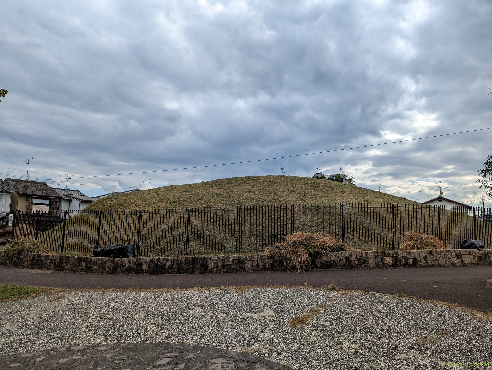

住宅地の中にいきなり出てくる今里大塚（いまさとおおつか）古墳公園。阪急の長岡天神駅から 15 分ほどの距離です。公園前に駐車スペースも数台分あります。

* [今里大塚公園の紹介](http://www.city.nagaokakyo.lg.jp/0000000946.html) （長岡京市）

恵解山古墳とは時代も違い、古墳時代も終わりの 7 世紀の古墳です。

行った日はちょうど古墳の散髪をしたところだったのでしょうか。古墳の周りには刈った草やゴミ袋に入った草が積み重ねられていました。古墳はすっきりして気持ち良さげでした(^^。

古墳には入れませんが、古墳脇が公園になっていて、柵の前からぐるっと古墳を見学できます。

7 世紀ってことで古墳も末期になってますね。公園は円墳らしからぬ雰囲気。くびれの曲線がいいです。古墳の案内板の前にも草が大量に積まれていて見えませんでしたw

