この日は長岡京市の古墳をいくつもまわりましたが、事前の調査で一番楽しみにしていたのがこの古墳で、一番アクセスが大変そうだなと思ったのもココでした。

この古墳は Google Map で道がないので Google Map 頼りではアクセスできません。ちなみに Yahoo!地図では道があります。

ただ、色々なブログや Google Map にはアクセスの方法が書かれていますので、それを見ればアクセスにはそれほど困りません。私も特に迷うことはなく一発で行けました。ここでもアクセス方法を書いておきます。

## アクセス

光明寺前の府道 10 号線の光明寺から少し北に行ったあたりにバッティングセンターがありますが、そのさらに少し北の竹林が両側にある林道をひたすら道沿いに進みます（1km 程度?）。最後は結構な坂になりますが、道はしっかりした道で歩きやすいです。

両側の竹林では竹を切る作業が至るところで行われており、そのための軽トラが走っていたりします。

先に書いたとおり、Google Map では道がありません。



私が歩いた軌跡はこんな感じです。

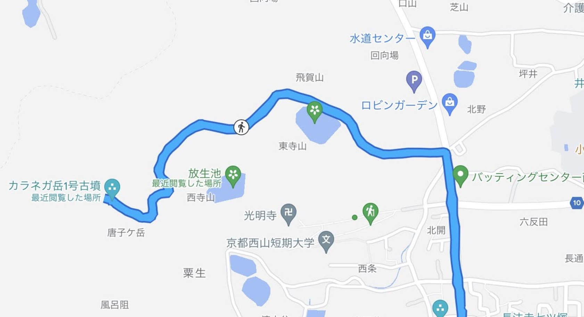

府道からはこんな感じです。

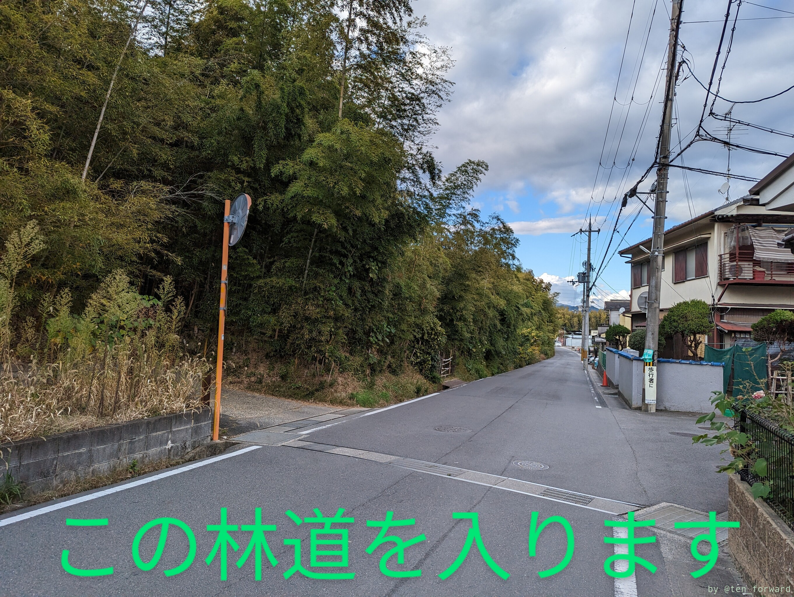
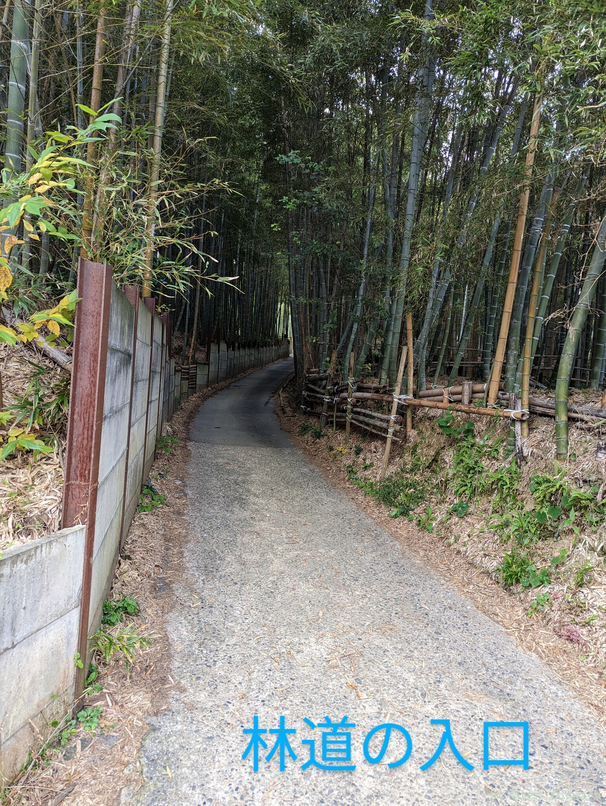

竹林の中を進みます。途中、左側に儀仗池（古墳から遠い方の池）が見えます。途中いくつか（ひとつ?）小屋が見えますが、結構な坂を登ったあとに写真のような小屋が見えれば目的地です。

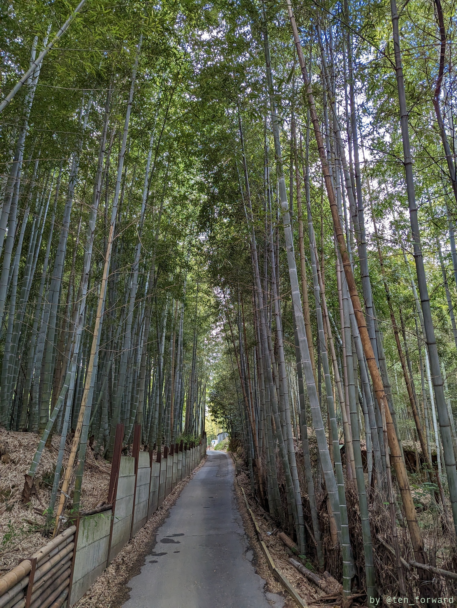
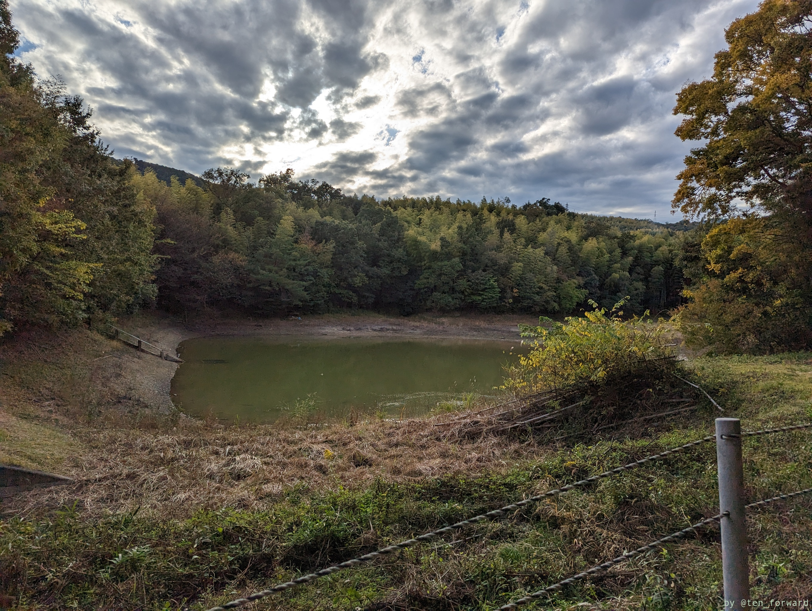
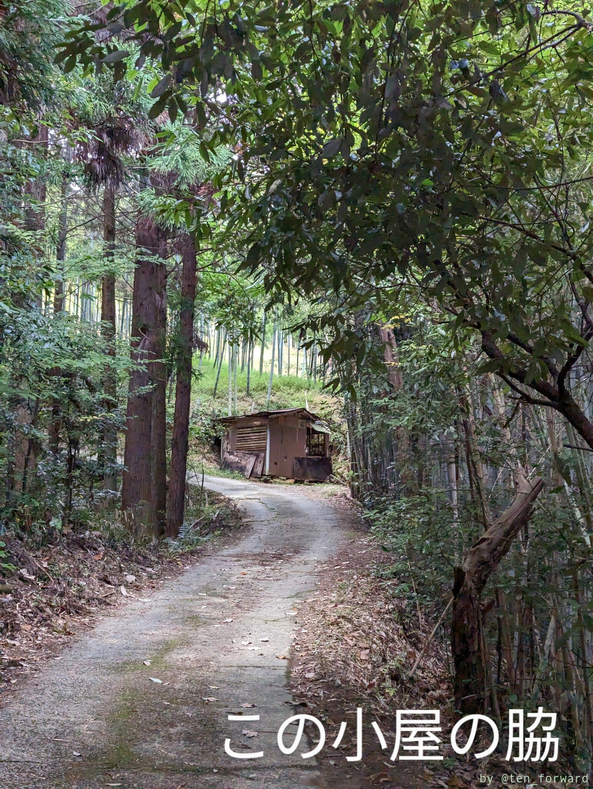

## 古墳

カラネガ岳 2 号墳は帆立貝型と判明しているようですが、1 号墳はわからないようです。2 号墳のほうが色々出土していて情報が多いようですね。1 号ですが、2 号よりは後の古墳で、古墳時代後期の古墳のようです。

小屋の脇に石室が口を開けてます。これは良い石室!!開口部の雰囲気がたまりません。

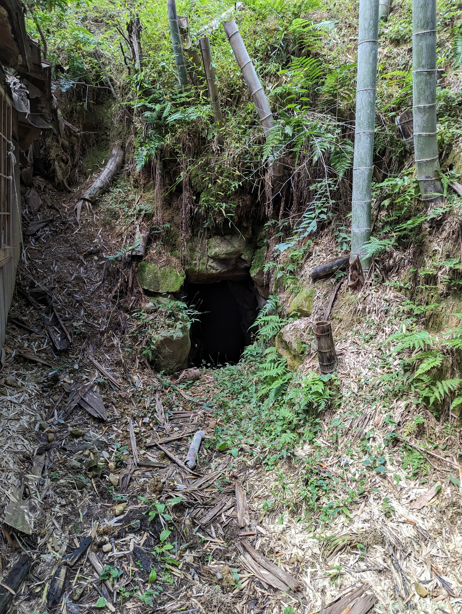
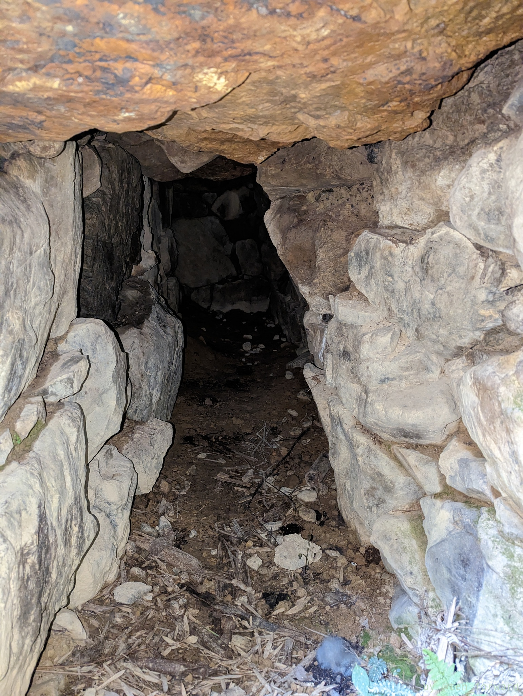

入り口は少し低いのでかがんで入ります。玄室までいけます。玄室は両袖ですがあまりはっきり広がってる感じはないです。

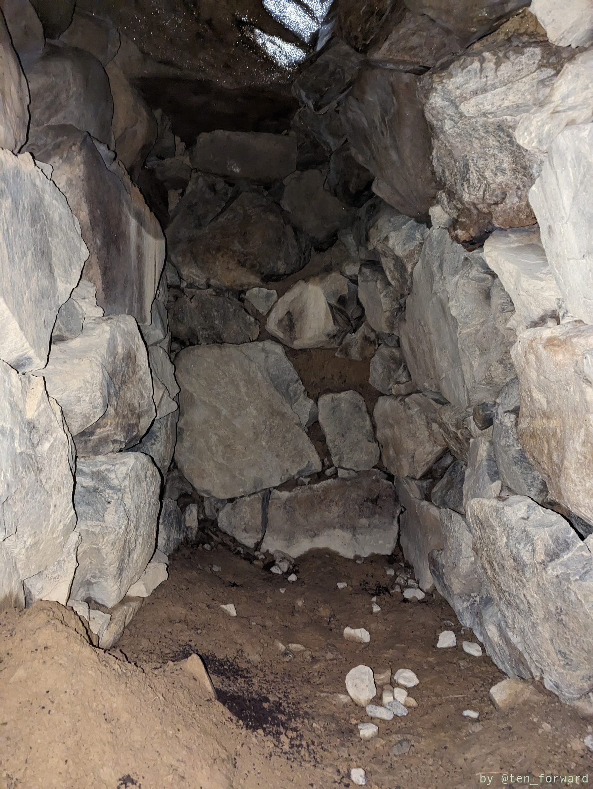
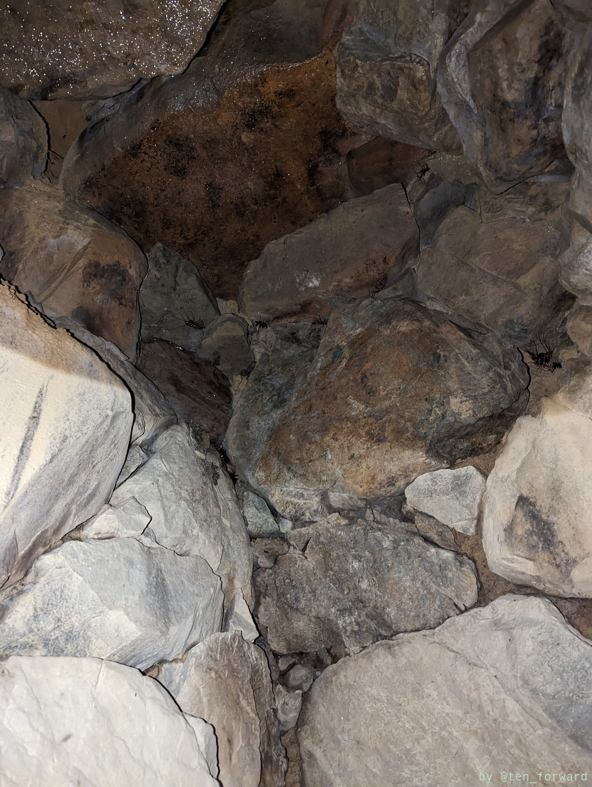

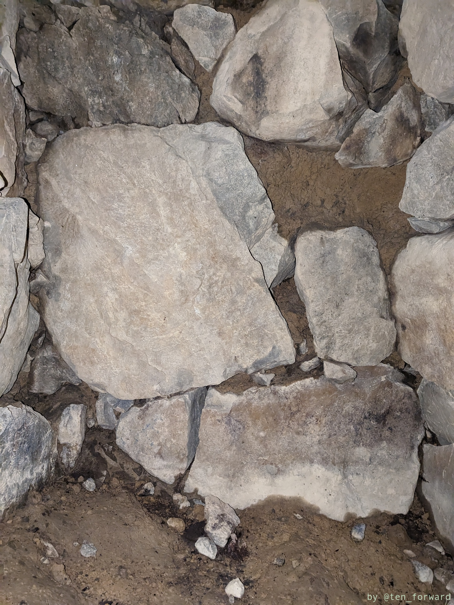
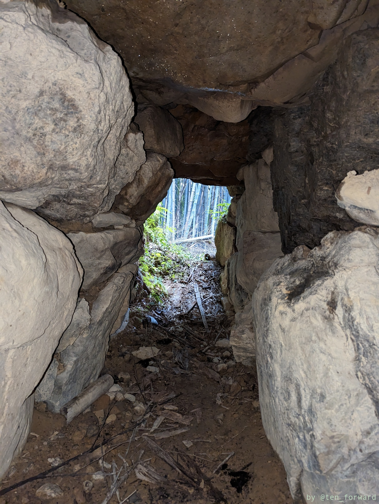

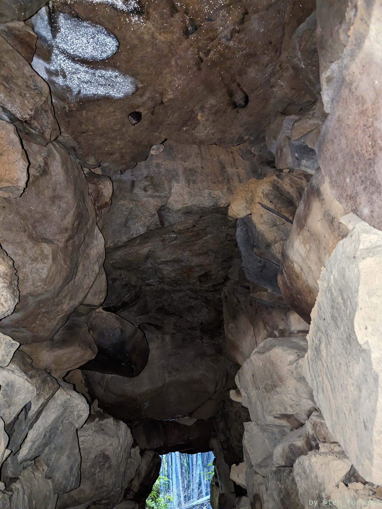
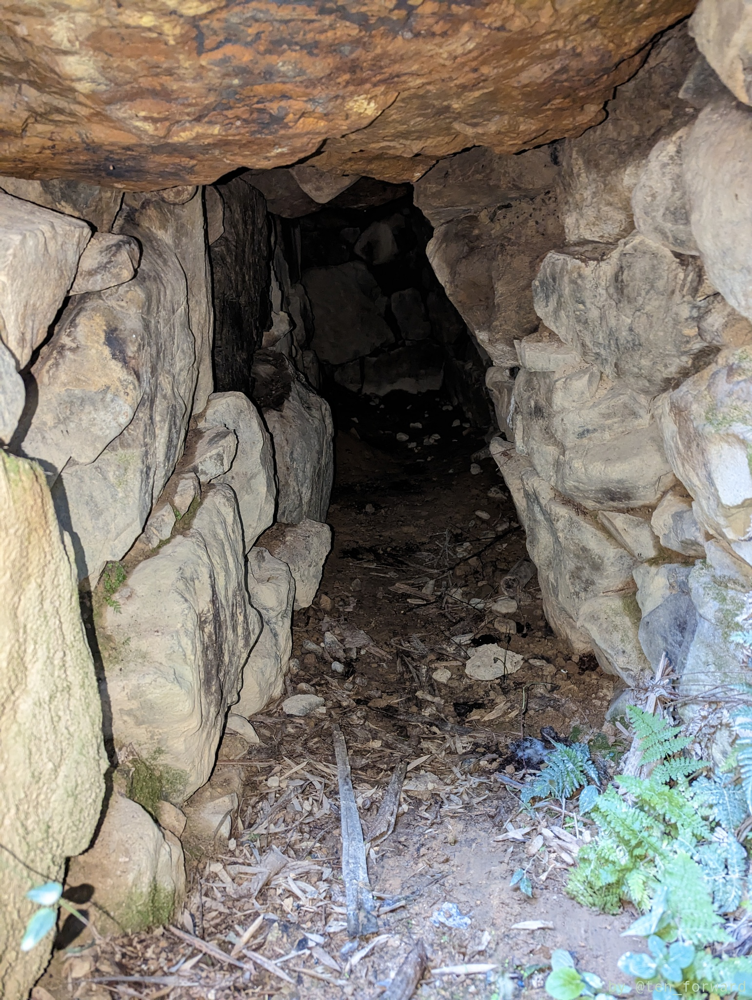

## 古墳についての情報

ブログ書くにあたって、情報を仕入れるために少しだけググったので書いておきます。

検索すると色々な方がカラネガ岳古墳 1 号墳を訪問されていますが、他に 2 ~ 4 号墳があるようです。学術的には 2 号墳の方が色々情報が多いようで、年表なんかでもカラネガ岳 2 号墳が載っています。[長岡京市埋蔵文化財センターの古墳一覧](http://nagaokakyo-maibun.or.jp/iseki-sheet2kofun.html)では、すべて半壊ということで残ってはいるようですが、3, 4号墳の場所はよくわかりません。2 号墳に行こうとしたけどやめたというブログはありますが、訪問記は見つけられていません。消滅したという話は載っていたりしますので、埋もれているのかもしれません。

2 号墳は 1 号墳の近くにあるようなのですが、アクセスできるのか? 視認できるのかは良くわかりません。史学研究会の会誌「史林」の 64 巻 3 号に「[\<調査報告\>京都府長岡京市カラネガ岳一・二号古墳の発掘調査](https://repository.kulib.kyoto-u.ac.jp/dspace/handle/2433/237488)」という報告があり、1, 2 号墳のことが詳しく書かれています。場所もこの報告内に地図はありますので、大体の位置はわかります。1 号墳の場所から先もきちんとした道はありますのでアクセスはできるのかもしれませんし、竹林の中にあってアクセスは難しいのかもしれません。

### リンク

* [長岡京市埋蔵文化財センターの古墳一覧](http://nagaokakyo-maibun.or.jp/iseki-sheet2kofun.html)
* [\<調査報告\>京都府長岡京市カラネガ岳一・二号古墳の発掘調査](https://repository.kulib.kyoto-u.ac.jp/dspace/handle/2433/237488)
* [カラネガ岳1号墳（長岡京市）（京都府）（後期）Karanegadake No.1 Tumulus,Kyoto Pref.](http://kofunwodougademiru78.publog.jp/archives/83251087.html) （古墳を動画で見るサイト guami_38_36のblog）
* [カラネガ岳１号墳](http://kofuntokaare.main.jp/3goufun/page597.html) （古墳とかアレ）
* [石室を見ることが出来る古墳](https://turedure-kyoto.blogspot.com/2017/11/blog-post.html) （徒然なるままに 京都）
