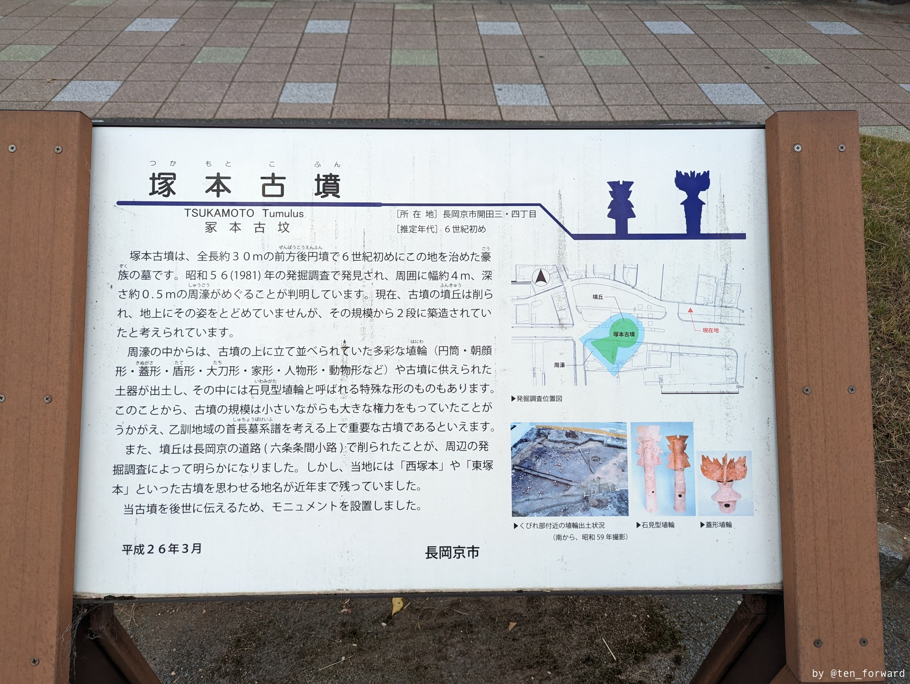
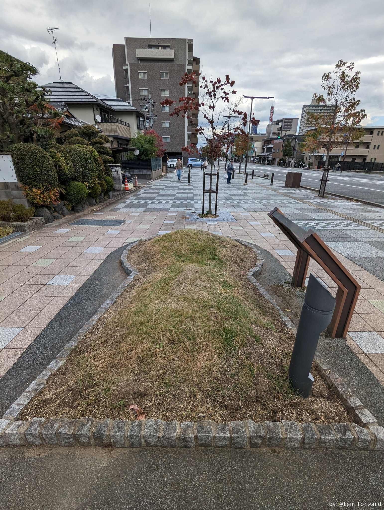
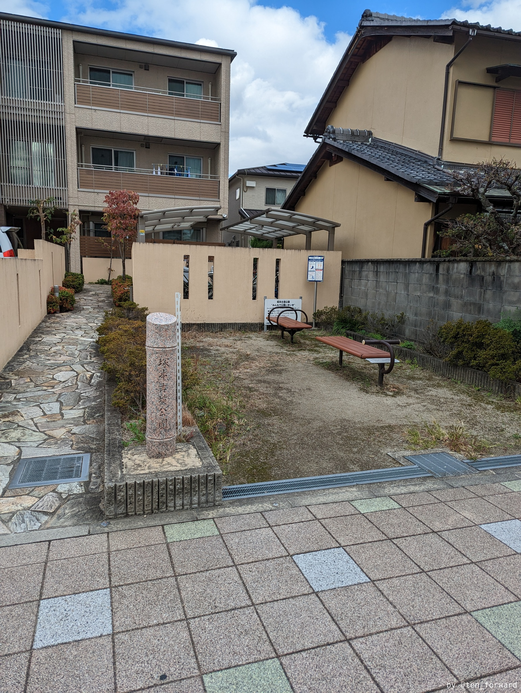
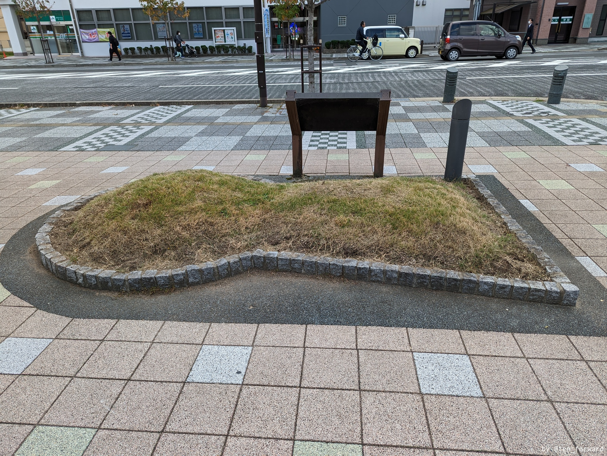

この古墳は実は見学できる形で残っているわけではないのですが、モニュメントがかわいかったので紹介(^^。

JR長岡京駅西口と阪急長岡天神脇を通って長岡天満宮の正面大鳥居に続く天神通りの、よく整備された片側2車線の道路脇にある**塚本古墳公演**。その前に案内板とモニュメントがあります。

後世破壊されたという古墳が多い中で、長岡京の道路建設のために削られたというのが都が置かれた土地らしいですね。

公園はとてもこじんまりとしています。

メインストリートの歩道にこういうのがあるのっていいですね。
