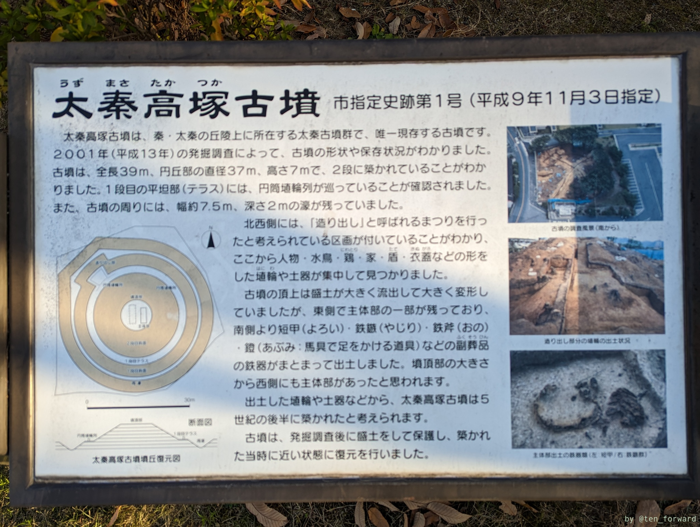
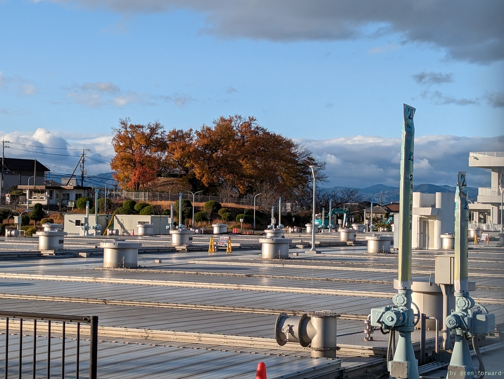
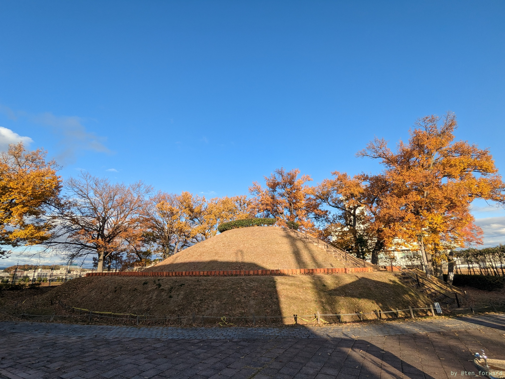
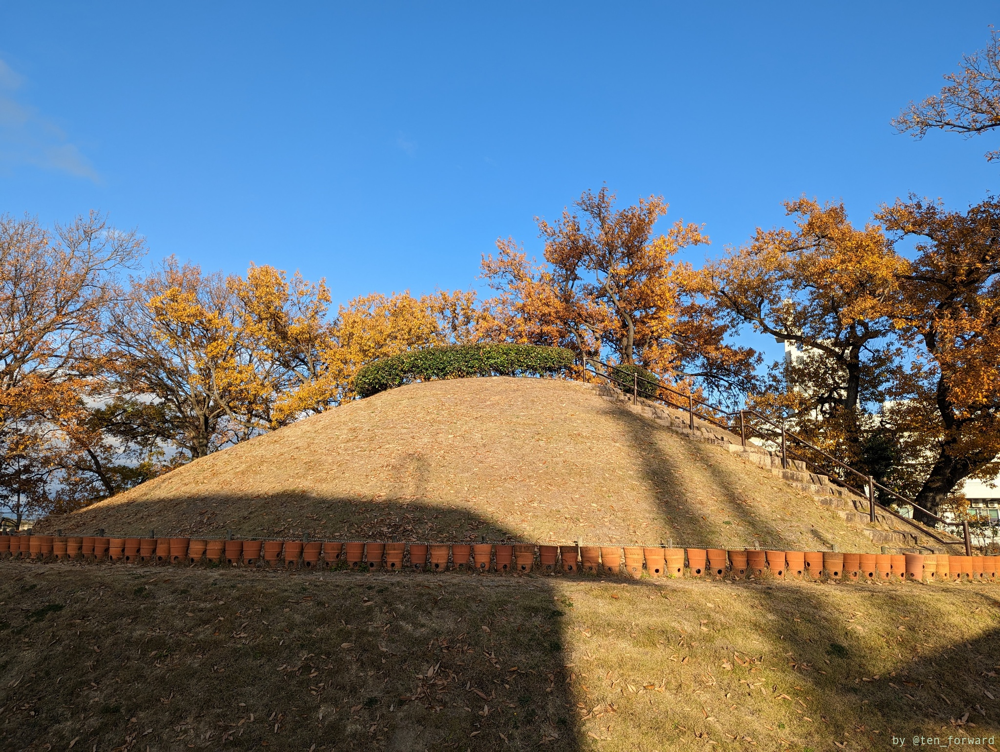
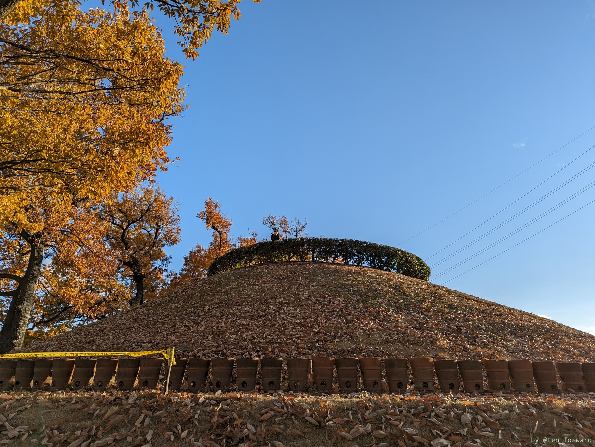
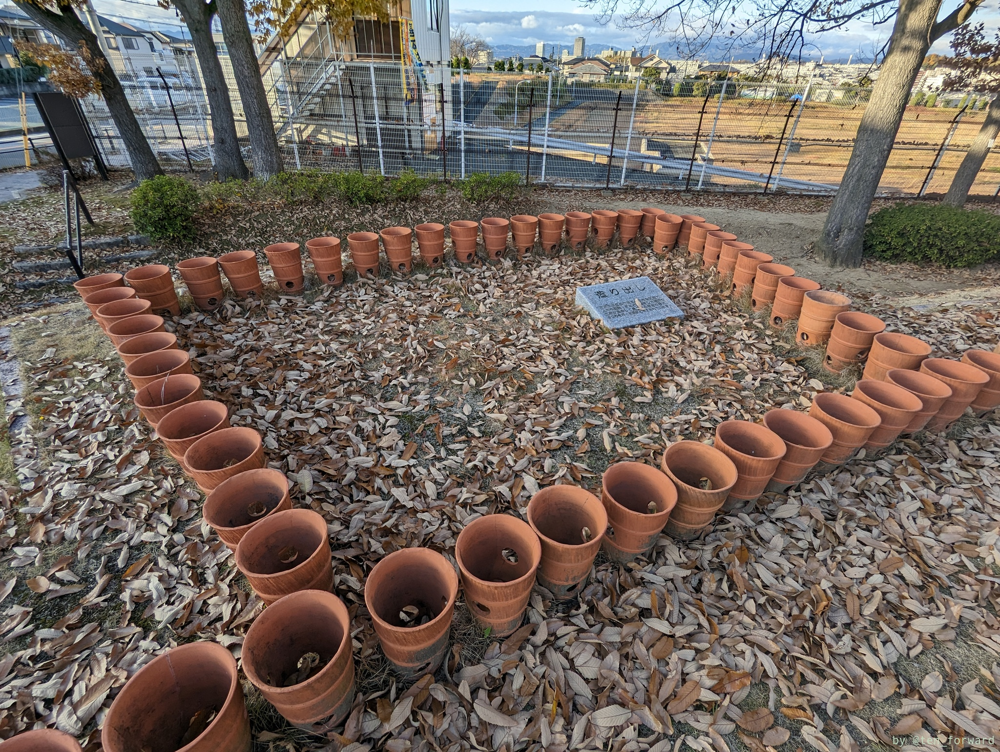
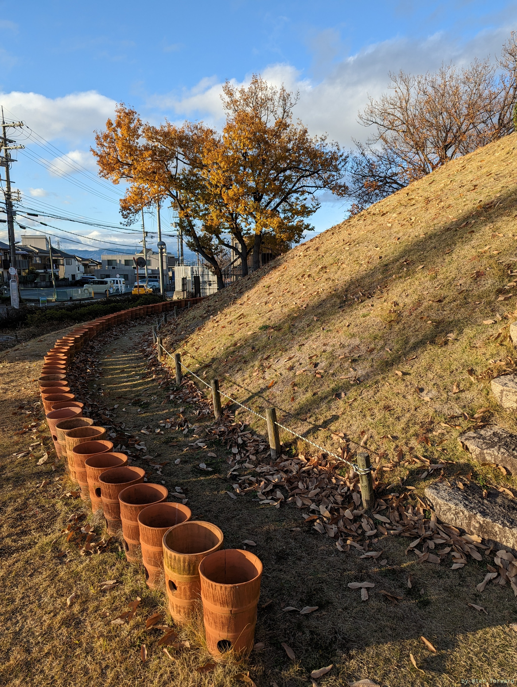
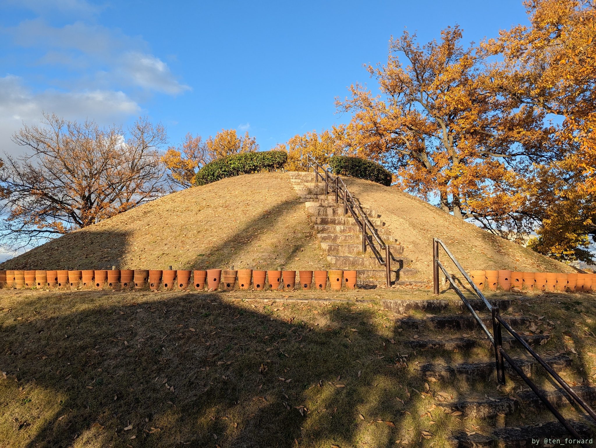

大阪府の寝屋川市にきちんと整備された古墳があるということで行ってきました。

場所は寝屋川公園の近く、大阪市の豊野浄水場の脇に、きちんと公園として整備されています。駐車場はありません。豊野浄水場前というバス停の目の前です。

こじんまりとしてて、きれいに整備された円墳です。

周りには円筒形の埴輪が並べられています。造り出しもいいですね。

下も1段目もぐるっと一周回れます。

近所には他にも古墳あるみたいなので回ってもいいですね（この日はもう夕方だったので次回に）。
