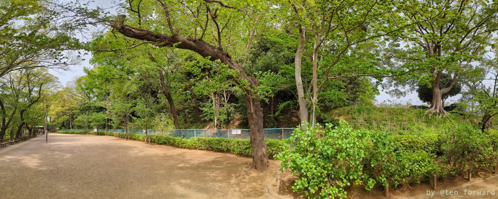
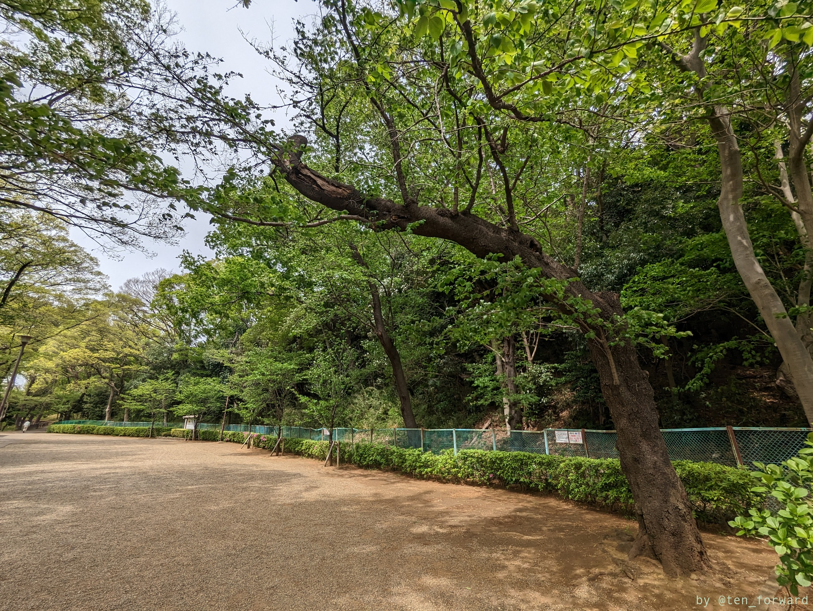
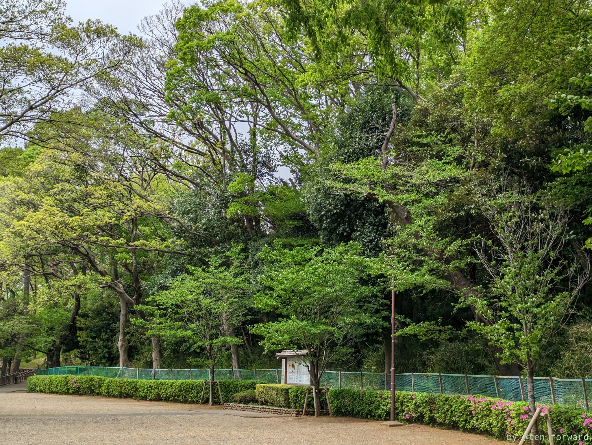
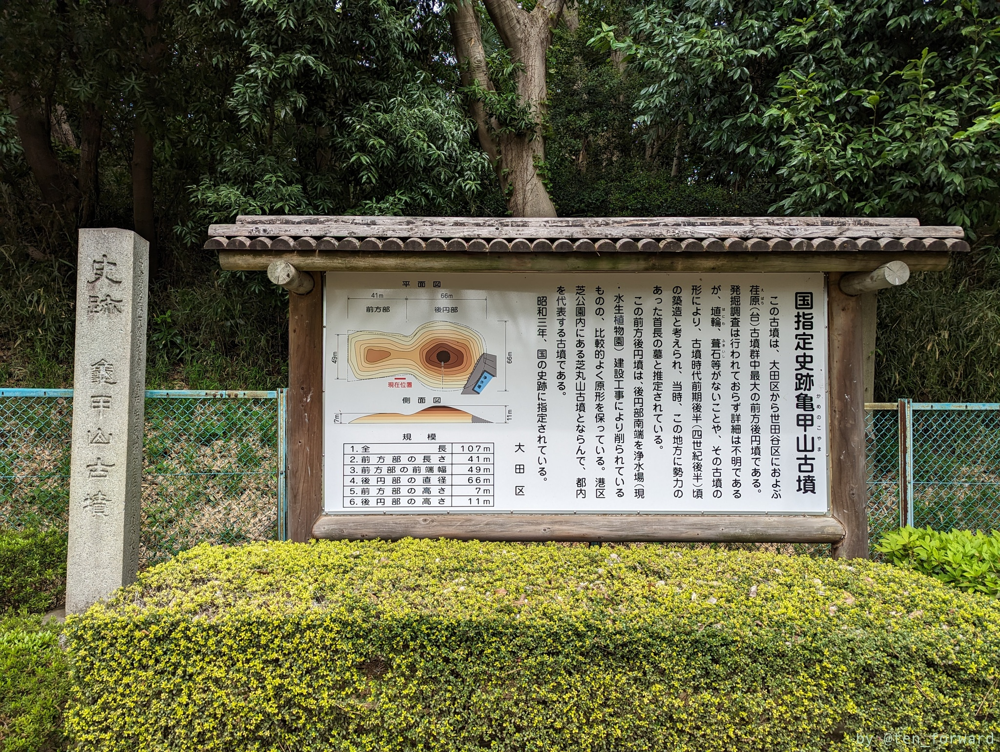

東急の多摩川駅を降りてすぐの多摩川台公園内にある東京最大級の前方後円墳です。



中に入れるわけではなく、離れて眺めるわけでもないので、大きすぎて全体の感じはつかめないのですが、それでも前方後円墳のくびれは感じられます。

近くには[古墳展示室](https://www.city.ota.tokyo.jp/shisetsu/hakubutsukan/kofuntejishitsu.html)や多摩川台古墳群、宝来山古墳などもあるので、ぜひまとめて訪れてみてください。

## 参考
* [亀甲山古墳](https://www.city.ota.tokyo.jp/shisetsu/rekishi/minemachi_denenchoufu/kamenokoyama_kofun.html) （大田区）
* [ぶらり亀甲山古墳](https://kofun.jp/diary/20131105) （古墳にコーフン協会）
* [亀甲山古墳](https://kofun.info/kofun/176) （古墳マップ）
