東京都最大の古墳は都心の東京タワーのお膝元にあると聞いて行ってきました。芝公園内の芝丸山古墳です。

全長は 106m（125m?）で、後円部径は 64m、前方部幅は 40m 程度のようです。墳頂と後円部西側は削られてしまっているすです。

東京タワーの近くにあるのですが、気が茂っているので意外に両方を収めた写真が撮れるスポットは少ないです。

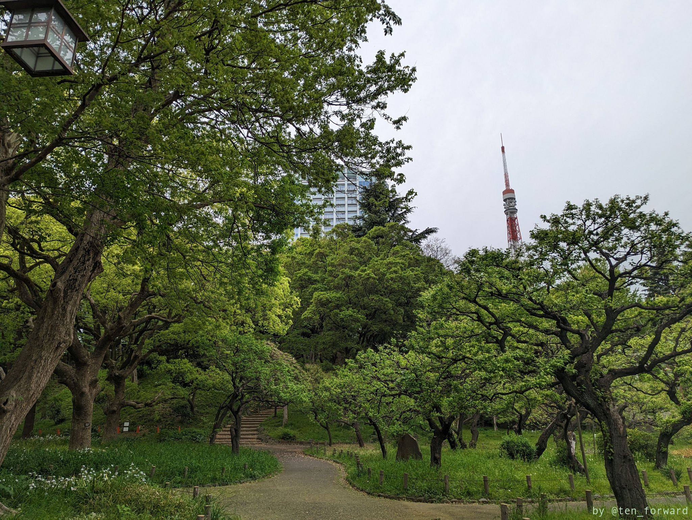

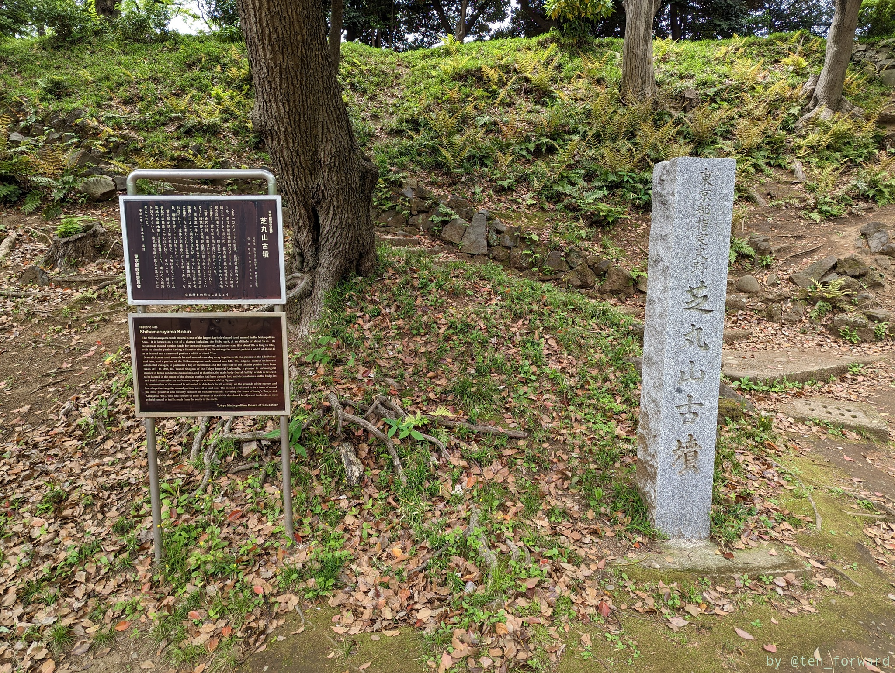
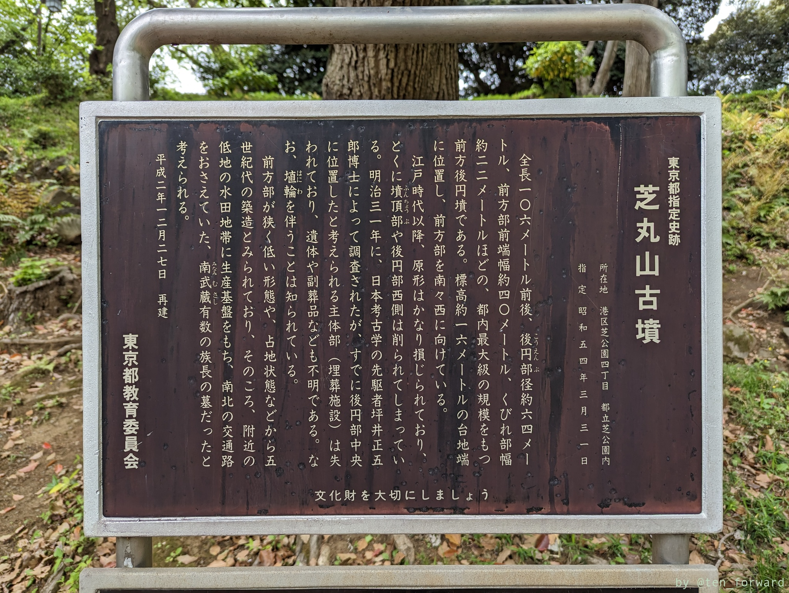

前方後円墳のくびれ部分には神社があります。

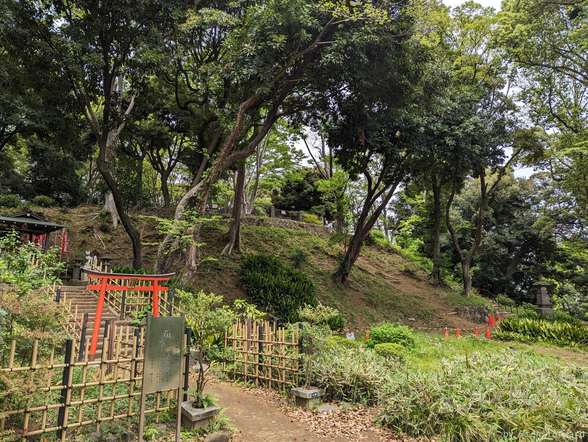
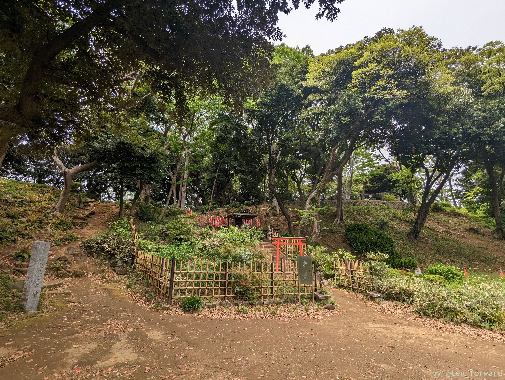

写真で見るとわかりづらいですが、前方後円墳感は結構ありますね。

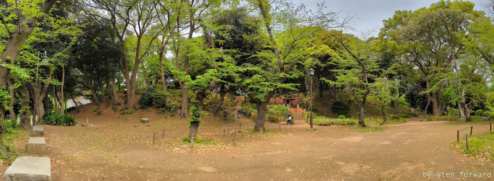

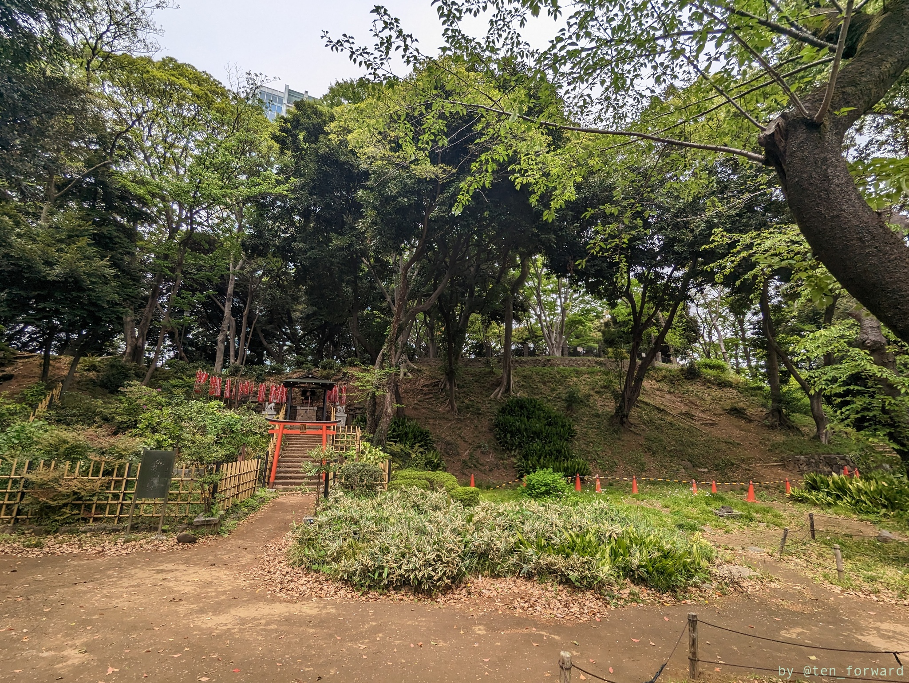
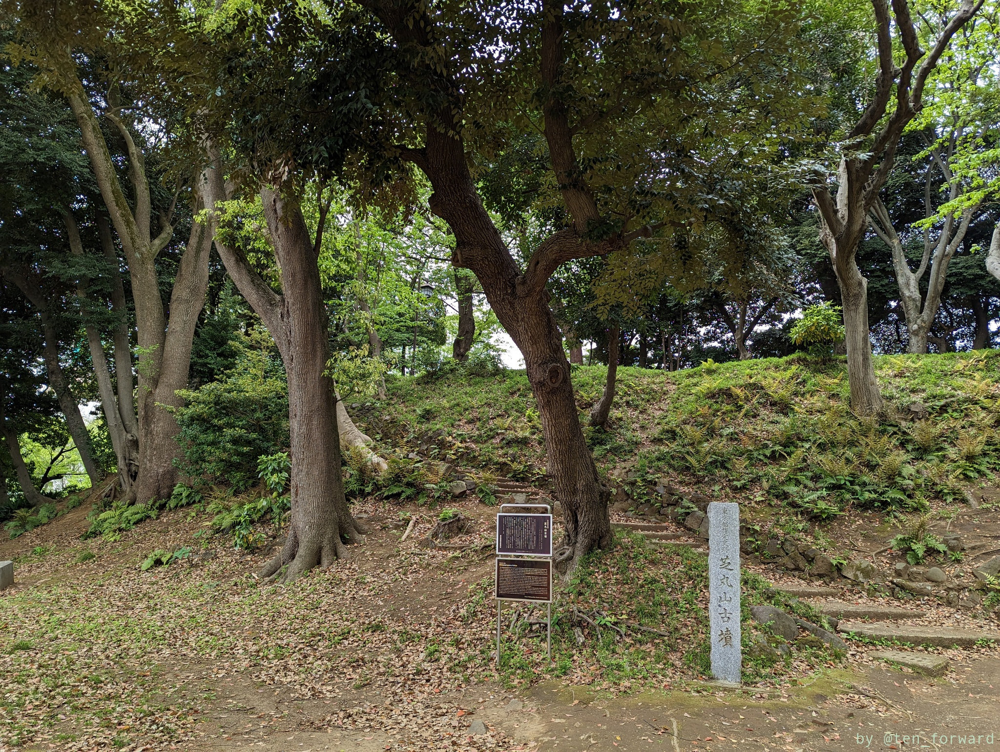

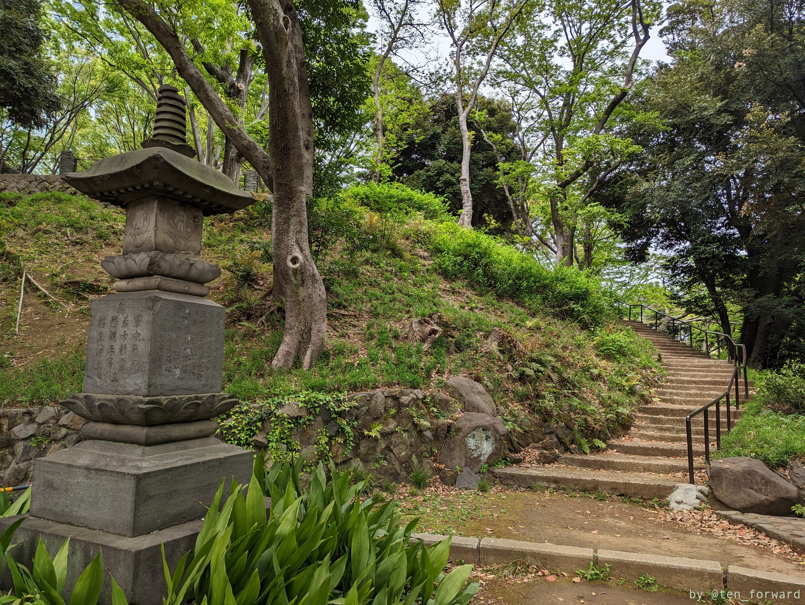
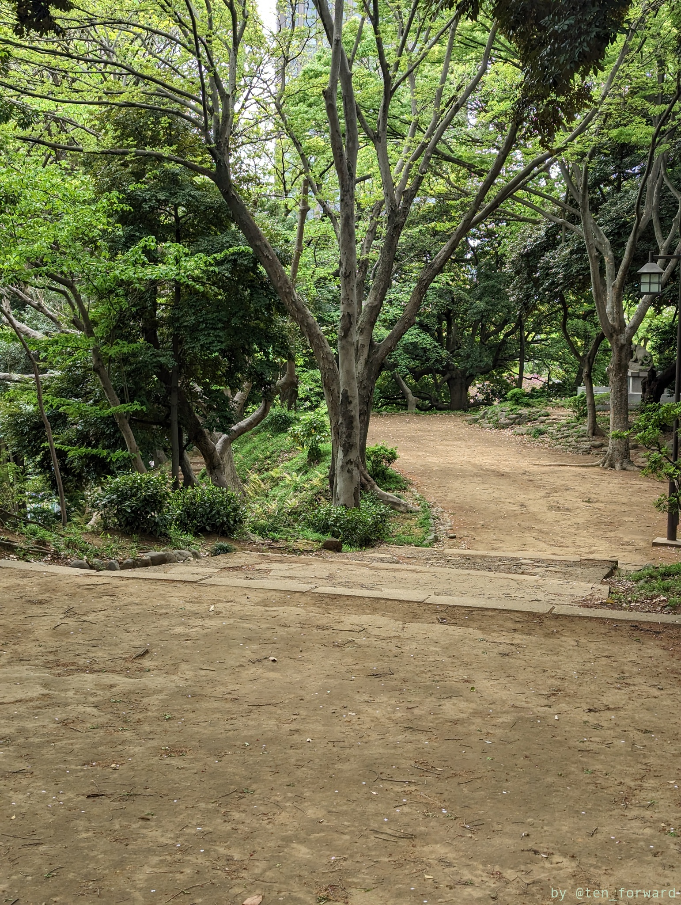

後円部は公園のようになっていて子どもたちが遊んでいました。

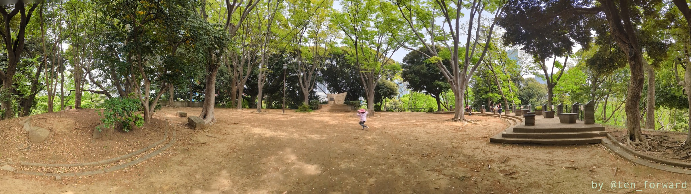

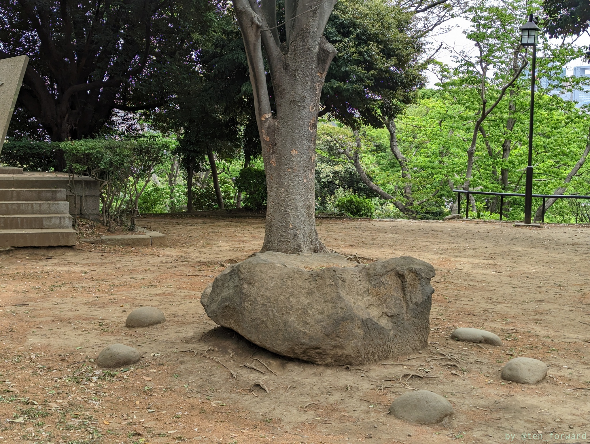
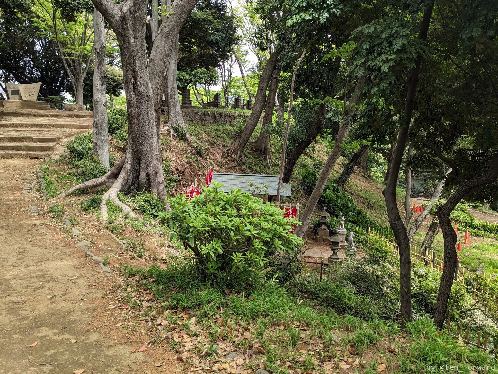

