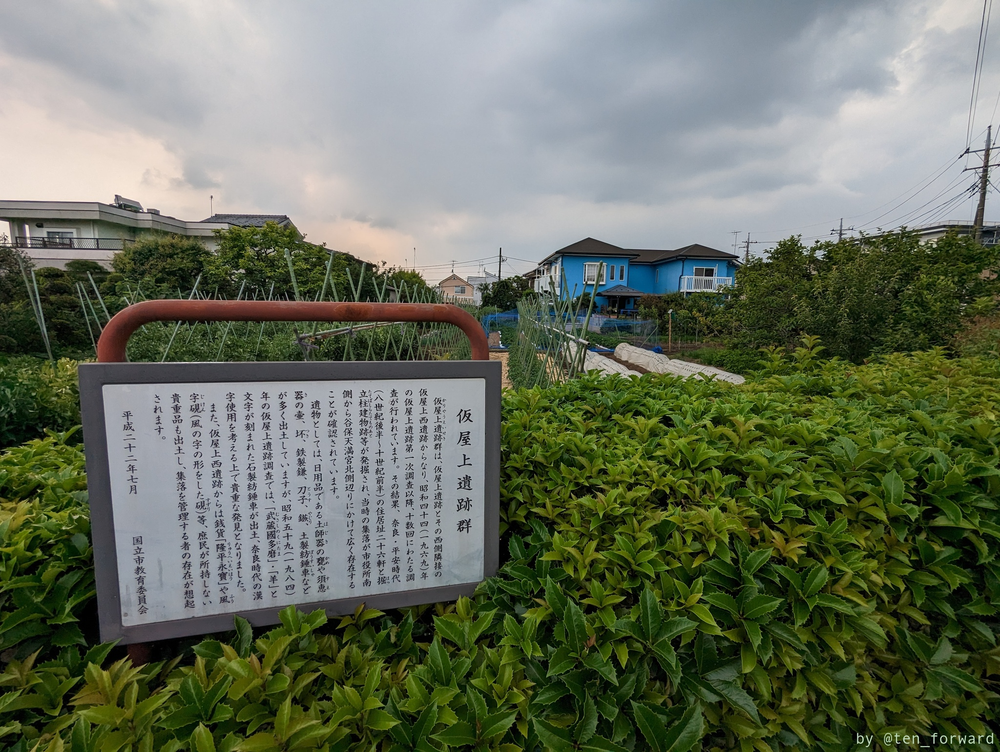
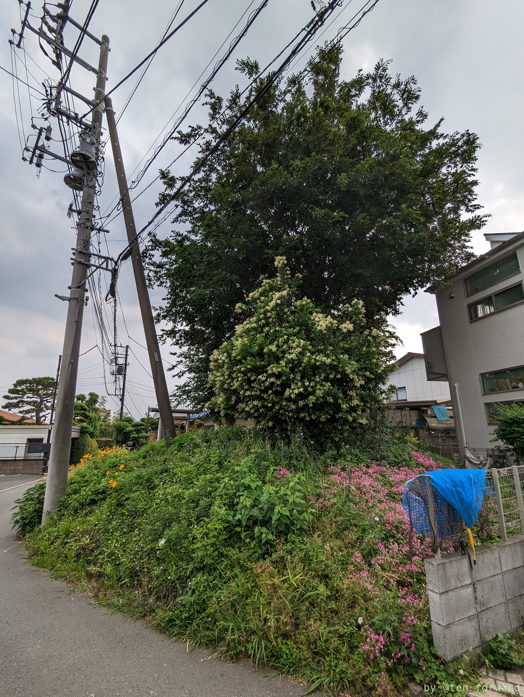
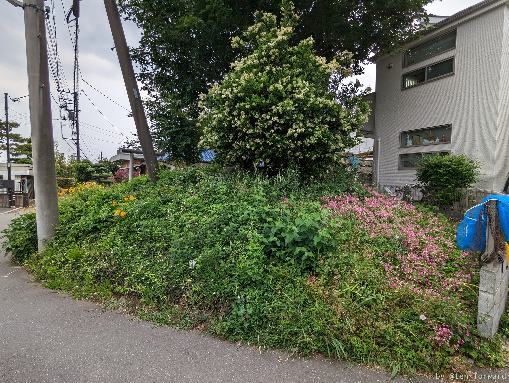
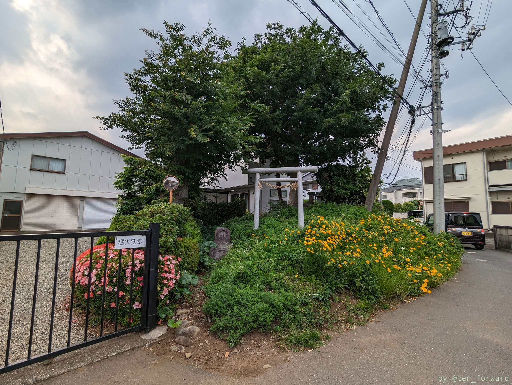
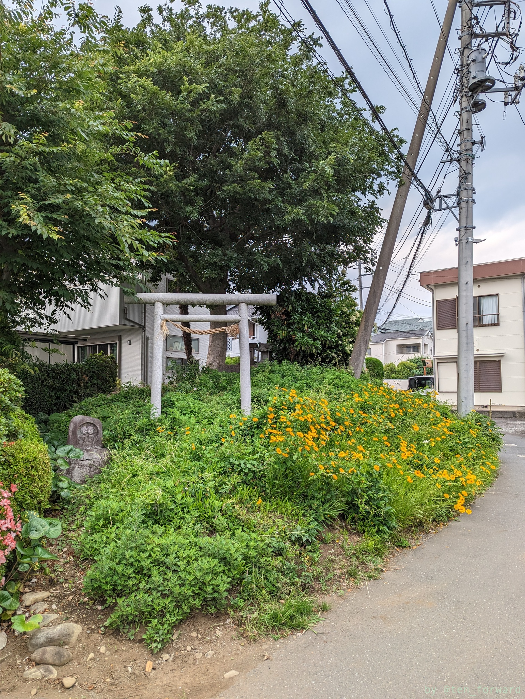

国立、府中の古墳を訪ねたこの日最後に訪れた古墳です。谷保は、先に[下谷保古墳群](post/2023-05-22_shimoyabo/)で訪れていましたが、このあと高倉古墳群を見に行ったのでスルーしていました。このあとに時間がまだあったので、じゃあということで南武線に乗って再度谷保の駅で降りました。

地図を見ていると仮屋上遺跡群というのが目についたので、ここを経由して行ってみました。奈良平安時代の住居跡が発掘されているようですね。とはいえ看板以外は特に何か遺跡が感じられるものはありませんでした。

さて、そのあと線路沿いを歩いて踏切をわたり、細い住宅地の道を行くとありました。古墳をちょっと迂回するように曲がった道の横に、鳥居とてっぺんに祠がある石塚古墳です。石塚でなく「牛塚」だという説もあるのかな。

線路沿いから歩いたので、まず北から古墳を見ることになりました。東から見ると一番古墳感ありますね。

南側には鳥居があります。周りを開発で削られながら、残ったのはこのように何かの「塚」として祀られているからでしょうね。

発掘はされていないものの、レーダー調査で石室と周溝が確認されているようです。また分級の測量調査もされているようです。円墳と推定されているようです。

## 参考

* [石塚古墳](http://gogohiderin.blog.fc2.com/blog-entry-729.html) （古墳なう）
