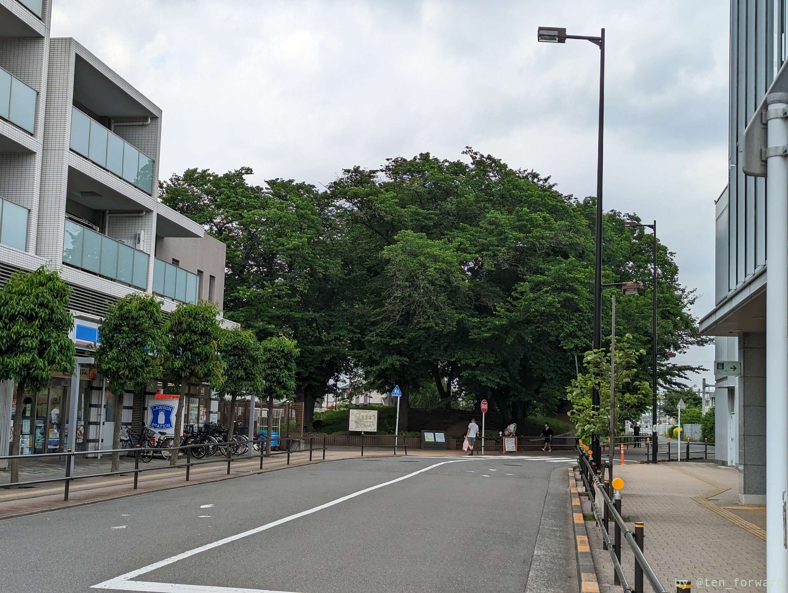
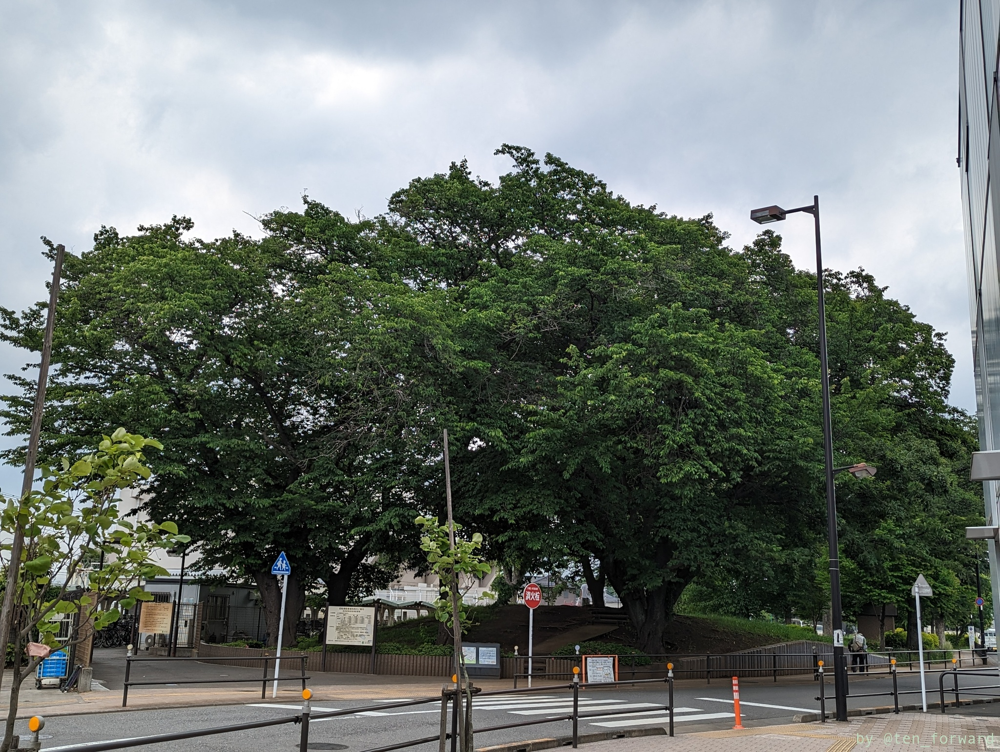
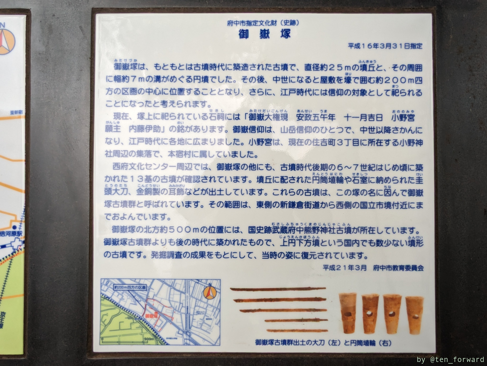
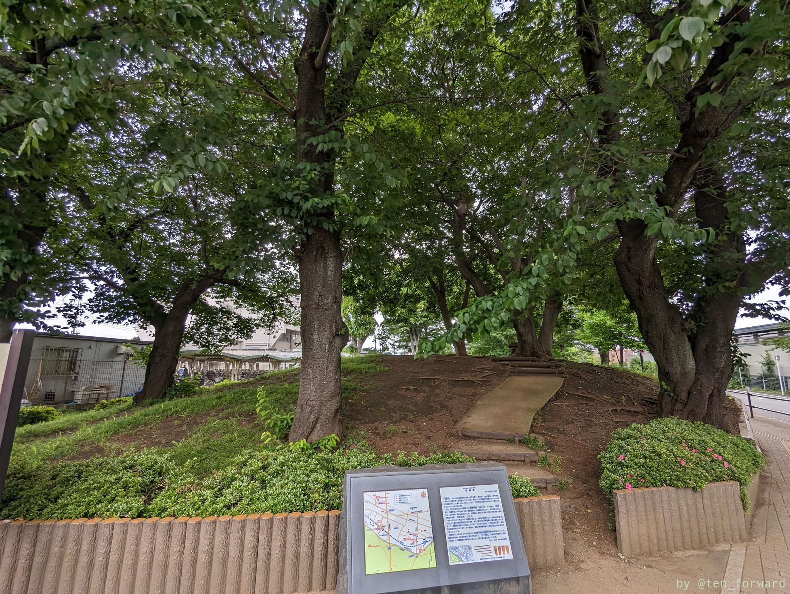
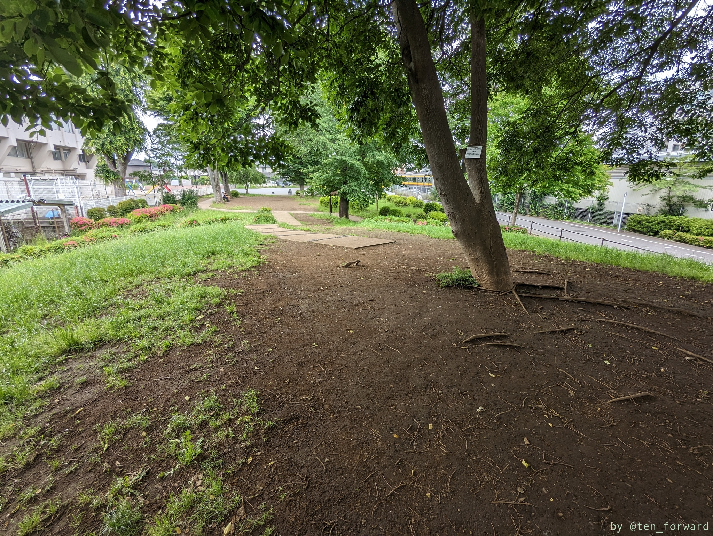
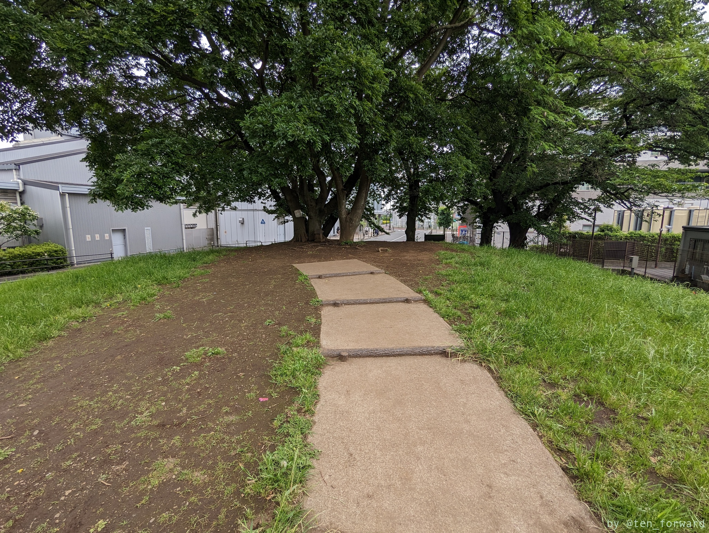
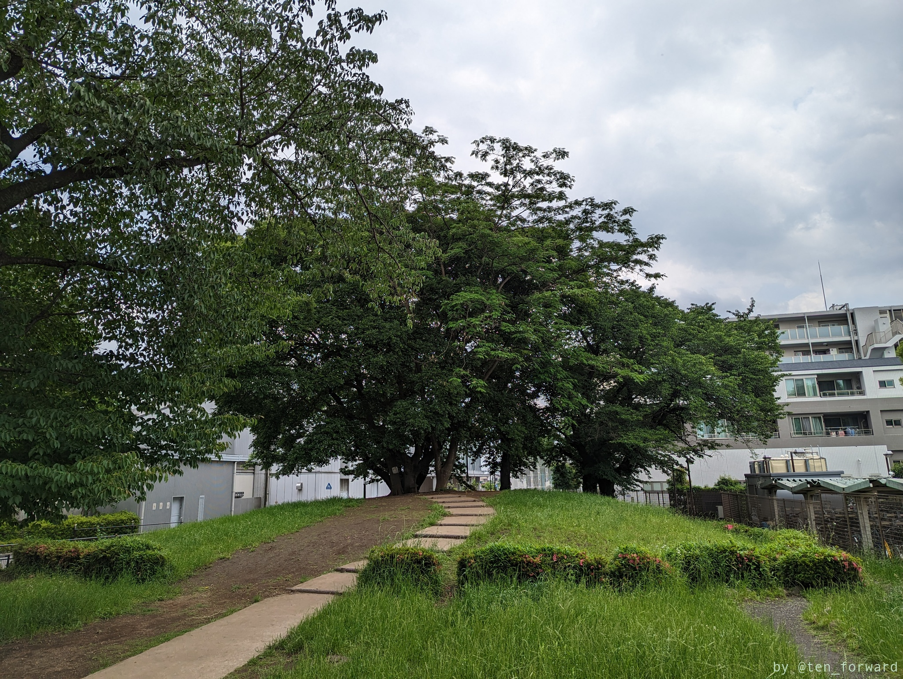
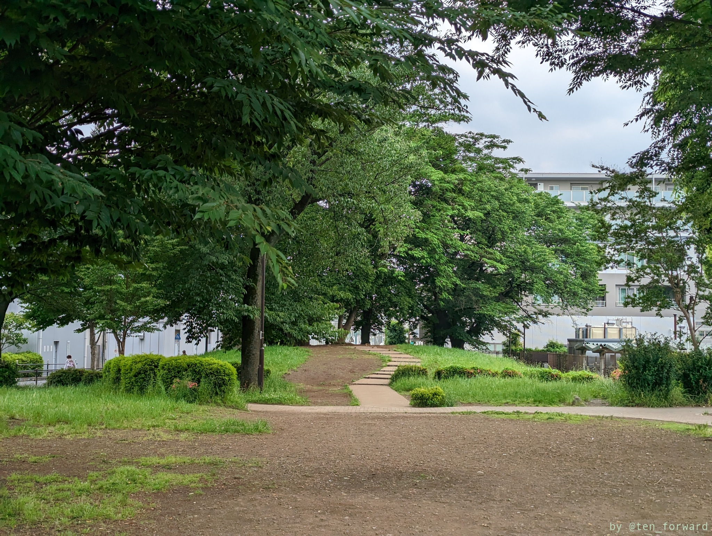

[四軒在家古墳](post/2023-05-22_shikenzaike/)を見た後は、南武線で西府駅まで移動して御嶽塚古墳へ。駅を出ると目の前にあります。御嶽塚公園の脇にあり、近所のサラリーマンが古墳上でたばこを吸ったり、昼休みを公演のベンチで過ごす人がいたりという風景でした。

付近は 7 世紀前半にかけて作られた 13 基の古墳が確認されているようです。

いい感じの膨らみがあって良い形です。

