この日は府中市方面の古墳を訪問しました。この日の一番のハイライトはなんといってもこの武蔵府中熊野神社古墳でしょう。

* [国史跡 武蔵府中熊野神社古墳](https://www.city.fuchu.tokyo.jp/gyosei/fuchusinogaiyo/bunka/kumanokohun.html) （府中市）

この古墳は**上円下方墳**。全国で 5 基しか確認されていないようです。最近の天皇陵もこの形のようですね。

南武線の西府駅から 10 分ほど歩くと、国道沿いに鳥居と展示館が見えます。展示館脇には石室の復元展示室もあります。訪問は月曜日だったので残念ながらお休み。

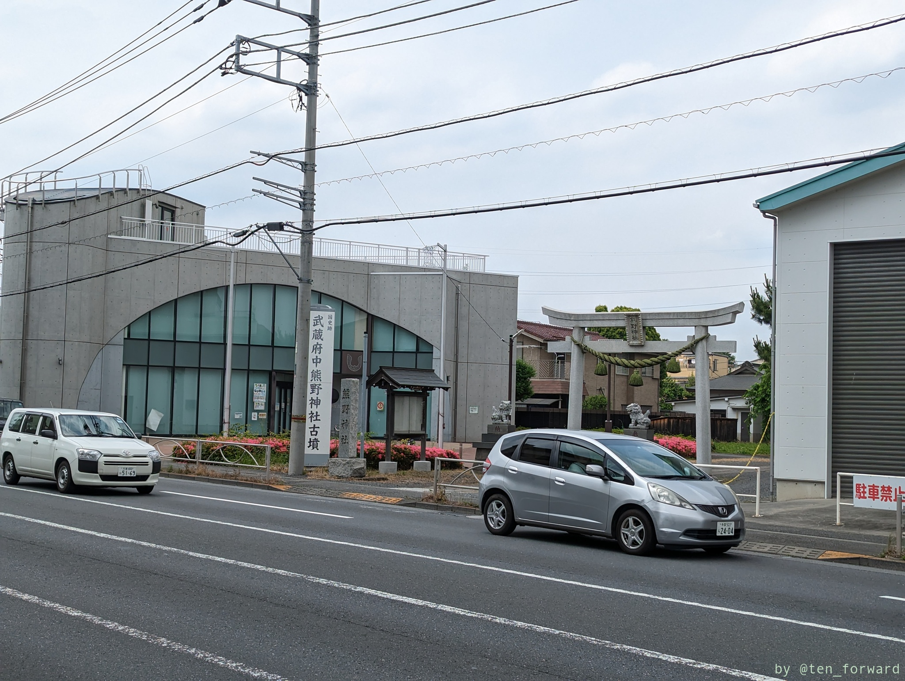
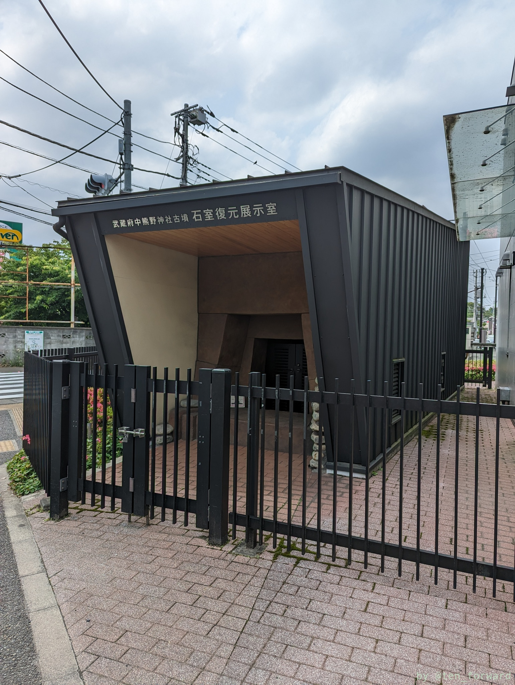
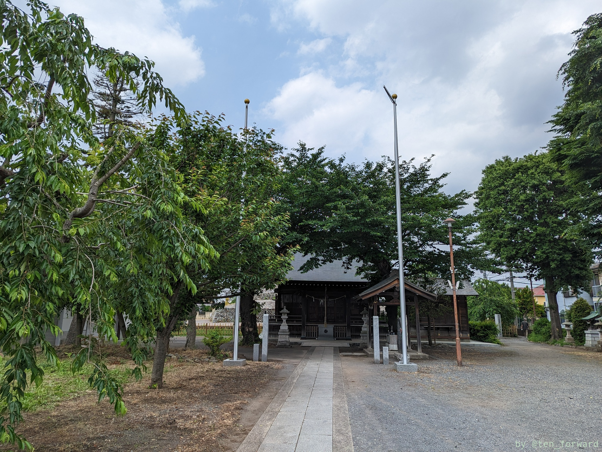

本殿の裏側が古墳です。展示館脇の道を進めば古墳正面に出ます。私は本殿でお参りした後に本殿脇を通って古墳前に出ました。

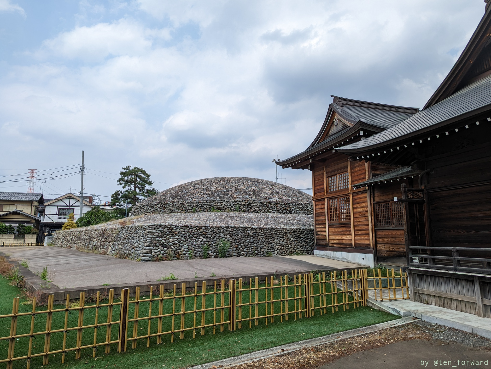
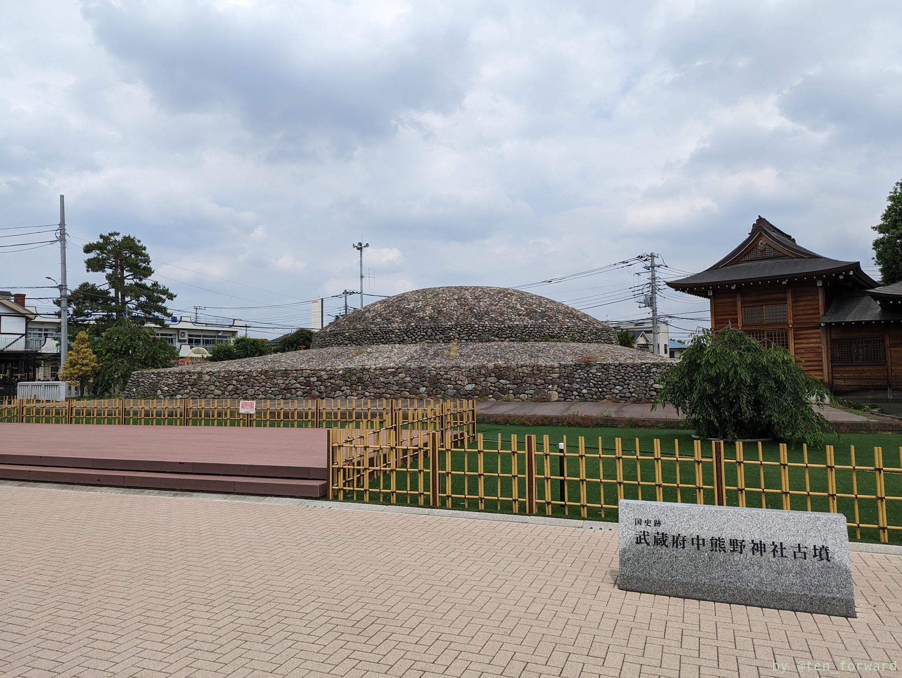

全面に石がふかれていて光り輝くような感じです。

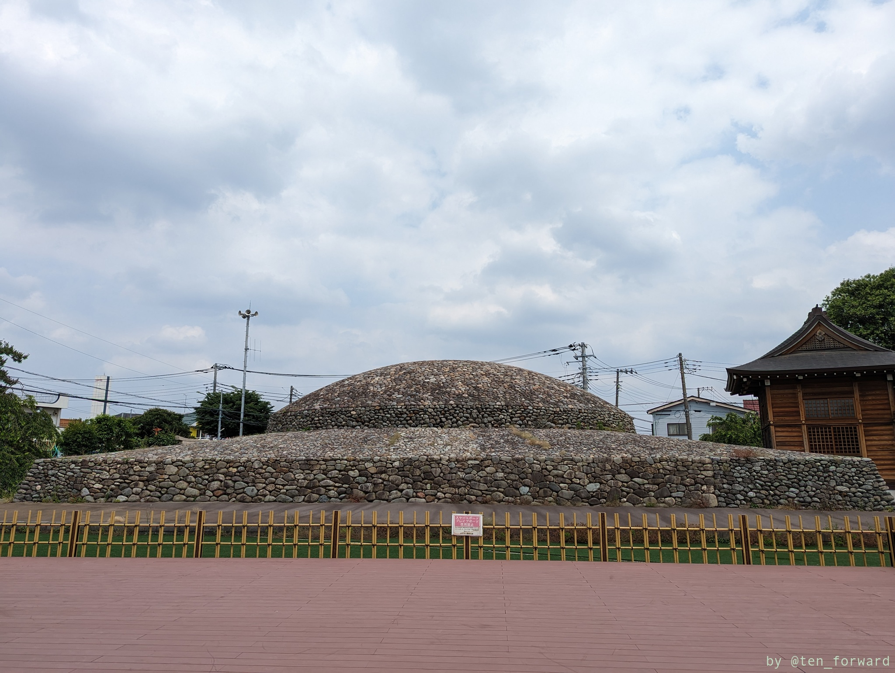
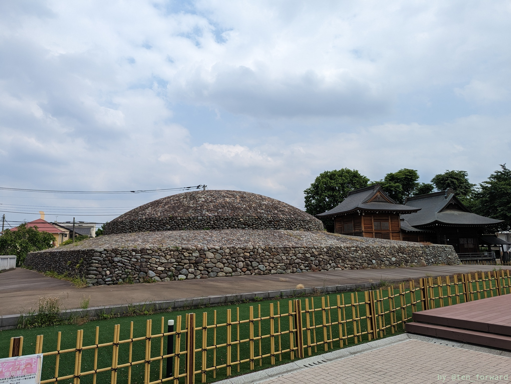

北側には鳥居があります。

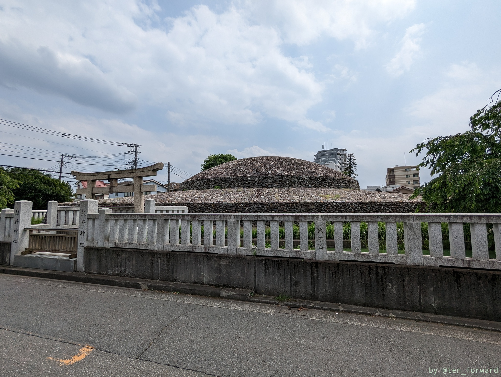
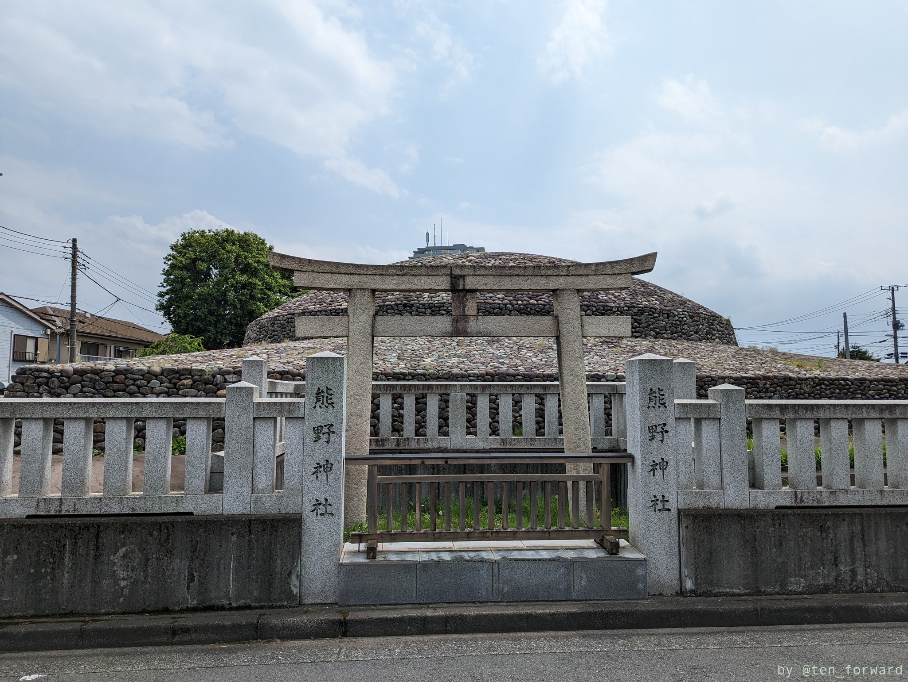

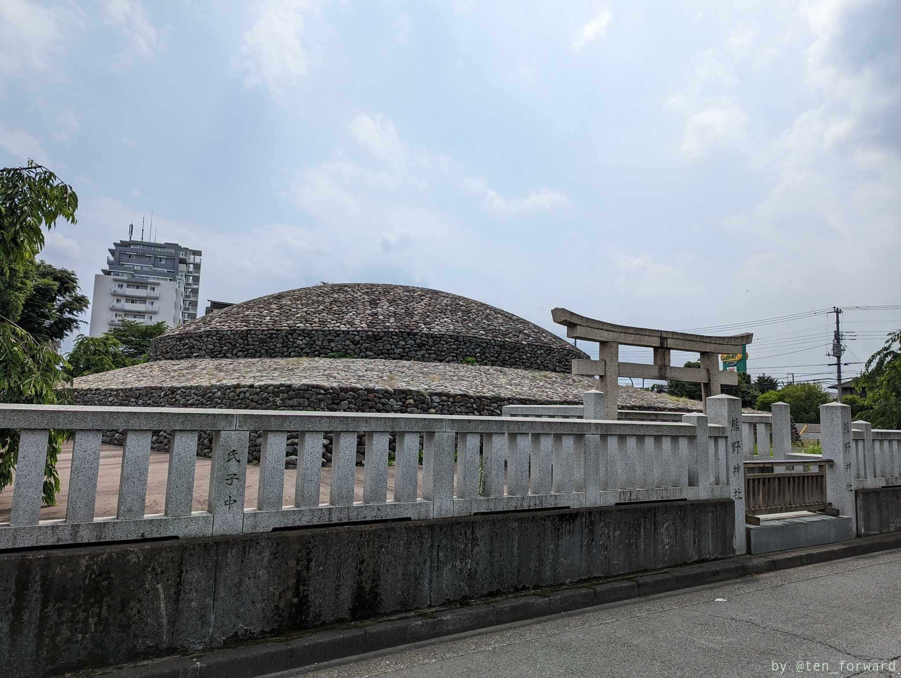
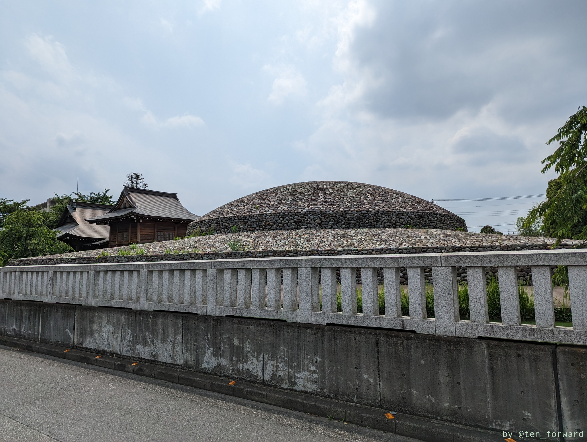

次は展示館と石室復元展示室も見てみたいです。

