この日は府中市方面の古墳を巡りましたが、最初に訪れたのは国立市の四軒在家古墳群 1 号墳の移設復元古墳です。

* [四軒在家（しけんざいけ）古墳](https://kunimachi.jp/spot/shikenzai/) （くにたちNAVI）
* [四軒在家古墳群](https://kofun.info/kofun/204) （古墳マップ）

JR 南武線の矢川駅から歩いて 10 分ほどの四軒在家公園内にあります。

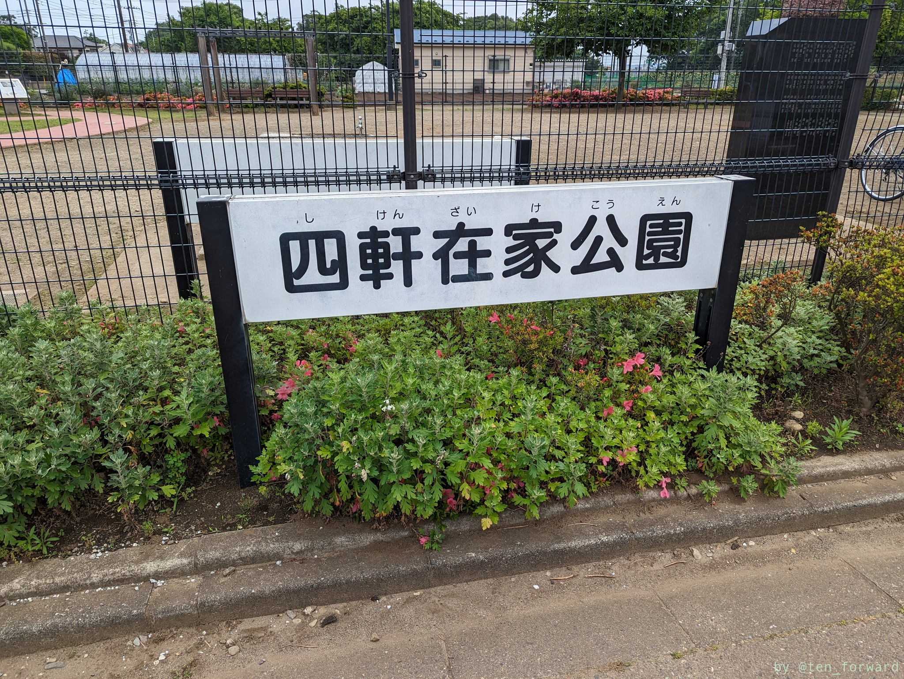
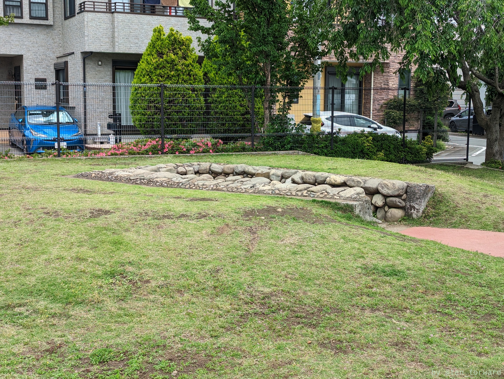

周溝の位置が赤く舗装されています。

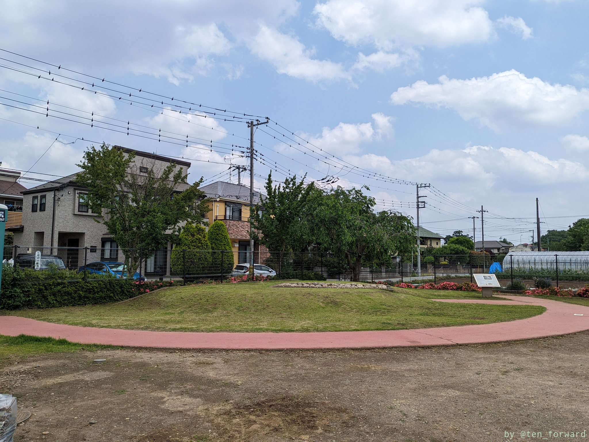
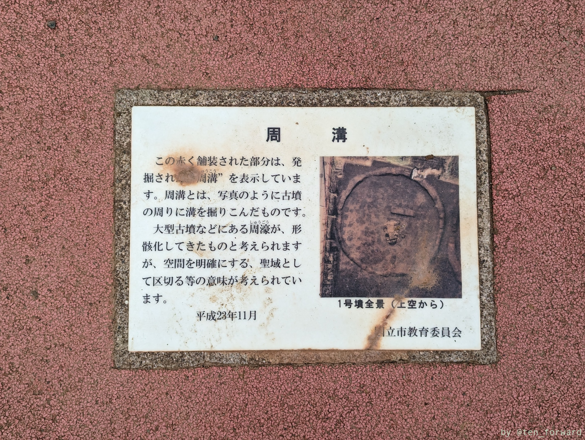

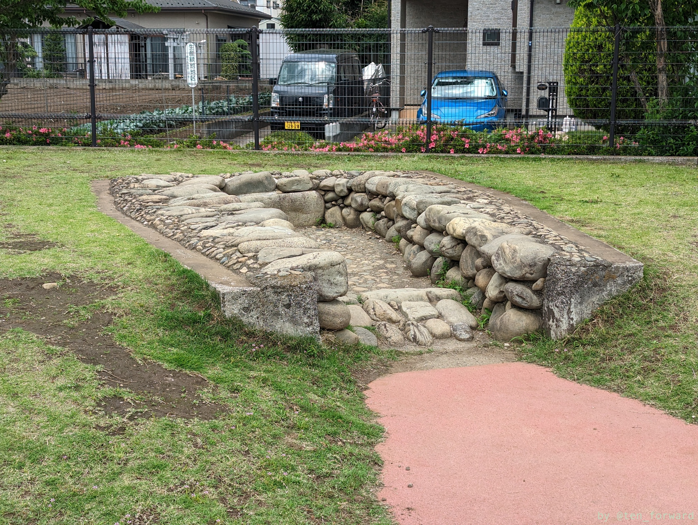
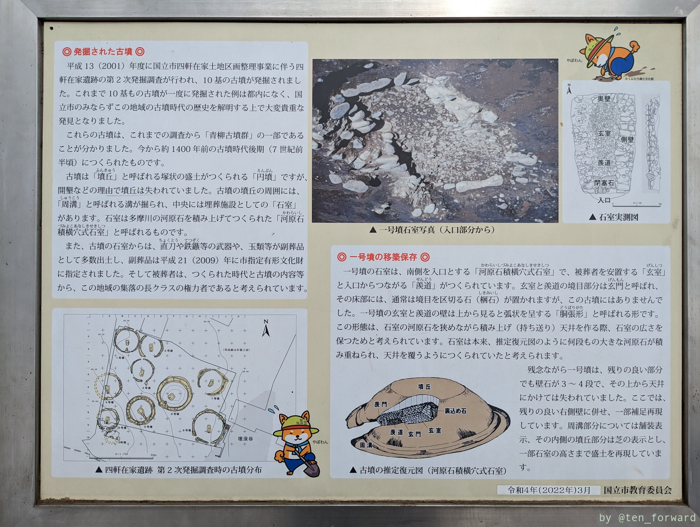

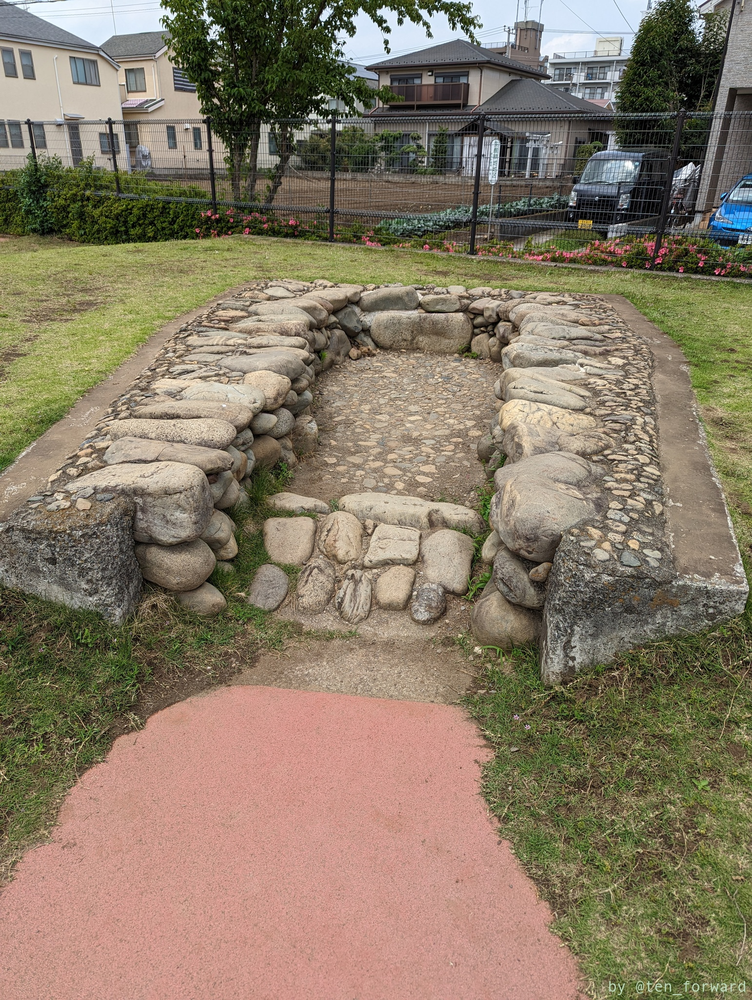
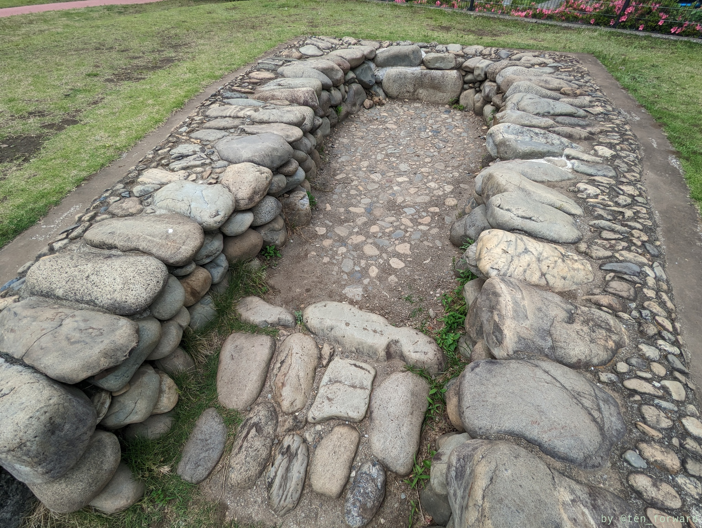
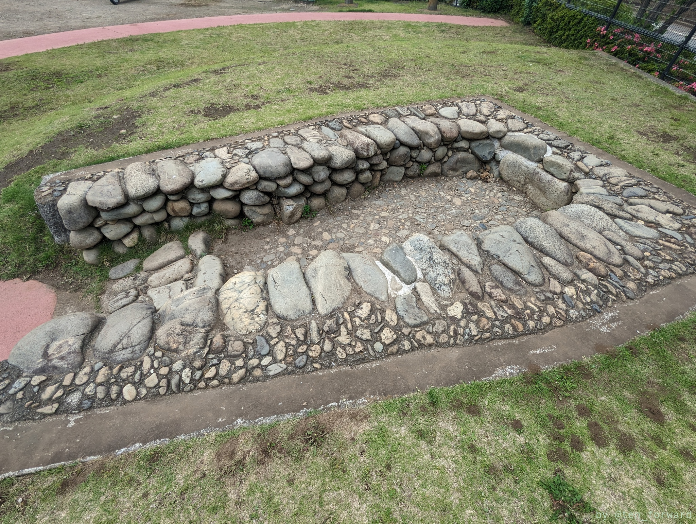

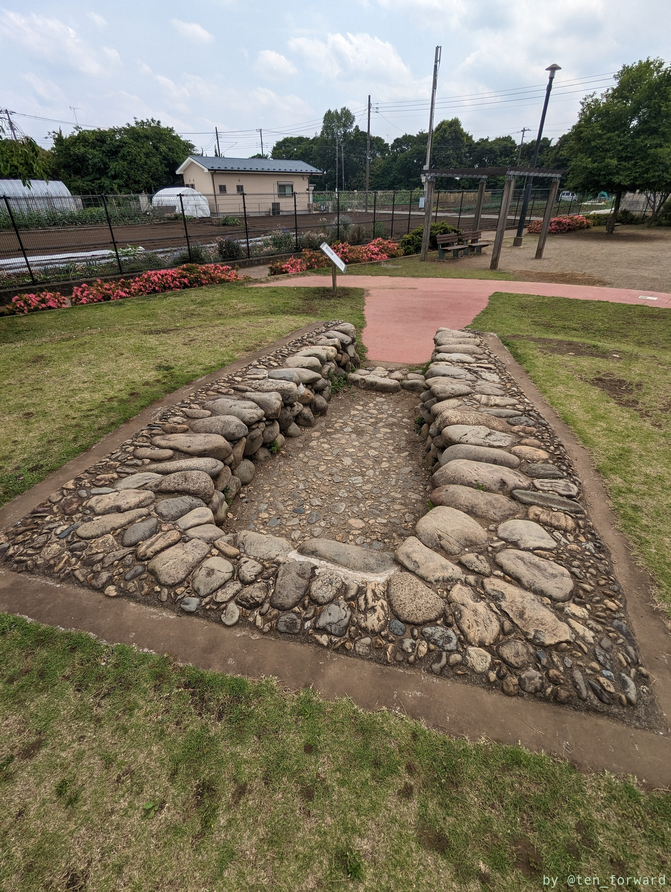
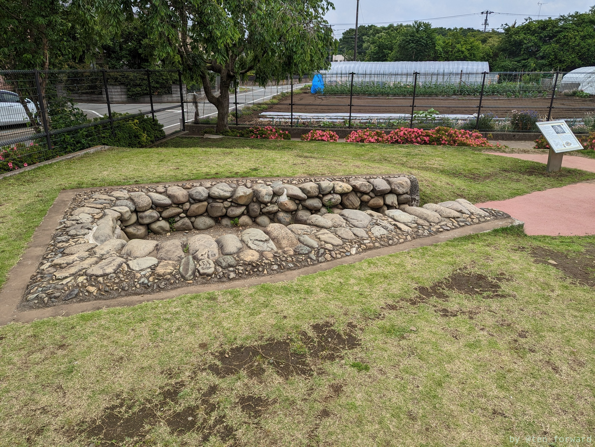
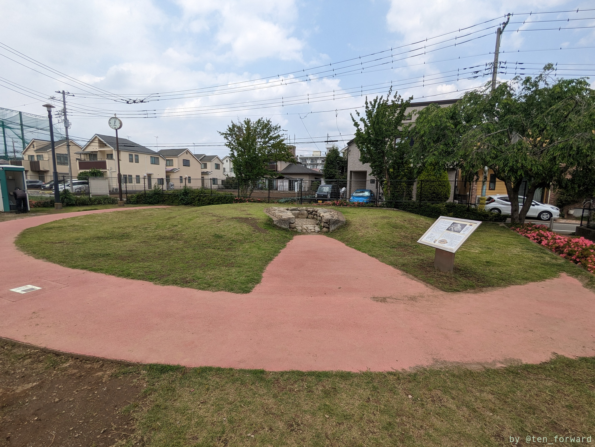

こじんまりとしていますが、きれいに移設・復元されています。
