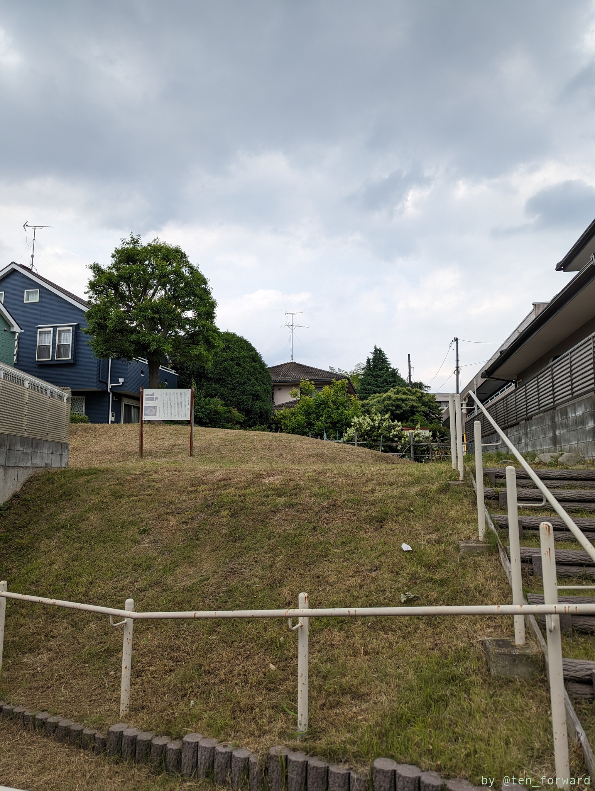
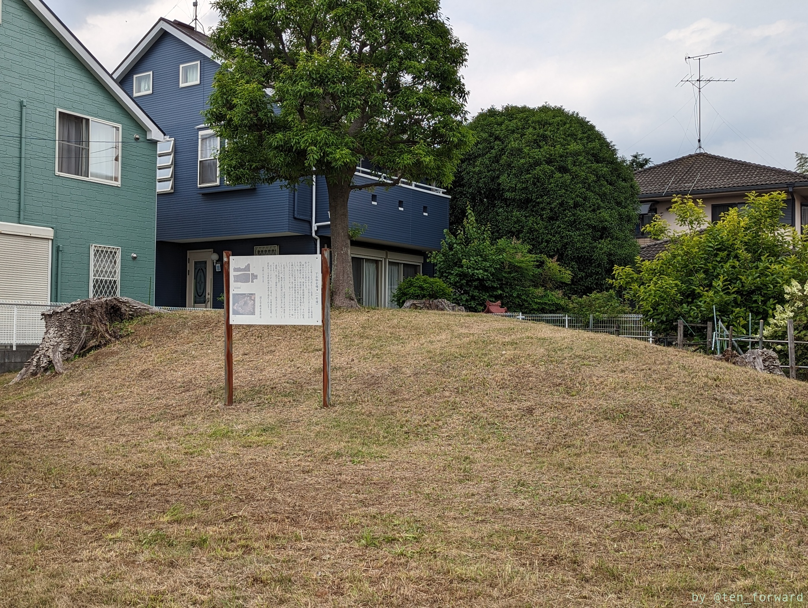
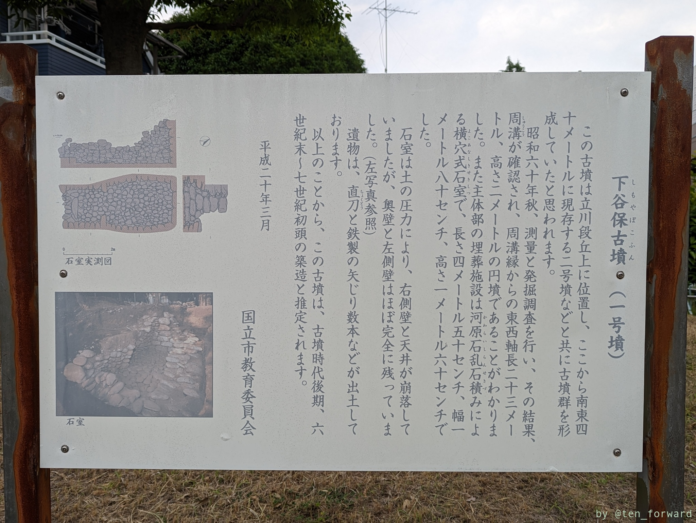
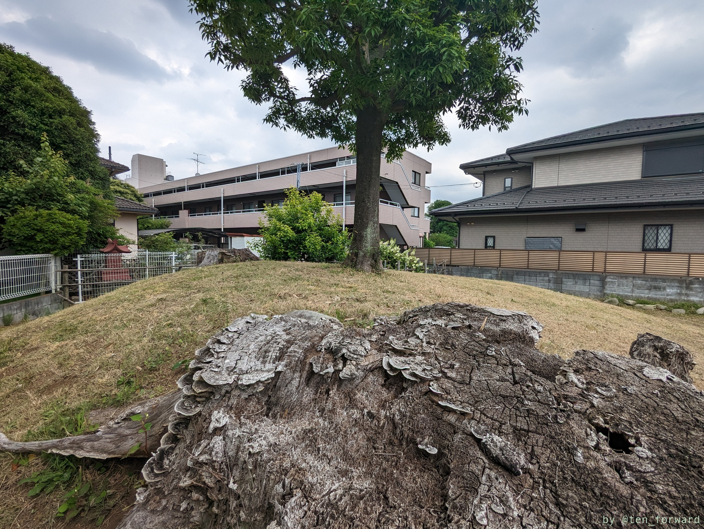
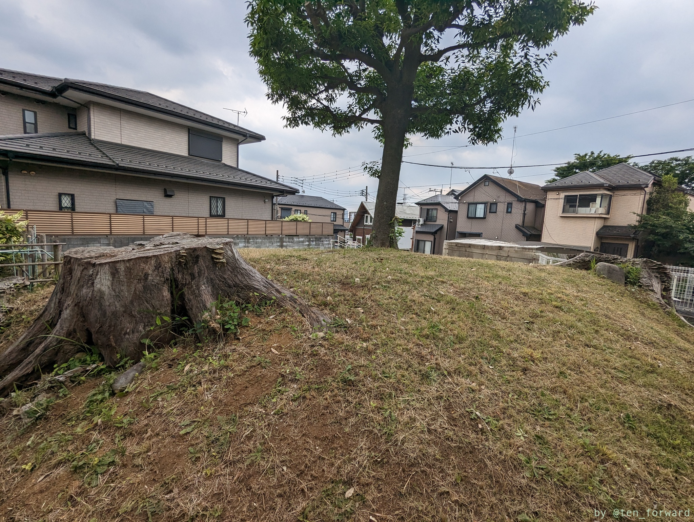
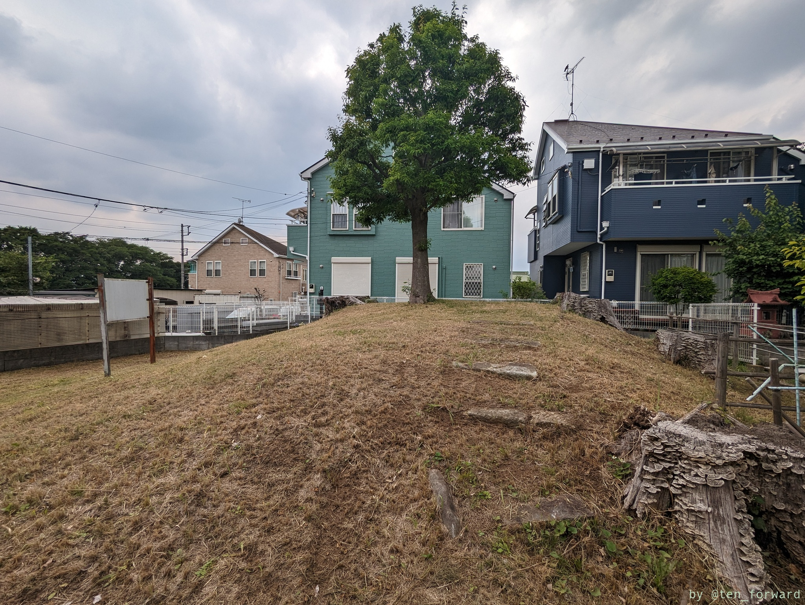
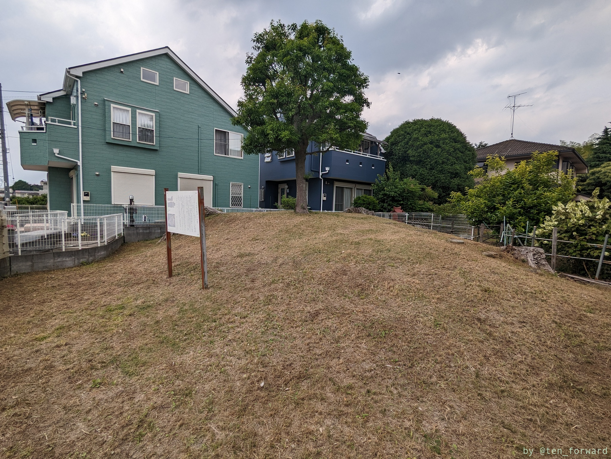
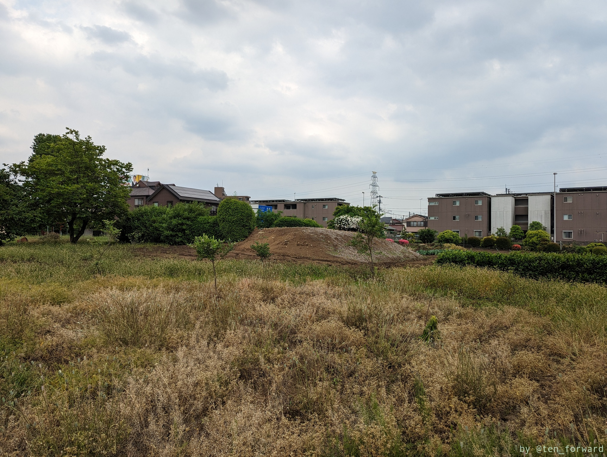
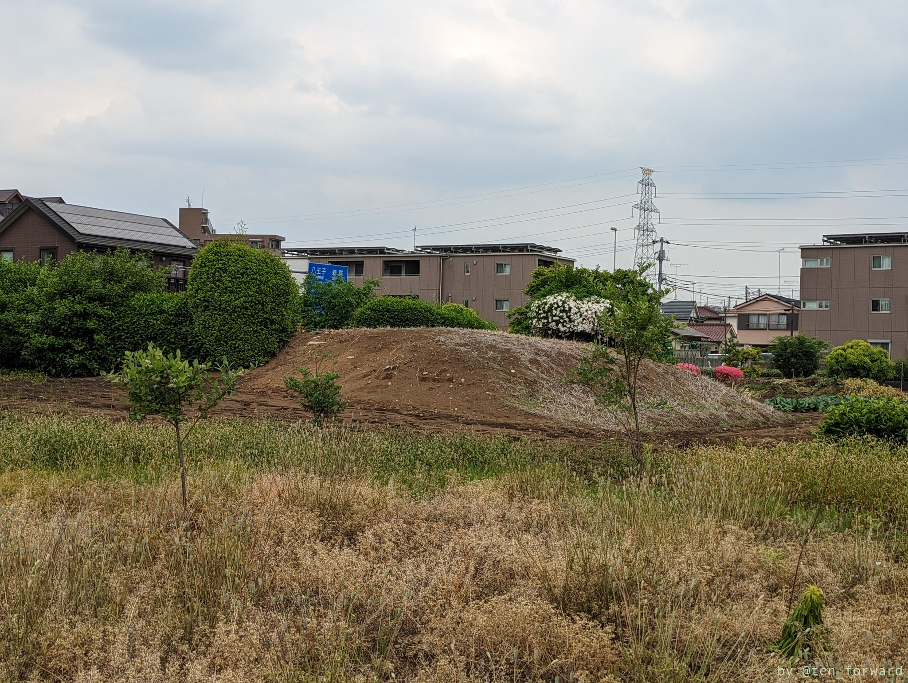

引き続きこの日訪れた府中・国立の古墳。南武線谷保駅から徒歩 10 分程度の住宅地の中にある、下谷保古墳群の 1, 2 号墳です。下谷保古墳群は 10 個の古墳が確認されており、近くには谷保古墳という古墳もあるようです。見れる形で残っているのは、この 1, 2 号墳のみで、あとは開発でなくなっているようです。

1 号墳の脇には 9 号墳の石室石材が置かれていたようですが、あとで知ったので写真はありません。

1 号墳は公園のように敷地への階段があり、中に案内板が設置されています。墳丘はきちんと草刈りもされていて、ちゃんと保存されています。墳丘脇には（写真では見づらいですが）小さな祠があります。元は墳丘頂上にあったようです。この祠があったため、古墳がきちんと保存されていたようです。

墳丘に切り株がありますが、石室の保存のために木は切られたようです。

1 号墳を出て前の道を左に少し進むと民家と駐車場の間に少し隙間があり、そこを（失礼して）少し上がると畑の中に 2 号墳が見えます。私有地らしいので遠くから撮影だけしました。

## 参考・関連情報

* [市内で古墳が発見されました!! (発掘調査報告書のご案内)](https://www.city.kunitachi.tokyo.jp/about/about1/about2/1465447523213.html) （国立市）
* [下谷保 1 号墳](https://kofun.info/kofun/1389) （古墳マップ）
* [下谷保 2 号墳](https://kofun.info/kofun/1390) （古墳マップ）
* [下谷保古墳群（しもやぼこふんぐん）、解体中の国立会館　＠東京都国立市谷保](https://massneko.hatenablog.com/entry/2014/11/05/180200) （墳丘からの眺め）
* [下谷保 10 号墳](http://gogohiderin.blog.fc2.com/blog-entry-567.html) （古墳なう）
