最高気温 35 ℃で熱中症の危険があるので外出は控えるようにという予報が出ている中、じゃあ車で楽に行けるところに行くかということで行ってきました。兵庫県宝塚市にある中山寺の中にある中山寺古墳です。

築造時期は 6 世紀後半から 7 世紀前半。墳丘の形状はわかっていないようです。円墳か方墳という説があるとか。

中山寺は安産祈願で有名で、そういえばうちの子が産まれる前に行ったような（うろおぼえ）。

アクセスは、阪急宝塚線の中山観音駅もしくは JR 宝塚線の中山寺駅から徒歩です（阪急の方が近い）。

* [アクセス](https://www.nakayamadera.or.jp/about/access.html) （中山寺）

駅から少し歩くと立派な山門が見えます。途中はエスカレーターなどもあって優しいです（エスカレーター乗るほどの距離でもない階段ですがw）。

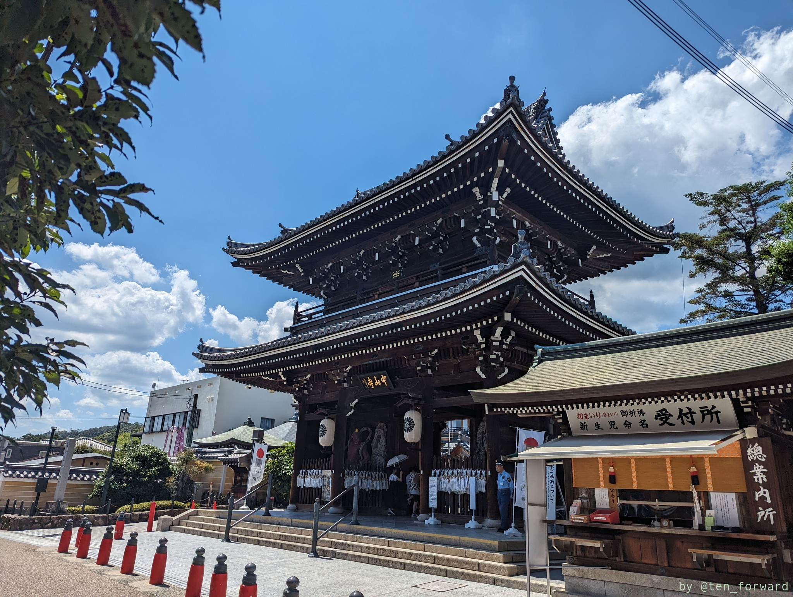
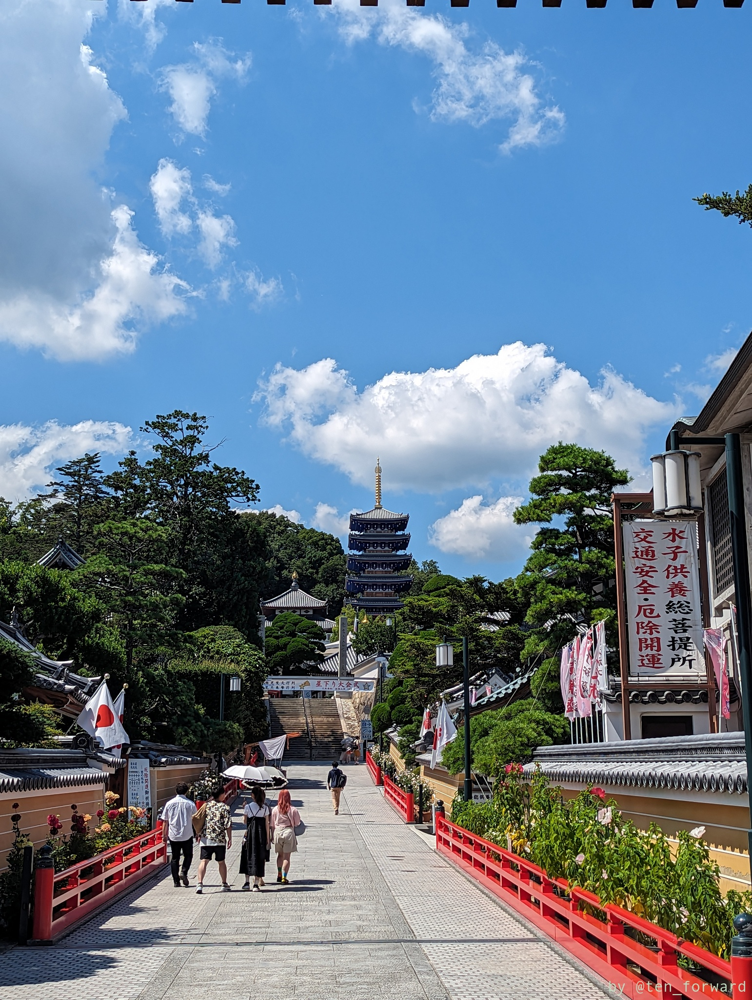

上の 2 枚目の写真に見える階段（or 脇にあるエスカレーター）を上がってまっすぐさらに階段を上がると本堂の方に行くのですが、左の方に行くとお寺の案内としては「石の櫃（からと）」という名前がついた石室の前に出ます。

* [境内の鳥瞰図](https://www.nakayamadera.or.jp/about/chokan.html) （中山寺）

おぉー、これは良い羨道、良い石室、良い石棺!!

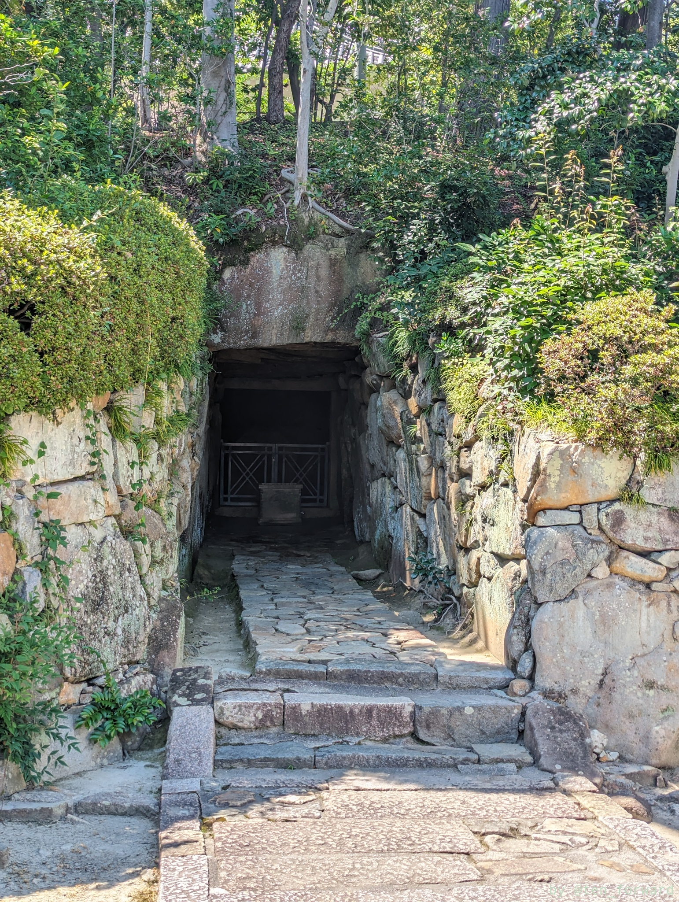
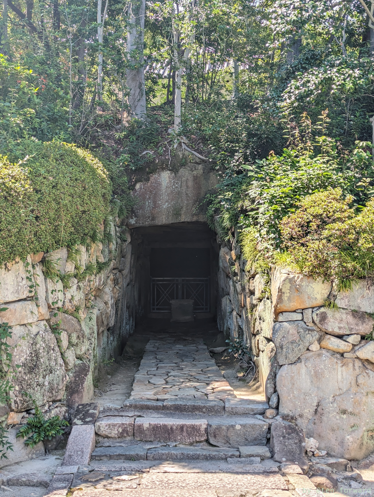

羨道は 8.5m とのことで、長いですよね。うーむ、立派。

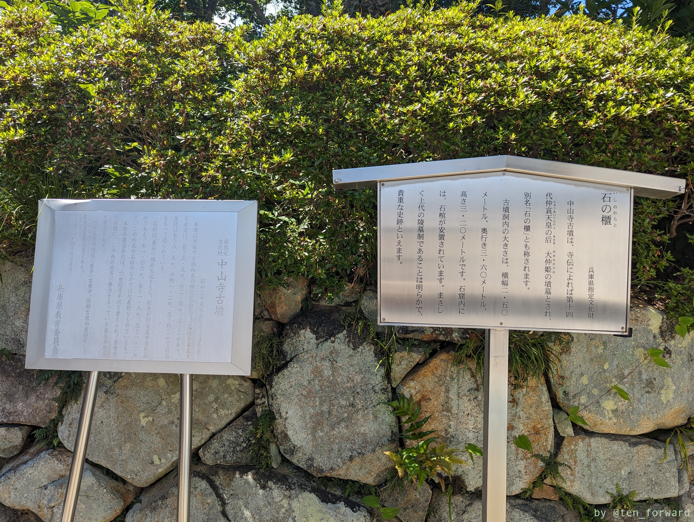
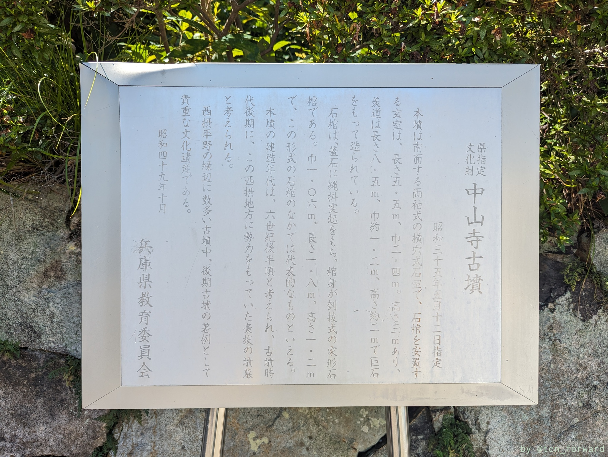

お寺の案内板と教育委員会の案内板が並んでいます。

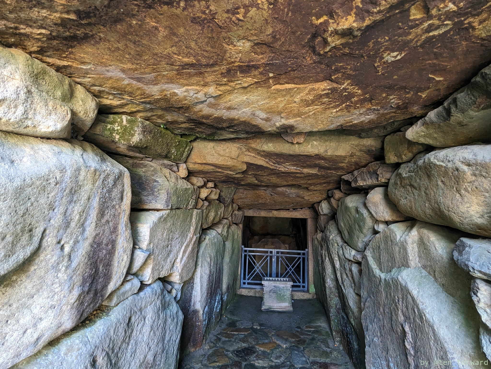
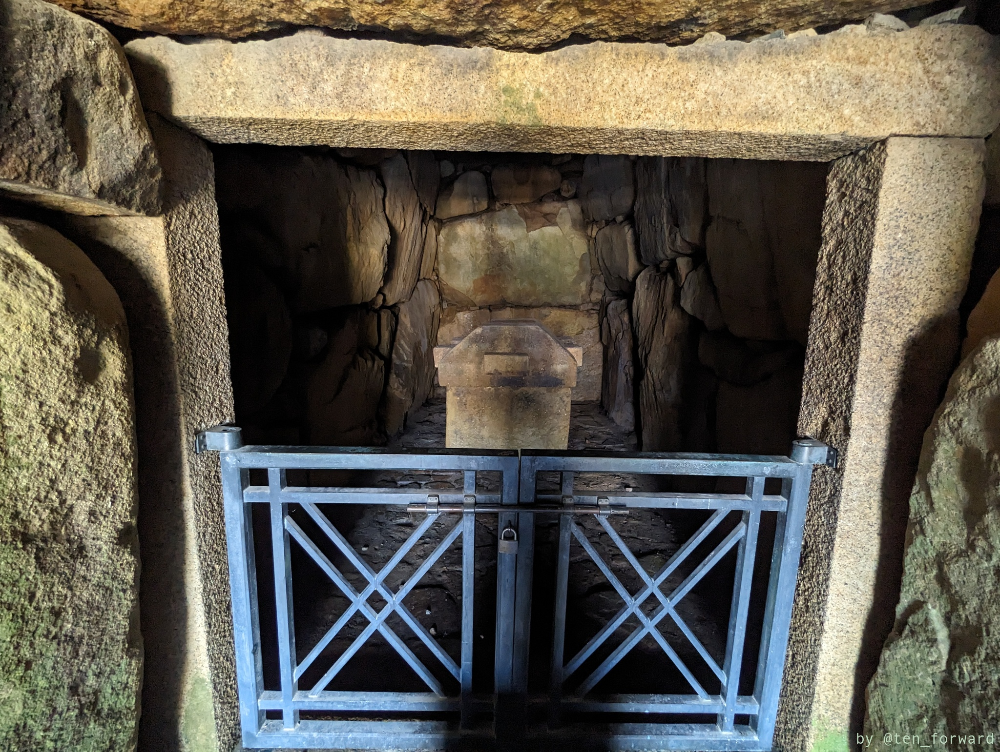

すごい。きちっとキレイに積まれています。玄室は入れませんが、近くから見れますので十分です。

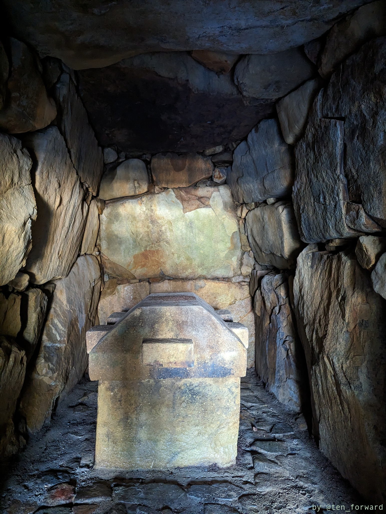
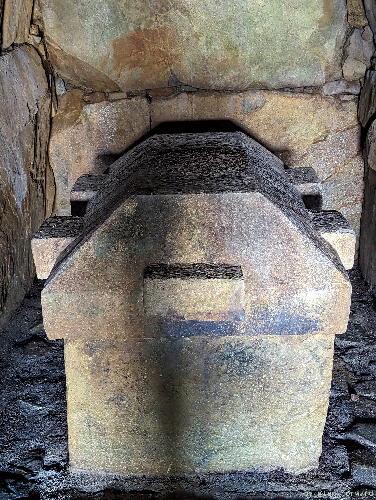

立派な石棺です。

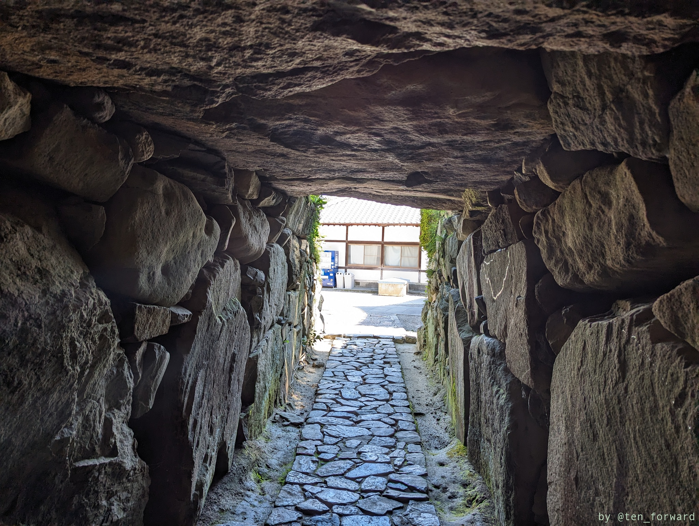
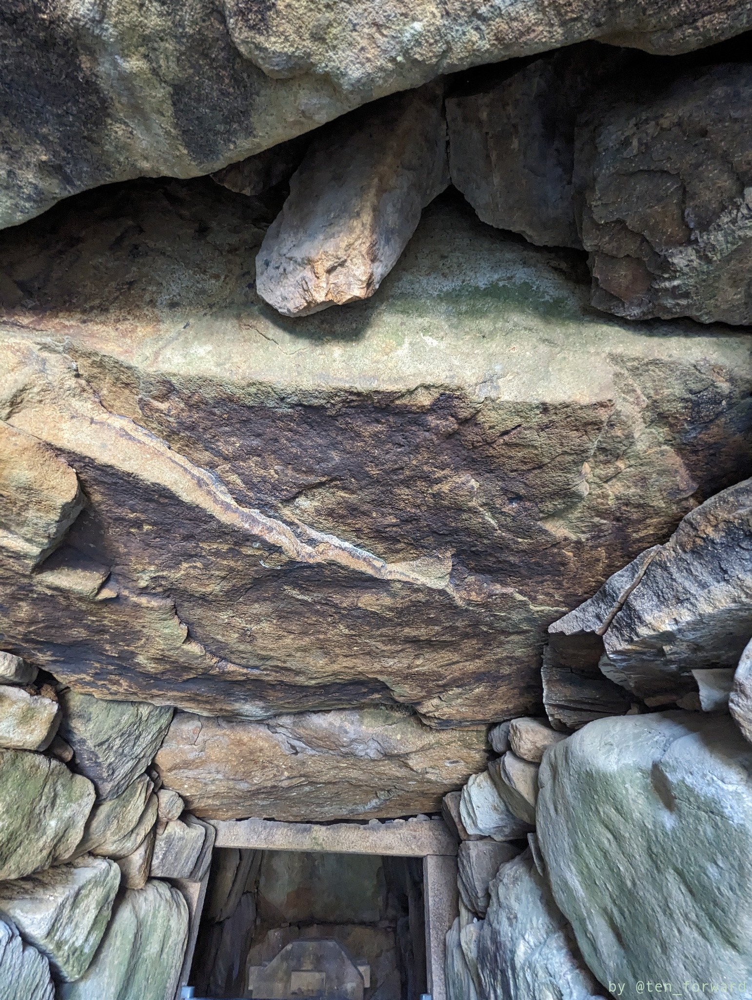

天井石なんかは巨石ですね。

羨道からきれいに石が積まれているところ、巨石の天井石、立派で整った形の石棺と見どころ満載です。

## 参考

* [Wikipedia の白鳥塚古墳](https://ja.wikipedia.org/wiki/%E7%99%BD%E9%B3%A5%E5%A1%9A%E5%8F%A4%E5%A2%B3_(%E5%AE%9D%E5%A1%9A%E5%B8%82))
* [「古墳とかアレ」さんの「中山寺古墳」ページ](http://kofuntokaare.main.jp/6goufun/page495.html)
* [「古墳にワクワク」さんの「中山寺（白鳥塚）古墳（宝塚市）（兵庫県）」ページ](http://kofunwodougademiru78.publog.jp/archives/74094907.html)

