近鉄飛鳥駅から北北西の方へ少し歩くと民家の脇に岩屋山古墳があります。7世紀中ごろの方墳ですが、八角墳という説もあるようです。

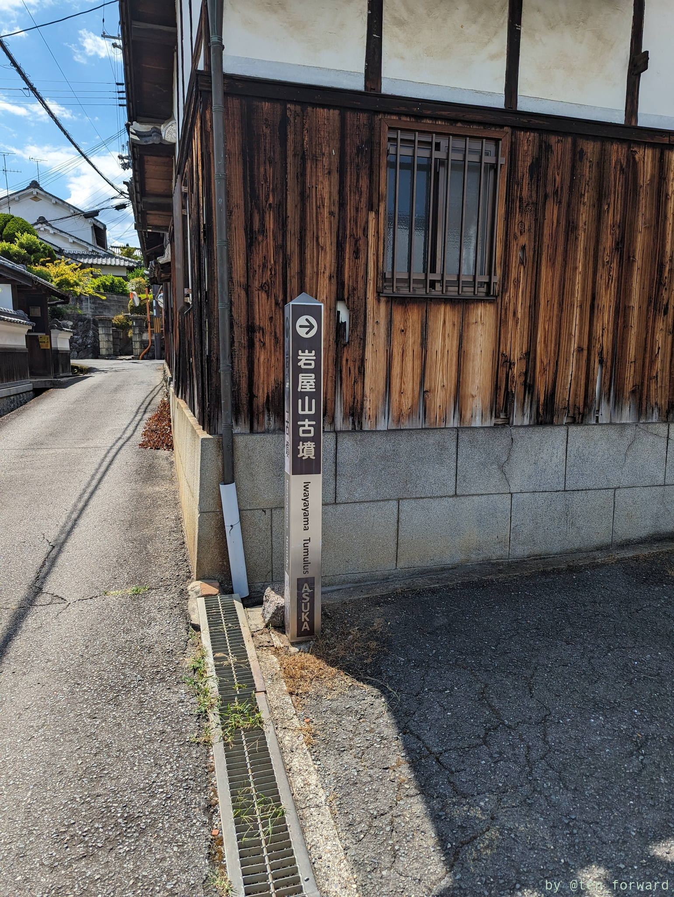
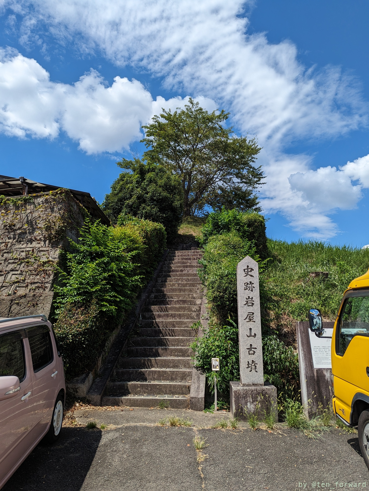

階段を上がると正面に大きく開口部のある古墳が見えます。

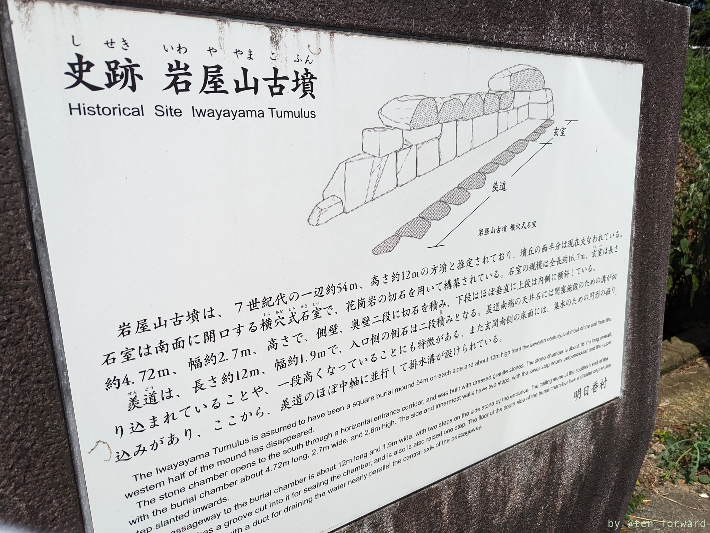
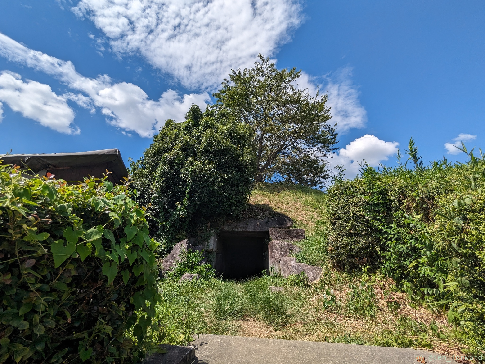

羨道が長く、きれいに巨石が積まれているところで後期感ありますね。天井とかすごく大きいですね。

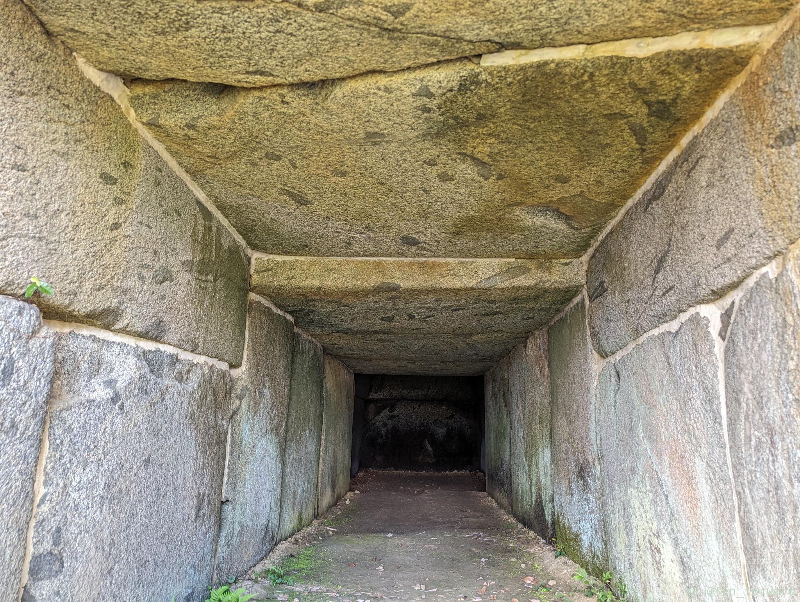
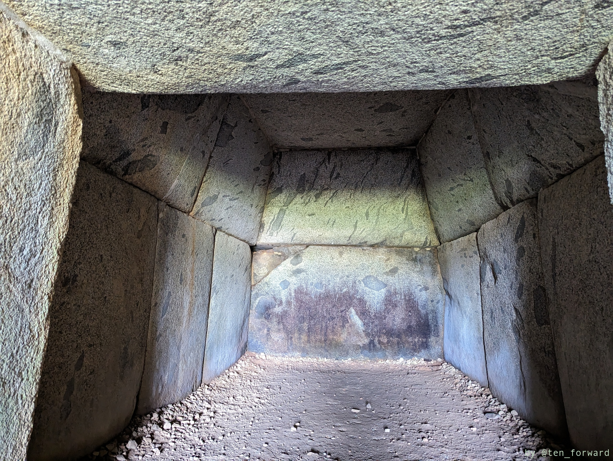

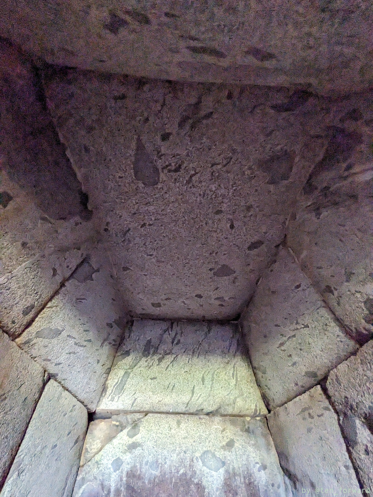
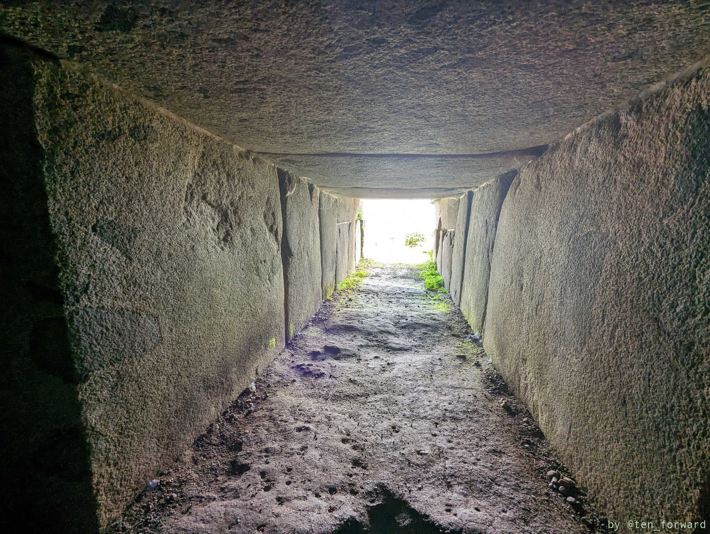

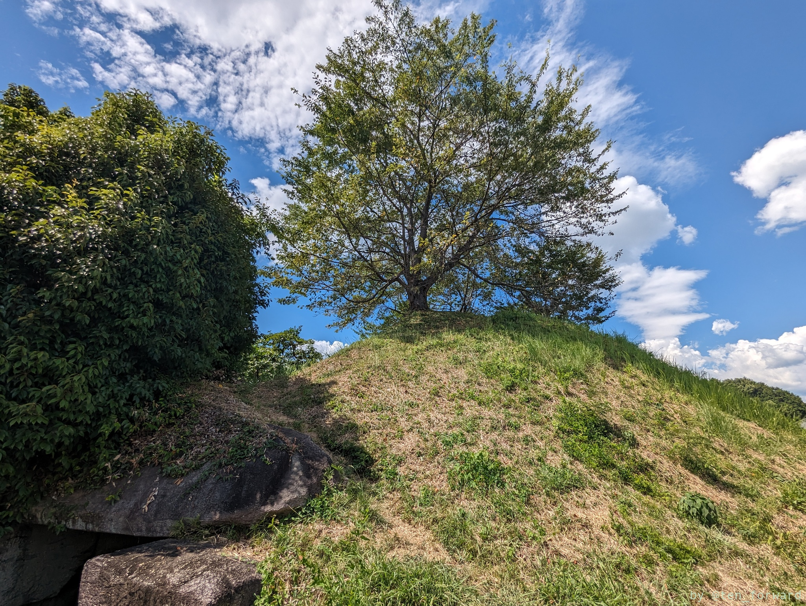
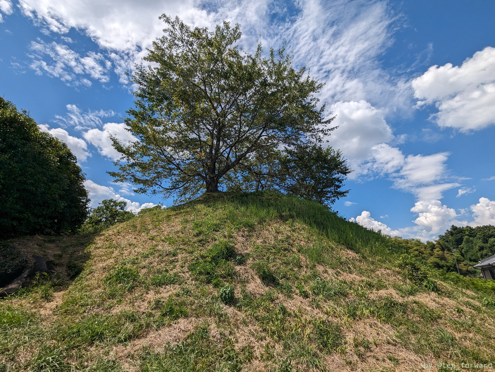

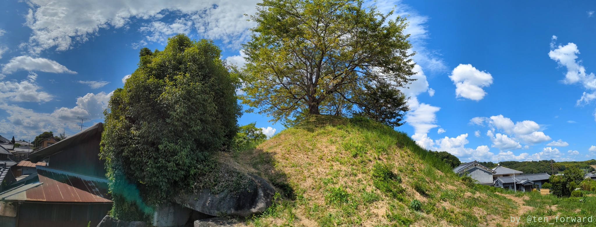

## 参考

* [岩屋山古墳 (国指定史跡)](https://www.asukamura.jp/gyosei_bunkazai_shitei_1_iwaya.html) （明日香村）
* [岩屋山古墳](https://asukamura.com/sightseeing/496/) （旅する明日ネット）
