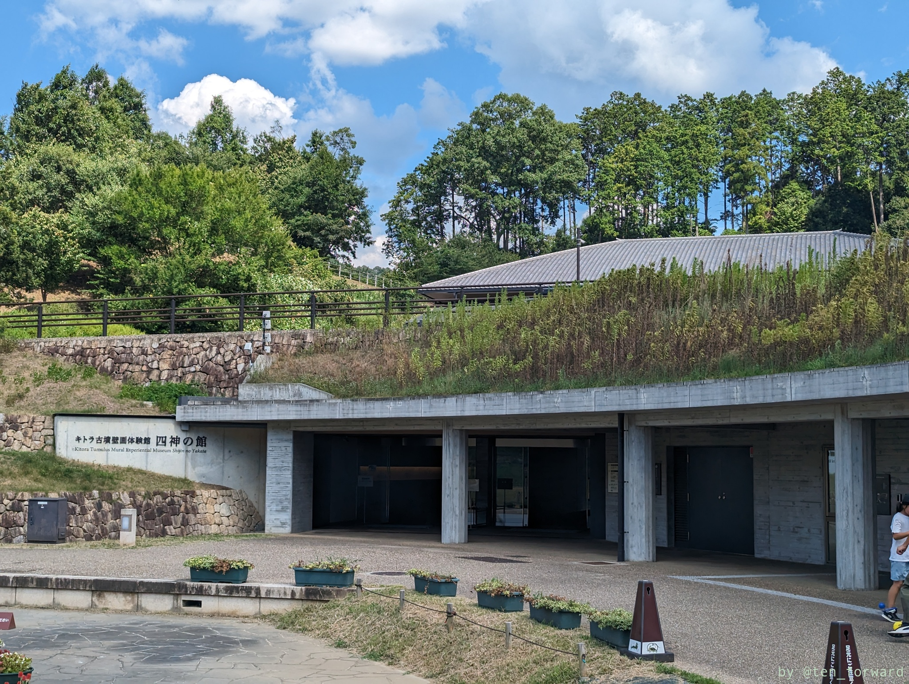
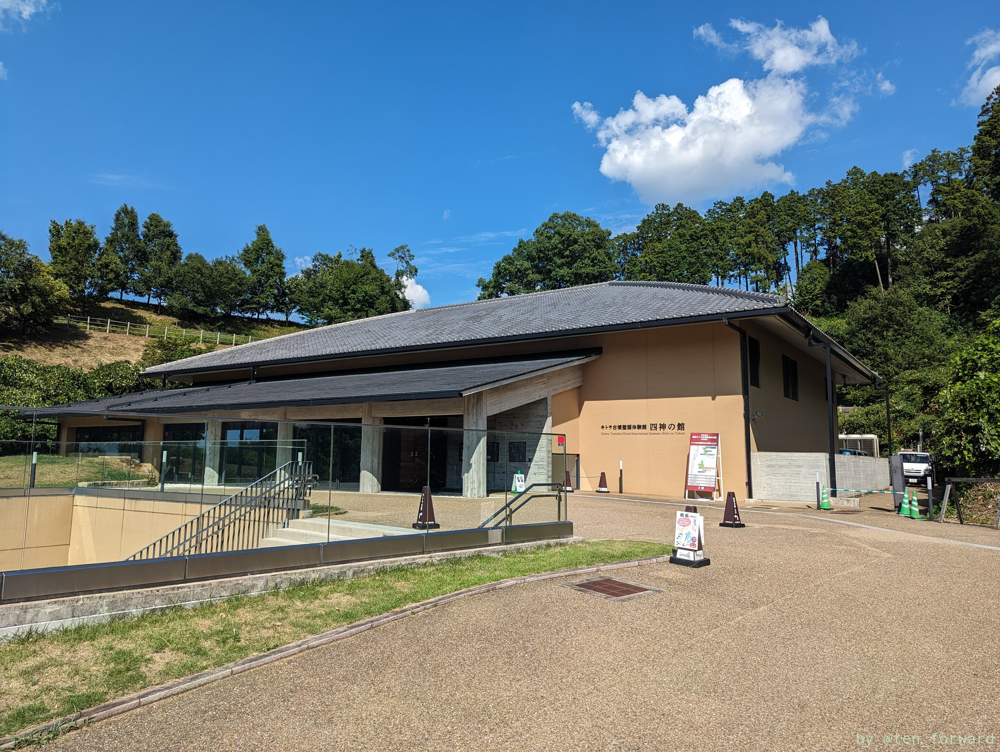
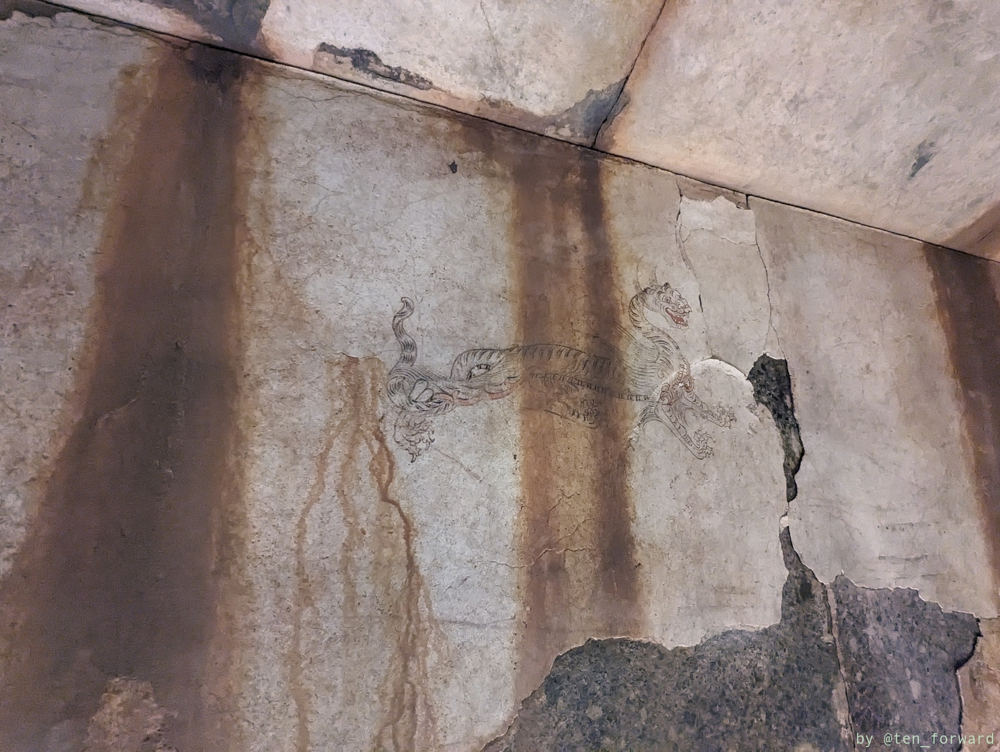
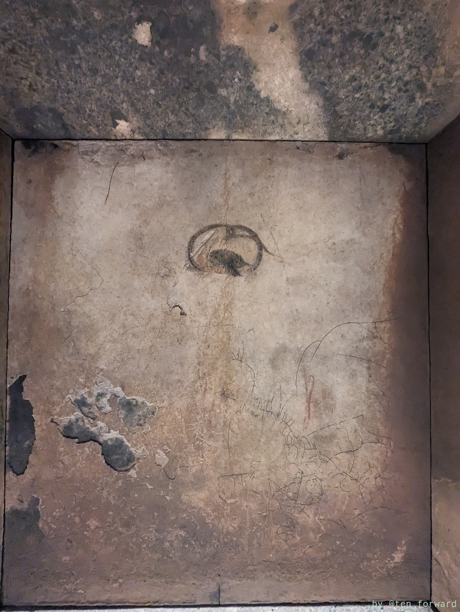
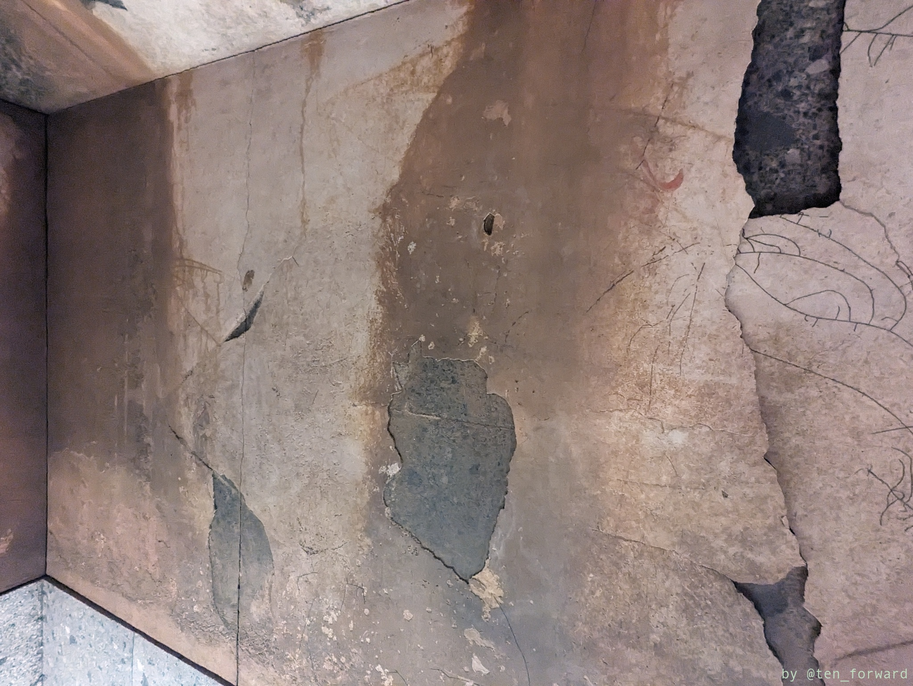
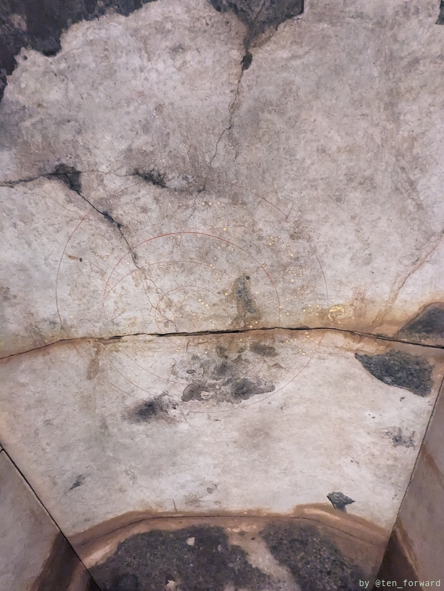
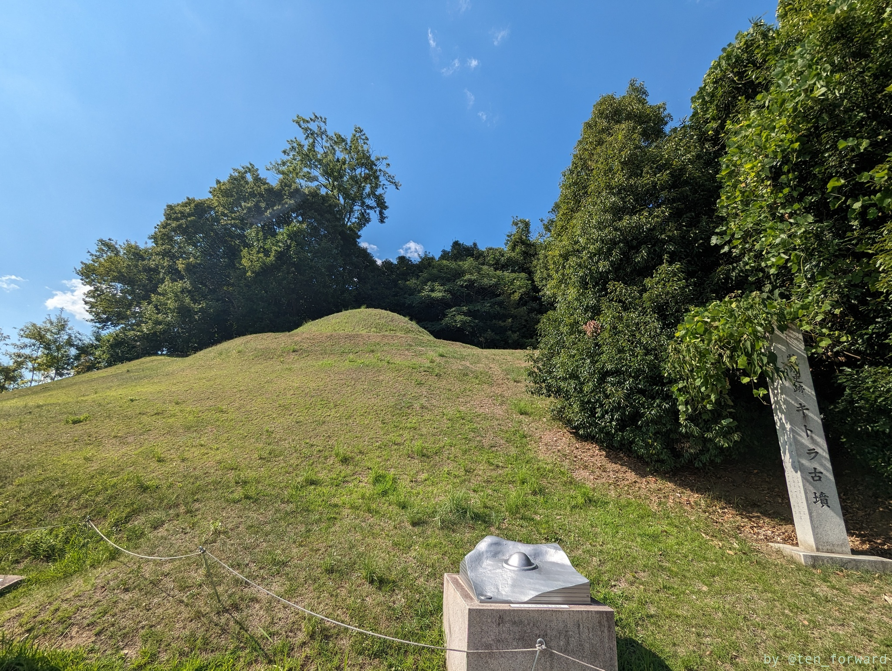
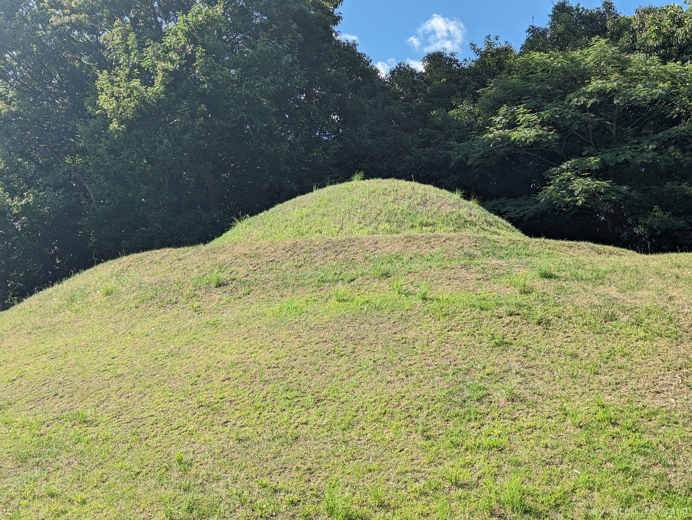
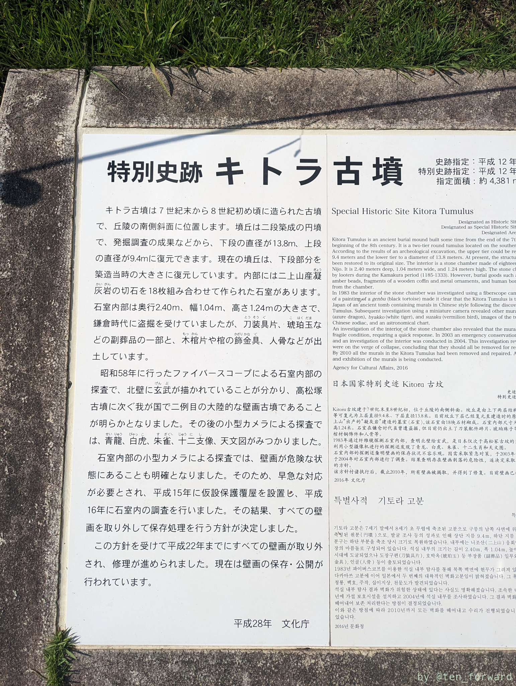
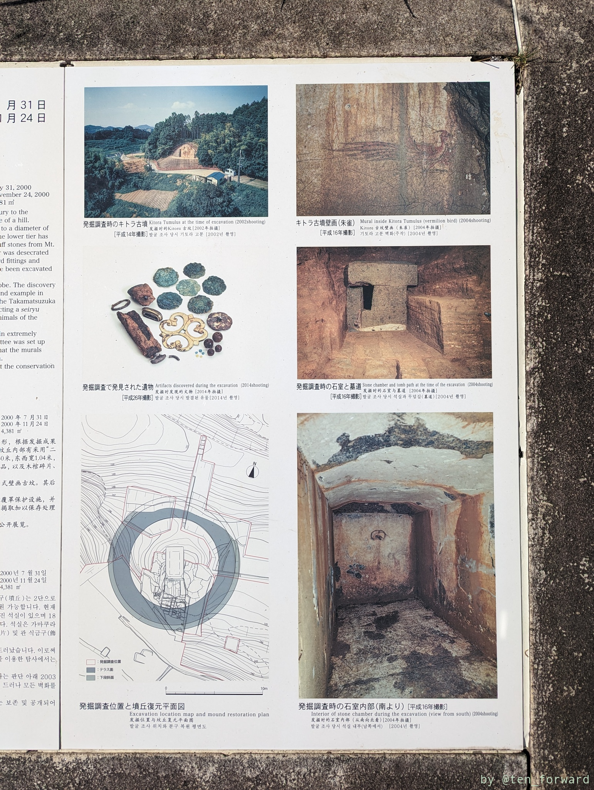

## キトラ古墳壁画体験館 四神の館

この日のメインイベントはキトラ古墳の壁画公開。応募して行ってきました。今回は南壁「朱雀」でした。

壁画体験館四神の館の前に駐車場があるのですが、あいにく満車で 1km 近く先の第2駐車場に止めました。灼熱の暑さの中、この距離は遠い…

地下には色々な展示がされています。入るとすぐに石室の復元があり、近くに座っているボランティアの方にお願いすると内部に入って見学できます。説明もお願いするとやってくれますので、壁画公開に行く場合はここで予習してから行くと良いでしょう。

復元ですが、本物に近く再現されているので、実際に説明を聞かないと見落とす絵もあったりして、説明は聞いたほうが良いと思いますよ。

壁画の公開の見学は1階です。こちらは撮影禁止。10分ほどですが、小さな部屋ですので時間は十分でした。肉眼でもよく見えますが、オペラグラスも貸してくれるので、これで拡大させて見るとより細かいところまで見えます。

## キトラ古墳

キトラ古墳は 7 世紀末〜 8 世紀初めごろの二段築成の円墳です。

四神の館の外にはキトラ古墳があります。見るところからは結構高い位置にありますので、見上げる感じですね。

かわいい円墳ですね。

## 参考

* [キトラ古墳壁画体験館　四神の館　キトラ古墳壁画保存管理施設](https://www.nabunken.go.jp/shijin/index.html)
* [キトラ古墳](https://www.asuka-park.jp/area/kitora/tumulus/) （国営飛鳥歴史公園）
* [キトラ古墳](https://asukamura.com/sightseeing/510/) （旅する明日香ネット）
