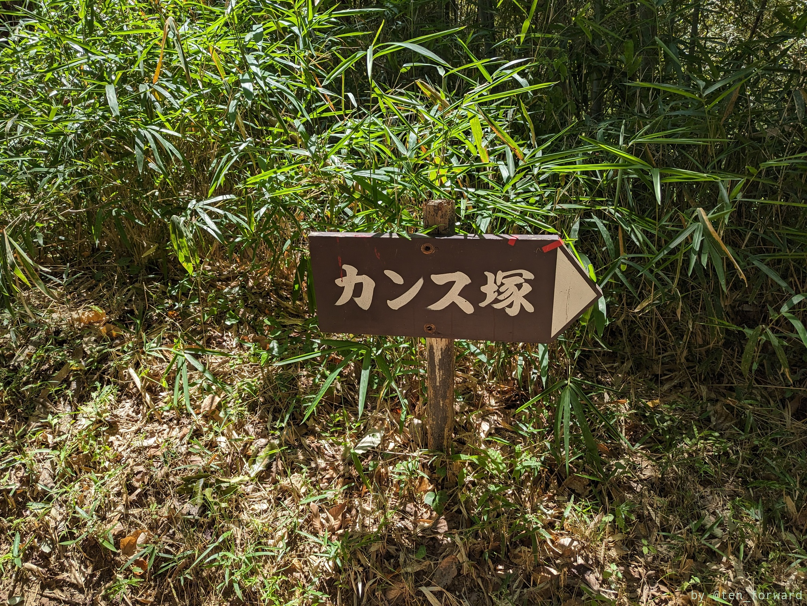
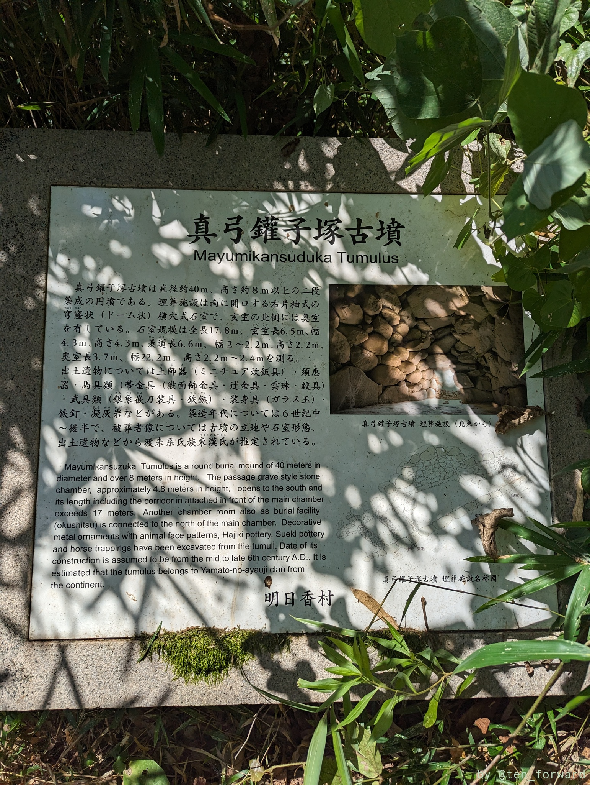
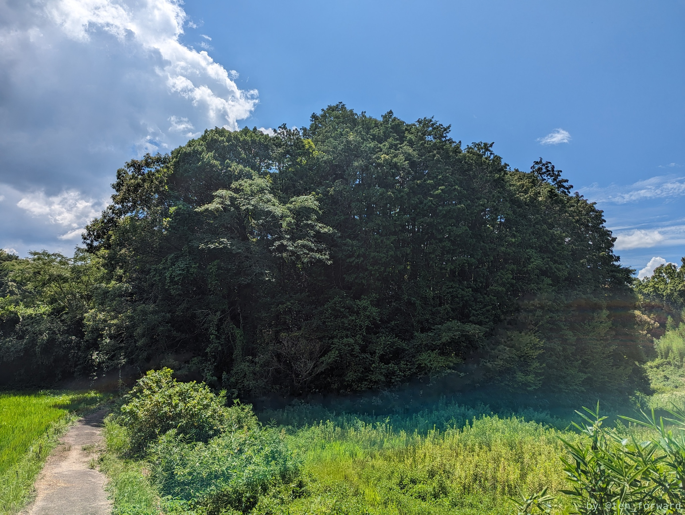
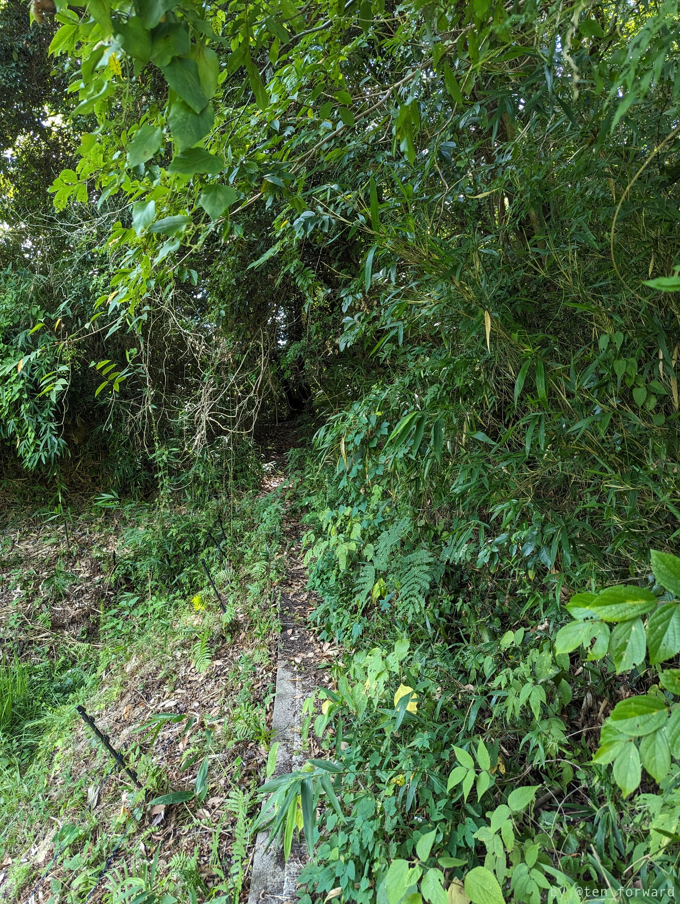
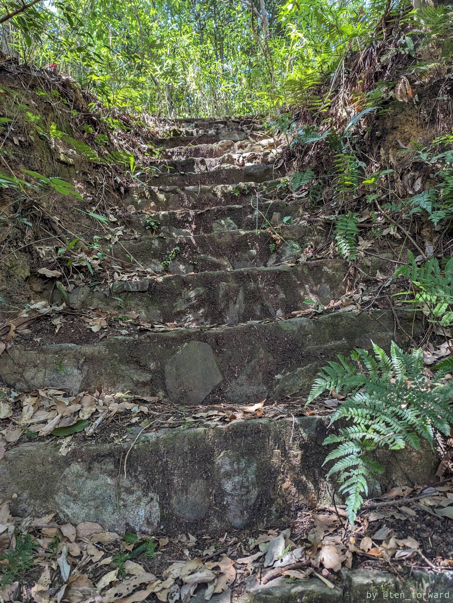

アグリステーション飛鳥から牽牛子塚古墳へのアクセス道の途中にあるのが真弓鑵子塚古墳です。分岐のすぐ脇に案内板がありましたが、雑草で隠れてて最初わからなかった。6世紀中〜後半の円墳のようです。

上の写真のように近くまでアクセスできる道はありますが、その先はフェンスが建てられており（私が行った時は倒れてましたが）、その先には石の階段がありました。

階段を上がっても特に何かある風でもなく、夏で茂みも深いのでそれ以上進むのはやめておきました（その後のキトラ古墳の予約時間が迫ってたし）。

