涼しくなり天気が良かったので、思い立って茨木市の追手門学院大学に隣接する将軍山古墳に行ってきました（一部過去に行ったときの写真が含まれます）。

将軍山古墳は、全体で 6 つの古墳からなる古墳群でした。そのうち、6 世紀築造の円墳である 1 号墳が現存しており、その他は宅地造成により消滅しています。2 号墳のみ墳丘長 100m 超の前方後円墳で、石室のみ 1 号墳脇に移設されています。

1 号墳は大織冠神社として信仰の対象になっており、鳥居もある神社の本殿扱いです。

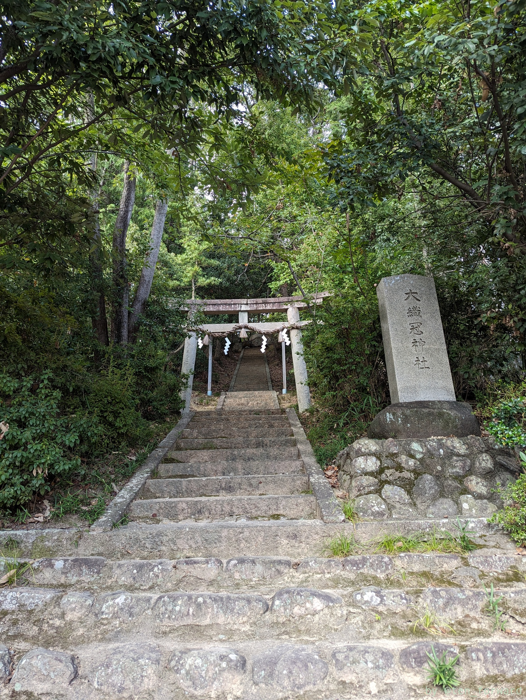
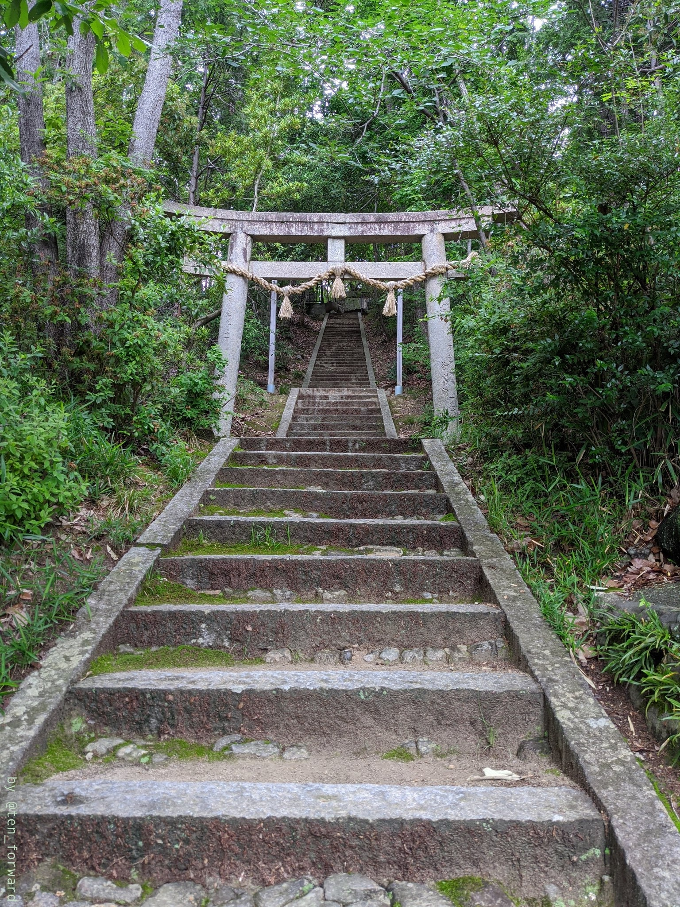

## 将軍山 1 号墳

1 号墳は藤原鎌足の墓として信仰の対象になっていたようでそのため、脇の石碑とか結構大切に信仰されてきた感じがします。ただ、築造年代（6世紀）からその可能性は少ないとのことです。

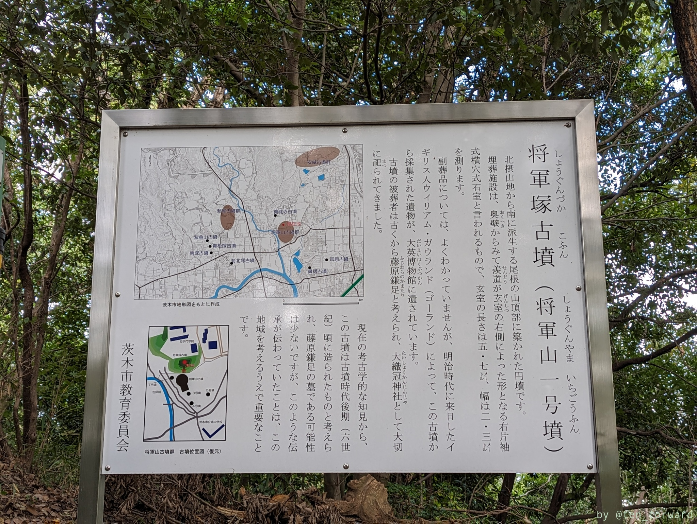
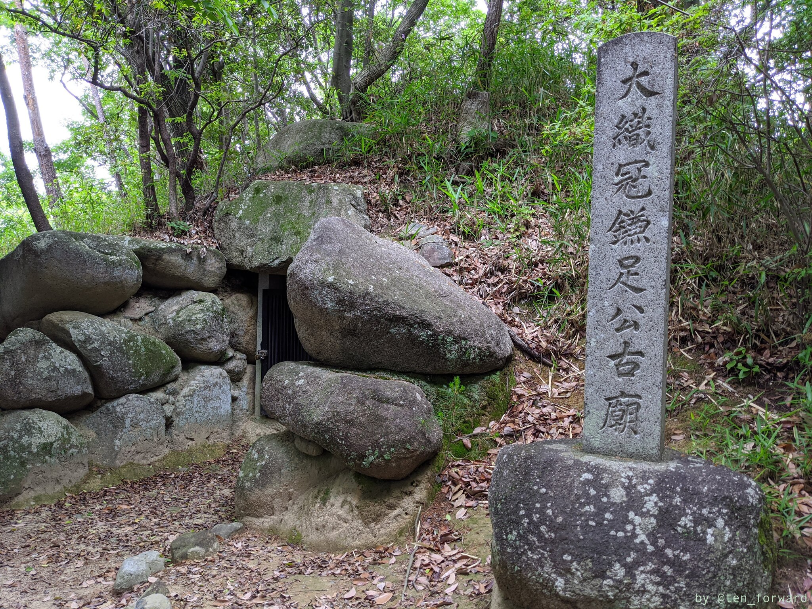

神社の本殿があるわけではなく、古墳自体が信仰の対象です。

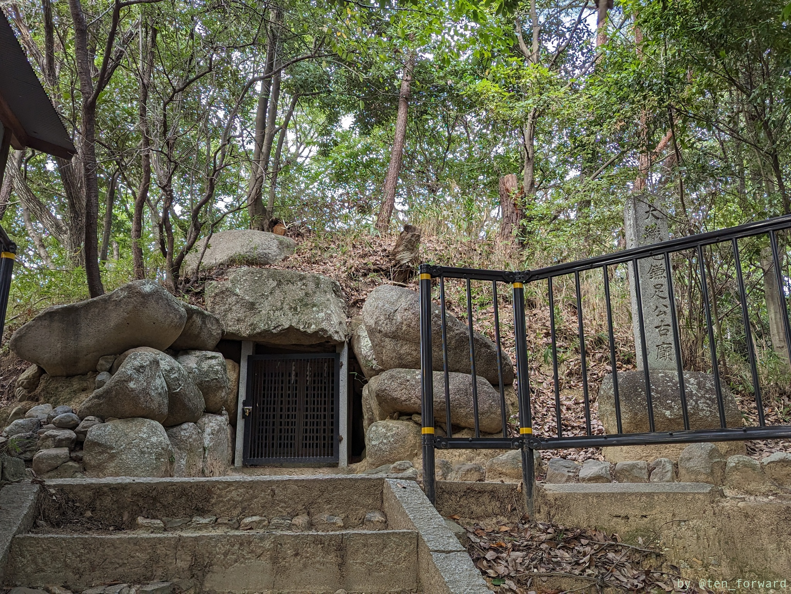
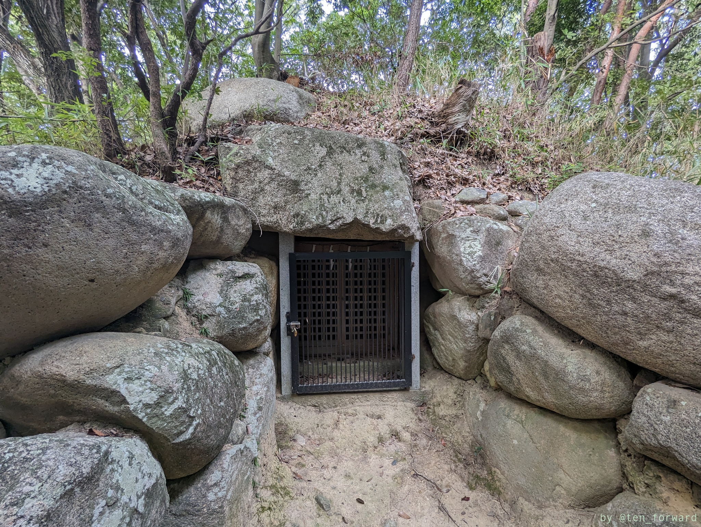

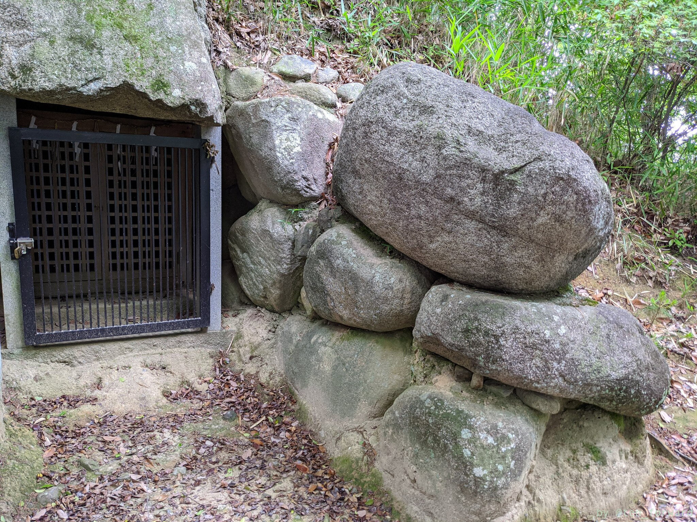
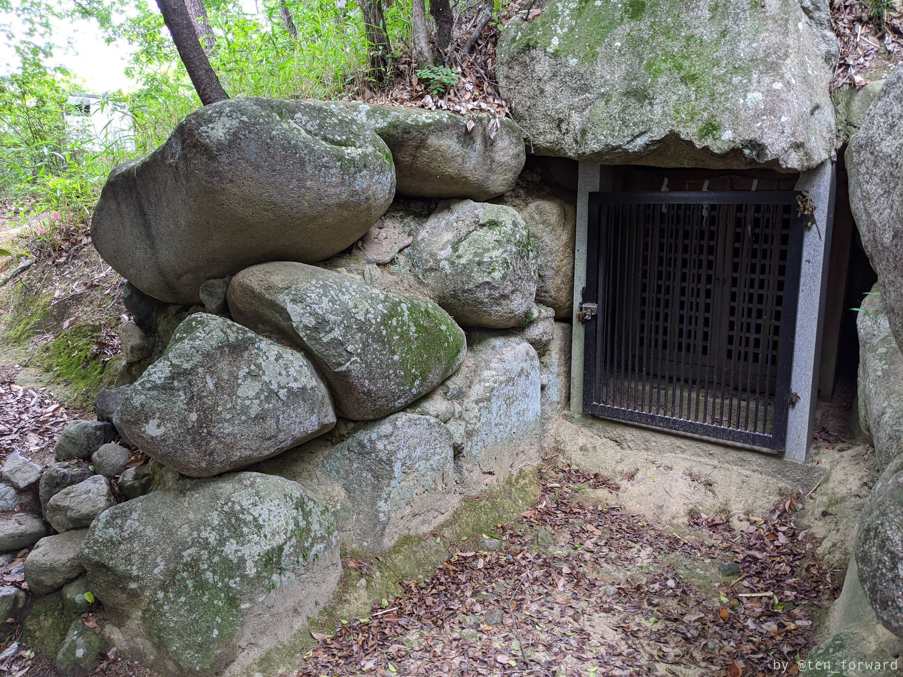

## 将軍山 2 号墳移設石室

1 号墳の脇には 2 号墳の移設石室があります。2 号墳だけ 4 世紀築造です。

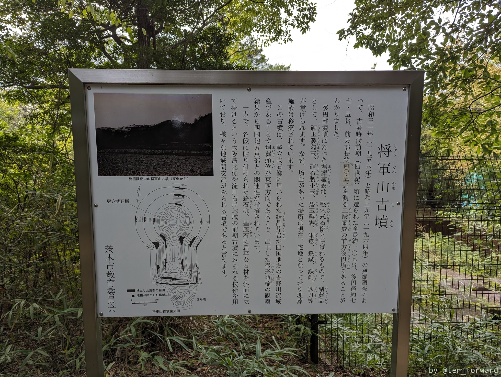
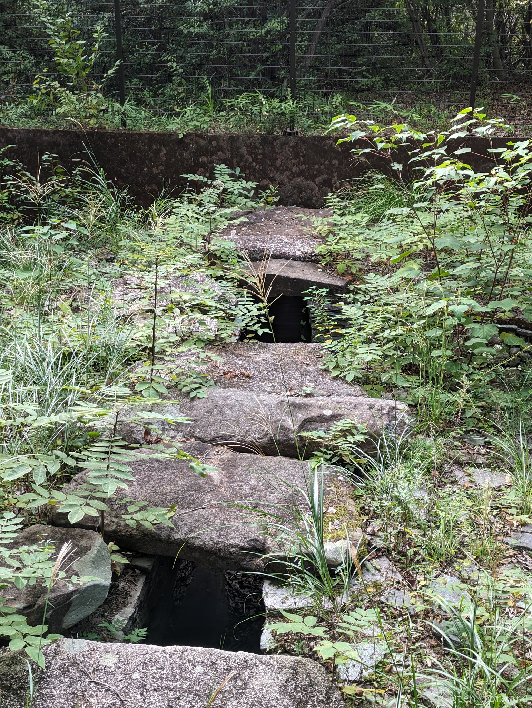

細かい石の積み上げで構成されている石室が美しいです。

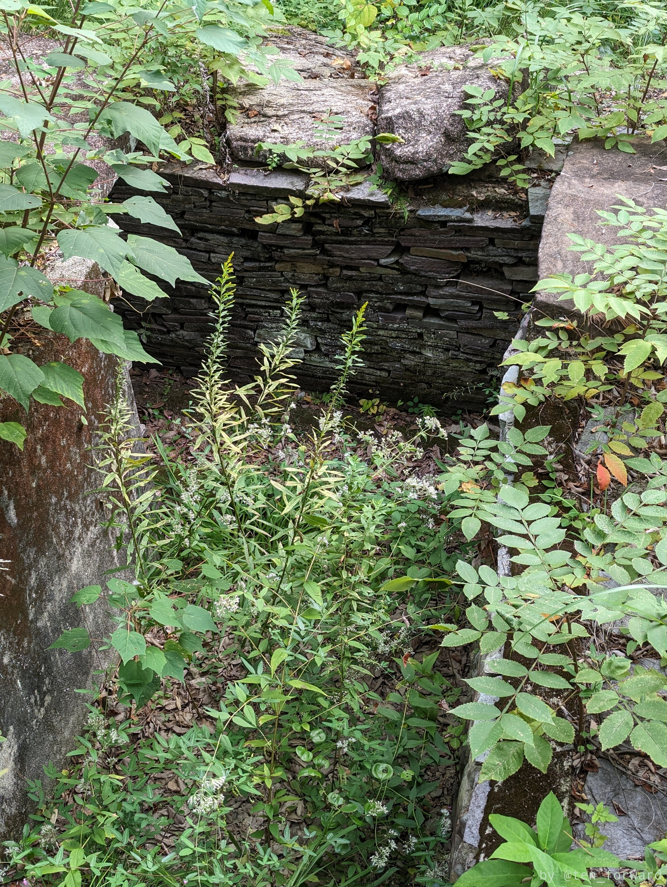
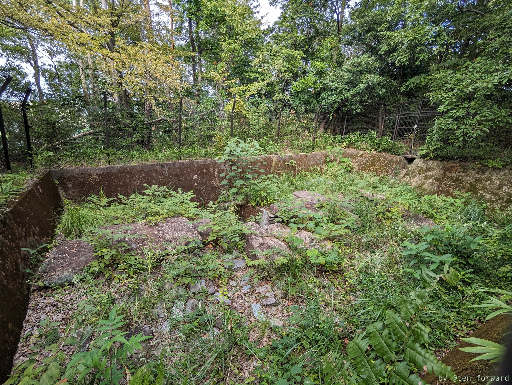
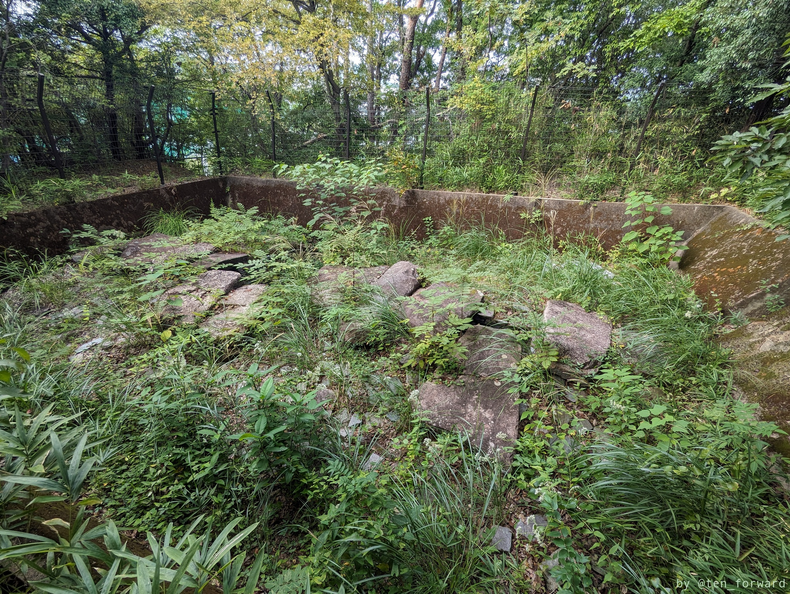

