寝屋川方面に行ったので、まだ見ていない古墳を見てきました。

寝屋川公園内にある寝屋古墳です。寝屋川公園は色々な競技場や施設があってたくさんの人が体を動かしている感じで、まさしく公営の公園としてはいい感じに利用されていていいな〜という感じでした。

寝屋川公園の駐車場がありますので、駐車場の心配はありません。

## 寝屋古墳

公園内でも北寄りの学研都市線の線路沿いにある古墳です。

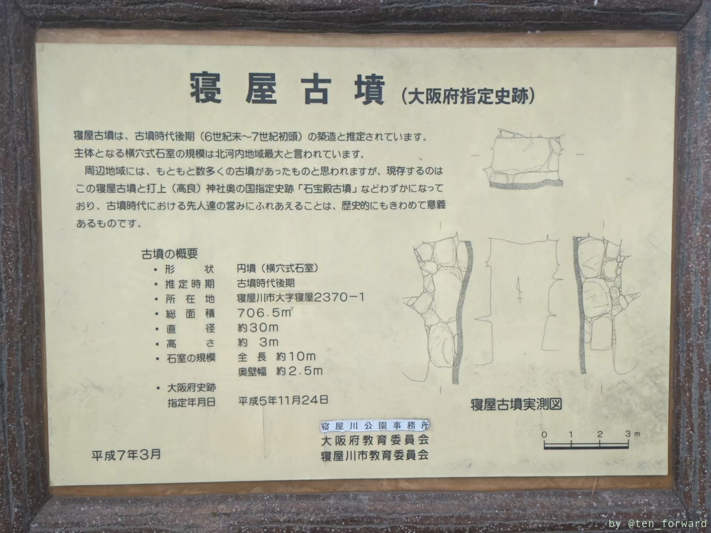
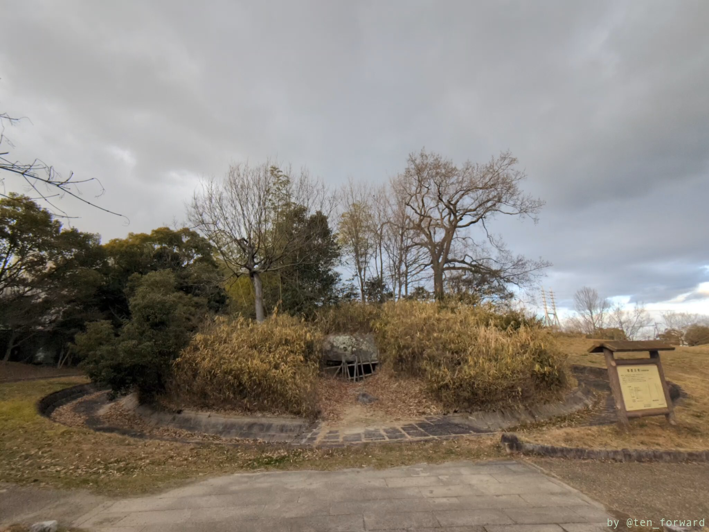

直径は約 22 メートル、高さ約 5 メートルで、6 世紀後半か 7 世紀前半の円墳だそうです。横穴式で、柵越しに石室内も見ることができます。

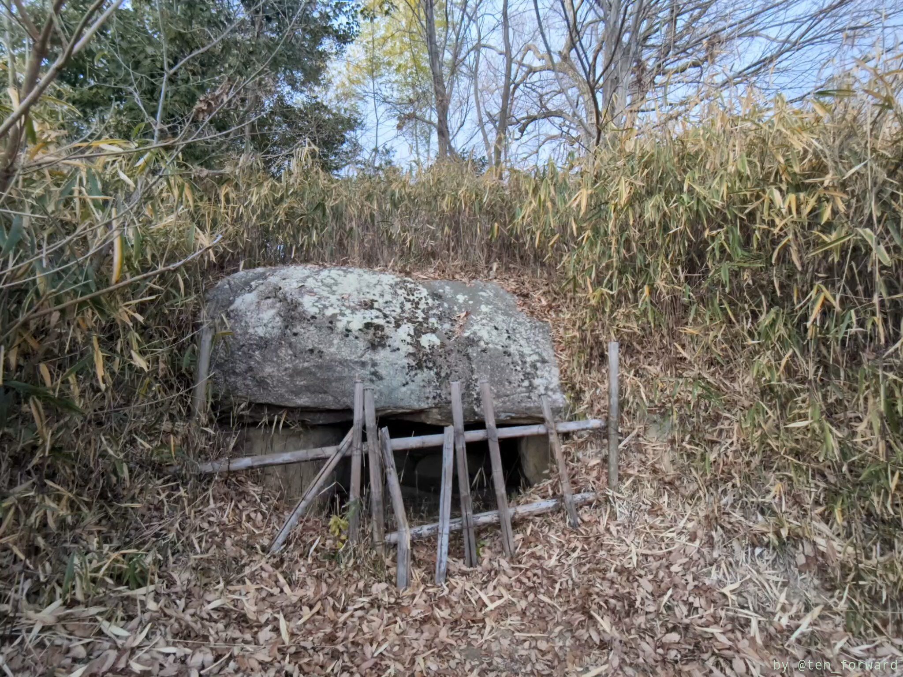
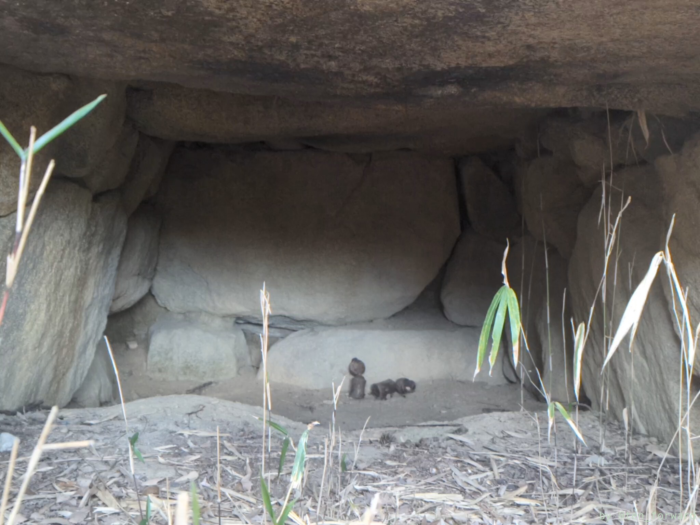

なんか置かれてるけど何?w

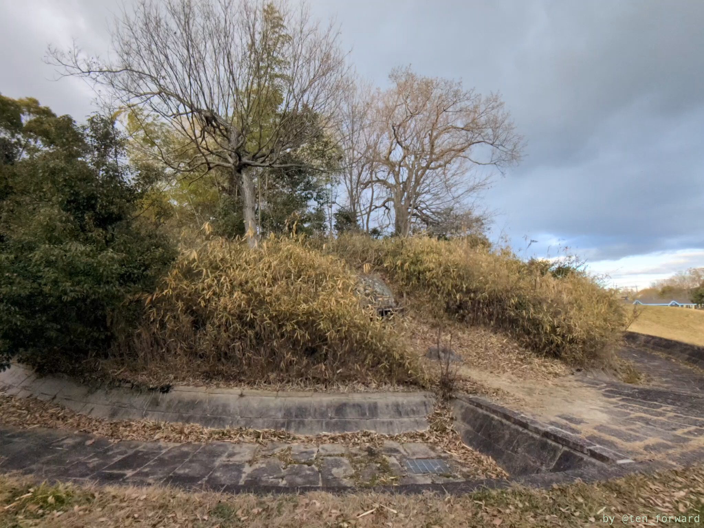
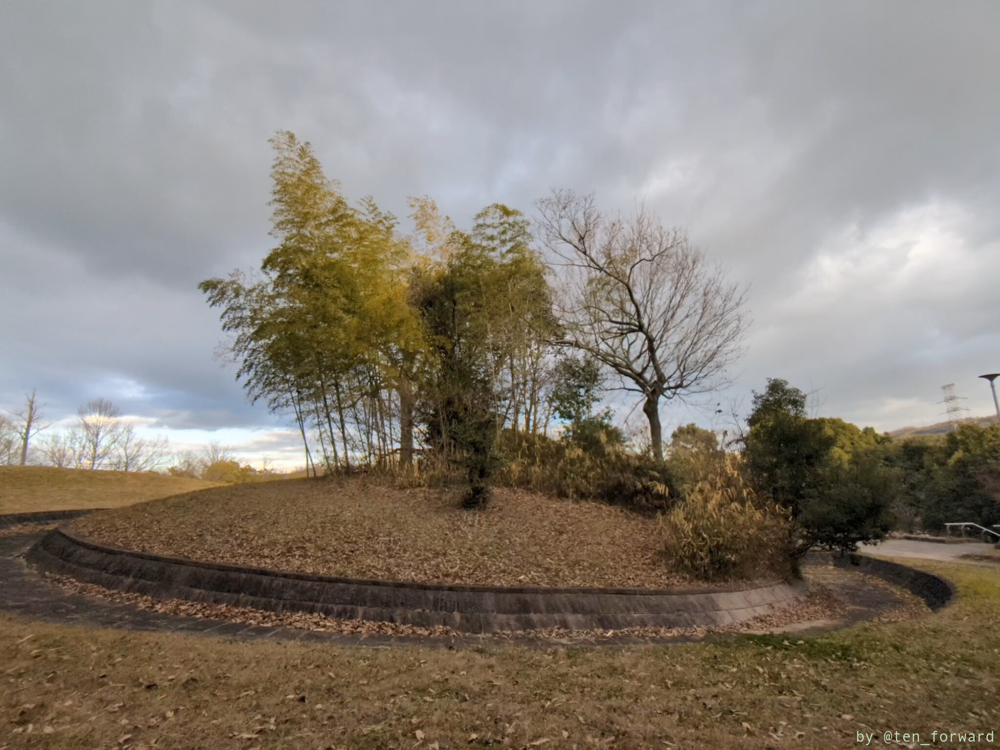

いい感じに整備されていますね。

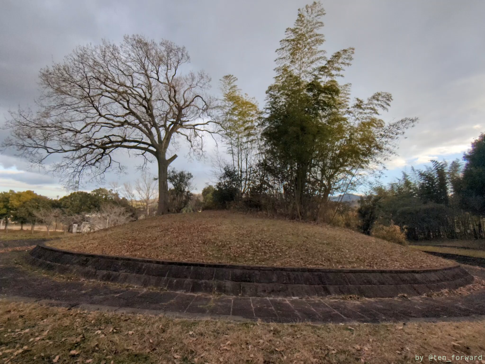
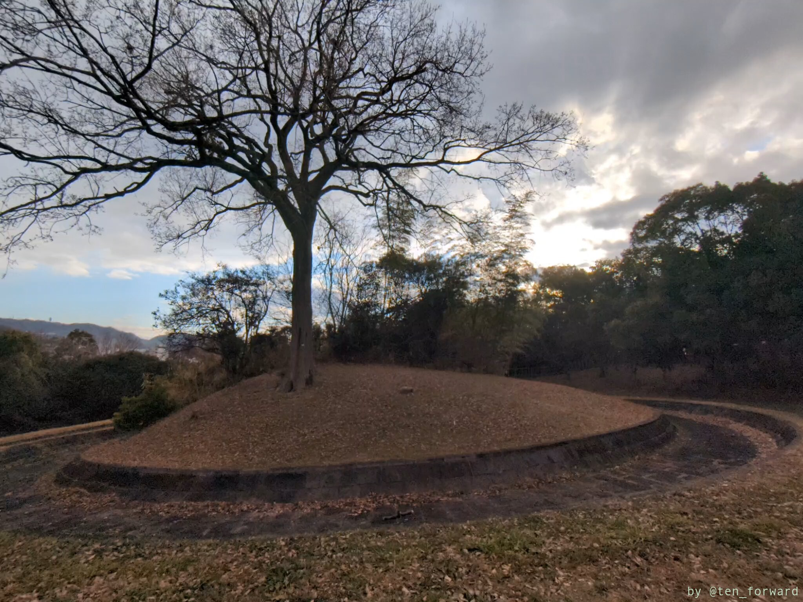

## 太秦古墳群 18 号墳

太秦古墳群では、以前[太秦高塚古墳](post/2022-12-11_uzumasatakatsuka/)に行きました。寝屋川公園南脇の第 2 京阪のトンネル上（?）の公園に、18 号墳だけが復元されています。

第 2 京阪の建設に伴って多数の古墳が発見されたようですが、そのうち 18 号墳だけが復元されています。9 メートルの方墳だったようです。

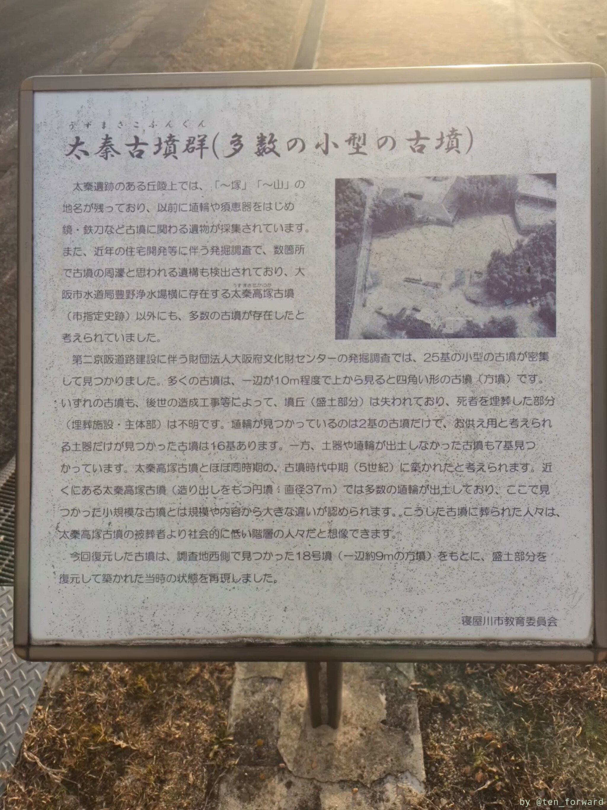
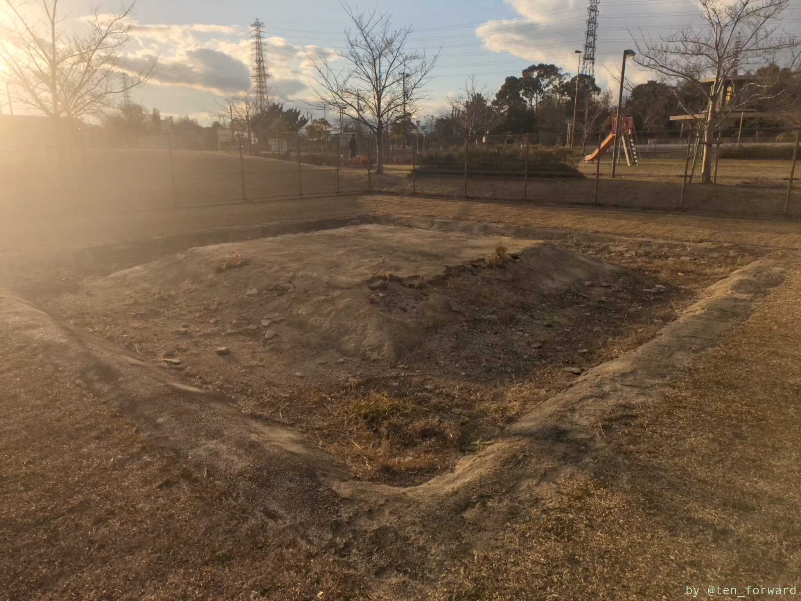

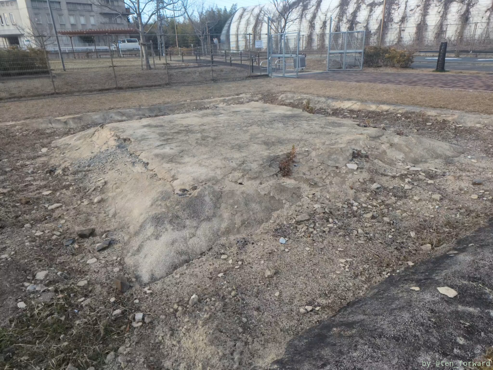
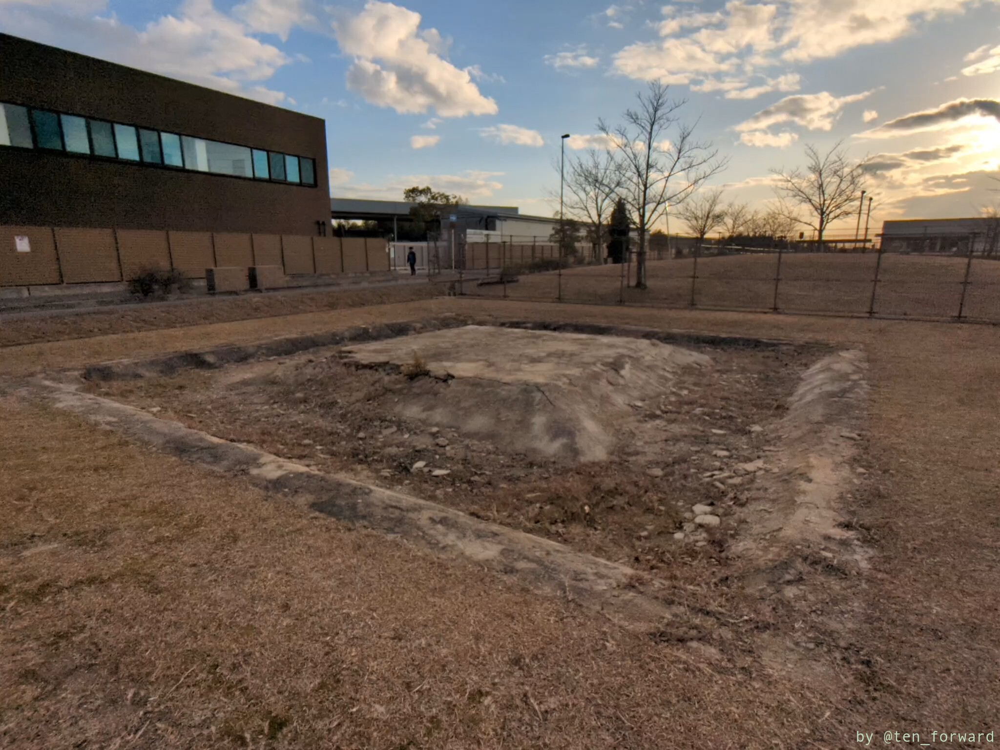

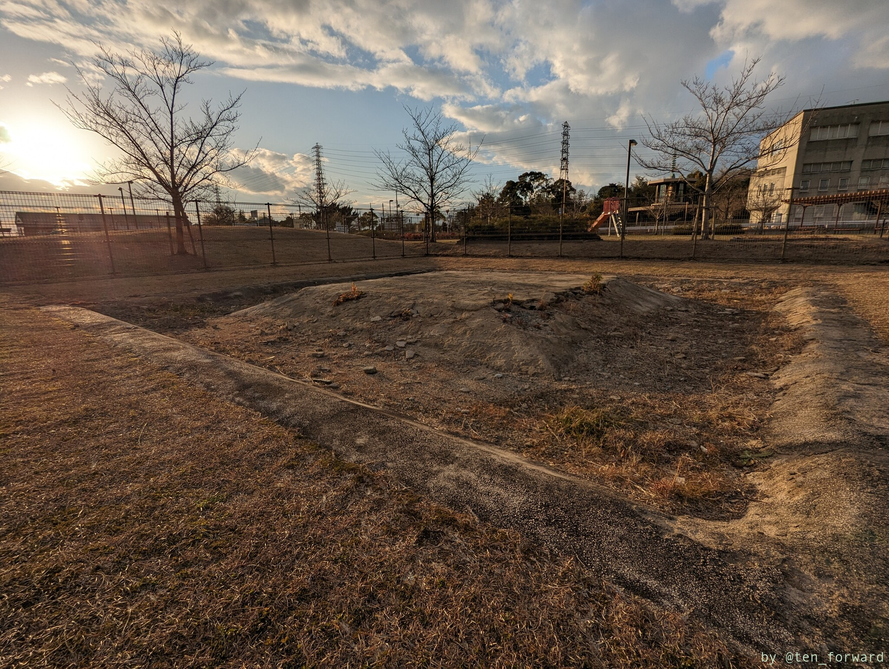
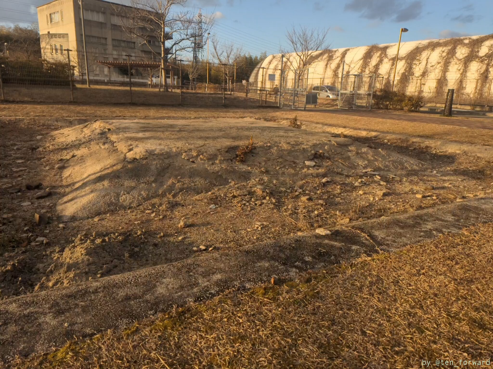

## 参考

* [寝屋古墳](https://www.city.neyagawa.osaka.jp/organization_list/kyoiku_shakaikyoiku/bunkasport/bunkazai/namesagasu/1378168913030.html) （寝屋川市）
* [太秦古墳群](https://www.city.neyagawa.osaka.jp/organization_list/kyoiku_shakaikyoiku/bunkasport/bunkazai/namesagasu/1378193397977.html) （寝屋川市）
* [太秦古墳群](https://ja.wikipedia.org/wiki/%E5%A4%AA%E7%A7%A6%E5%8F%A4%E5%A2%B3%E7%BE%A4) （Wikipedia）
