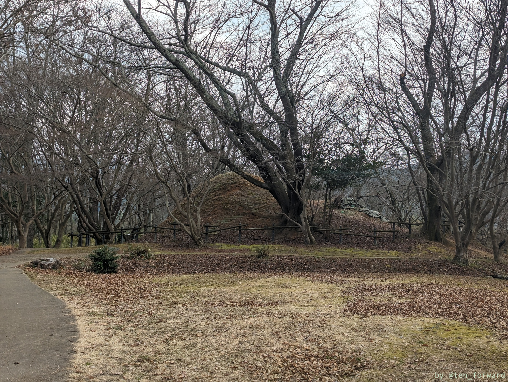
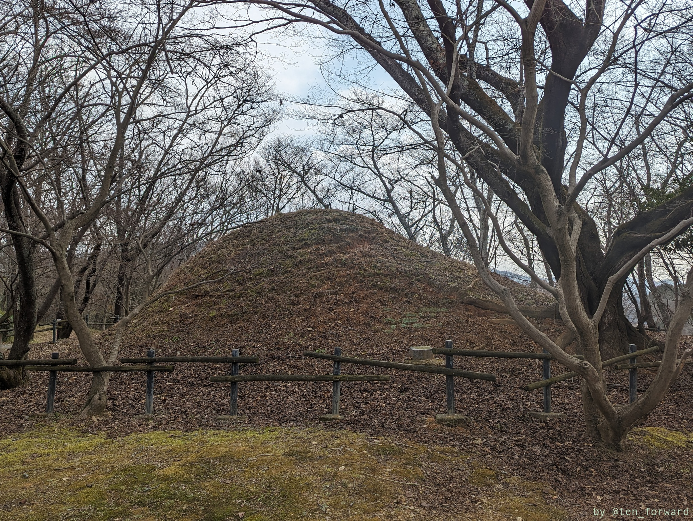
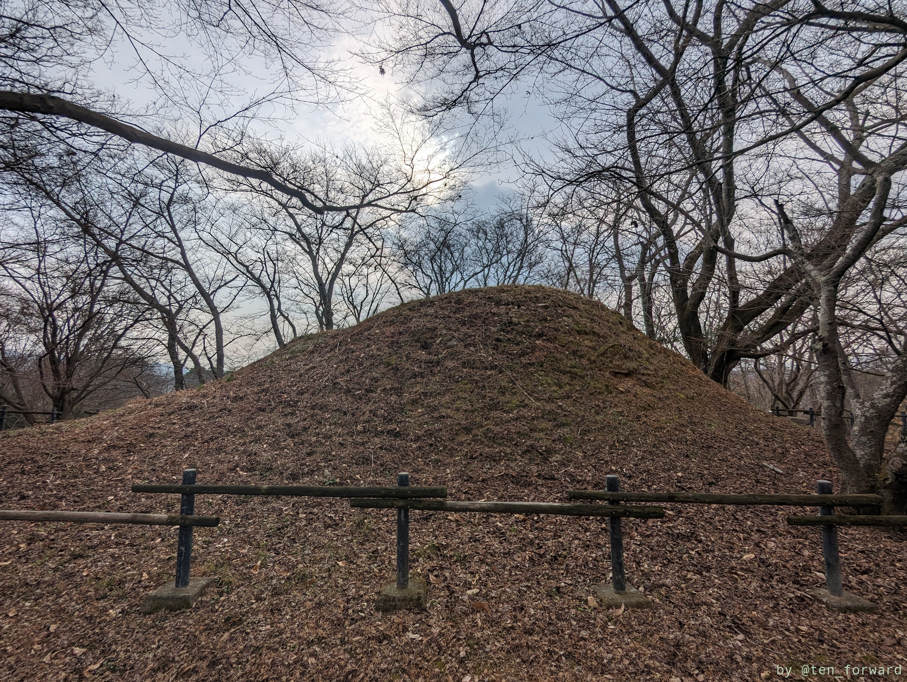
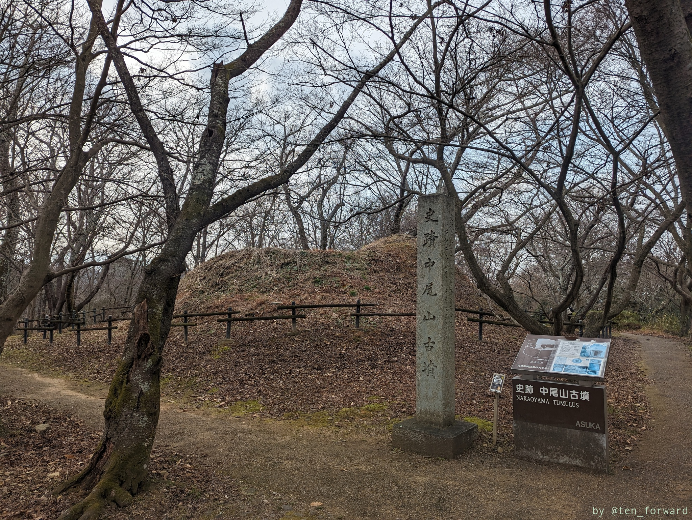
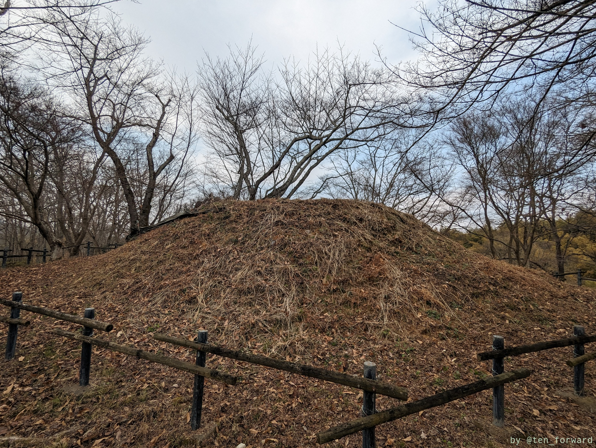
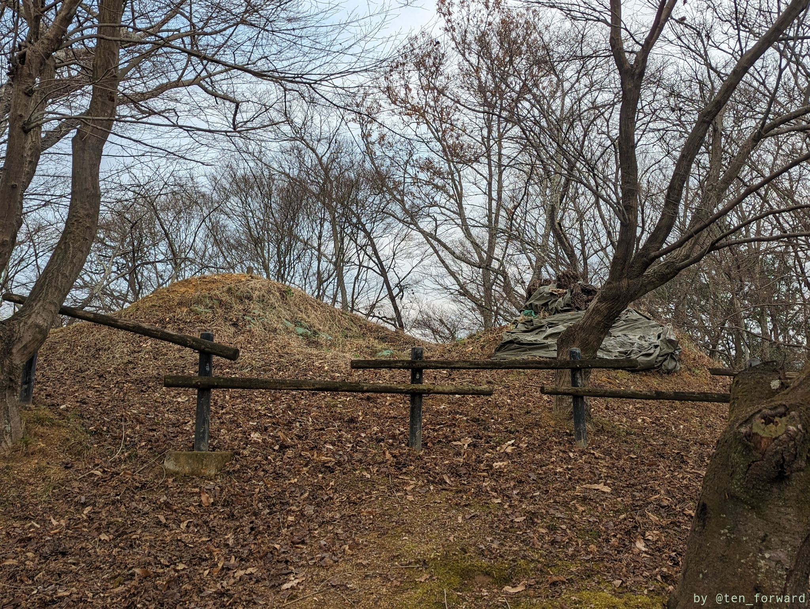

高松塚古墳の近くにある古墳です。結構坂を登った上にあります。高松塚古墳に行ったら寄りたい古墳です。

高松塚古墳の方、もしくは駐車場の方から急坂を登ると裏側の良い形が見えてきます。

発掘調査で三段築成の八角墳であることが確認されたようですね。文武天皇陵ではないかと言われているようです（近くには宮内庁指定の文武天皇陵があります）。

こんもりとした山が 2 つありますが、元々の形が崩れてこのような形になっているということですかね??

## 参考

* [中尾山古墳](https://www.pref.nara.jp/miryoku/ikasu-nara/bunkashigen/main10567.html) （奈良県歴史文化資源データベース）
* [中尾山古墳](https://ja.wikipedia.org/wiki/%E4%B8%AD%E5%B0%BE%E5%B1%B1%E5%8F%A4%E5%A2%B3) （Wikipedia）
* [「文武天皇の墓」確定的に…奈良・中尾山古墳で高級石材磨いた石室確認](https://www.yomiuri.co.jp/culture/20201126-OYT1T50231/) （読売新聞オンライン）
