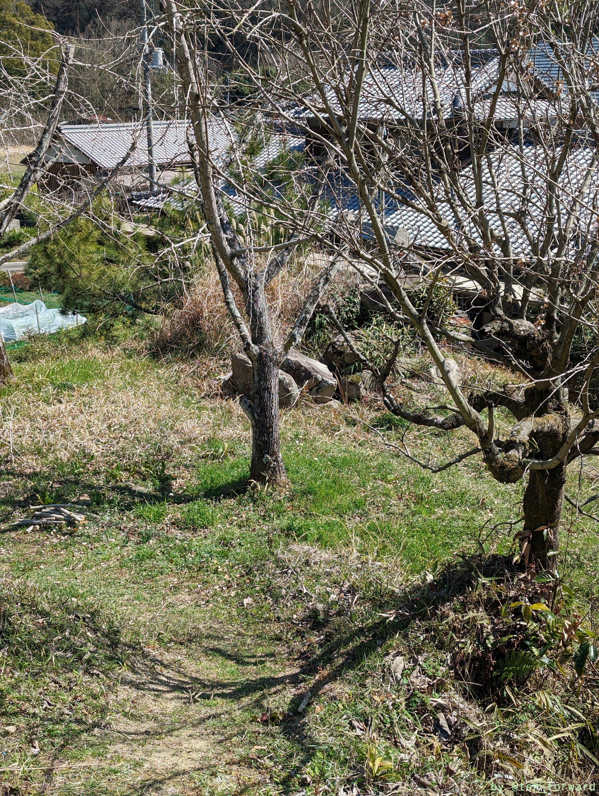
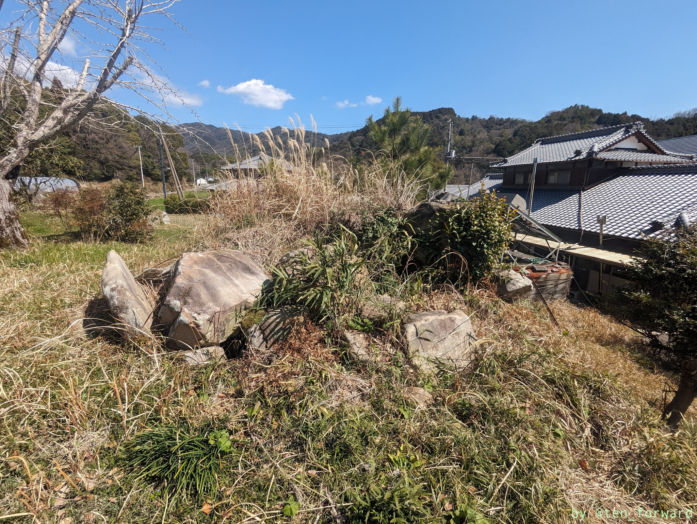
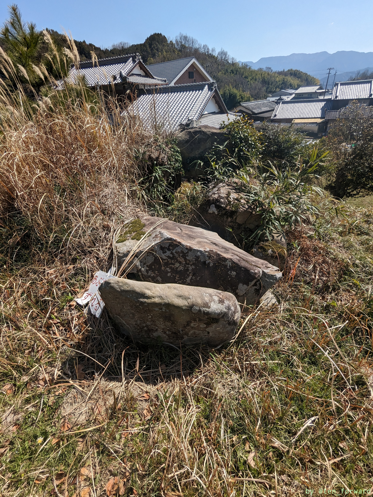
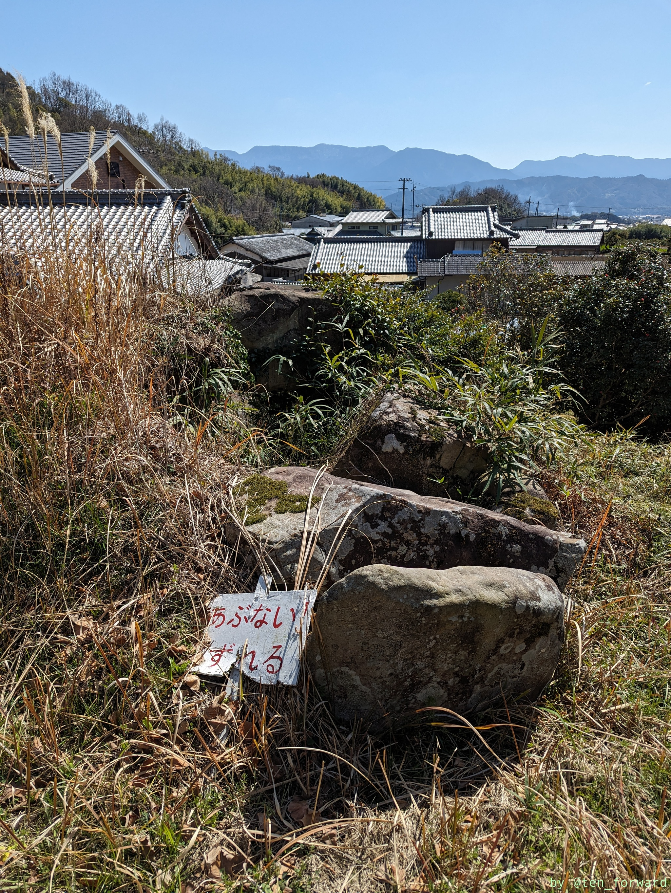
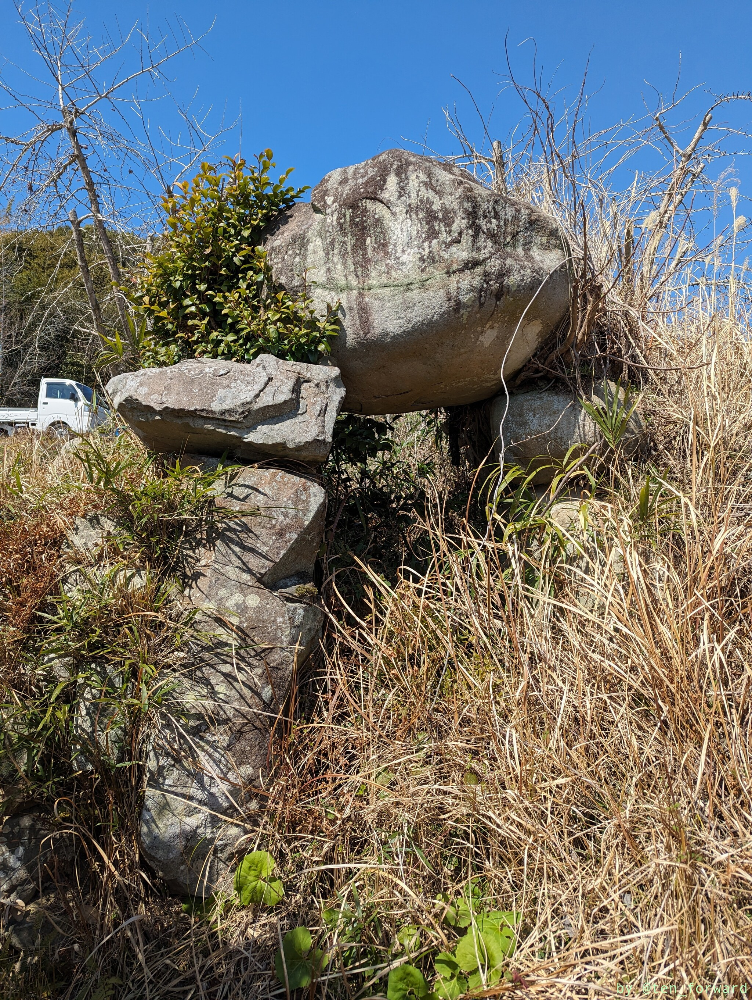
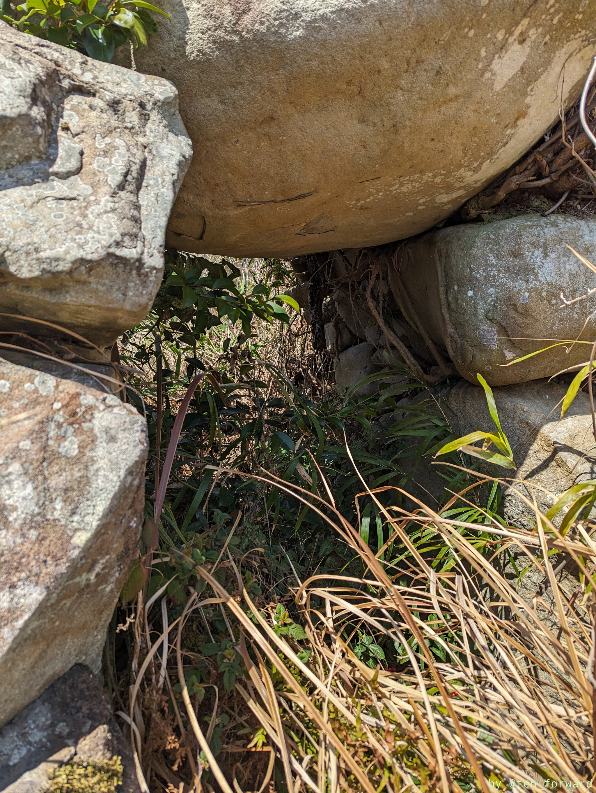
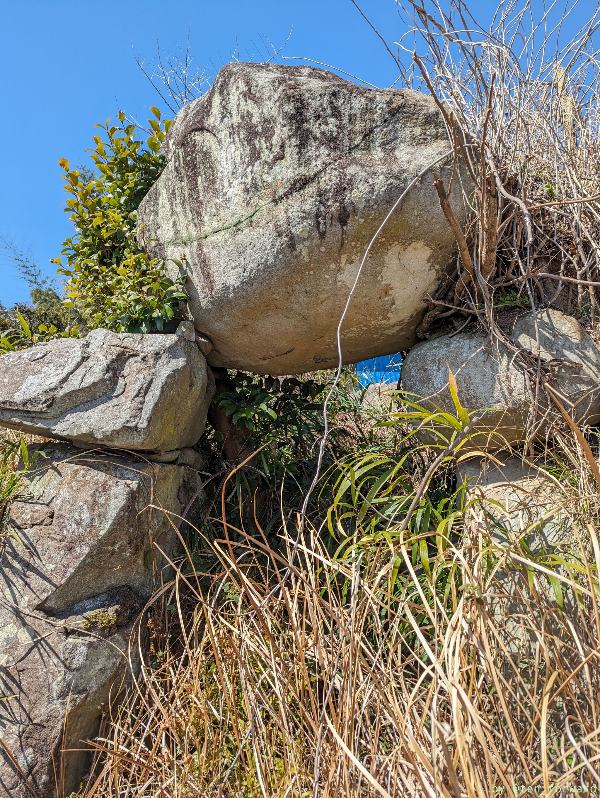
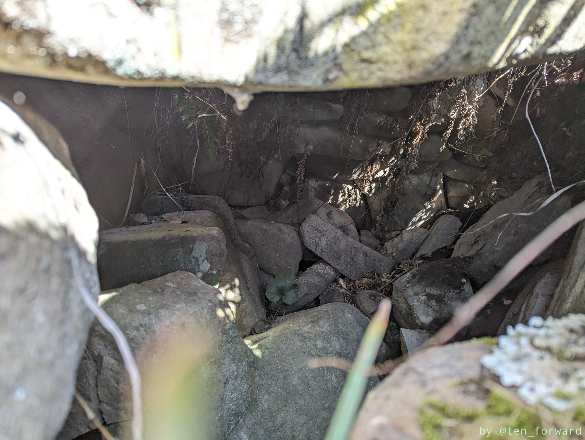

[葉佐池古墳](/post/2024-03-10_hazaike/)を見た後は、近くにある駄場古墳に行ってみました。葉佐池古墳の案内板や資料には「鳥越1号墳」という名前がありますが、その名前の由来などの説明はありません。駄場古墳というのは、そこの地名から来てるのかと思います。



Googleマップにも地点登録はされているので、マップに従って行くと迷うことはありません。ただ、「河中平井線」と書かれた道路から古墳に入っていく道は車1台がなんとか通れる程度の細さなので、葉佐池古墳に車を止めて行くのが良いかもしれません。距離は600mほどです（葉佐池古墳のリーフレットによると）。

現地は迷わず行けましたが、現地付近についてもどこが古墳かわからず少し行き過ぎて戻ったりと迷いました。写真に写っている家の脇なので目印にすると良いかも。人の家に裏庭か人の畑に入る背徳感はありますw

ご覧の通り、かなり荒れた感じで、近くには「あぶないくずれる」という看板もあります。

墳丘は失われており、墳丘の形状も不明なようです。両袖型で葉佐池古墳より少し後に作られたようです。

[古墳マップ](https://kofun.info/kofun/4527)の投稿写真を見ても、2017年ごろの写真では、まだ比較的きれいで看板もありました。少し周りを見渡してみましたが、看板はなさそうでした。「あぶないくずれる」の看板も以前はちゃんと立っていたようでしたが、今は倒れてしまって捨てられているようにも見えてしまいます。[Googleマップ](https://maps.app.goo.gl/6BYgZY8Hf38Ep8nWA)にも写真がありますが、最近になるにつれて荒れてきてる感じがあります。

でも、良い石室!!

もう少しちゃんと整備したらいいんじゃないでしょうか。私有地なのかな?

## 参考
* [駄場古墳](https://kofun.info/kofun/4527) （古墳マップ）
* [小野地区の遺跡紹介９　『駄馬（だば）古墳』（鳥越１号墳） ](https://www.cul-spo.or.jp/blog_maibun/?p=548) （埋蔵文化センター　公式ブログ）
