奈良県広陵町にある古墳です。「ばくや」古墳と読みます。普段は入口は鍵がかかっていますが、[事前に申し込んでおくと鍵を開けておいてくれる](https://www.town.koryo.nara.jp/contents_detail.php?co=kak&frmId=1436)ようです。

私が行ったこの日は、春の特別公開の日で、ボランティアガイドが説明してくれました（これも事前に申し込めば説明を受けられるらしい）。

古墳は直径 55m ほど、高さ 13m ほどの円墳です。時代は 6 世紀末とされているようです。この時期によくある巨石を用いた横穴式の古墳です。両袖式で、中には石棺の一部が残っています。

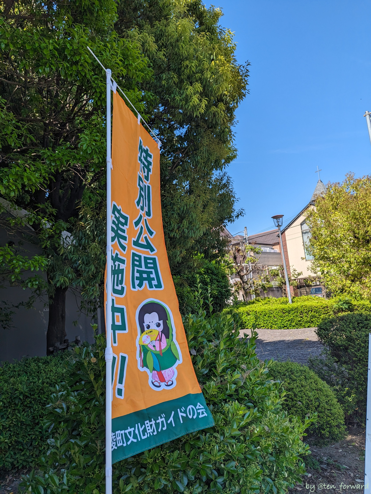
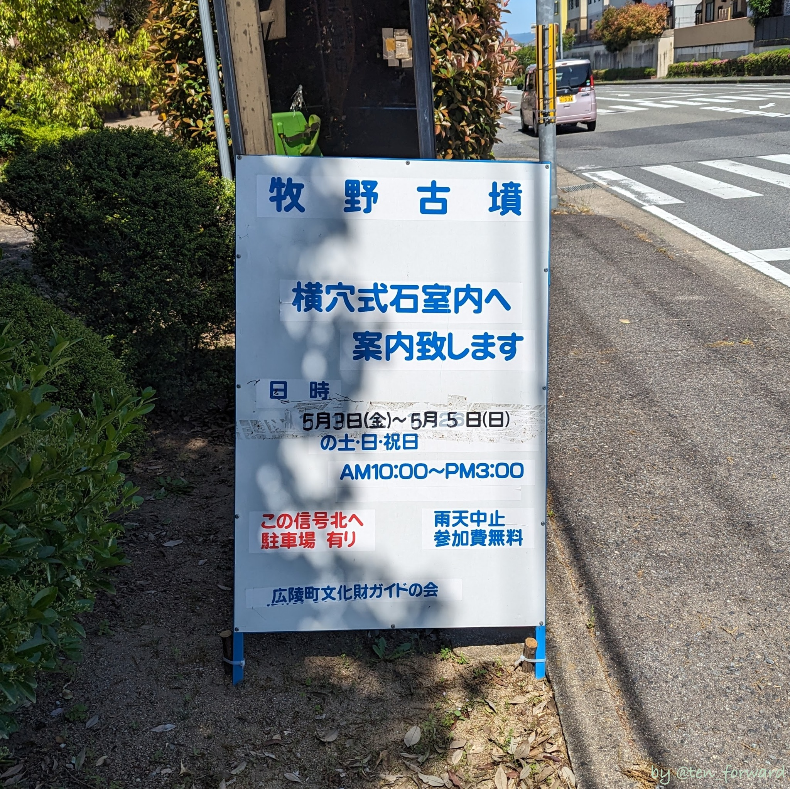

入口は立派ですし、円墳も良い形です。

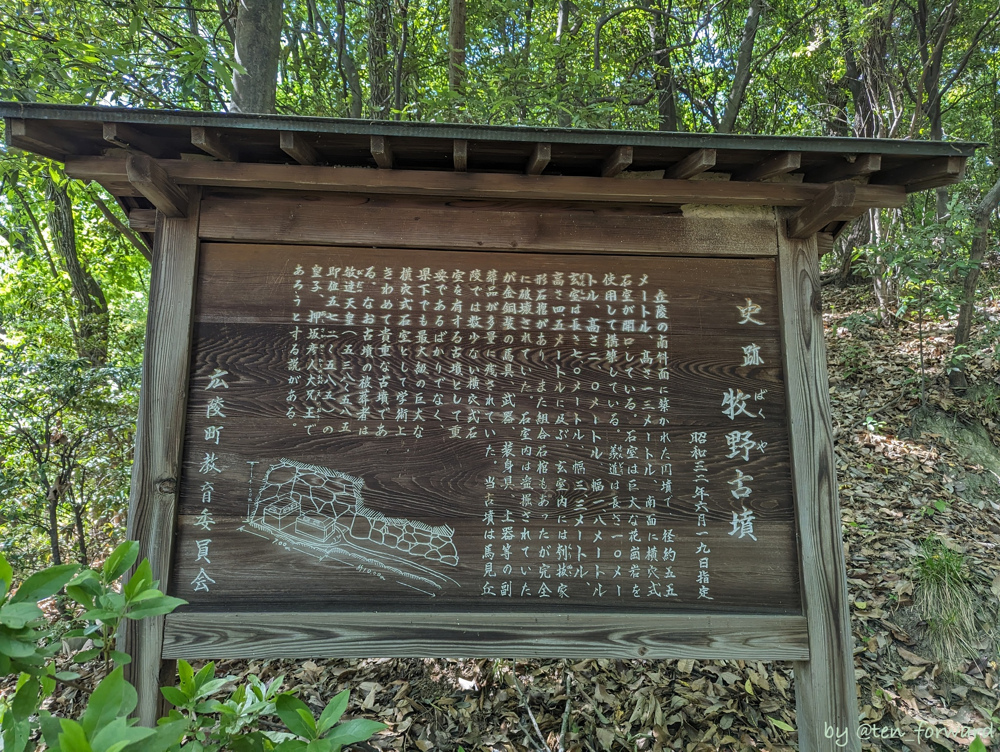
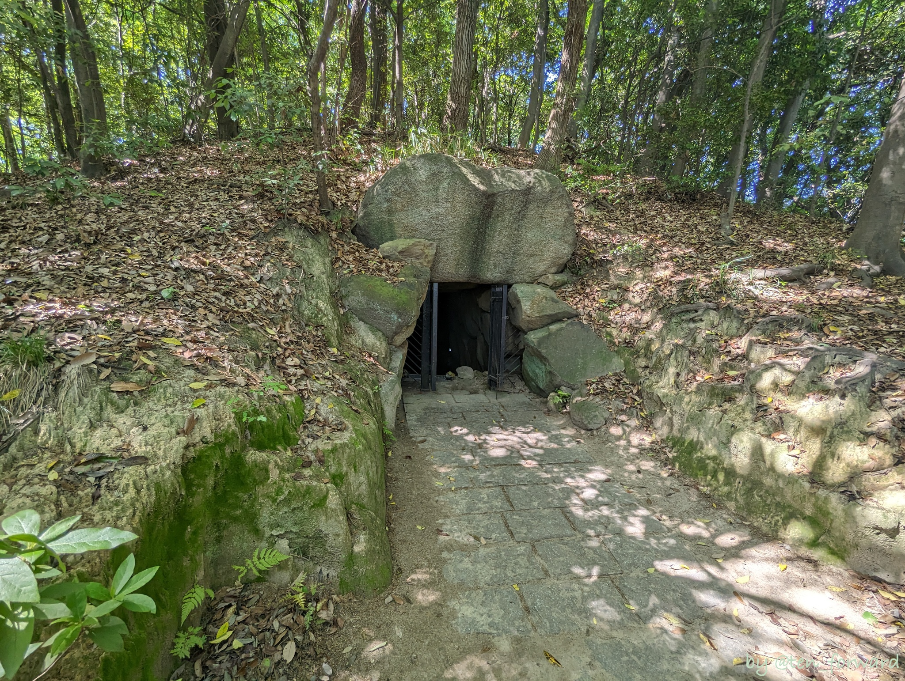

構成する石も巨大で立派ですね。

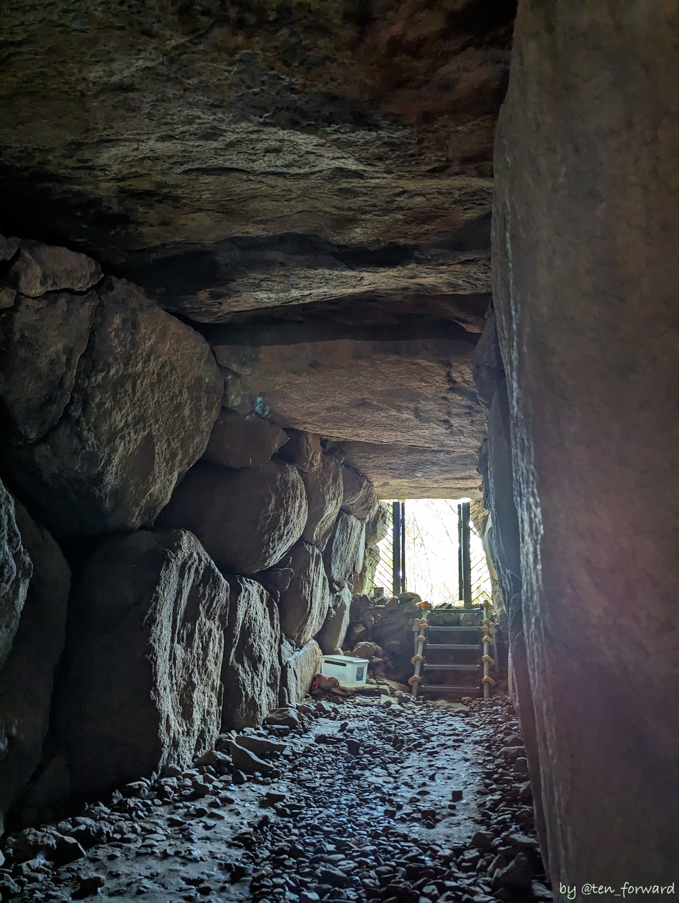
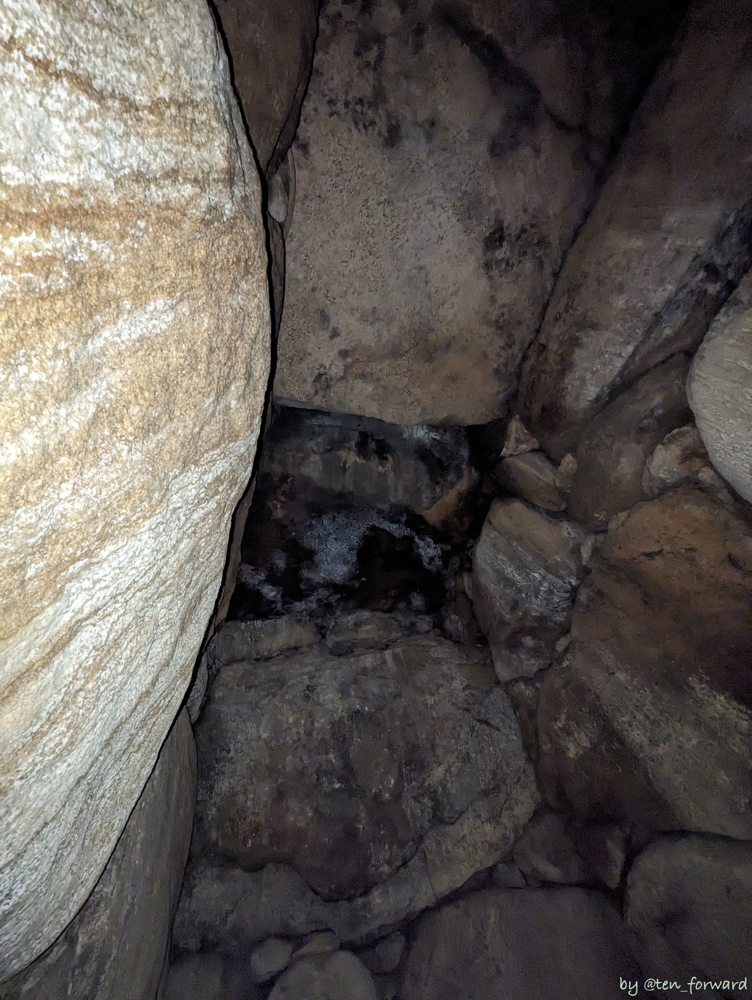

羨道一番奥の境界部分の天井石が一番大きな石ではないか、とのことでした。石棺は側面がなく、蓋がブロックで支えて置かれていました。赤い塗料が少し残っていて確認できました。

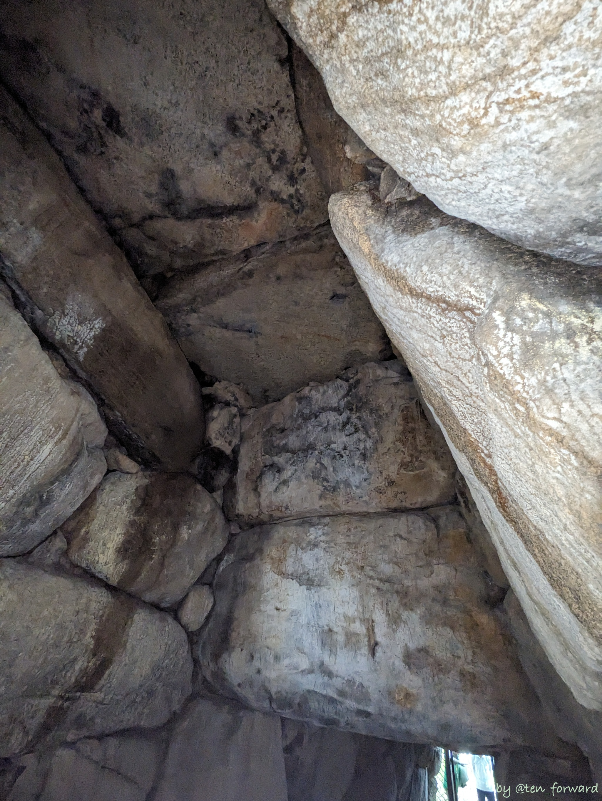
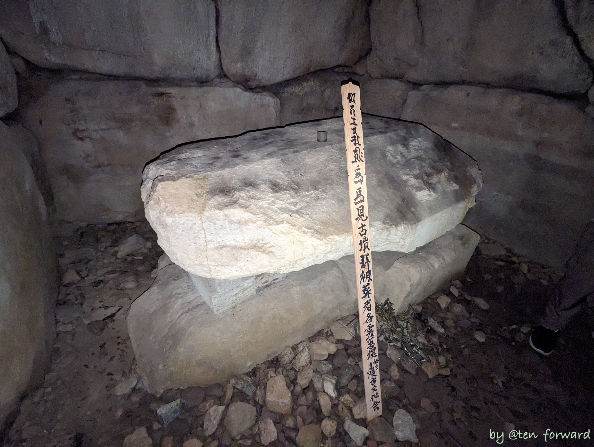

玄室の手前にもうひとつ石棺（?）があったと見られているようです。

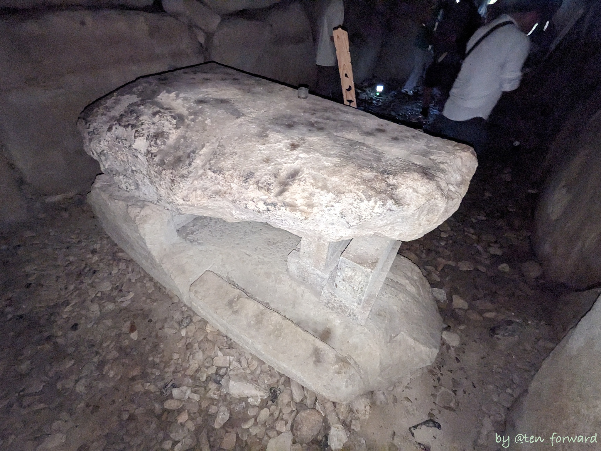
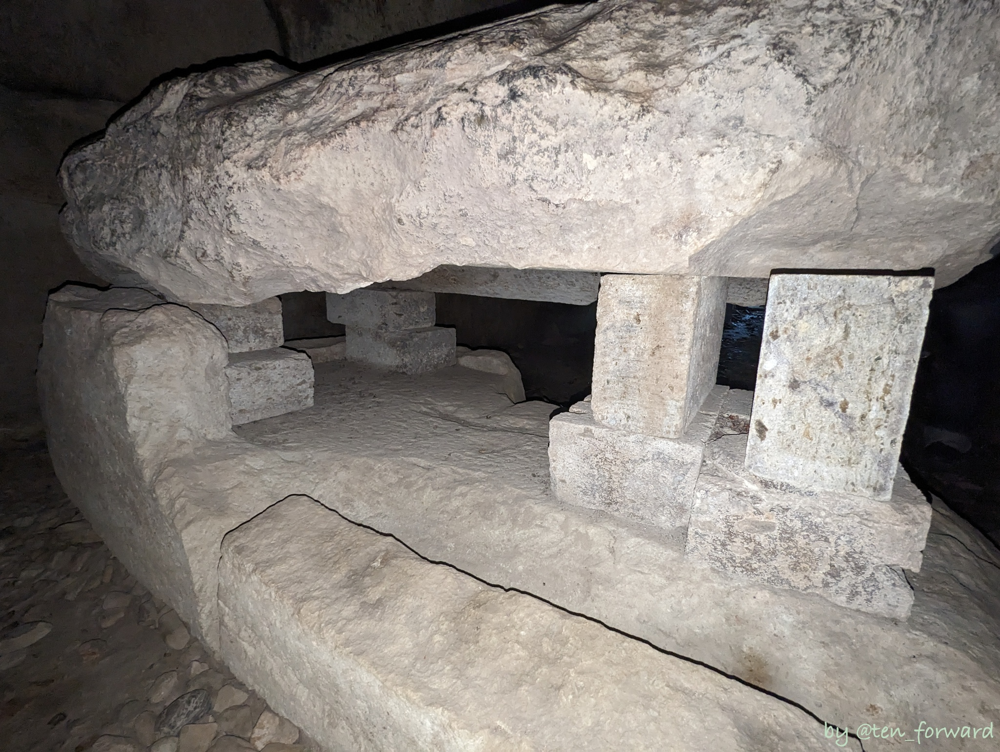

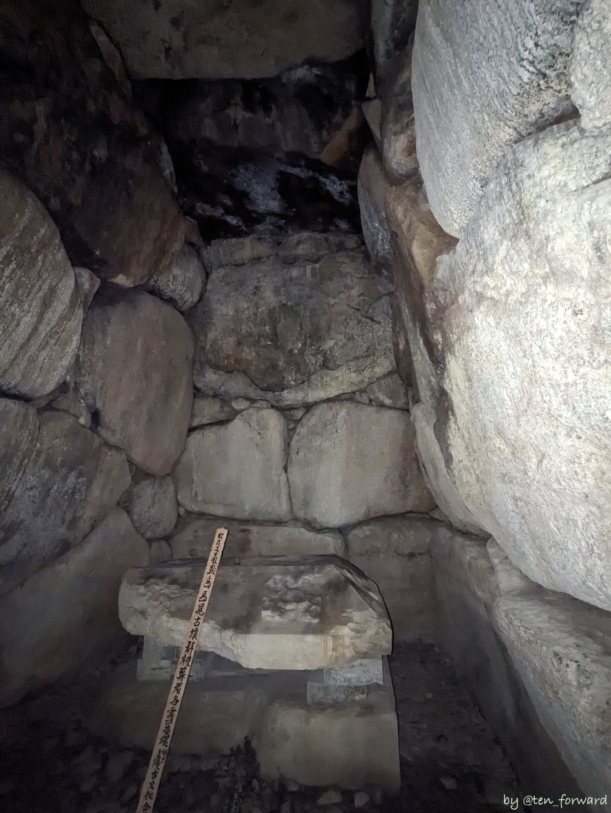
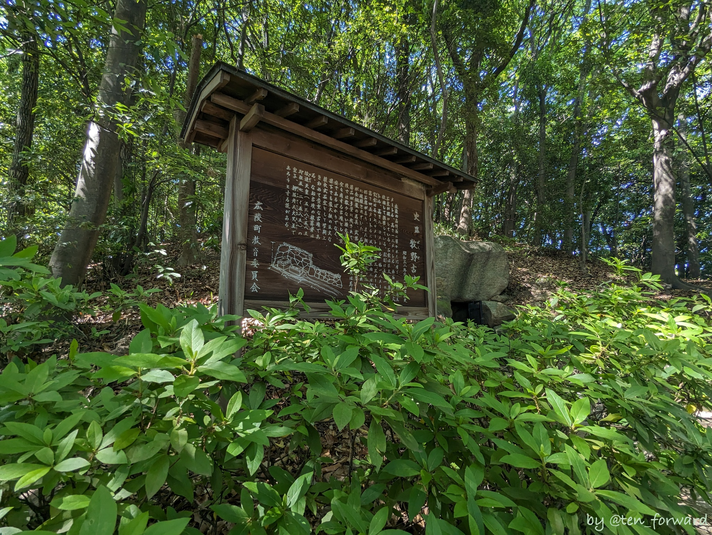

写真ではわかりづらいですが、墳丘もいい形の円墳ですよ。

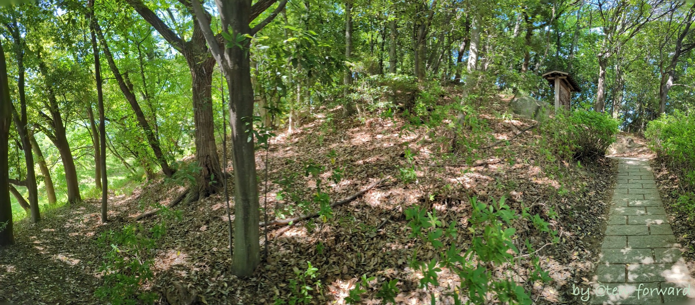
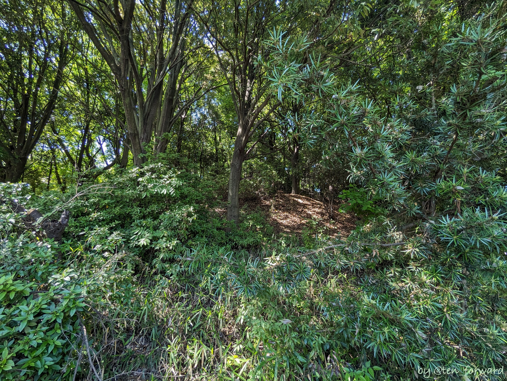

特別公開だけでなく、申し込んでゆっくりひとりで見るのも良さそうですね。

