亀岡のパワースポットで有名らしい出雲大神社に行く機会があり、Google Mapで調べていたら近くに立派な古墳があることがわかったので行ってきました。

## 出雲大神社

交通の便がそれほど良くないところにあるにも関わらず、結構な訪問者がひっきりなしに来ていた感じなので、著名なところなのでしょうね（私はパワースポットは詳しくない）。

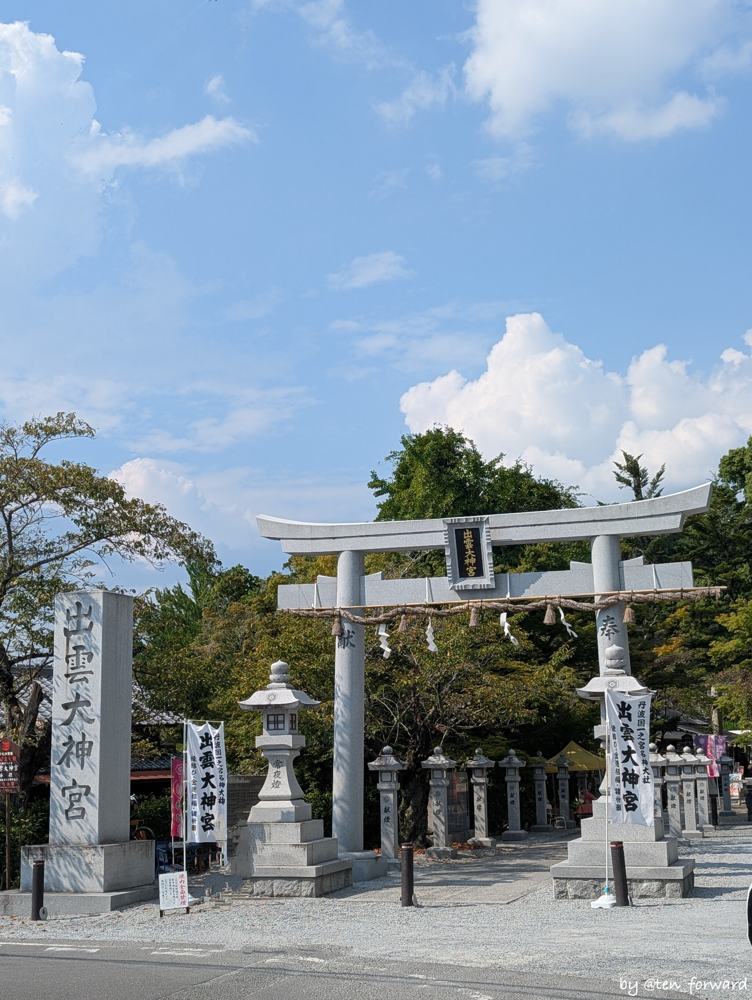

で、境内図を見ていると「古墳」!!

一通りおまいりしたあとに古墳の場所へ。え? どこが古墳? 😅

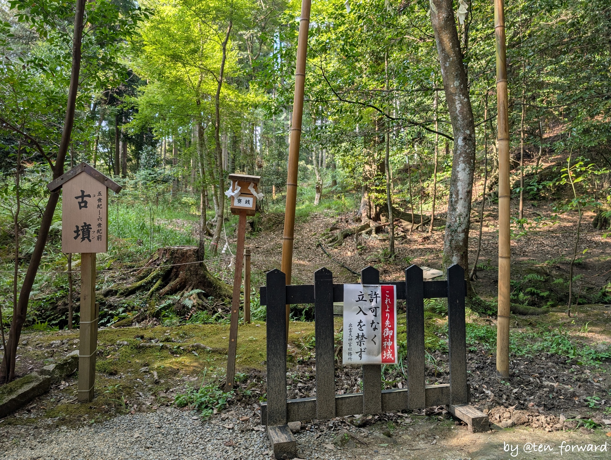
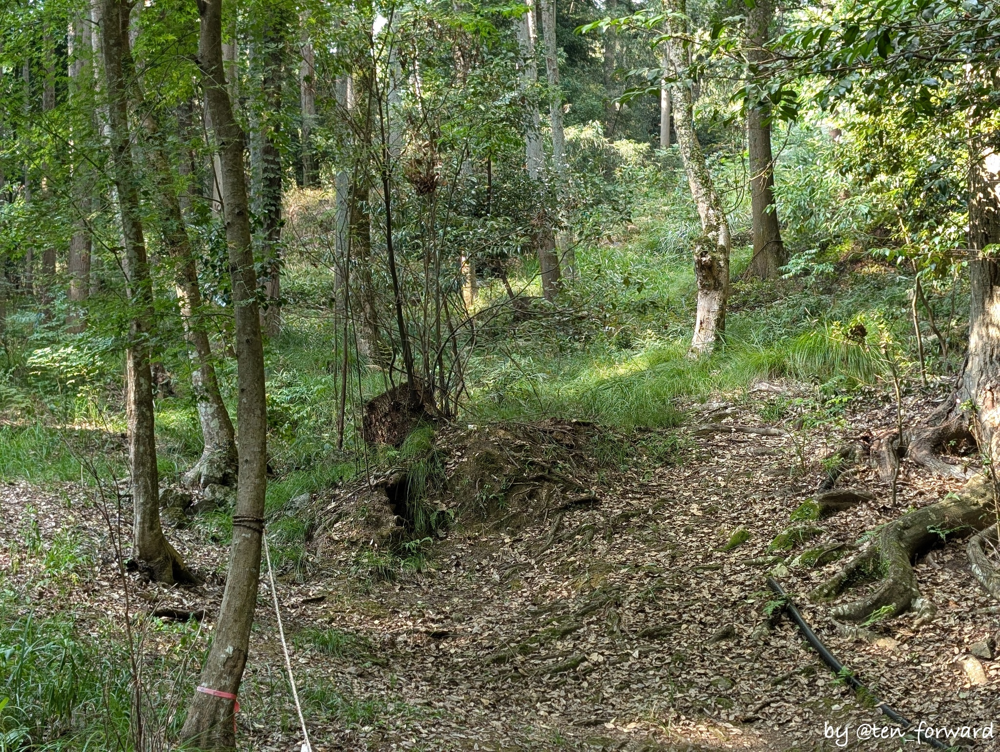

わからないですね。予習を全くしてなかったのもありますし…

どうやら、墳丘径19mほどの円墳で「出雲武式古墳」とのことです。次の資料あたりに少し説明があります。

* [平成25年10月13日（日）出雲遺跡現地説明会資料](https://www.kyotofu-maibun.or.jp/data/gensetsu-pdf/gensetu-siryoupdf/h25pdf/h25-izumo.pdf)
* [平成27年2月22日（日）出雲遺跡・中古墳群現地説明会資料](https://www.kyotofu-maibun.or.jp/data/gensetsu-pdf/gensetu-siryoupdf/h26pdf/h26-izumo.pdf)

ここに記事の引用が。

* [出雲大神社内に古墳⁉️](https://hanicotto.com/blog/6559/) （古墳フェスはにコット）

## 千歳車塚古墳

出雲大神社をおまいりしたあとは、そこから数百メートルの千歳車塚古墳へ。

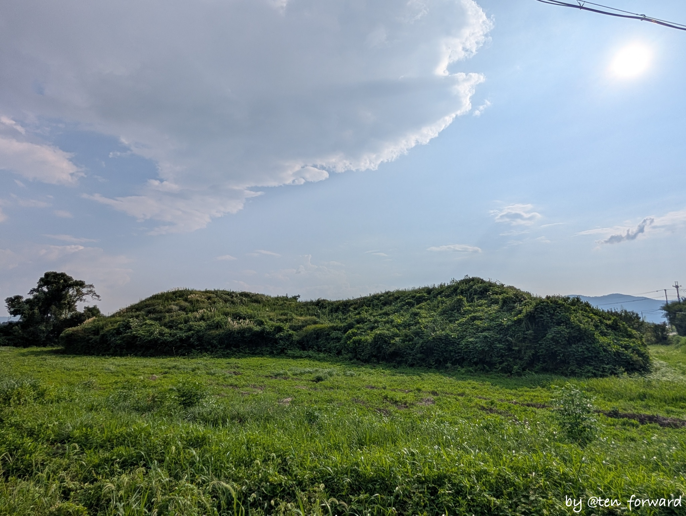

特に駐車場はないのですが、路肩に少し広くなった所（私有地かもw）があるので、そこにしばらく車を止めて見学しました。

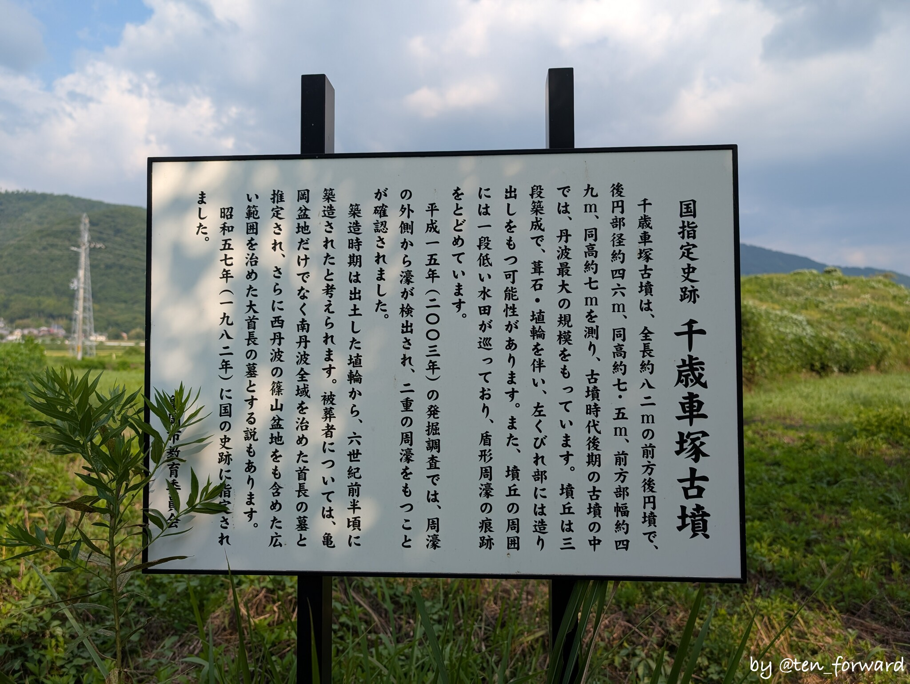
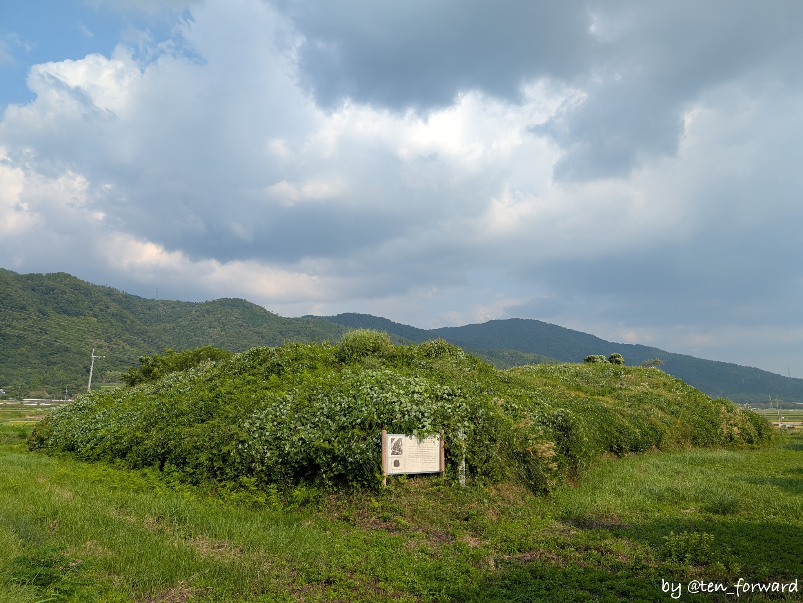

路端に案内板があるのですが、古墳近くにももう少し大きな説明板があります。ただ、きちんと整備されているわけではないので、時期によっては入っていけないのかも? 私は道なき道を入っていって近くまではいきました。周辺は水田?

とはいえ、せっかく立派な古墳が残ってるので、周りに歩道を整備するなどして、きちっと見学できるようにしてほしいものです。水田に囲まれてるので難しい?

この日も行こうと思えば、周辺の濠の後？を歩いて一周できたかもしれませんが、軽装だったのでやめておきました。

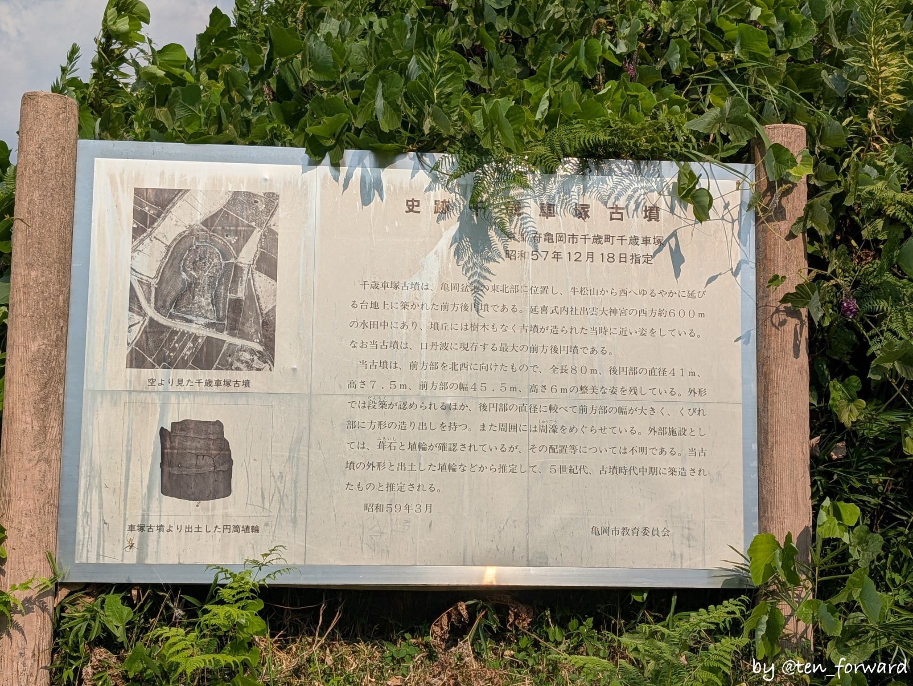
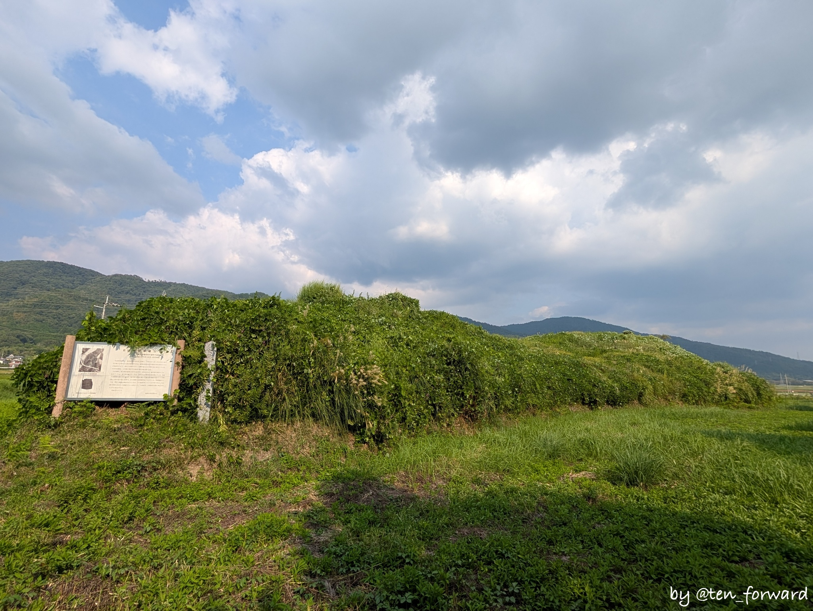

墳長 80m 超の立派な古墳で、造出もあったかも? とのことですね。

後円部側にたんぼのあぜ道を進んで見てみました。たんぼをはさんでますので、もう少し近くに寄りたいところですね。

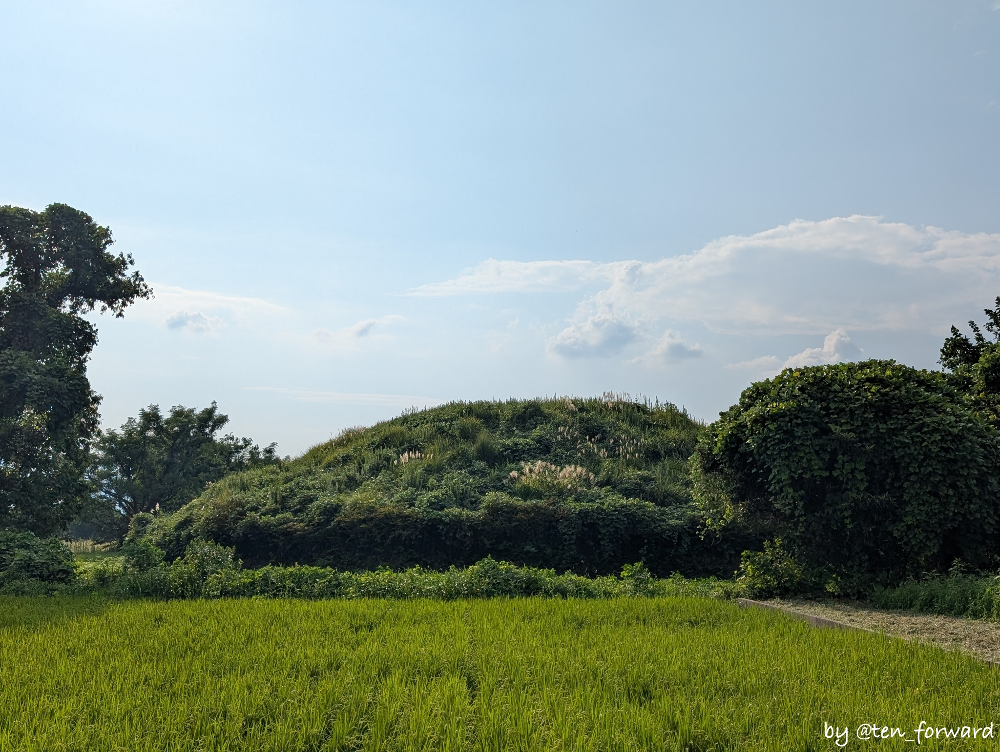
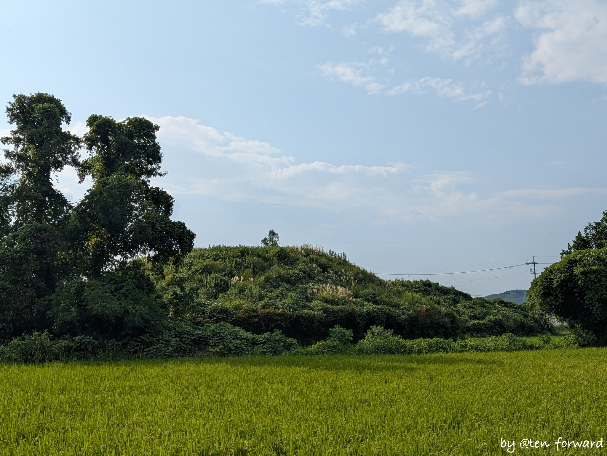

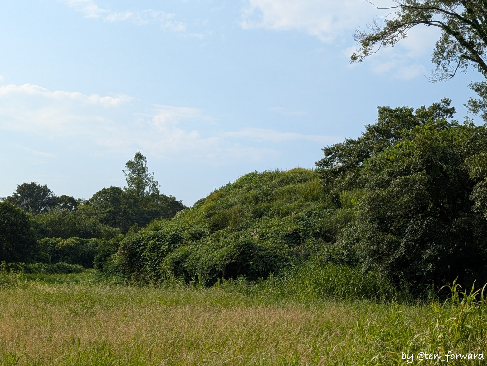
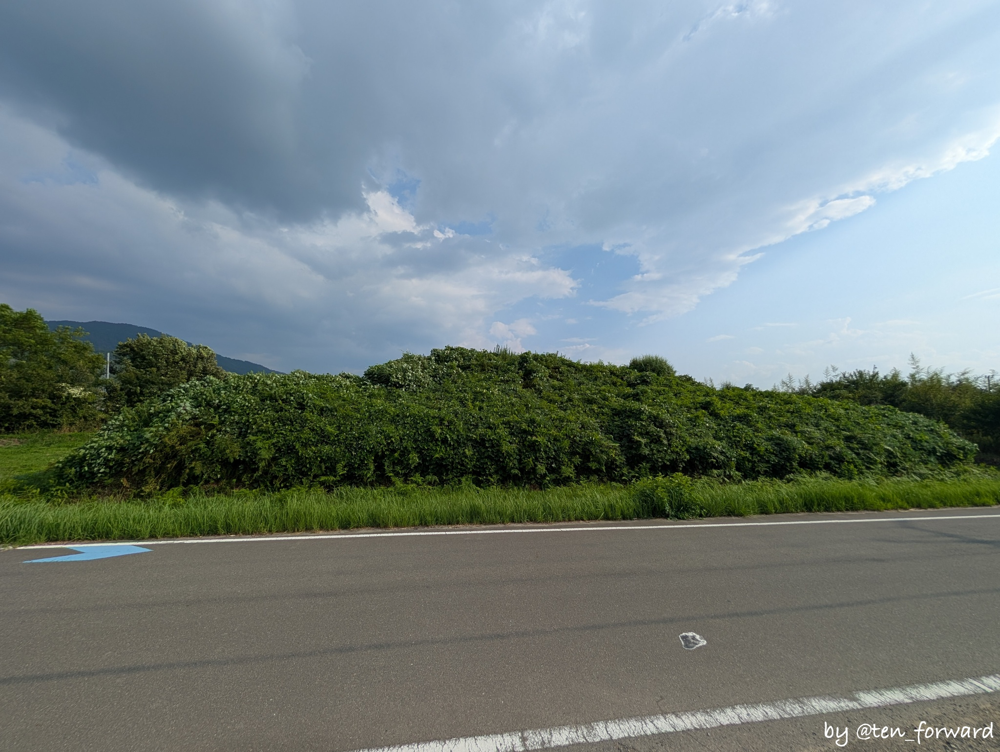
