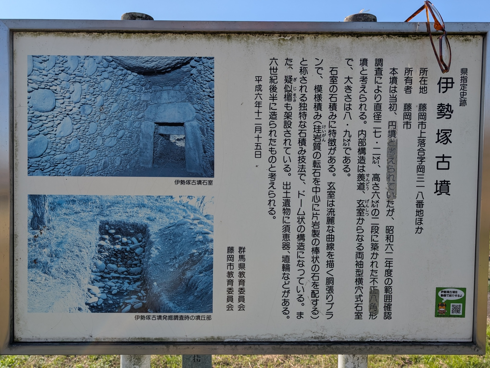
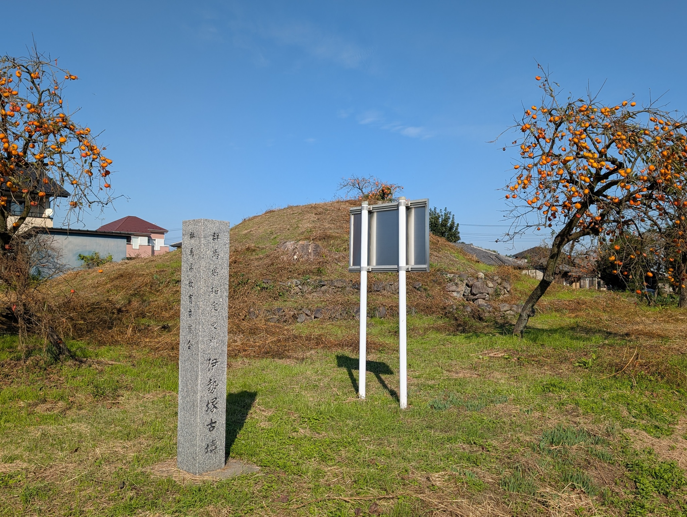
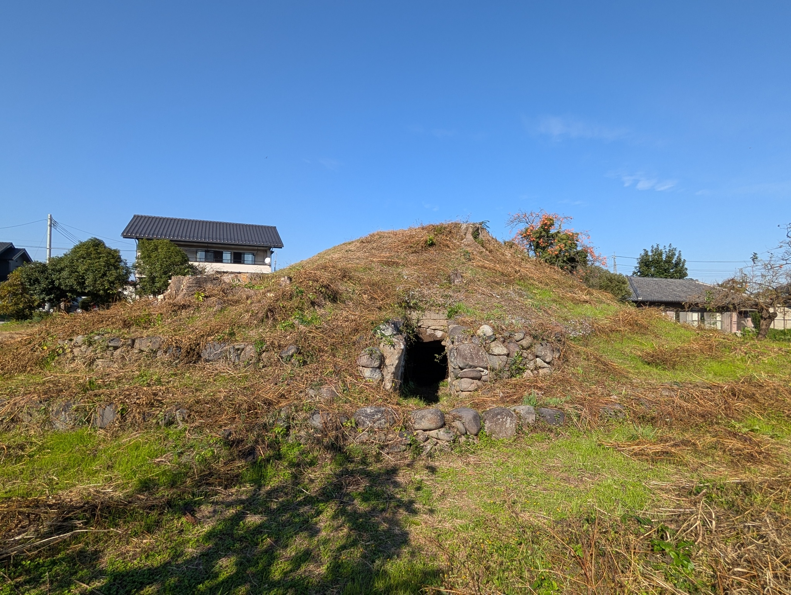
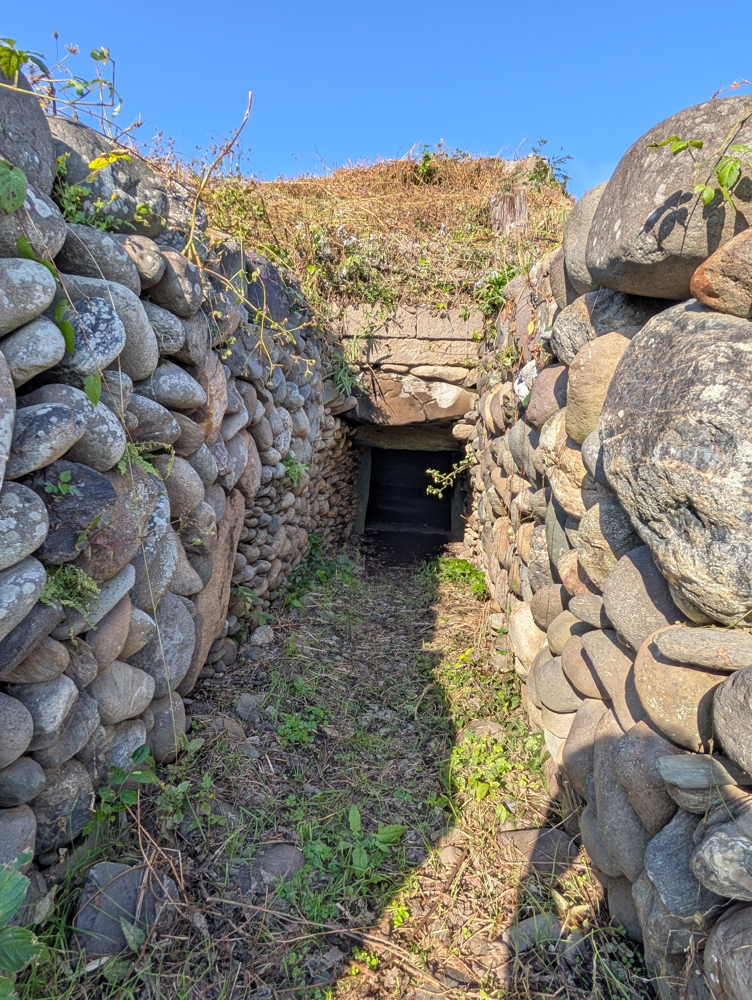
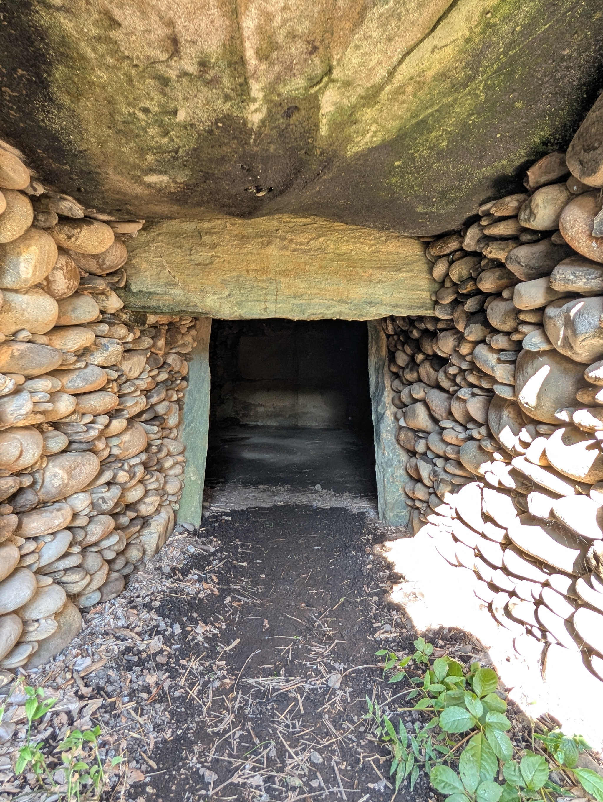
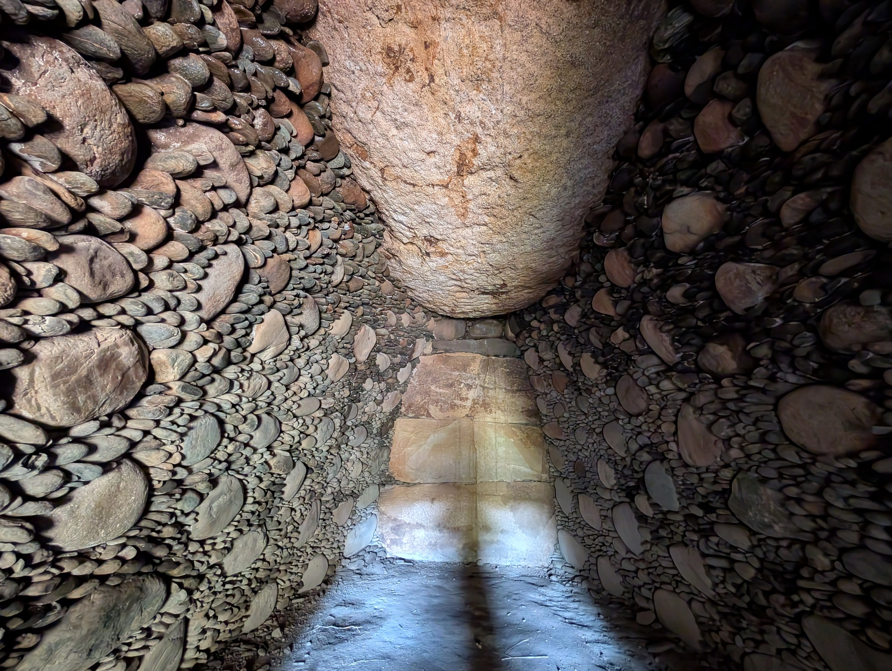
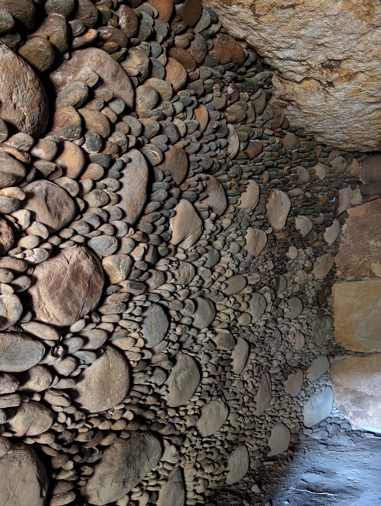
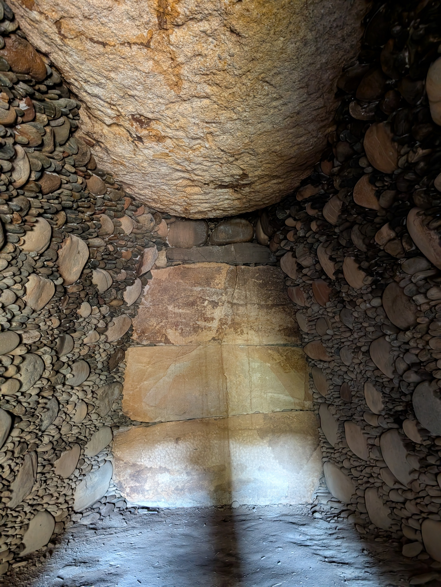
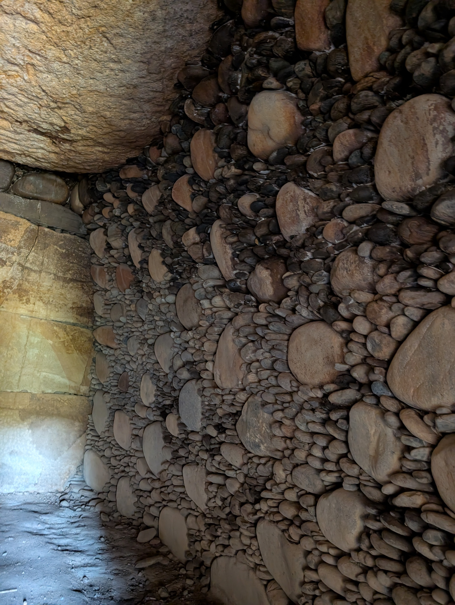

今回、上信電鉄山名駅で降りた一番の目的はこの伊勢塚古墳。形状は不整八角墳のようです。白石古墳群のひとつですが、この古墳だけ個別エントリーにします。山名駅からだと徒歩で 30 分程度、山名古墳群からだと 20 分程度でしょうか。

ここの特徴は、特に玄室がすごいんですが、角の丸い円形の石のまわりに細かい石を差し込んだ模様積み石室です。とにかく壁面が美しすぎます。

両袖式です。

## 参考

* [伊勢塚古墳](https://www.city.fujioka.gunma.jp/soshiki/kyoikuiinkai/bunkazaihogo/2/1/1020.html) （藤岡市）
* [伊勢塚古墳（藤岡市）](https://ja.wikipedia.org/wiki/%E4%BC%8A%E5%8B%A2%E5%A1%9A%E5%8F%A4%E5%A2%B3_(%E8%97%A4%E5%B2%A1%E5%B8%82)) （Wikipedia）
