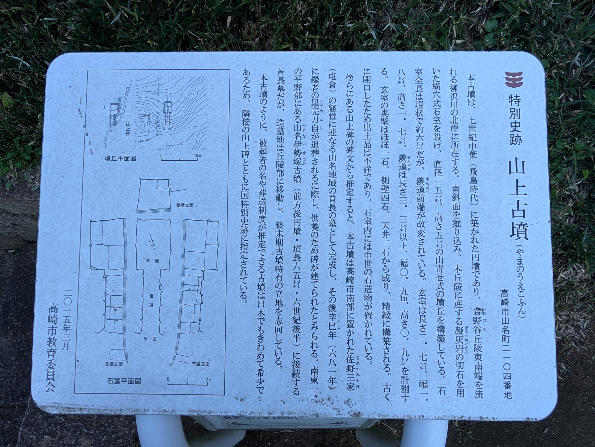
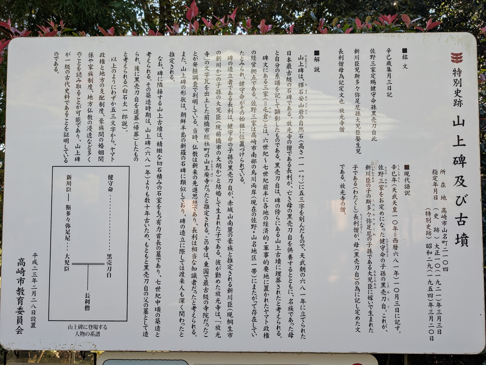
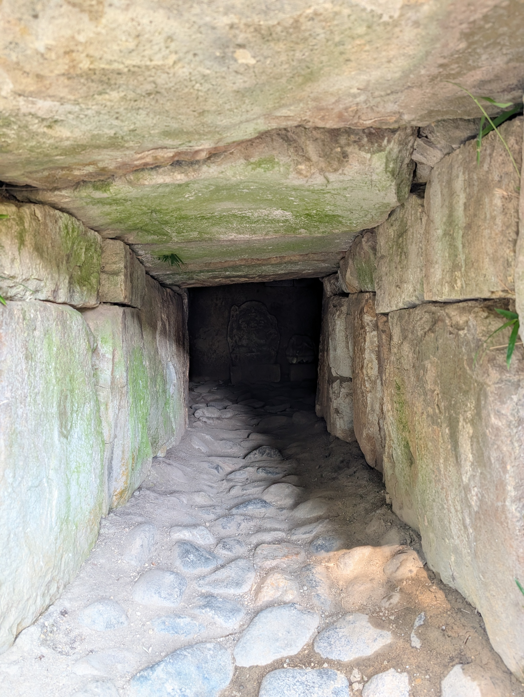
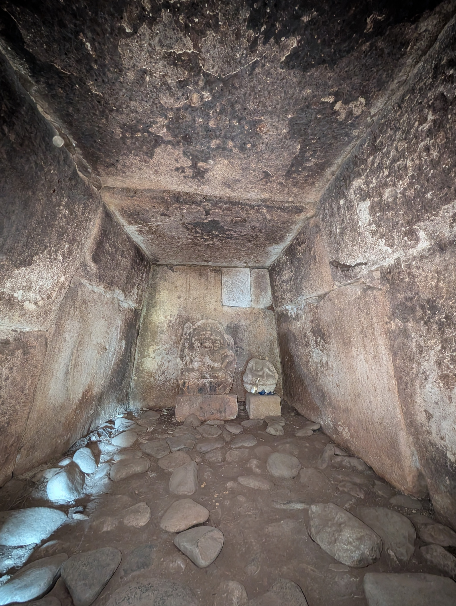
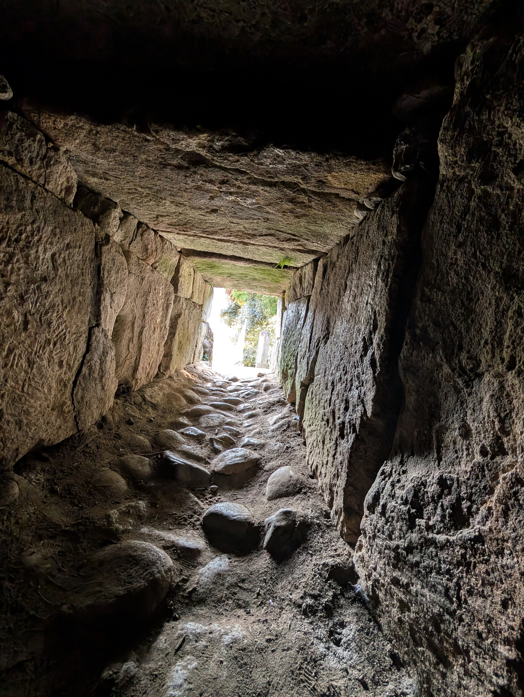
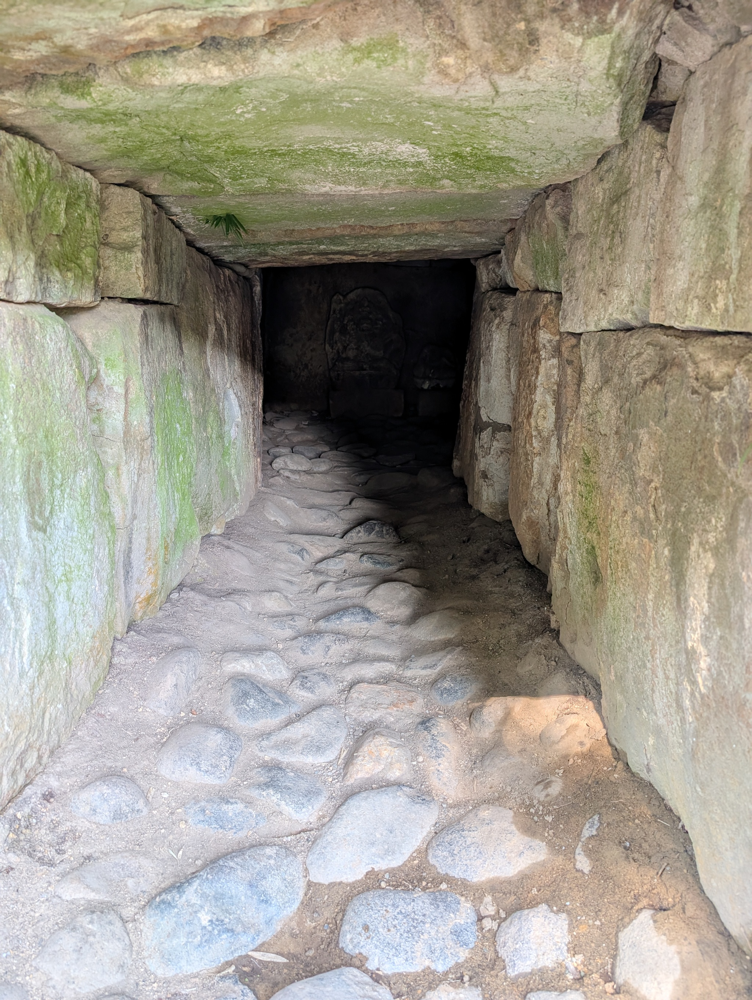
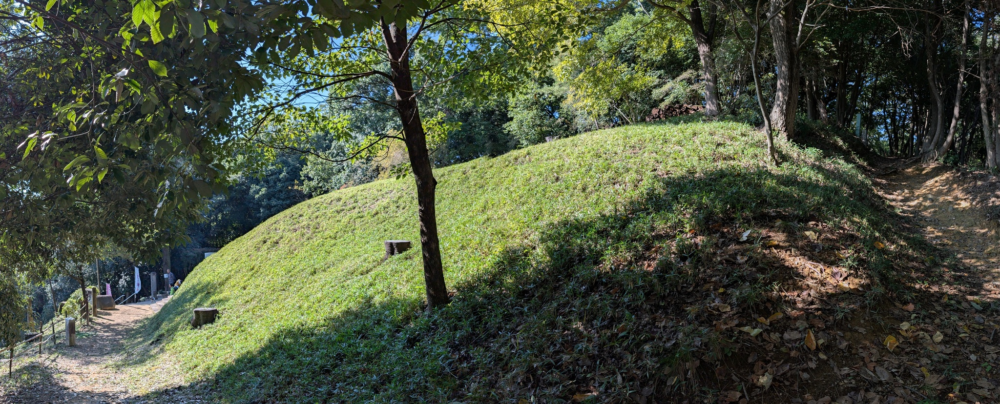
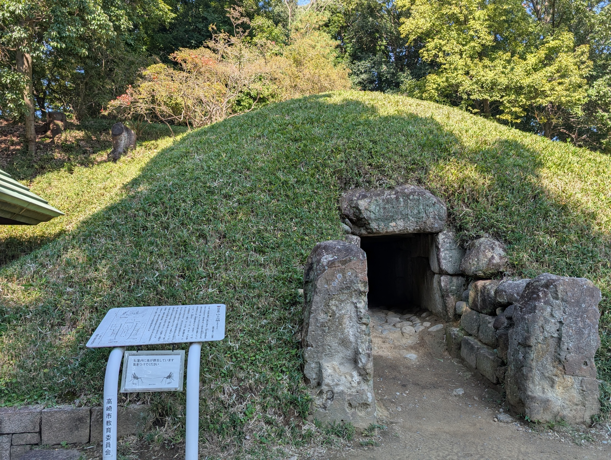
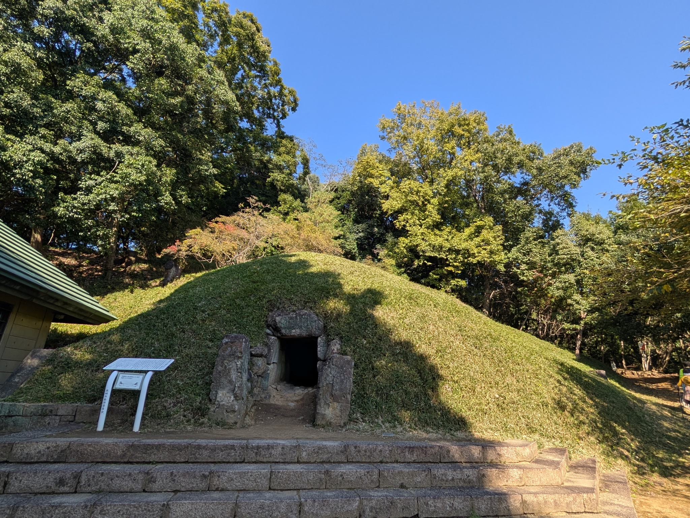

[山名古墳群](/post/2024-11-04_yamana/)を見た後は、山名駅まで戻って昼ごはんを食べたあとに、伊勢塚古墳に行こうと思っていたのですが、山名古墳群のページでも紹介した「上野三碑めぐりバス」のバス停を見つけたので、調べてみると山上古墳へはバスで 5 分ほどということでしたし、すぐに帰りのバスもありそうでしたので、山上古墳に寄り道してみることにしました。



山名駅からも歩けそうですが、名前通り山上なので、結構ハードな気がします。

山上古墳は、三碑めぐりバスの目的地でもある、山上碑という日本最古級の石碑の隣にある円墳です。直径は 15m、高さは 5m です。

羨道、玄室ともに大きな石ですね。被葬者も推定されているようです。

こじんまりとしている良い古墳ですね。石室もいいです。両袖です。
