ドライブも兼ねて箕面市の新稲（にいな）古墳に行ってきました。

箕面市立の運動施設である[スカイアリーナ](https://shisetsu.mizuno.jp/m-7207)に行く途中の道の脇にあります。スカイアリーナの駐車場に車を止められます。

スカイアリーナは展望がきいて、景色がキレイです。

箕面市には残っている古墳が少なく、あまり見学できる古墳がありませんが、ここは見事に残っています。墳丘は失われており、石室が露出しています。その上に木がしっかり根を張っていて、それで崩れるのを防いでるのかな？という気もします。

6 世紀後半の古墳で、両袖式。

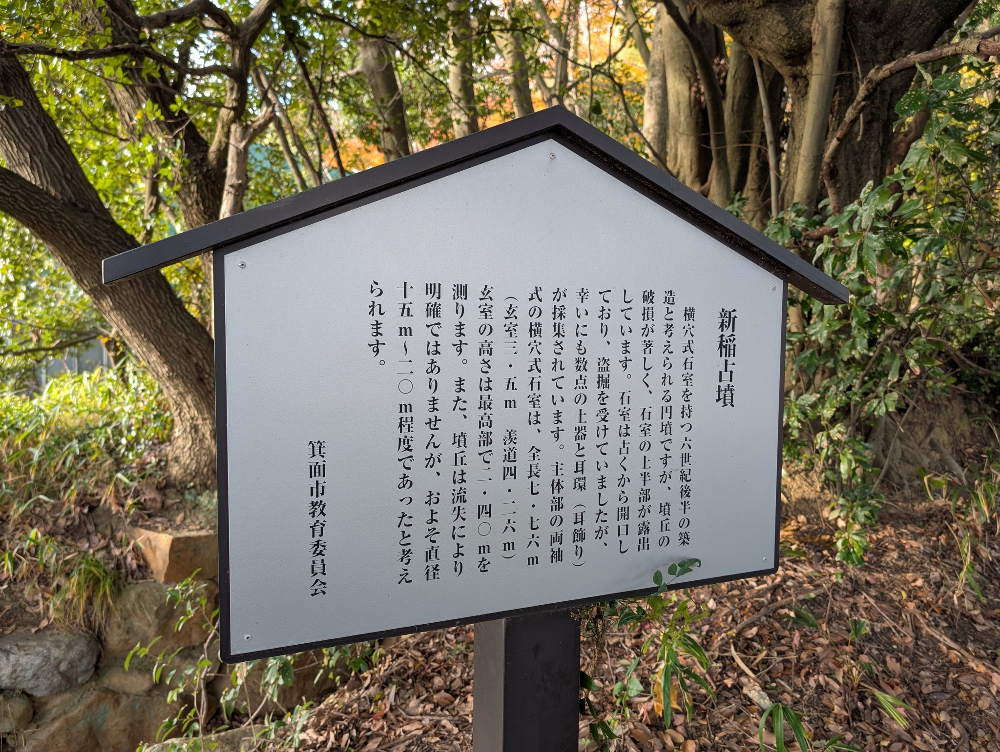

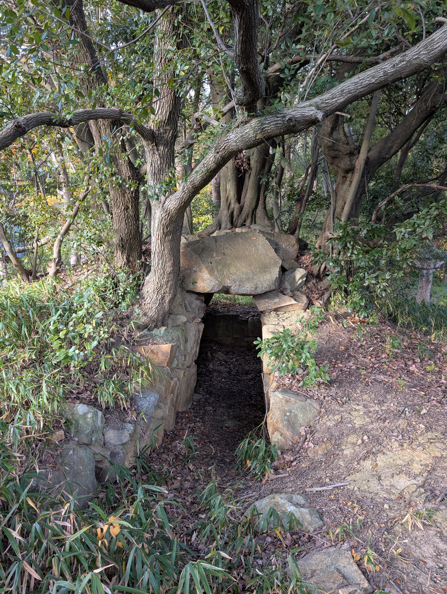
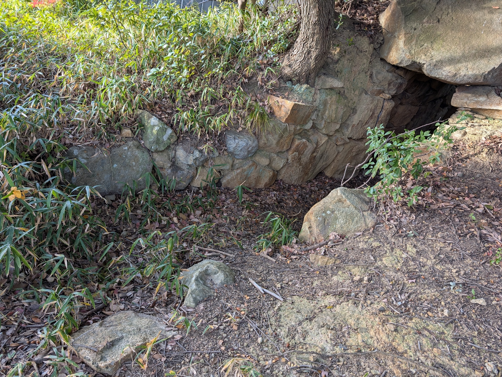

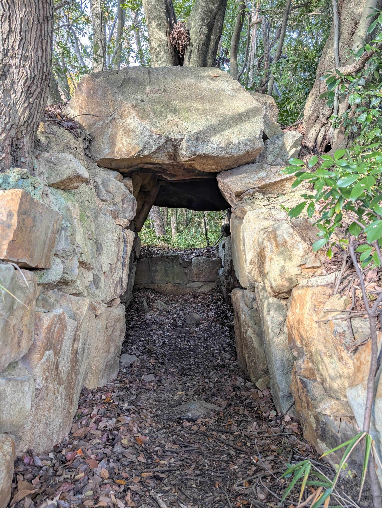
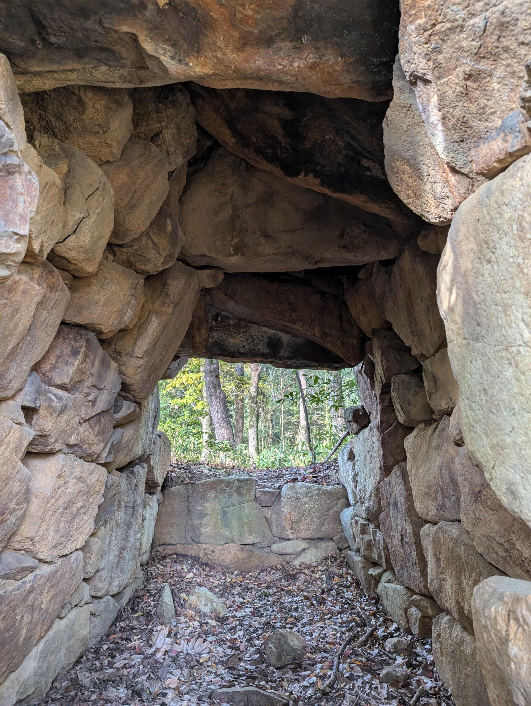

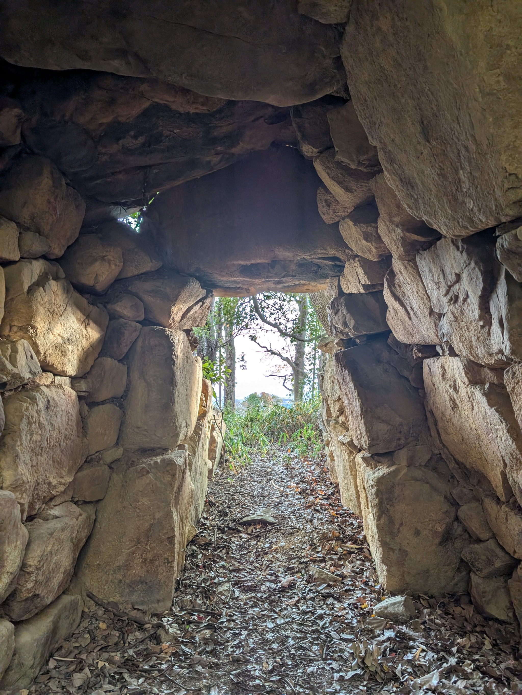
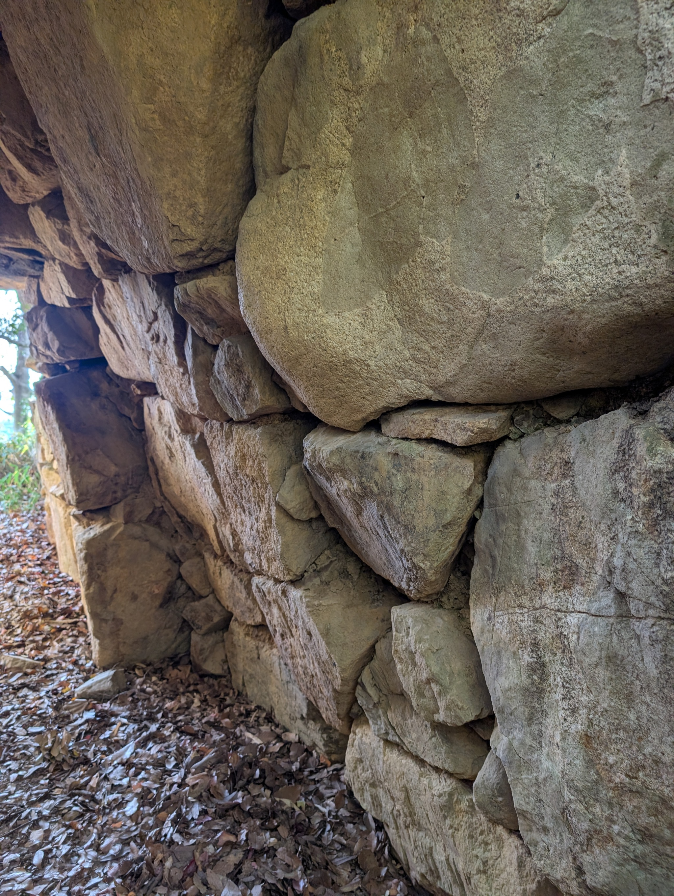

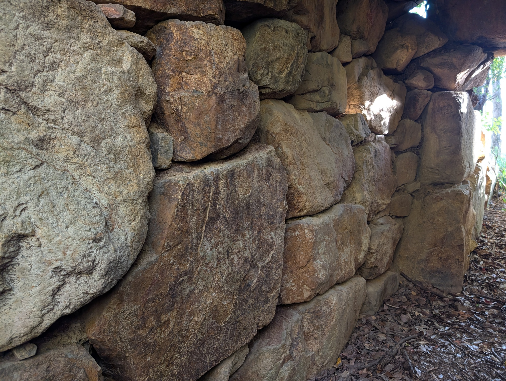
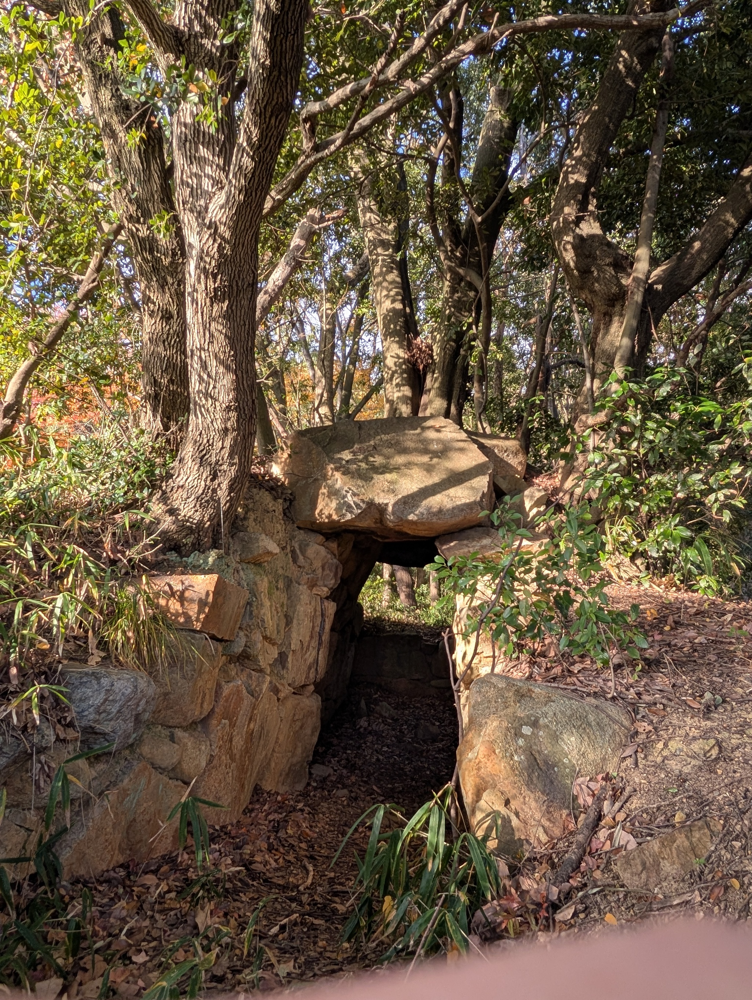

木がしっかり根を張っています。

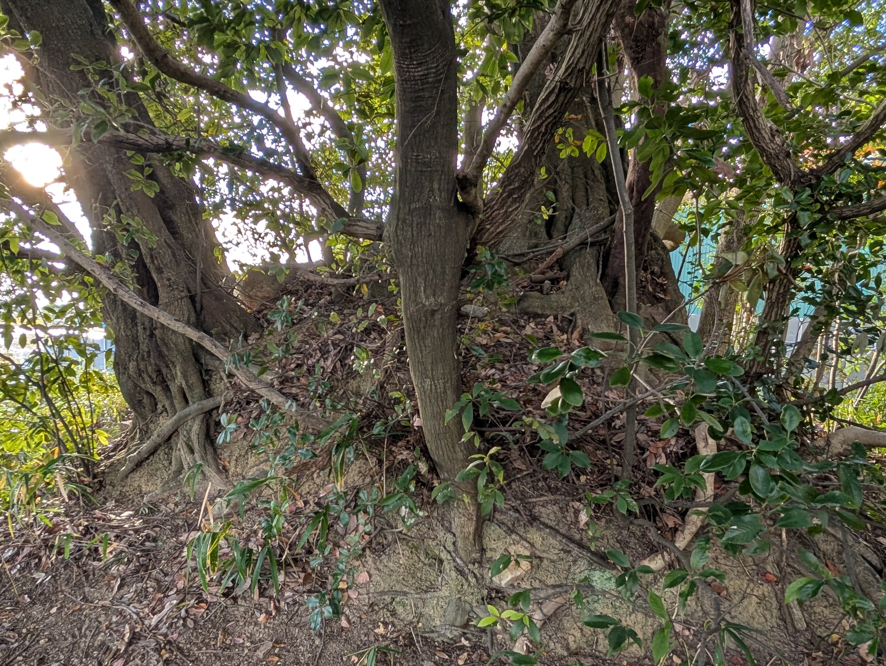
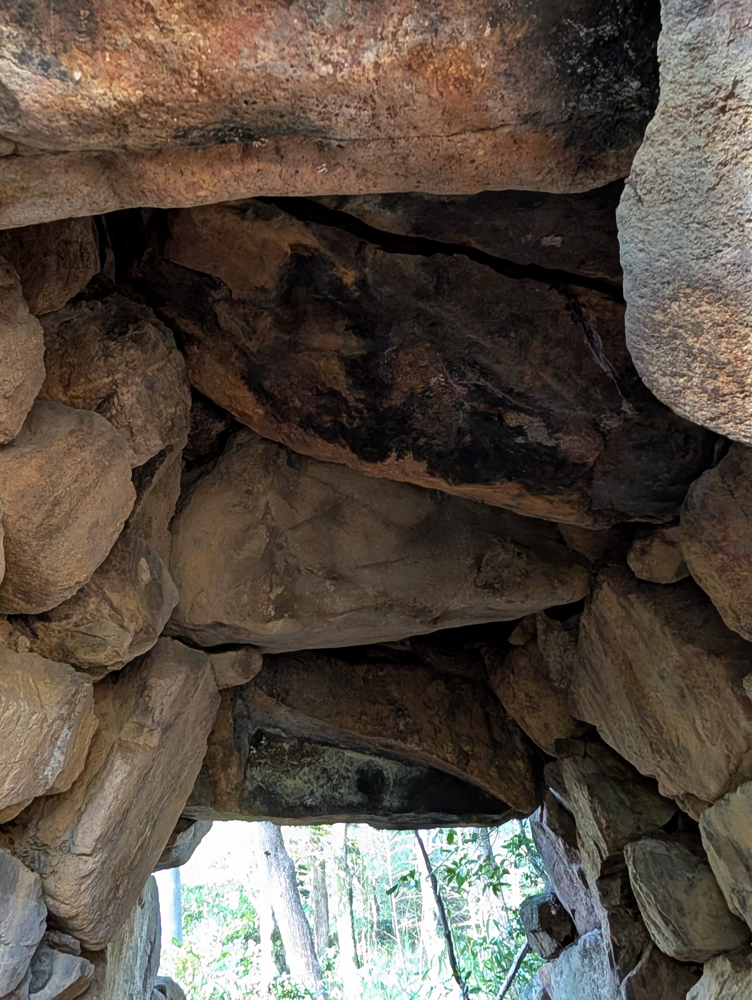

行った時は近くの木の紅葉が見事でした。

