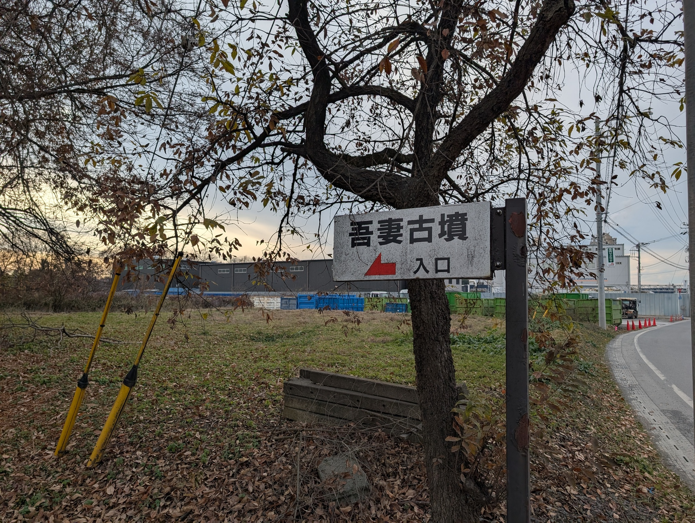
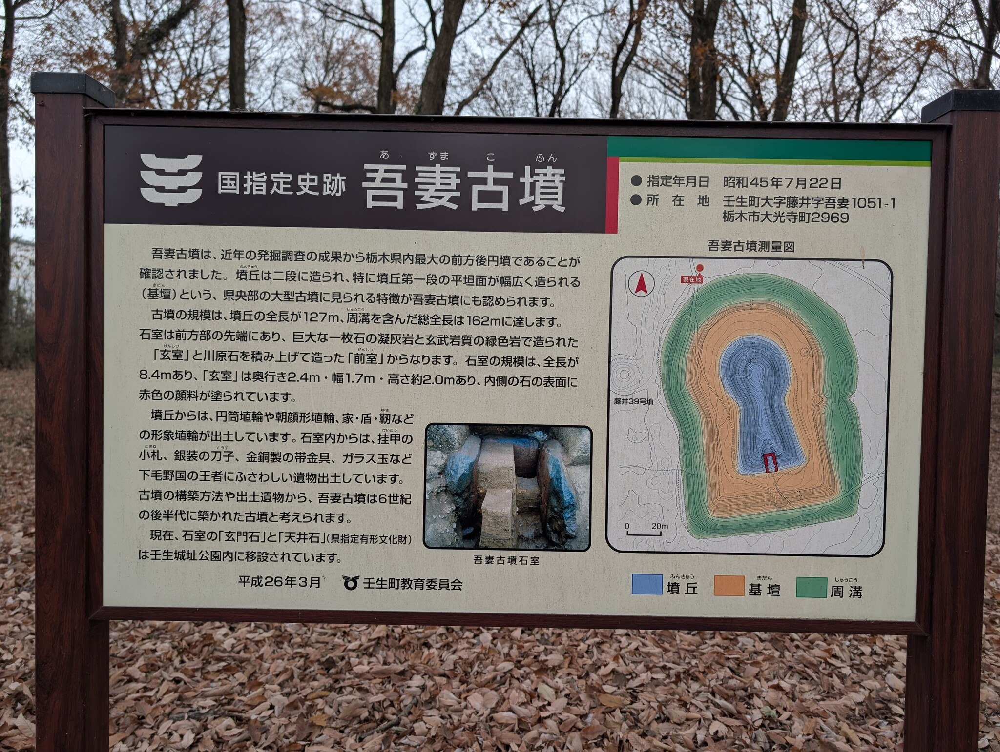
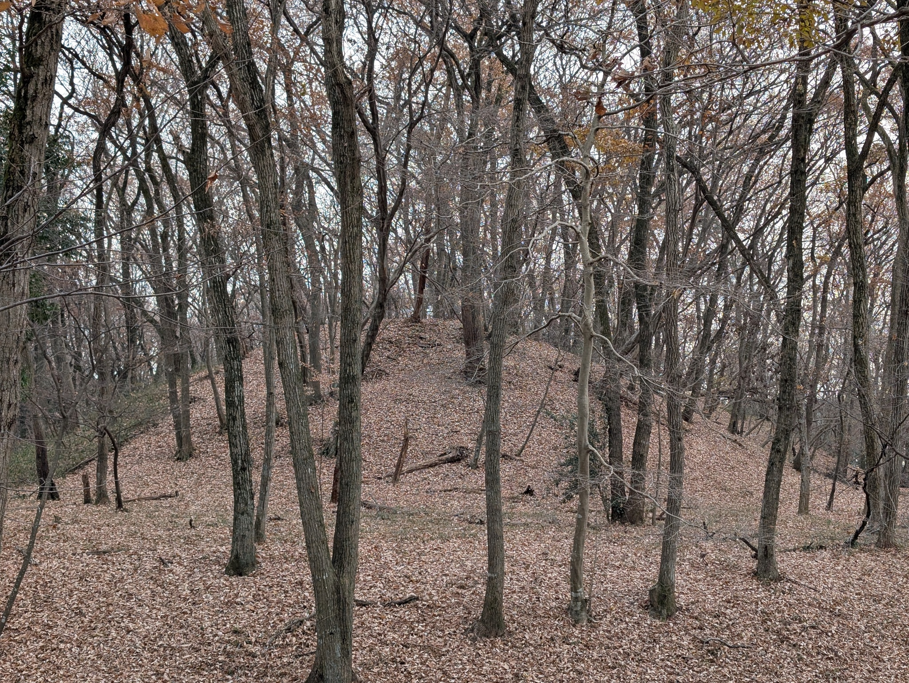
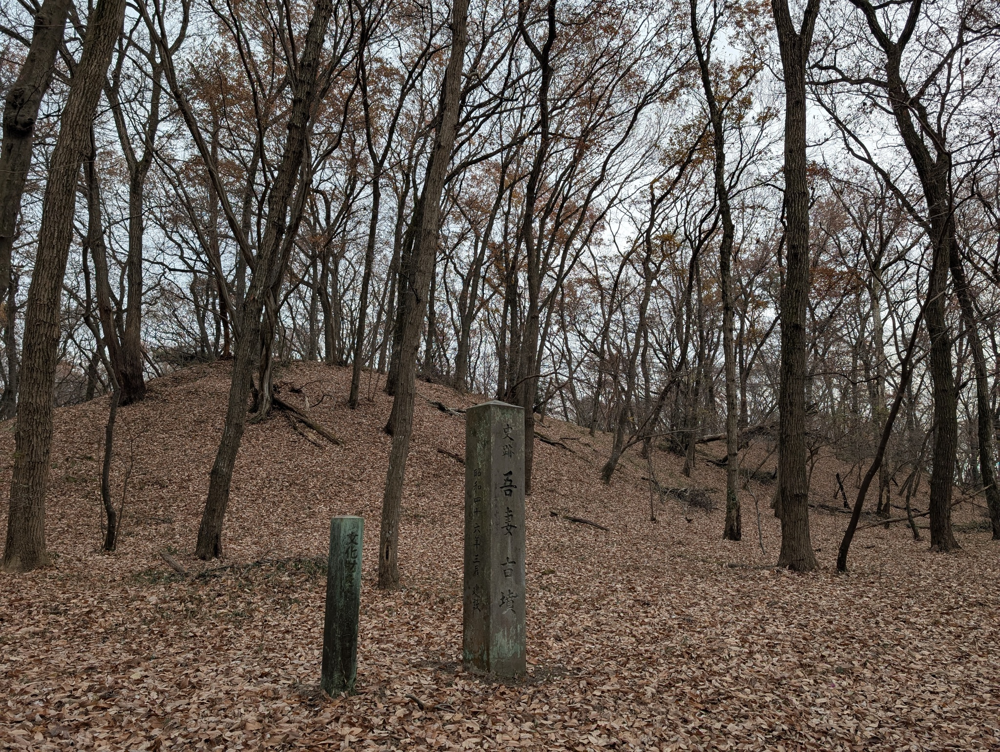
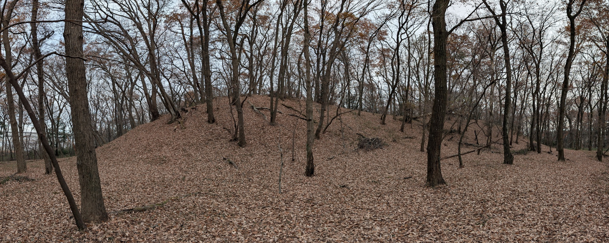
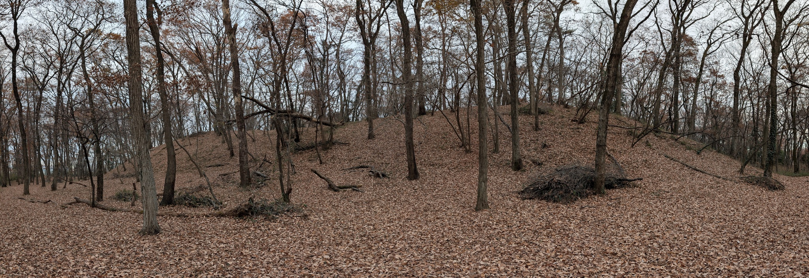
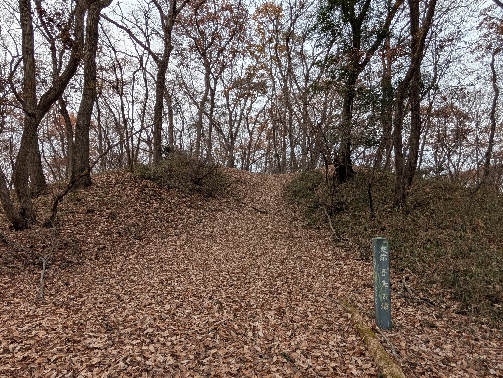
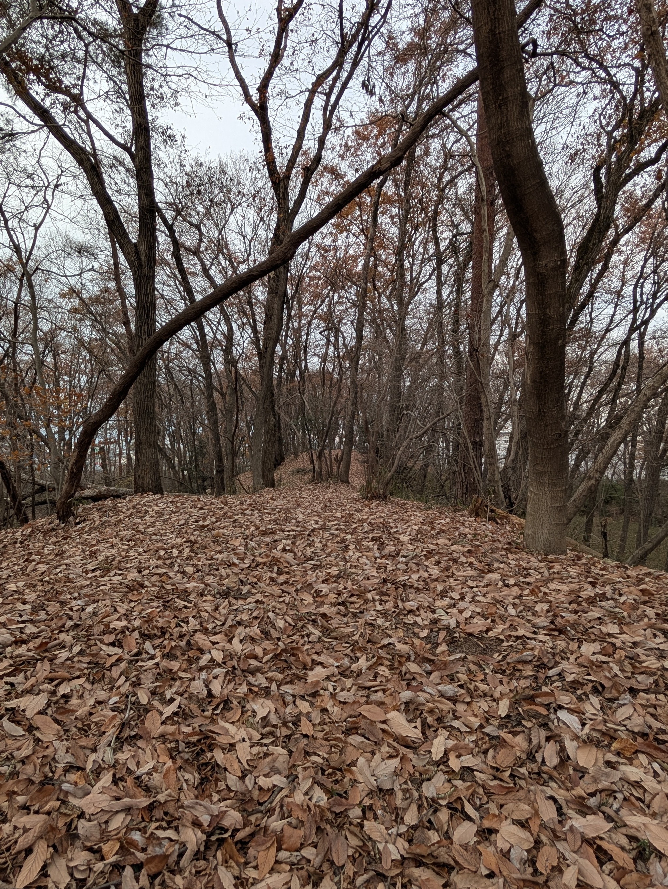
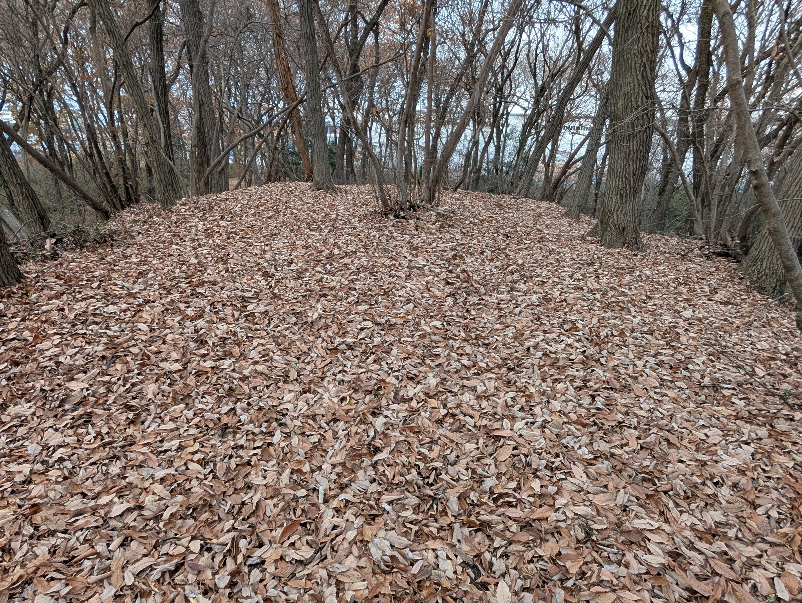
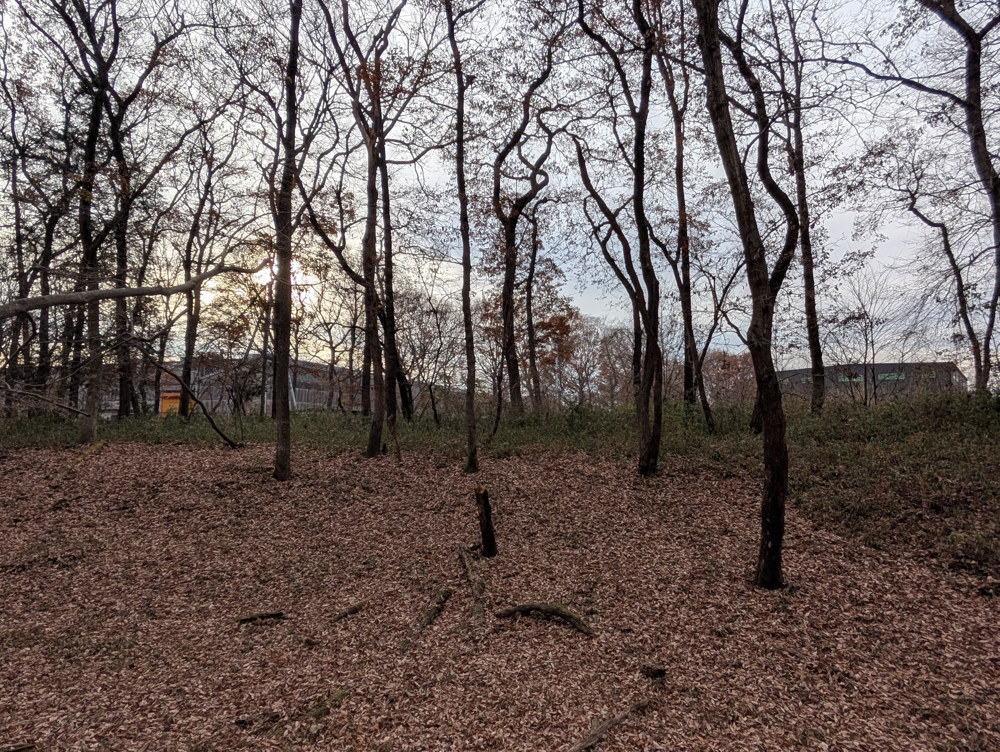

下野市の古墳を見たあとは、そのまま北に進んで壬生町に入り、吾妻古墳へ。

周りを工場に囲まれた森という感じで、工業地帯の中で保存されたエリアという感じですね。

Google Map で南から行くと、[このあたり](https://maps.app.goo.gl/nJLLhR63p4pEhkjJA)から入れと言われるのですが、実際はさらに北に回り込んむと、[工場の前に入口の看板があります](https://maps.app.goo.gl/t8PSSDUBCrLEfEMR6)（写真参照）。

6 世紀後半の前方後円墳で、近年の調査で栃木県最大の古墳ということが判明したようです。

この古墳は「下野型古墳」と言われる形状のようです。下野型古墳では、前方部に横穴式の石室があるのが特徴です。

次の写真「吾妻古墳前方部下から」で、中心部分がくぼんでいますが、ここから羨道があったようで、この部分にあった石室の石が、壬生藩主により持ち出され、庭石に流用されたようです。そのためくぼんでいるようです。

[その石は壬生城址公園にある](https://bunkazai.pref.tochigi.lg.jp/cultural/%E3%80%90%E5%90%BE%E5%A6%BB%E5%8F%A4%E5%A2%B3%E7%9F%B3%E5%AE%A4%E9%83%A8%E6%9D%90%EF%BC%88%E5%A4%A9%E4%BA%95%E7%9F%B3%E3%83%BB%E7%8E%84%E9%96%80%E7%9F%B3%EF%BC%89%E3%80%91/)ようで、見学もできるようです。

この他に 1 段目が広く取られていることや、凝灰岩（ぎょうかいがん）切石による横穴式の石室を持つことが下野型古墳の特徴のようです。

下野型古墳の特徴は、[この資料](https://www.city.shimotsuke.lg.jp/manage/contents/upload/5c0df7c5964f5.pdf)に書かれています。

そして、案内板にある「藤井39号墳」。どこかわからない!! 案内板に書くならポールくらい立てといてよ…

