東京に来て夕方まで時間があったので、世田谷方面でまだ見てない古墳を見学してきました。

アクセスは、大井町に泊まっていたので東急大井町線で二子玉川まで乗って、そこから稲荷塚古墳まで歩きました。3.5km 程度なので、1 時間程度で歩けます。私は大体 45 分ほどで歩いています。

## 稲荷塚古墳

小さな古墳公園になっています。かわいいですね。古墳自体は直径 13m ほどの円墳で、古墳時代末期の古墳ですね。結構色々な出土品が出ているようです。

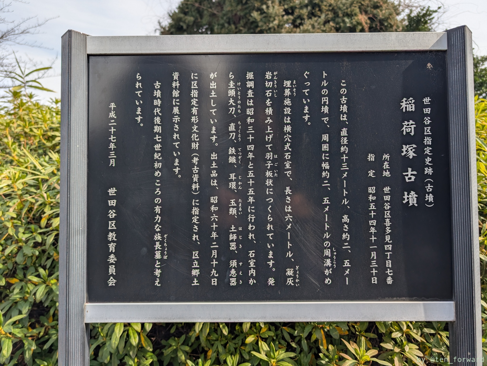
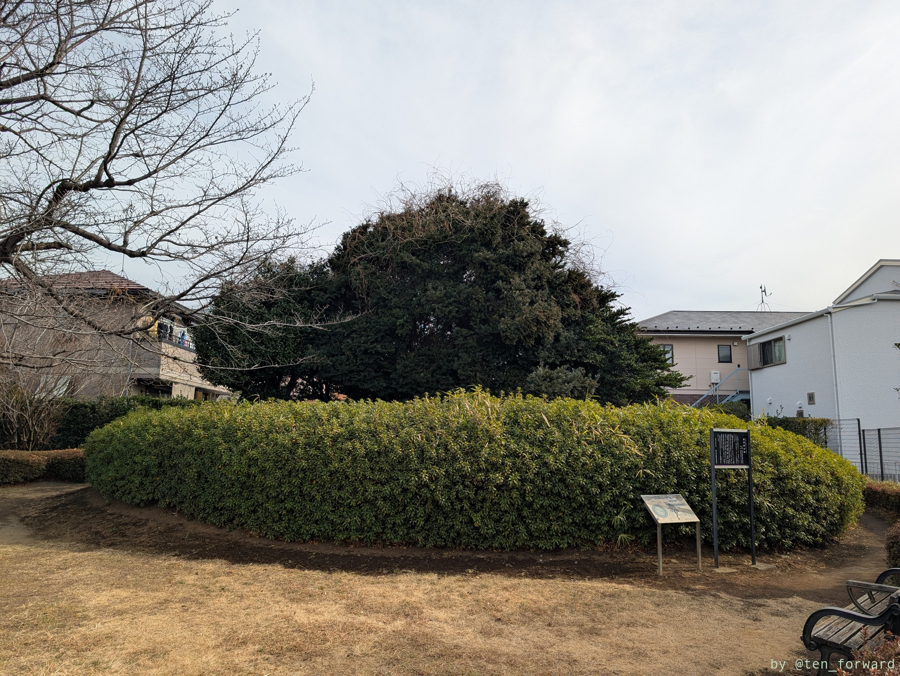

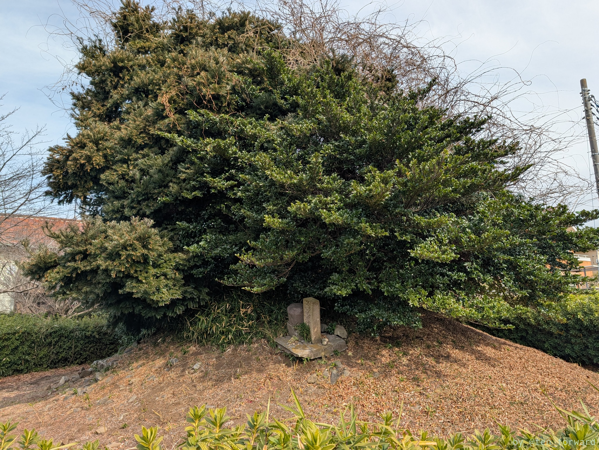
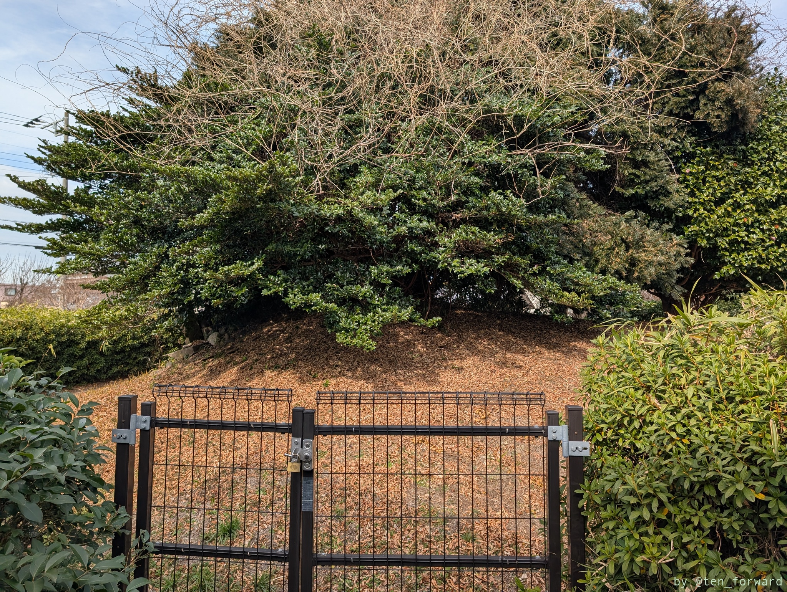
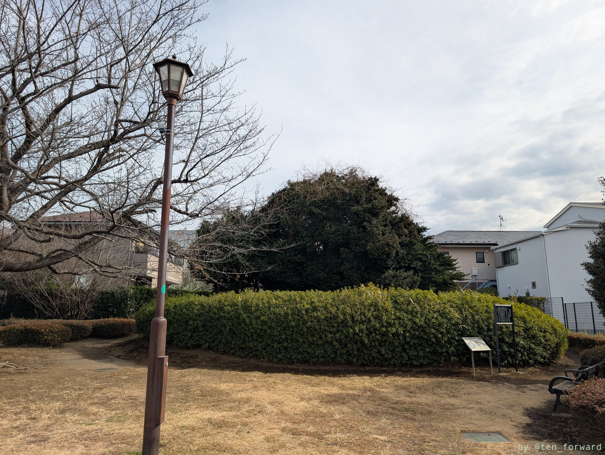

## 第六天塚古墳

稲荷塚古墳の近くにあって、民家脇の細い道に沿ってあります。5 世紀末〜 6 世紀初頭の円墳のようです。

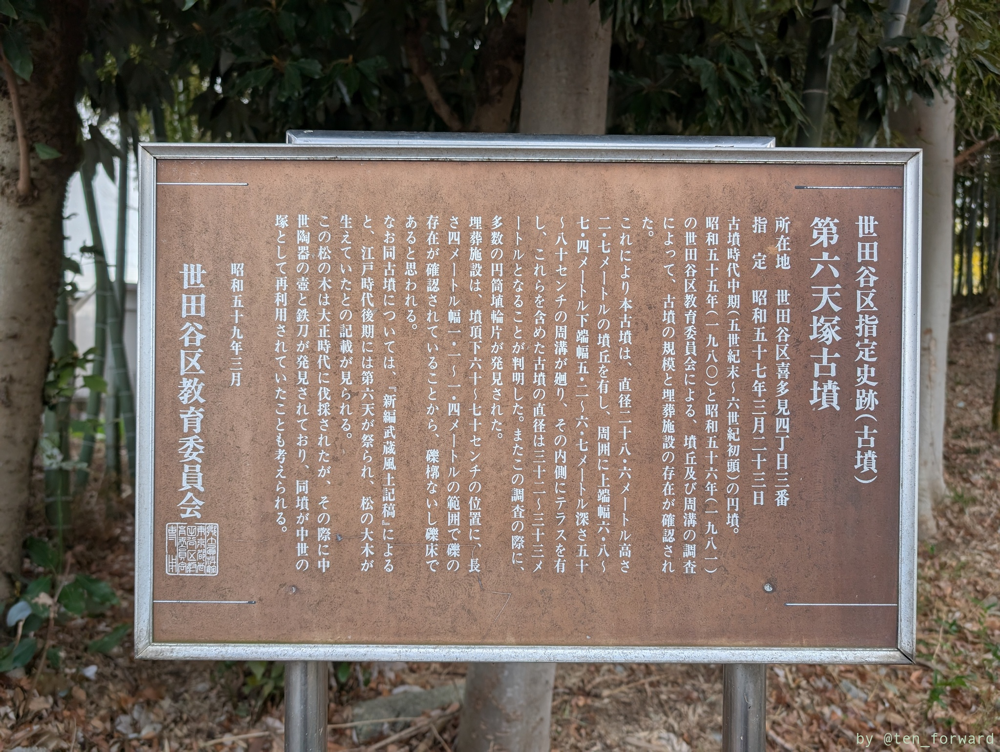
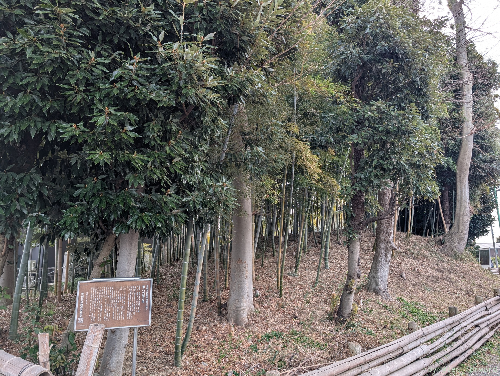

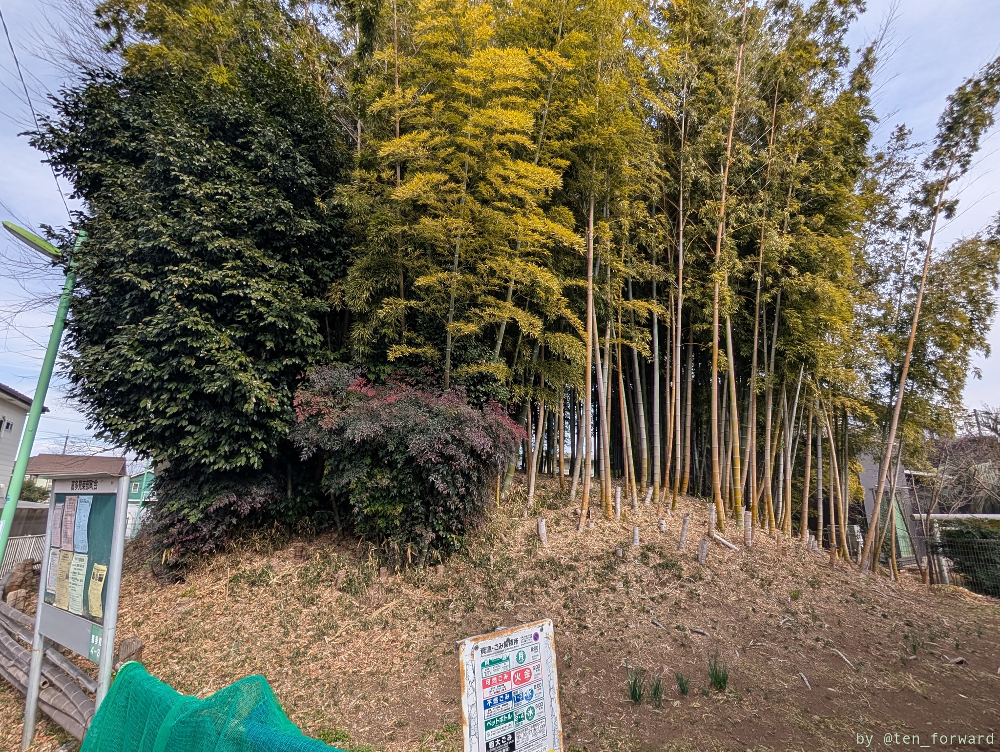
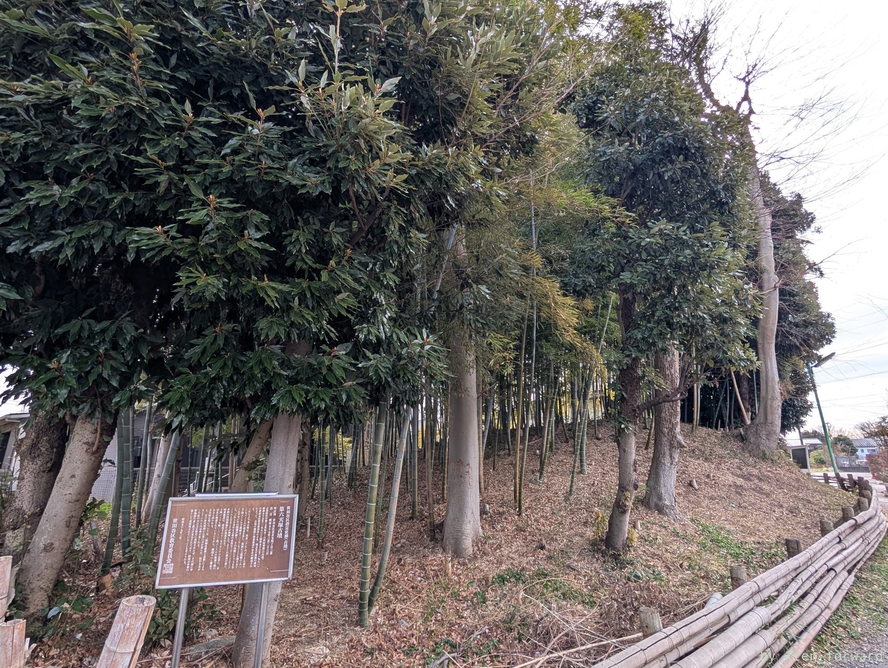

## 土屋塚古墳

稲荷塚古墳・第六天塚古墳から 20 分ほど歩くと狛江市に入って土屋塚古墳に至ります。

マンションと細い道に挟まれていて全貌を撮影するのが難しいです。

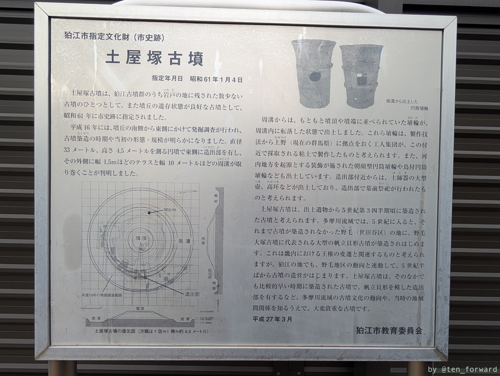
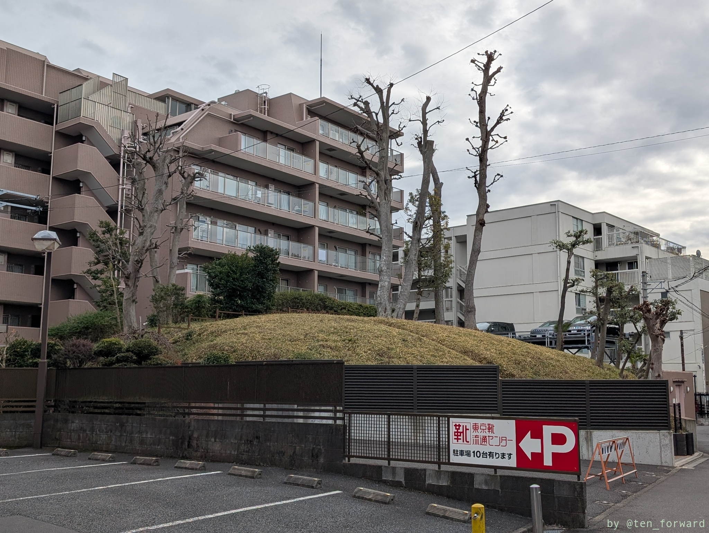

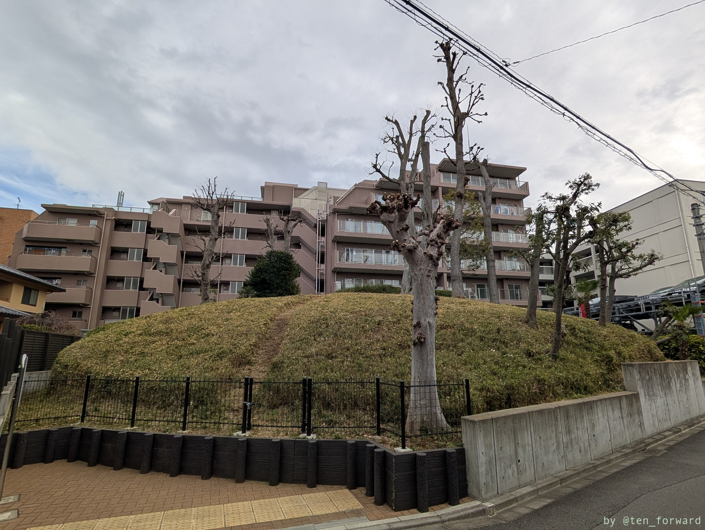

## 橋北塚古墳

土屋塚古墳から狛江駅まで歩く途中に橋北塚古墳があります。ここは保育園の園庭になっていて、見学はできません。外に案内板だけあります。

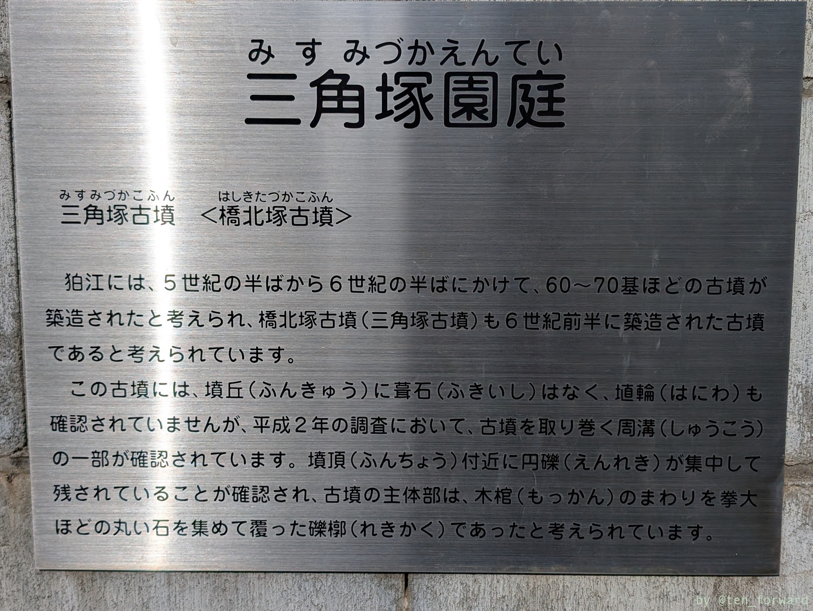
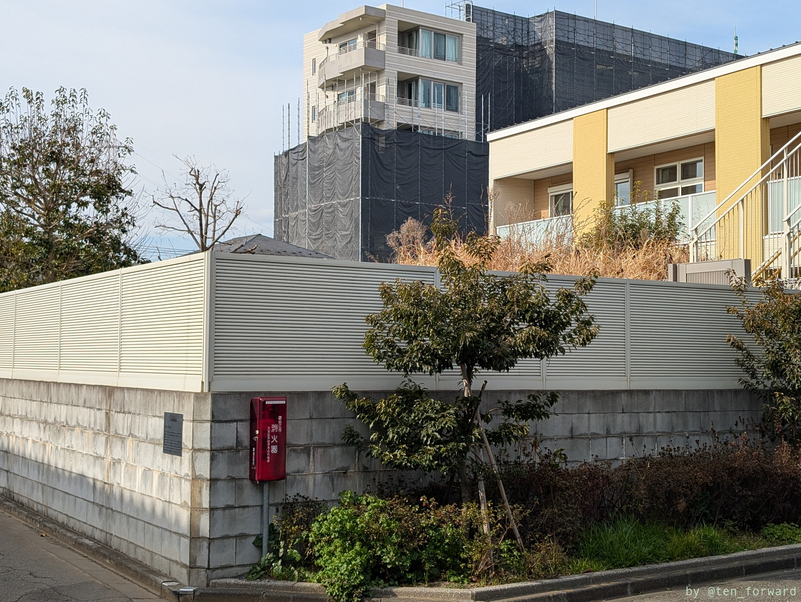

