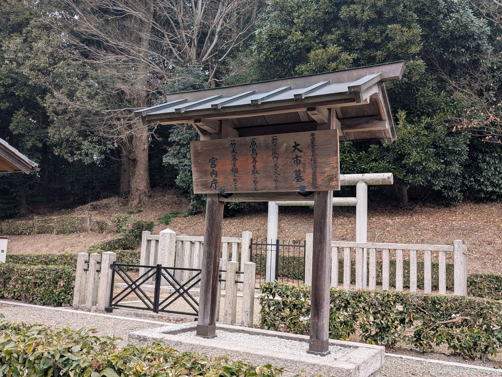
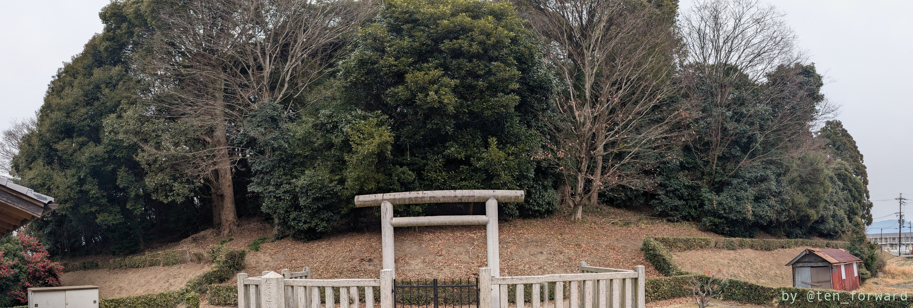
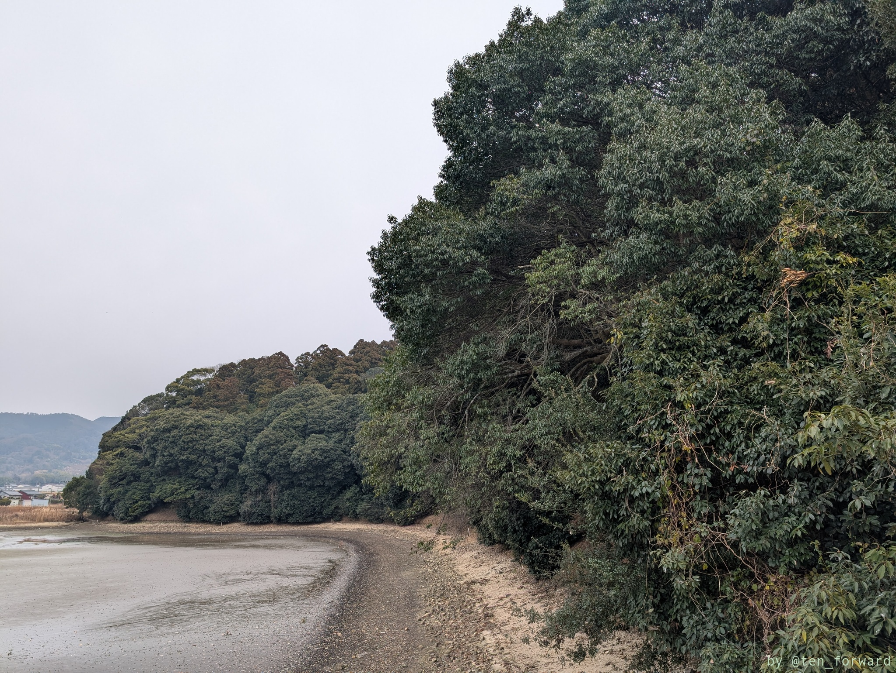
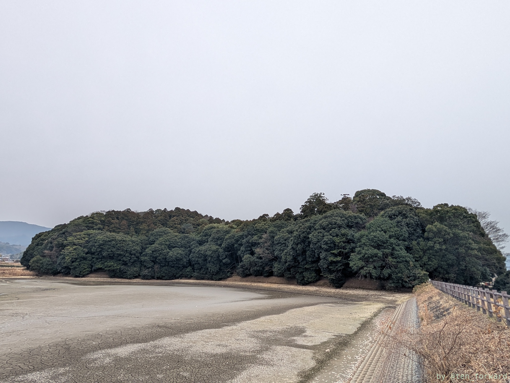
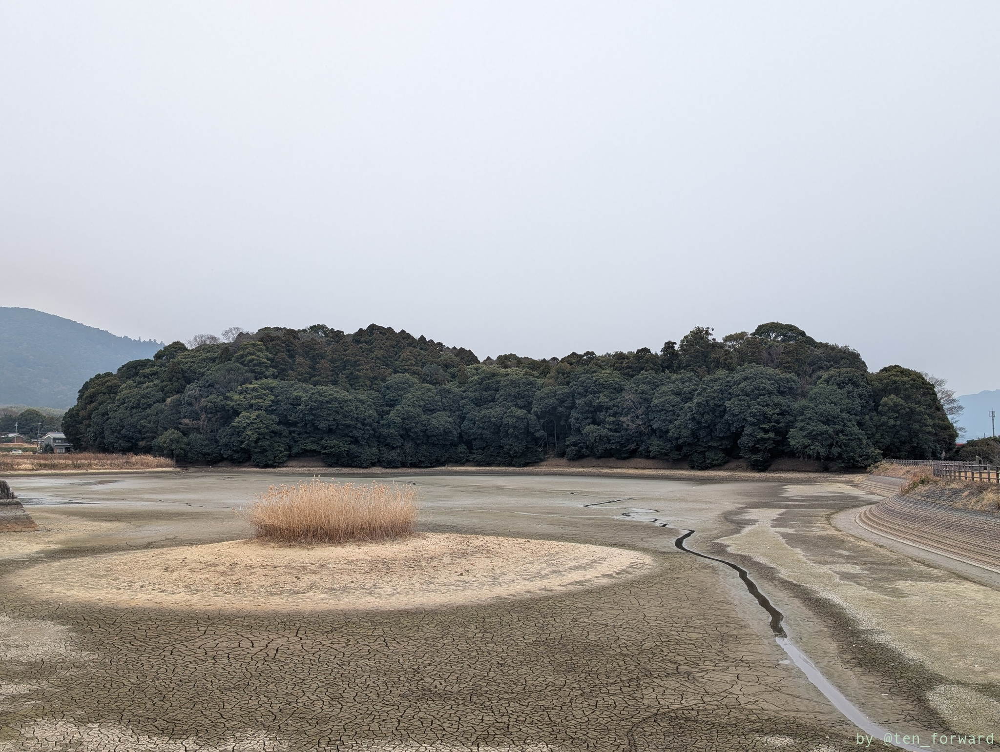
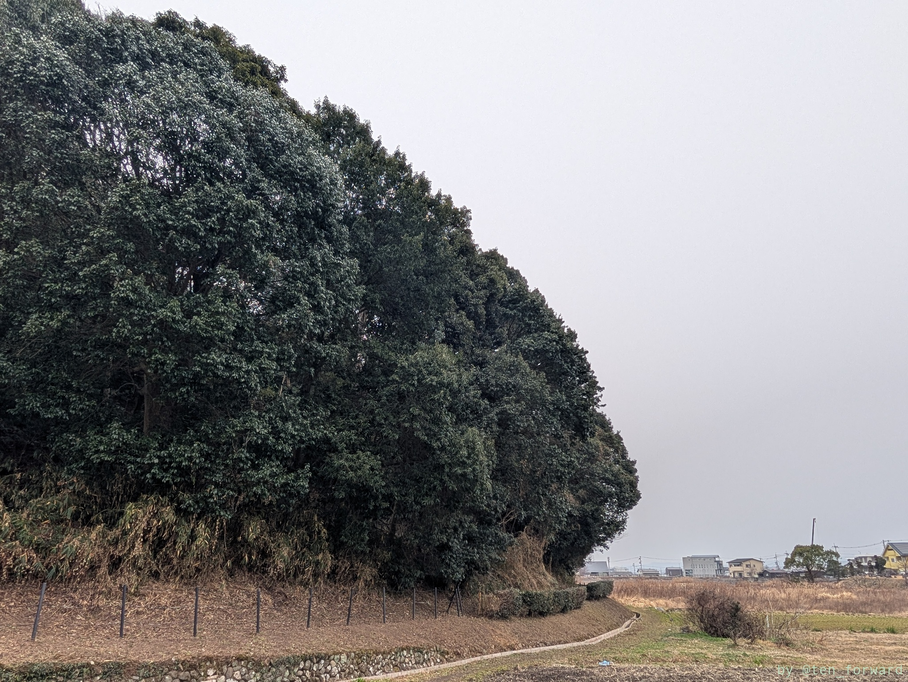
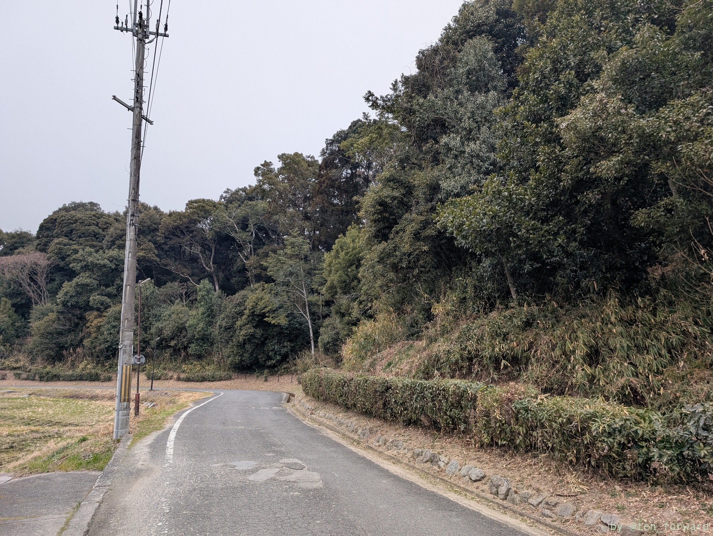
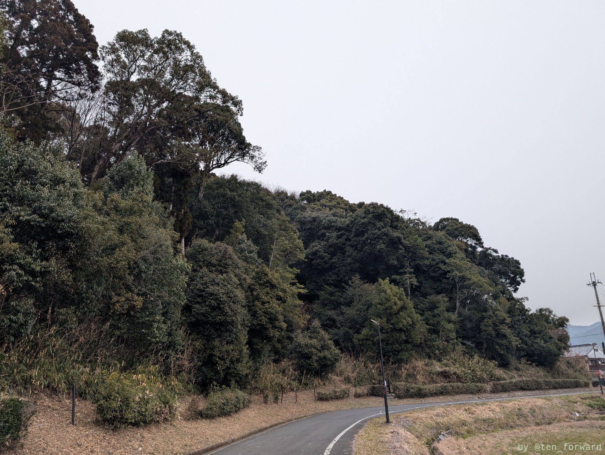

[桜井茶臼山古墳](/post/2025-02-01_sakuraichausuyama/)のあとは、車でそれほど遠くない箸墓古墳に行きました。箸墓古墳自体には駐車場がないのですが、近くに「ひみこの庭駐車場」という無料の駐車場があります。Google Mapで検索すると出てきますので止めると良いと思います。

ひみこの庭は、駐車場とは箸墓古墳をはさんで逆側にあるカフェもあるショップで、ここの方が箸墓古墳見学のために無料で開放してるとかだったと思います。箸墓古墳見たあとはひみこの庭でちょっと休憩すると良いかも?

* [ひみこの庭](https://him-sakurai.localinfo.jp/)

季節が良ければテラス席で古墳を眺めながらコーヒーとかもありですね。

私は駐車場からまずは箸墓古墳の拝所へ行き、そこから池の方に抜けてひみこの庭に行きました。その後、他の古墳を見てから、箸墓古墳東側の道を通って駐車場に戻ったという感じです。

箸墓古墳は全長 280m にせまる大きな前方後円墳で、3 世紀中頃〜後半にかけての築造です。かなり古いですね。卑弥呼の墓ではないかという説もある有名な古墳なので、一度観てみたかったんですよね〜

池をはさんで古墳を見ると、前方後円墳であることがわかっていい眺めです。

ホケノ山古墳などを見たあとは古墳の南側を通って駐車場に戻りました。

