前日まで松山出張でしたので、翌日松山から今治に移動して今治の古墳を見てきました。

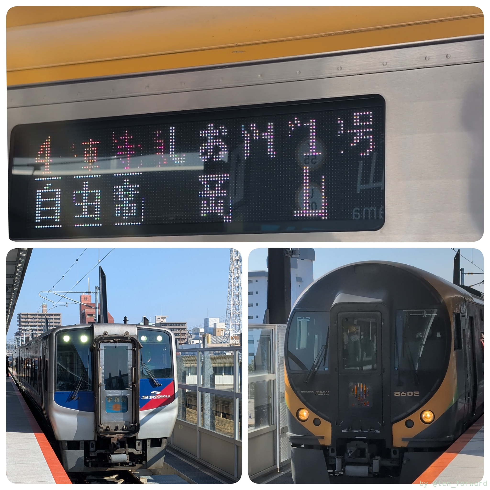
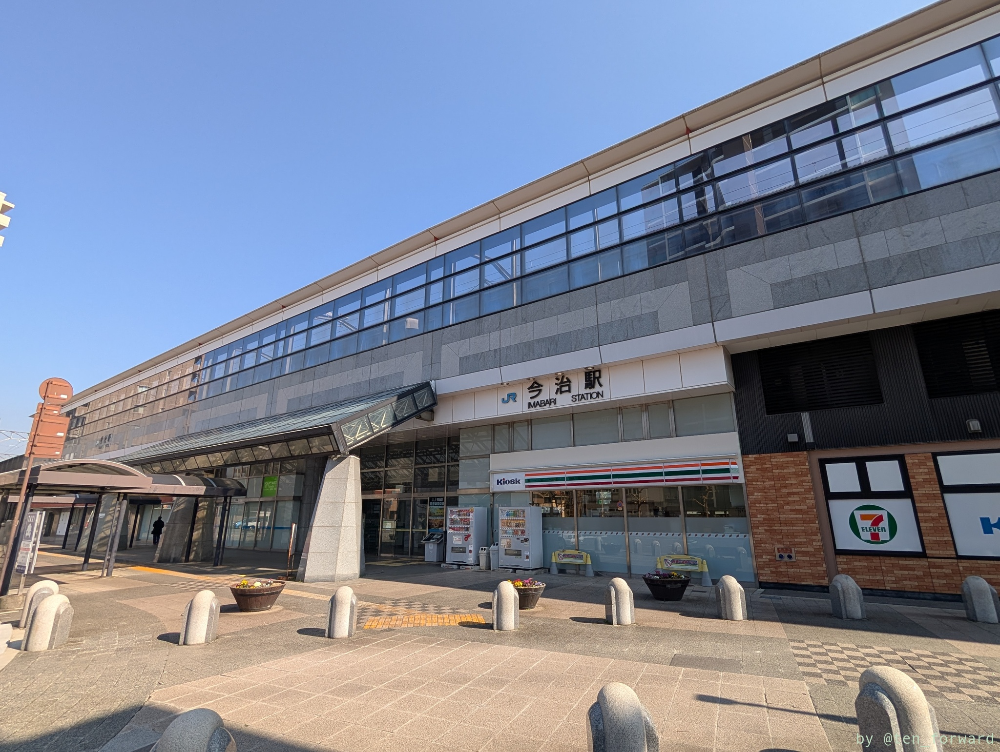

この日はタイムズカーを借りて移動です。まずは古墳情報収集のため、旧朝倉村の古墳情報を展示している[朝倉ふるさと美術古墳館](https://www.city.imabari.ehime.jp/museum/asakura/)に立ち寄りました。

古墳館はかなり細い道を上がっていくのですが、普段なら古墳館脇に車が止められそうです。しかし、この日は隣接するグランドで野球大会（?）をやっていた感じで、その車が大量に止まっていたので、細い道に入る前にある墓地の駐車場らしきところに止めました。

観覧は無料で、入ると中の人がこちらを振り向く感じでしたが、特に声とかかけられることなく中を見ました。こういう田舎の資料館は結構声かけられるんですけど。

ここでもらった朝倉の史跡・古墳めぐりという資料が、このあとの野々瀬古墳群や多伎神社古墳群の見学に大変役に立ちました。

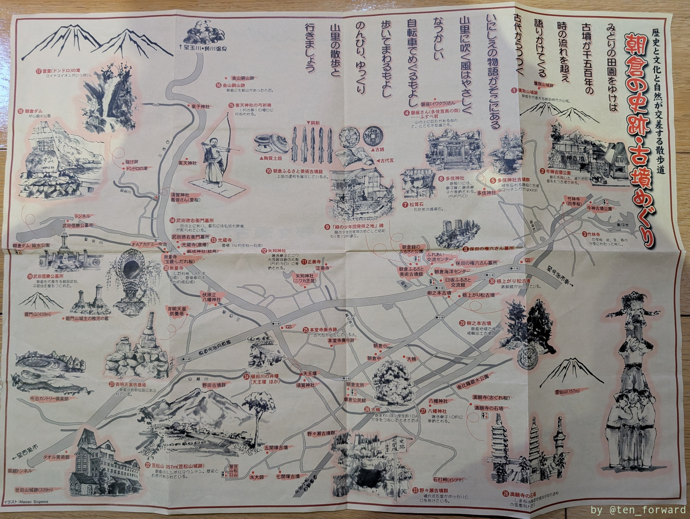
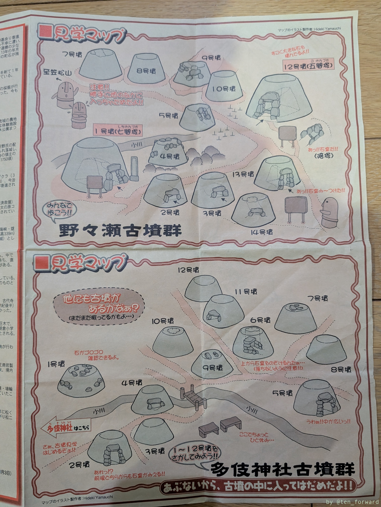

## 樹之本古墳

朝倉ふるさと美術古墳館から歩いて少しのところに樹之本古墳があります。前方後円墳のようで、5世紀後半の古墳ではにわや鏡などが出土しているようです。

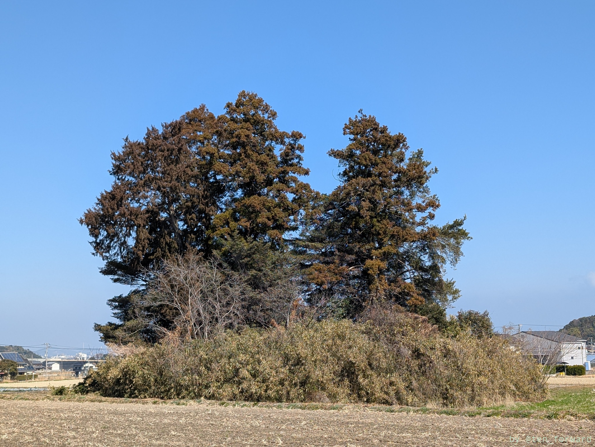
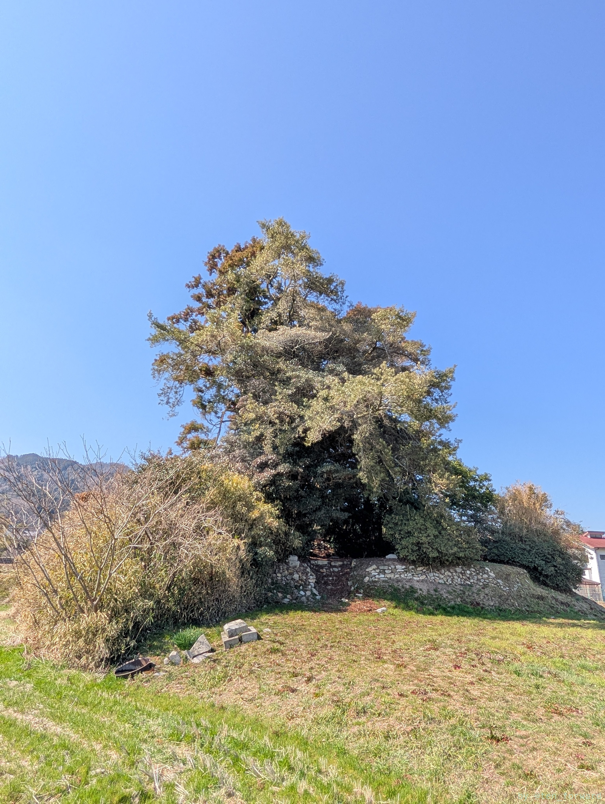
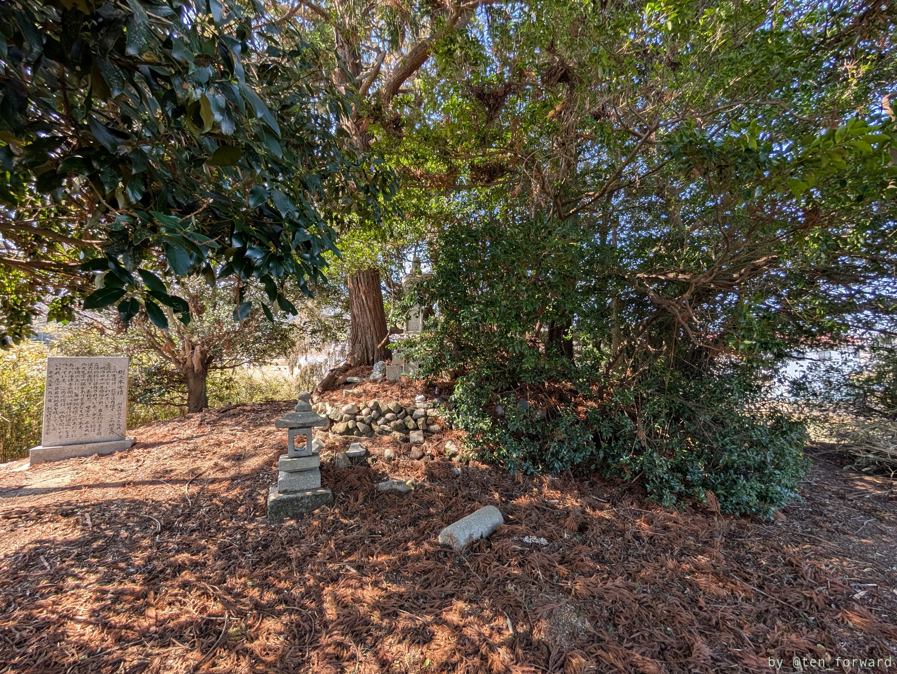

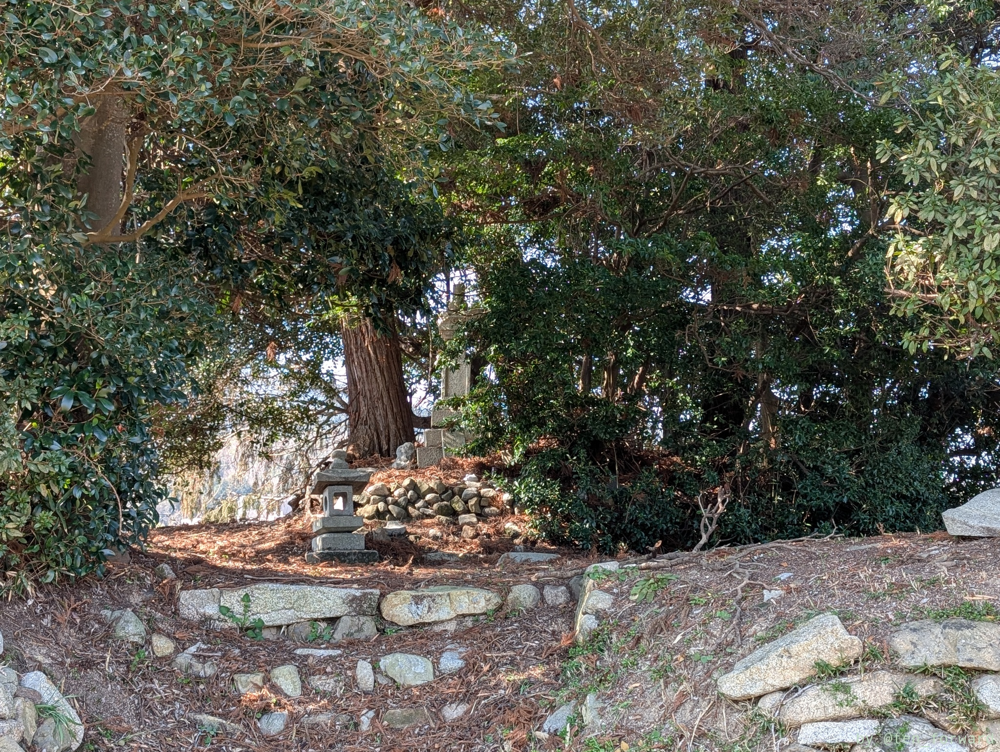
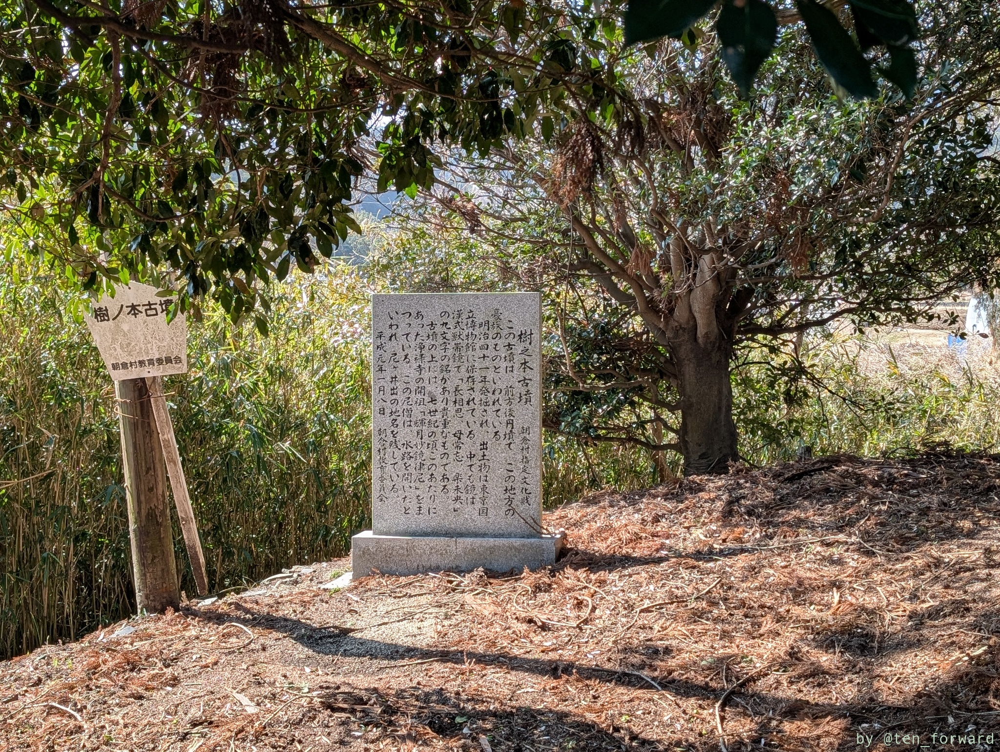

## 根上松古墳

樹之本古墳から少しいくとコンビニ裏側に根上松古墳があります。以前は県下一と言われた松の大木があったので一本松古墳とも呼ばれるようです。6世紀前半の古墳とのことです。

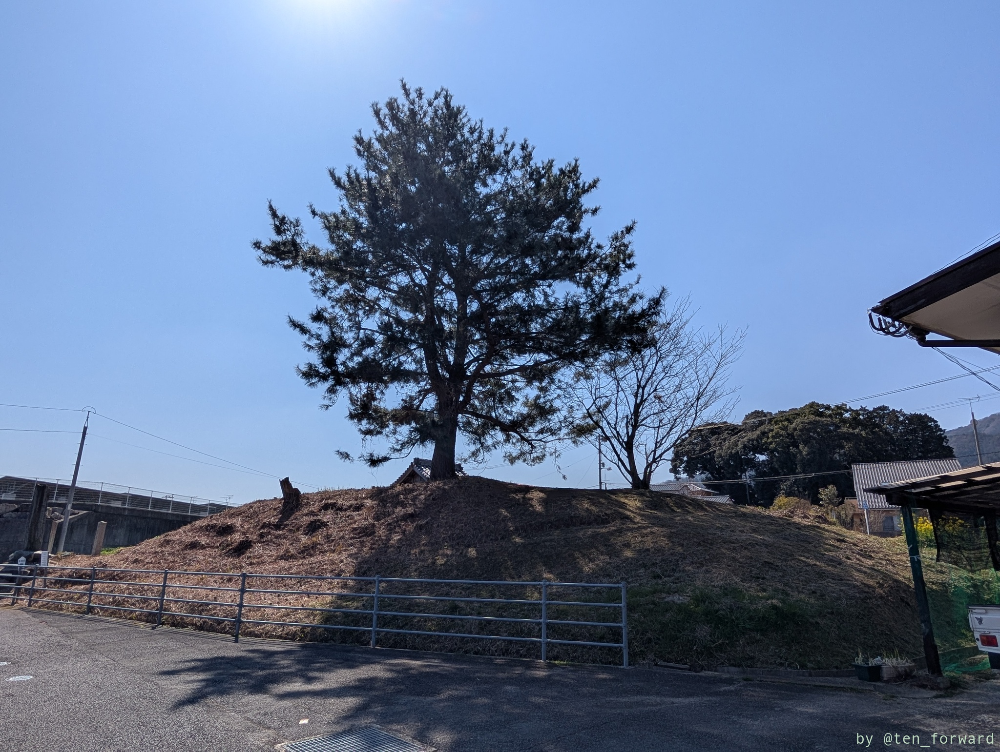
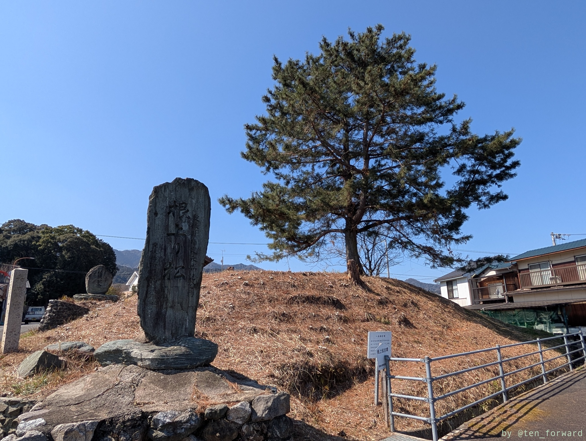

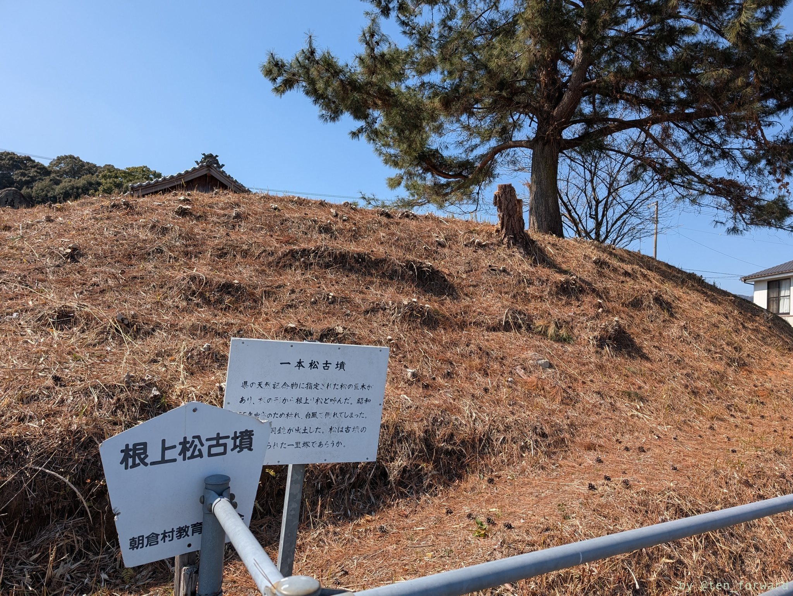
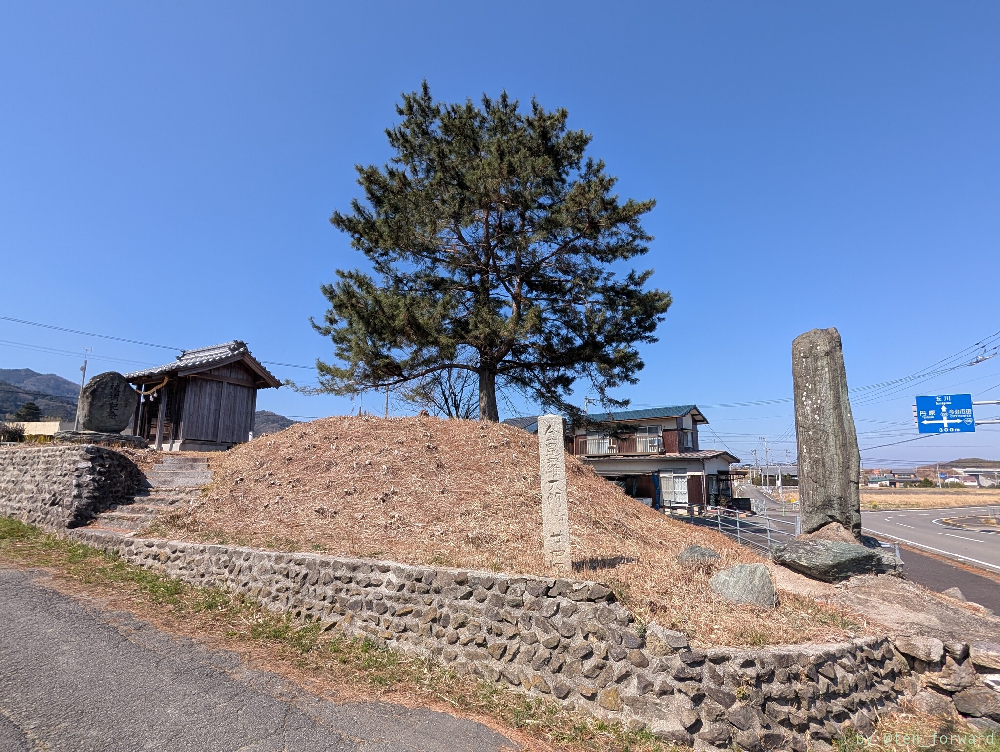

----
このあとは、美術古墳館でもらったマップに載っている野々瀬古墳群へ。
