野々瀬古墳群は、今治の南東にある笠松山山麓の愛媛県最大規模の群集墳とのことです。昭和初期には 100 基肄城の古墳が残っていたようですが、その後の開墾で今は 20 基ほどが残っているだけのようです。

朝倉ふるさと美術古墳館でもらったマップを参考に観てきました。

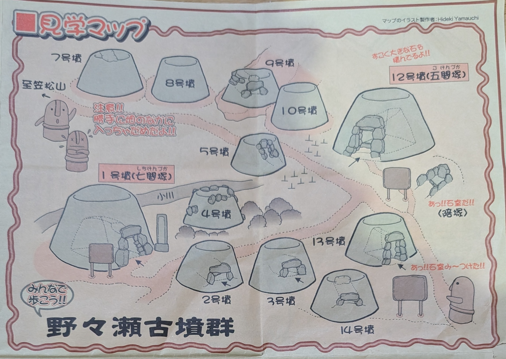

朝倉ふるさと美術古墳館から 10 分ほど車を走らせ、山を上っていくような道を進むと「野々瀬古墳群」と書かれた看板が目に入り、右手に古墳が見えます。

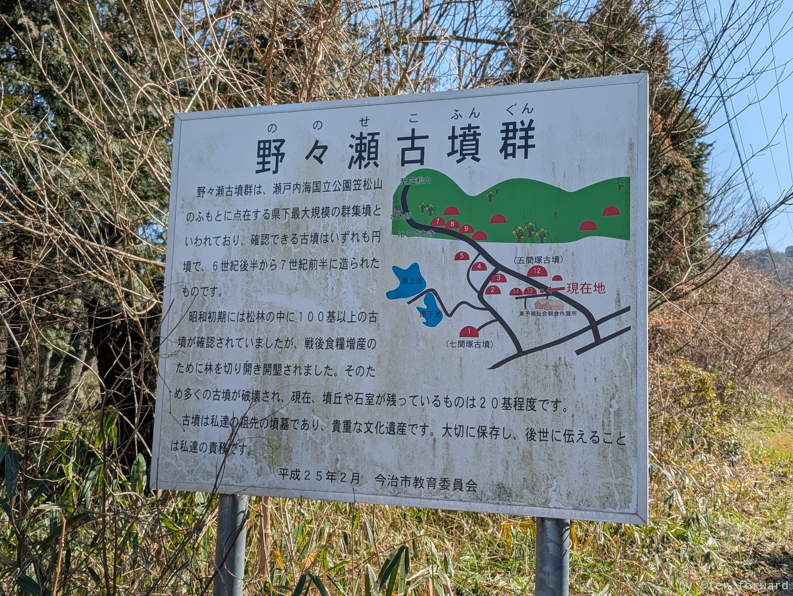

看板付近に車を止めようとしますが、適当な場所が見つかりませんでした。最初看板脇にあるこの日は閉まっていたっぽい作業所の門の前に車を止めましたが、もう少し進んで 10 号墳付近まで行くと、道が少し広くなって止められるところがありますので、そこに止めると良いと思います。そして 7 号墳から順に山を下るような感じで見ると良いでしょう。

12 号墳から 10 号墳方面へ山を上がっていくと、七間塚古墳（1号墳）方面へ向かう看板が立っています。

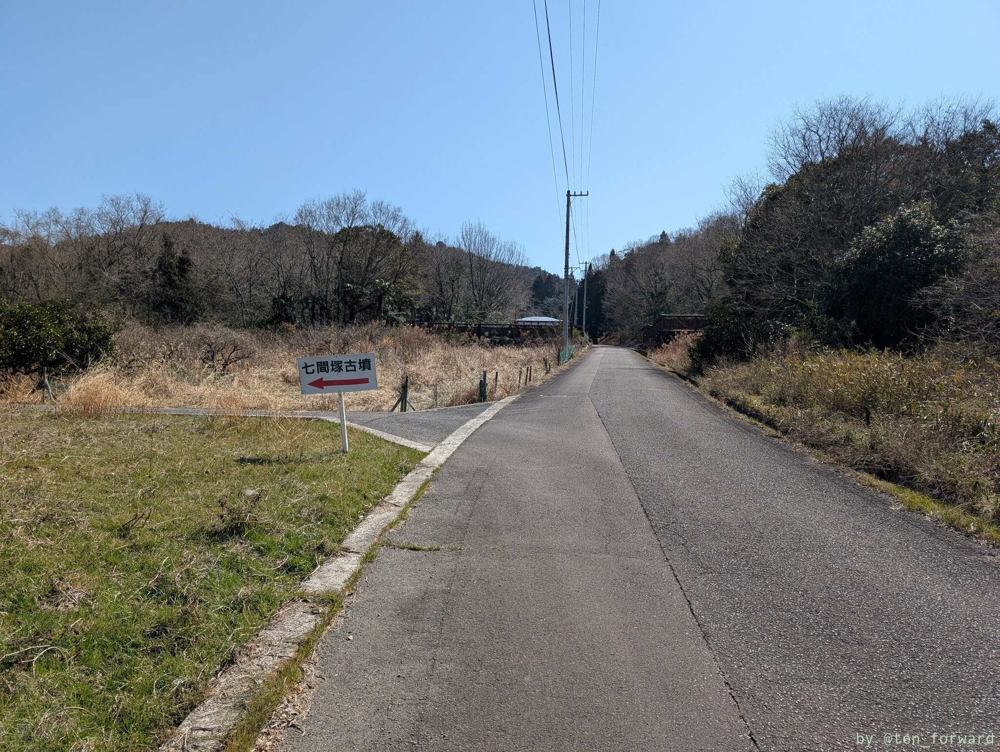

順番で行くと、7→8→10→9→5→3→2→1→12→13→14みたいな感じでしょうか。まあ、ここは適当に本能の赴くままに見学すると良いでしょう（笑）。

そして、美術古墳館でもらったマップに載っている古墳のうち、4 号墳だけわかりませんでした。5 号墳も、私有地っぽいところの中にあって、道路脇の墓地があるのですが、そこに入って裏に回り込むとそれっぽいところがあったので、そこが 5 号墳かなと思っただけで、案内はありませんでした。その他は看板が立っていて、わかりやすかったです。

## 五間塚古墳（12 号墳）

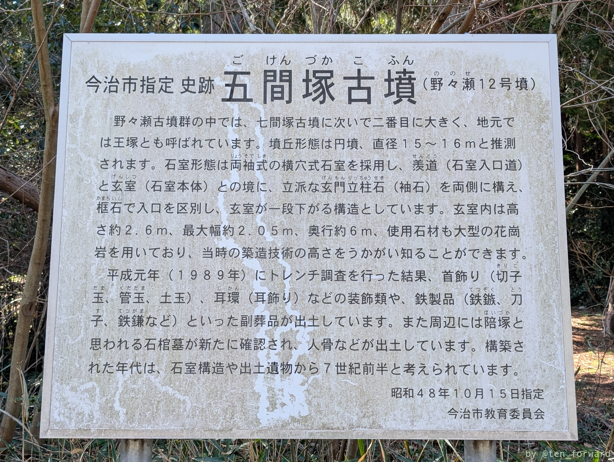

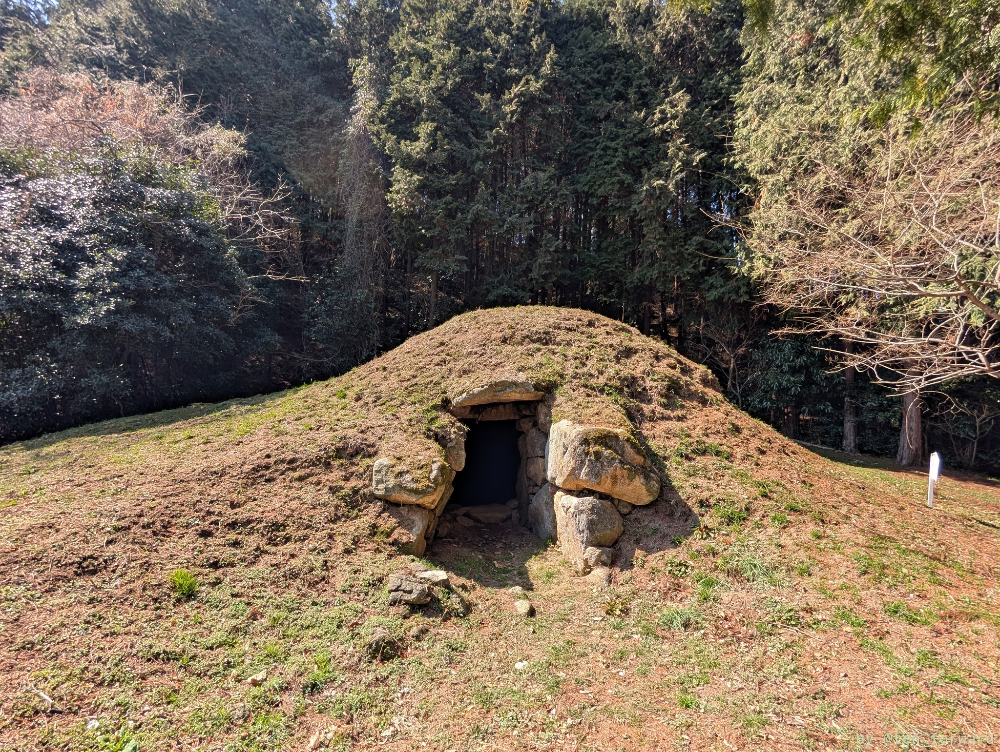
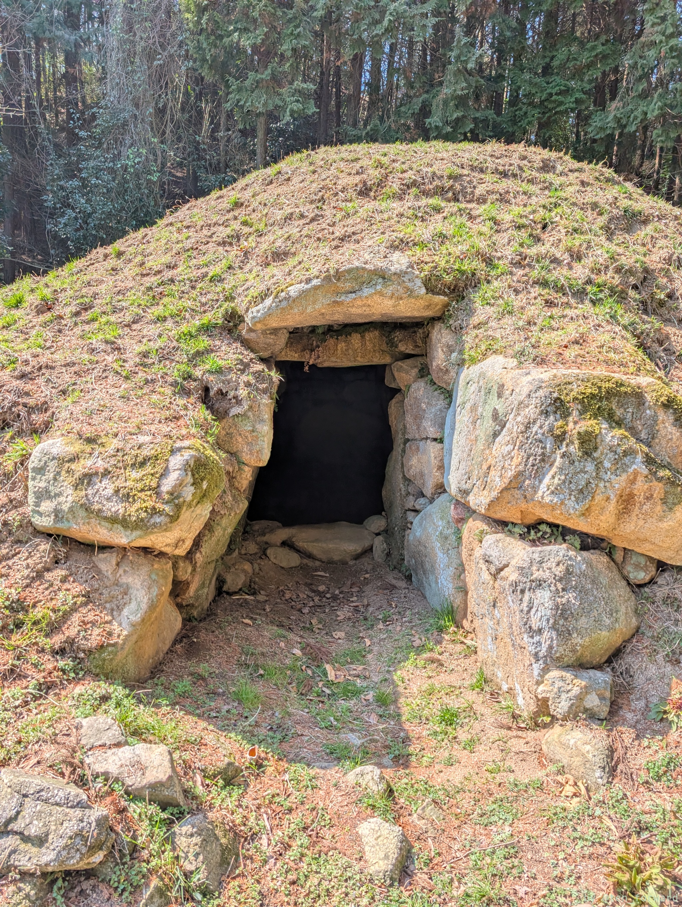

石室に入れます。立派な古墳です。

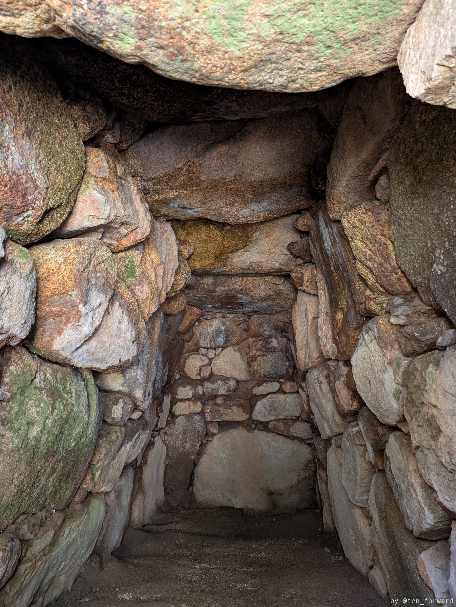
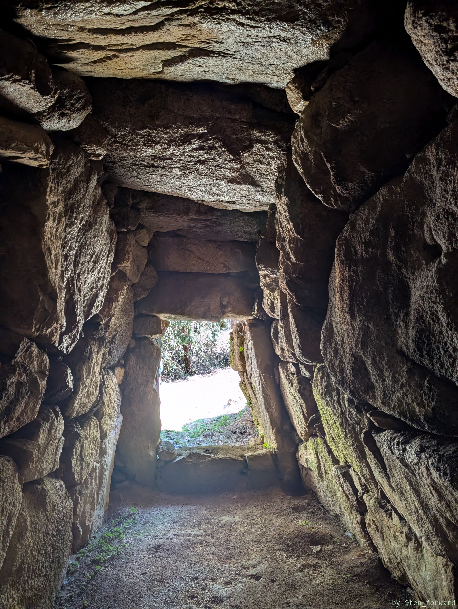
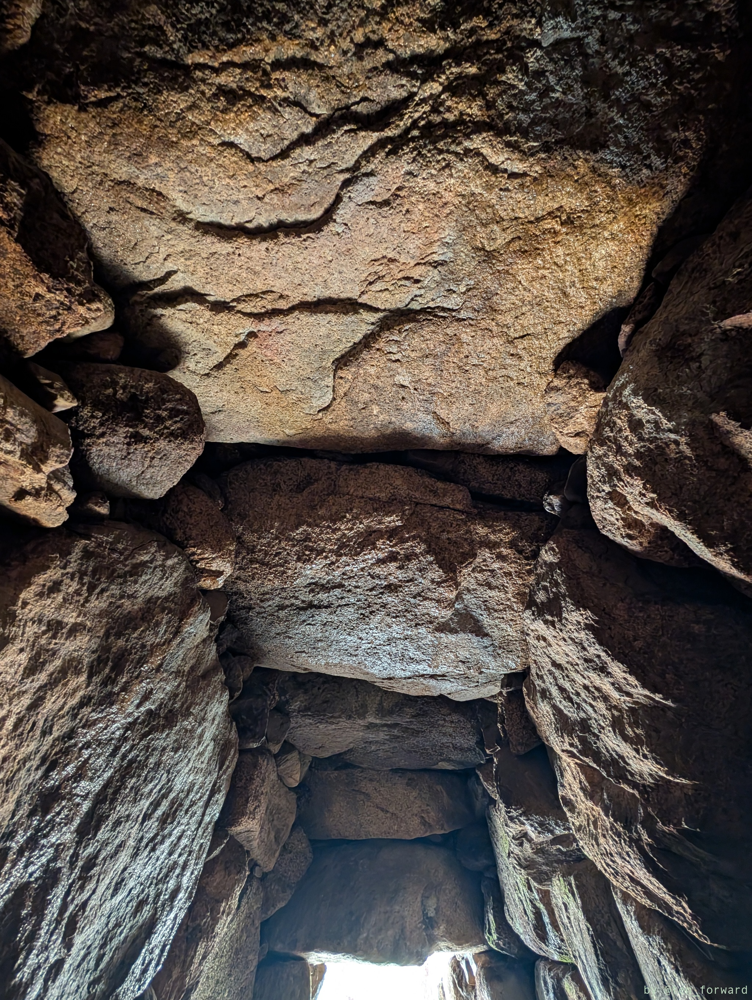

12 号墳の脇には陪塚も残っています。

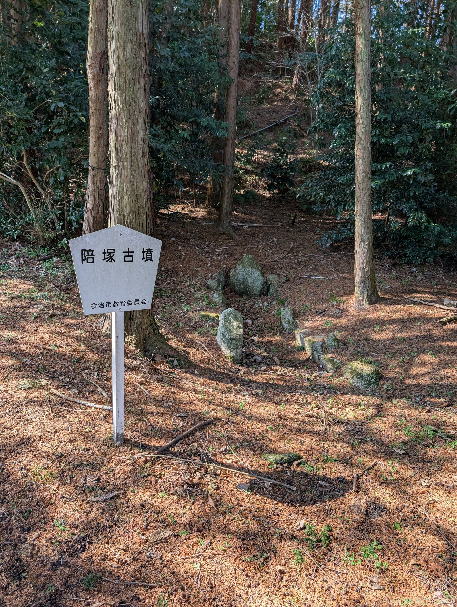
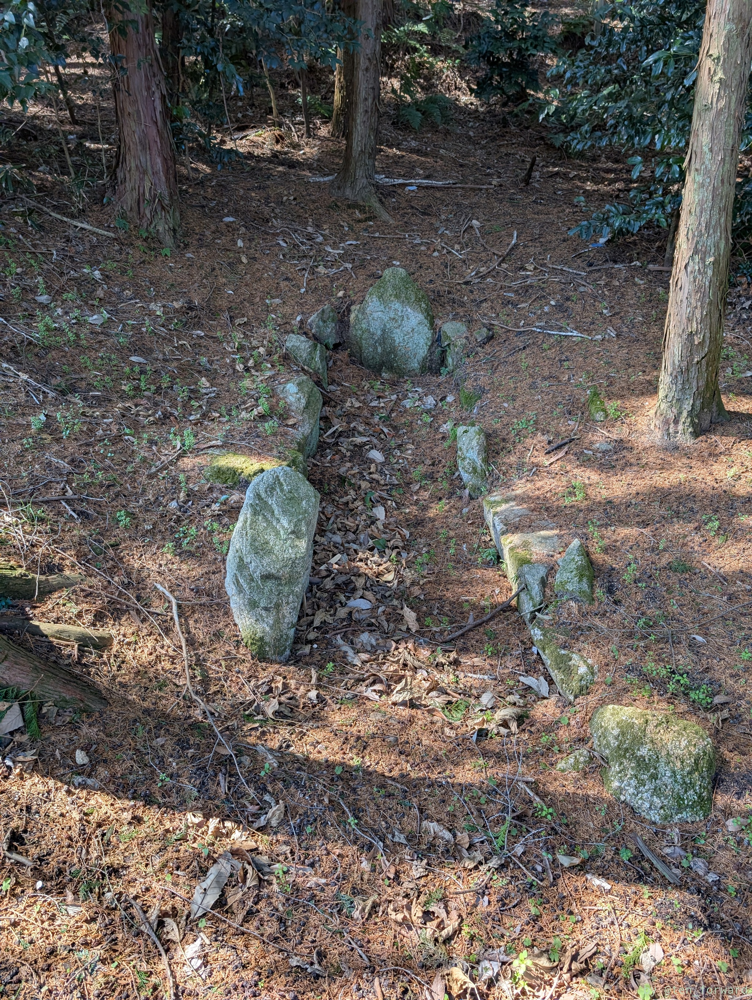

## 10 号墳

五間塚古墳から坂を上がっていくと、途中七間塚古墳への道があり、そのまま坂を上がっていくと 10 号墳が見えてきます。

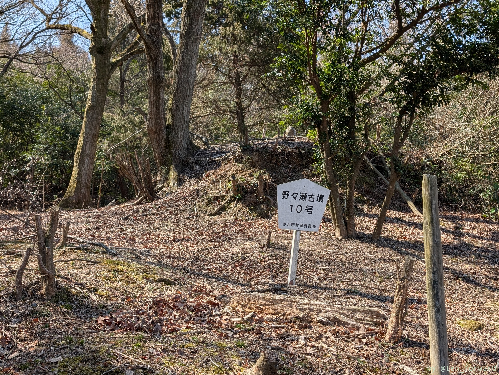
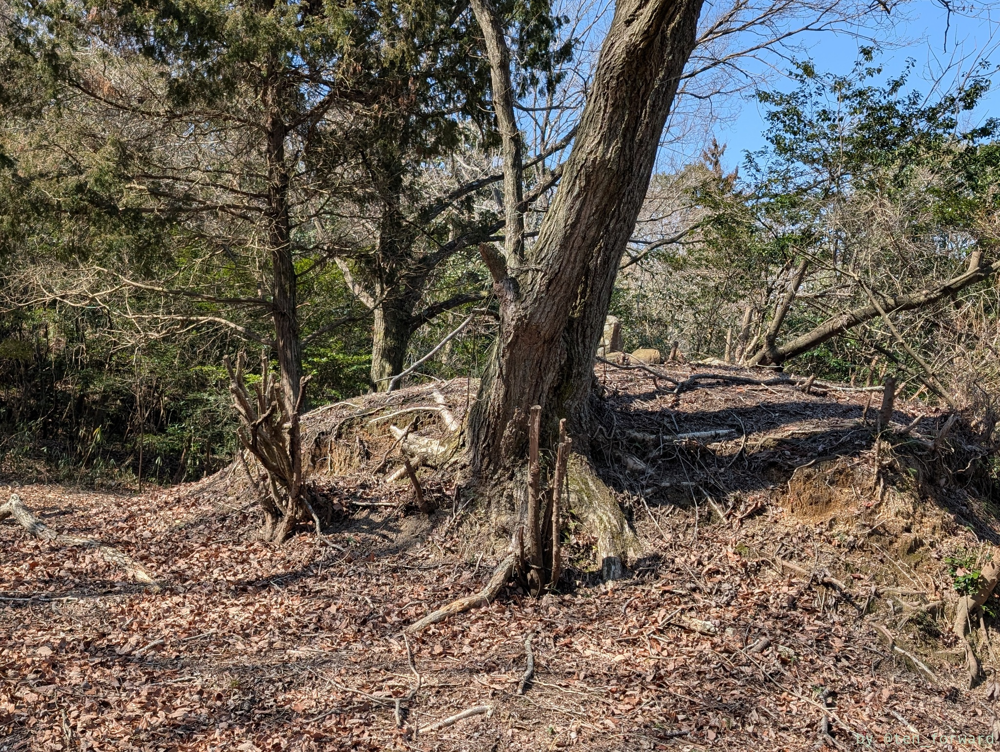
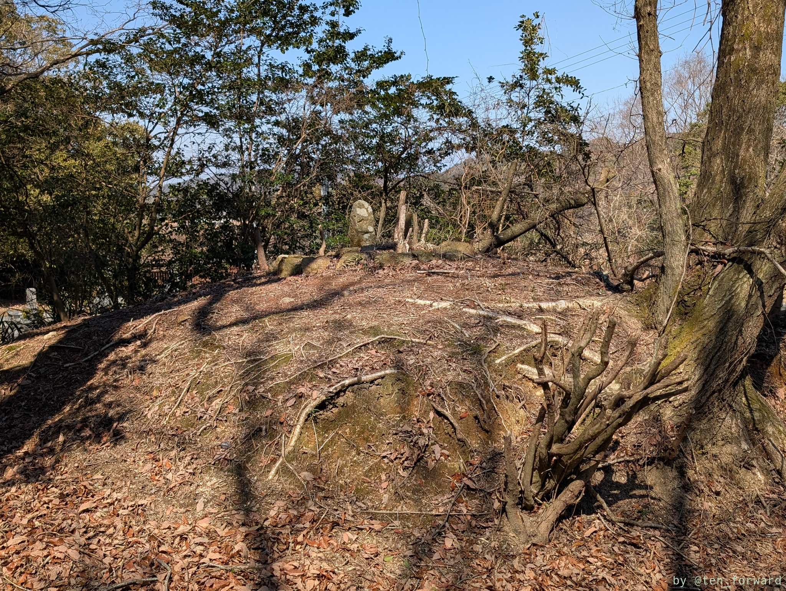

古墳自体、今も木が残っていますが、それ以外にもたくさん気が生えていたようですね。

（続く）

