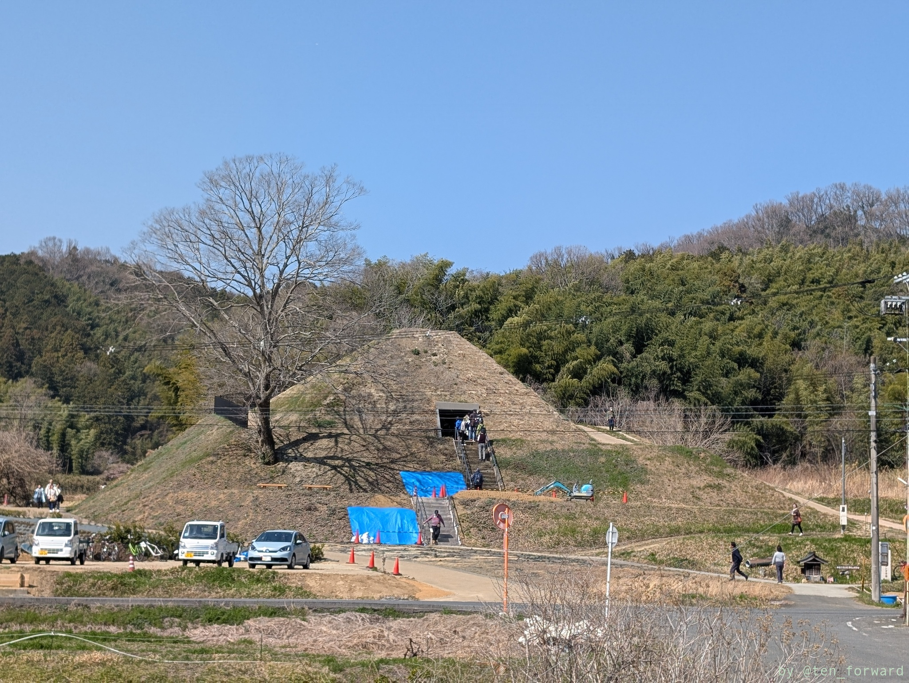
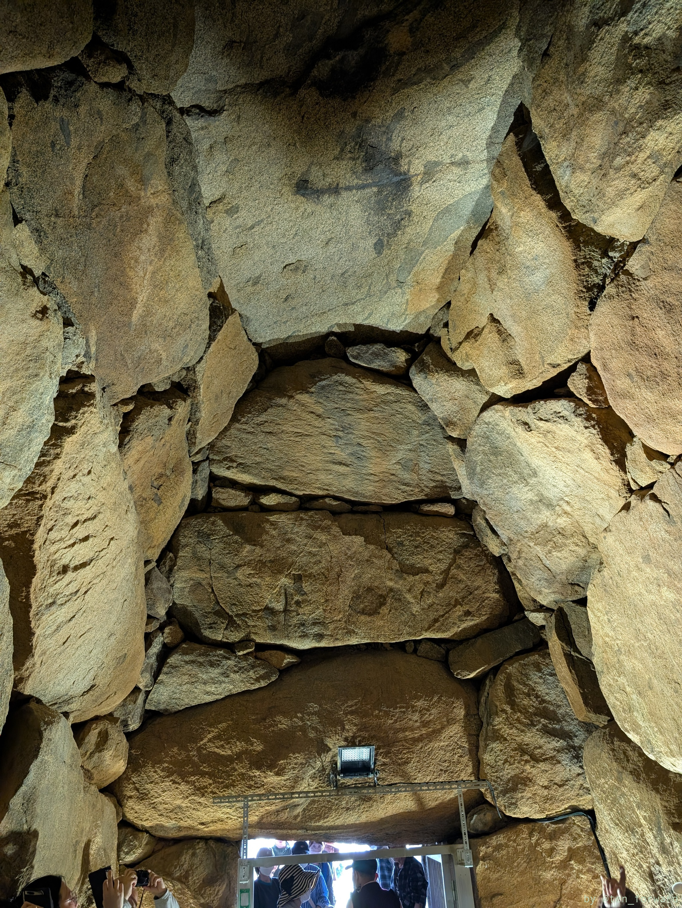
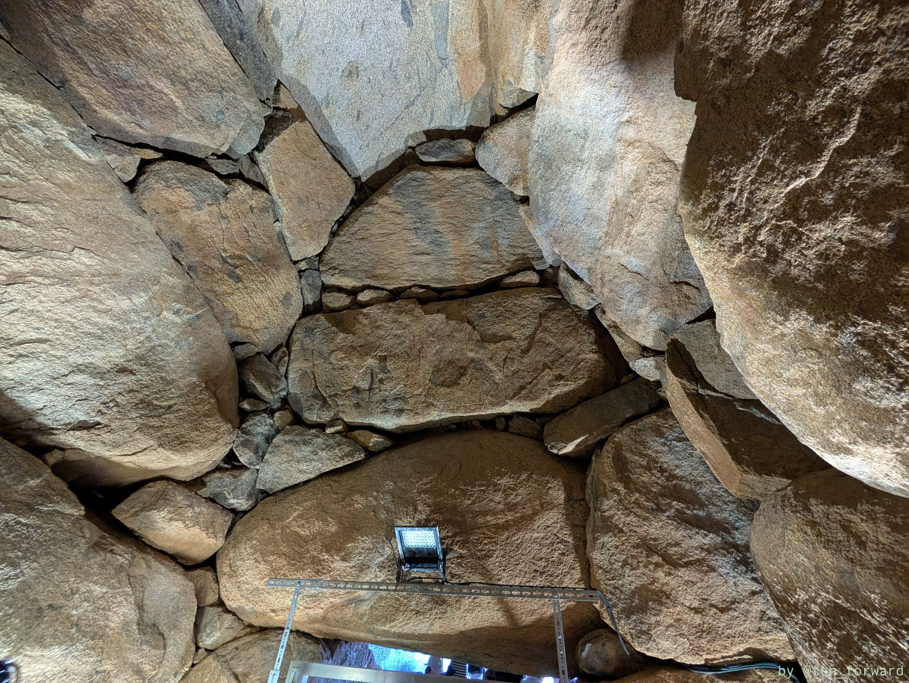
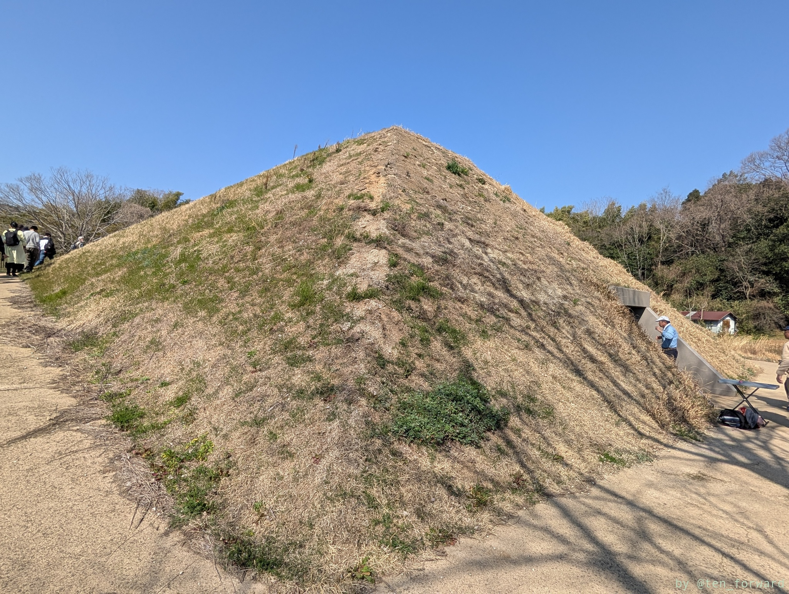
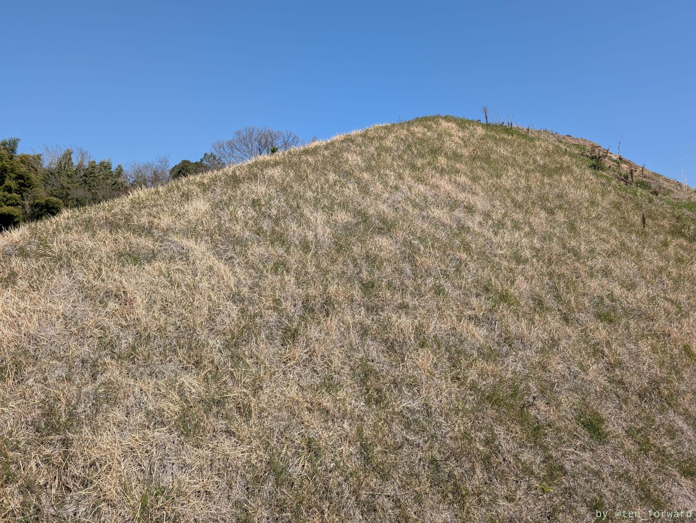
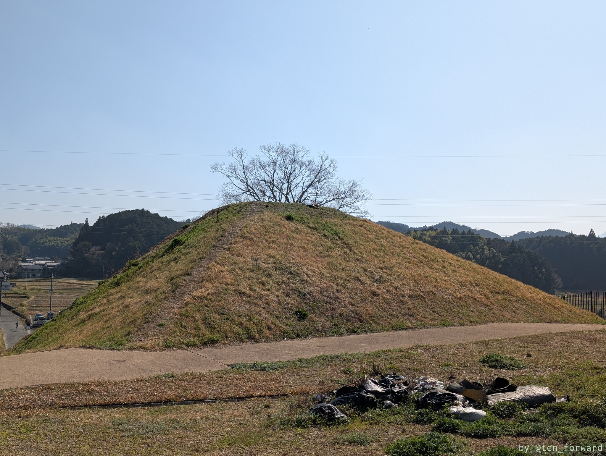

[高取古墳の日2025](https://sightseeing2.takatori.info/kofunday2025/) で 4 つほどの古墳の石室が公開されるということで行ってきました。4 つの古墳は時間差で公開でしたので、その順で回ってきました。最初は与楽カンジョ古墳です。

この日は近くの病院の駐車場が開放されていたのでそこに止めています。

20名ずつくらい石室内に入り説明を聞きました。

石室中央には棺台が復元されています。周りの石もきれいに整備されていますね。

天井石は巨石一枚で見事です。石室自体も非常に高くて 5.3m ほどあるようです。

古墳は、元々円墳と思われていたところ、再調査によって 1 辺 36m ほどの方墳であることが確認されたようです。

きれいに整備されており、いい形の方墳が堪能できます。上にも登れますよ。

## 参考

* [カンジョ古墳](https://sightseeing2.takatori.info/kanjyo/) （高取町観光ガイド）
