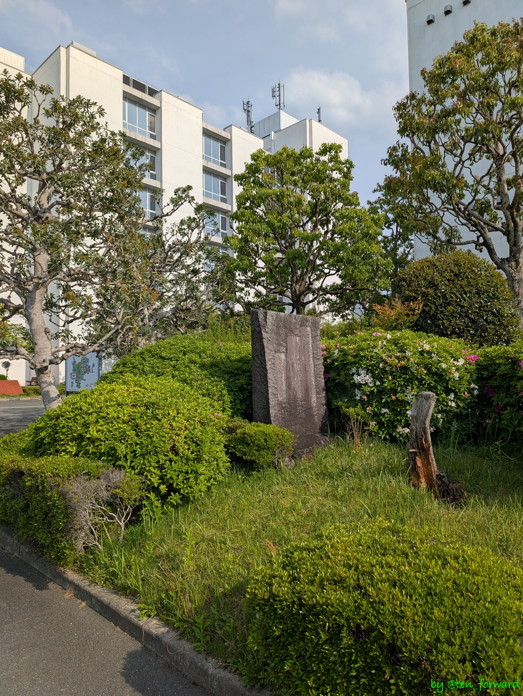
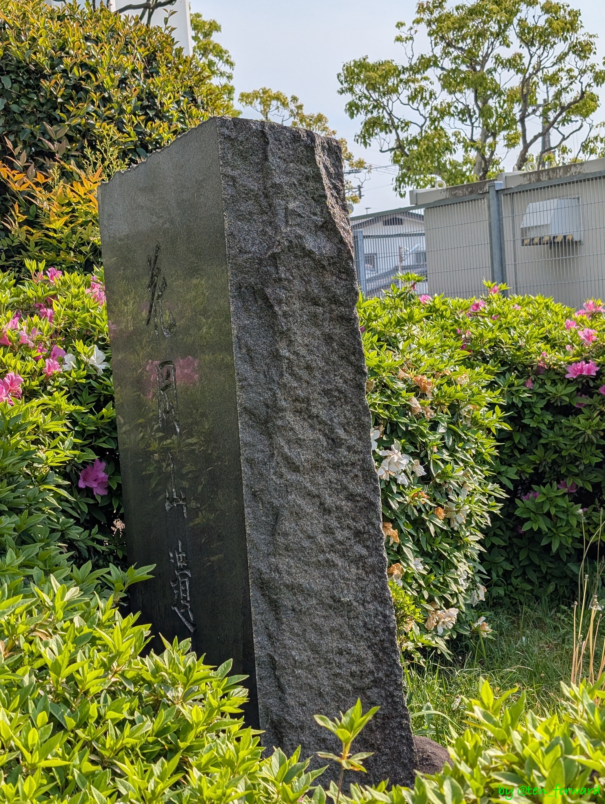
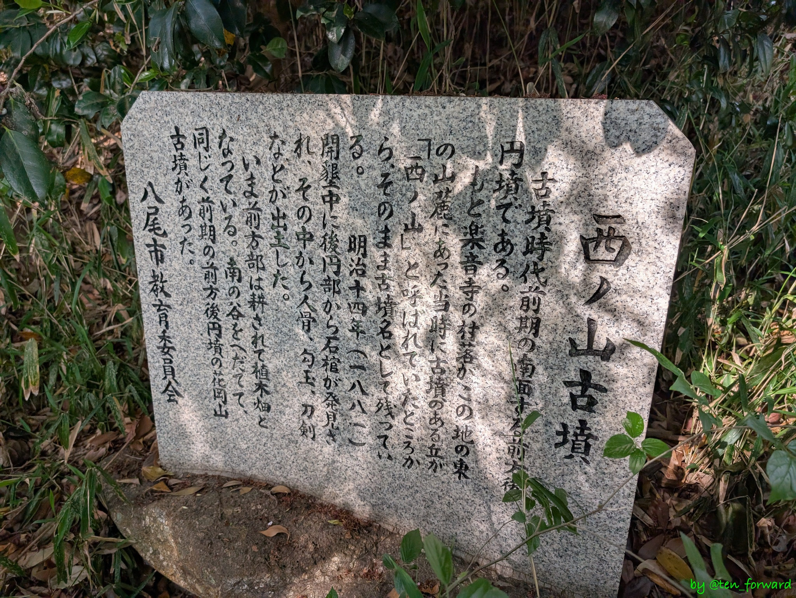
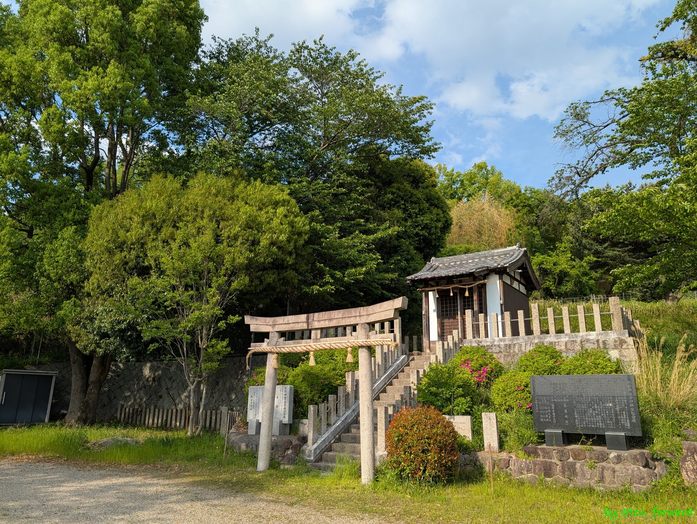
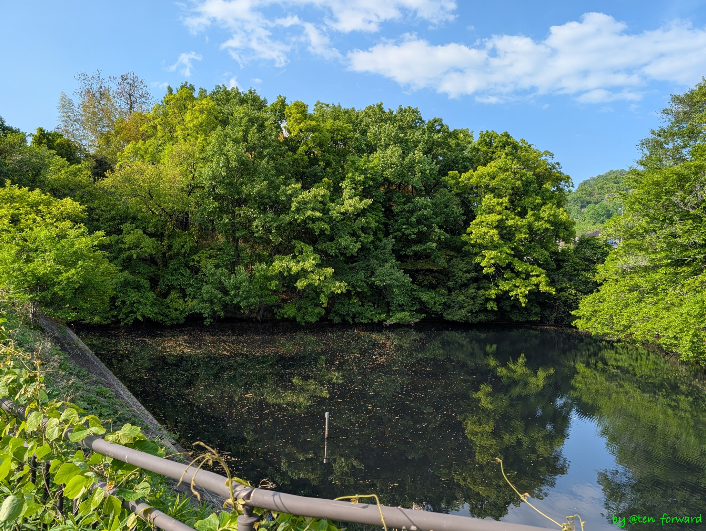
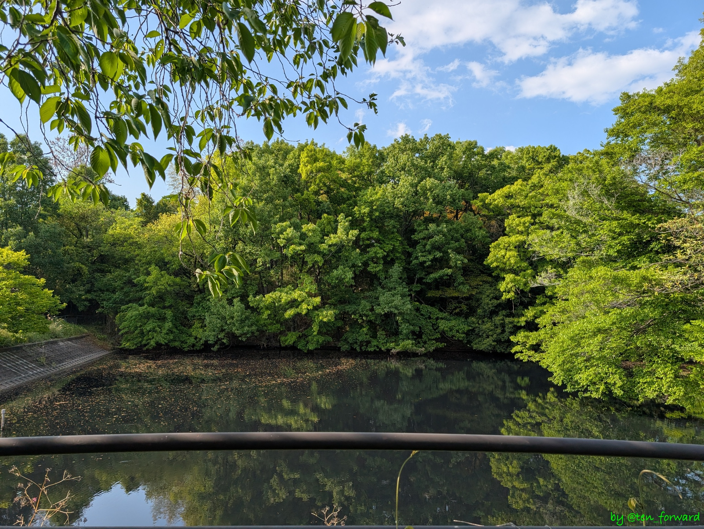
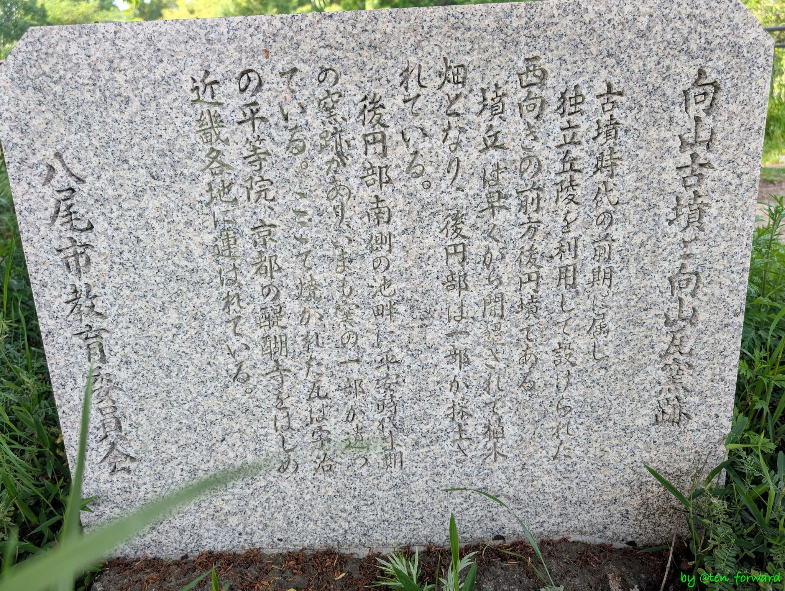
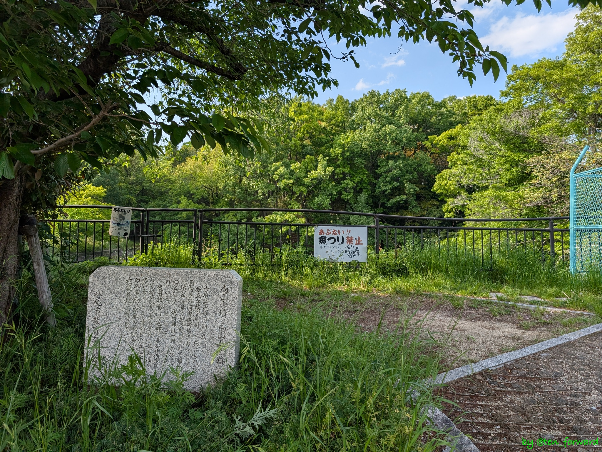

[心合寺山古墳](/post/2025-05-01_shionjiyama/)を観たあとは、散策地図に従い、まわりの古墳を見学しました。

## 鏡塚古墳

そのうち、国道 170 号線の旧道から、しおんじやま古墳学習館へ行く道に入ってすぐの脇の道を進むとあるのが鏡塚（かがみづか）古墳です。

家の間を進む路地の奥にありました。

直径28ｍ、高さ5ｍの円墳ですが、前方後円墳とする説もあるようです。

## 花岡山古墳

近くにある大阪経済法科大学の正門を入った所に石碑があり、そこが花岡山古墳の跡のようです。

## 西ノ山古墳

熊野神社背後にあり、熊野神社に説明板がありますが、古墳についてはよく見えません。色々出土しているようです。全長 55m の前方後円墳とのことです。

## 向山古墳

古墳時代前期の古墳で、このあたりの古墳で一番古い古墳のようです。池をはさんだ向かい側から見学です。

## 参考
* [鏡塚古墳](https://www.sonicweb-asp.jp/yao/feature/27072(th_78)/2597019?theme=th_78&layers=27072(th_78)) （やおデジマップ）
