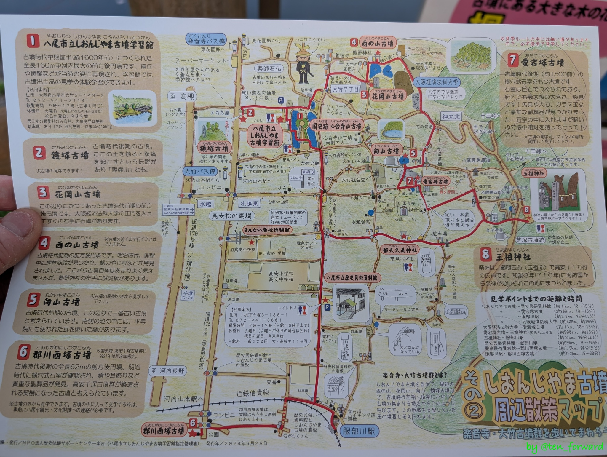
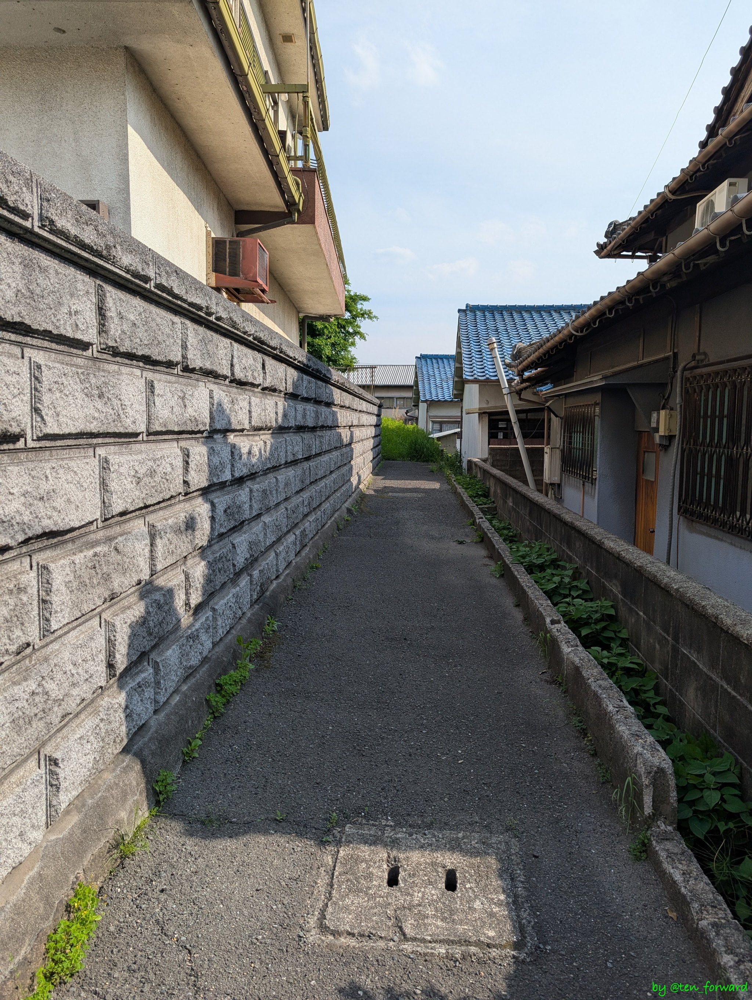
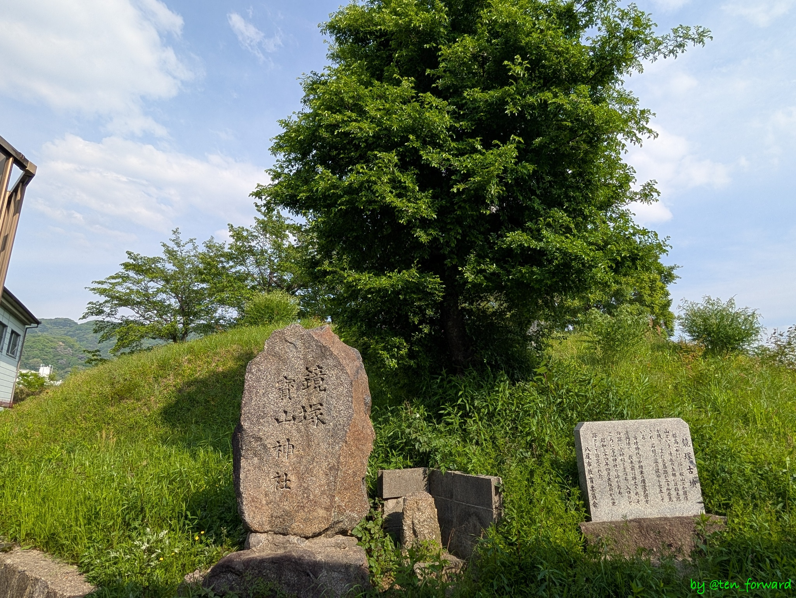
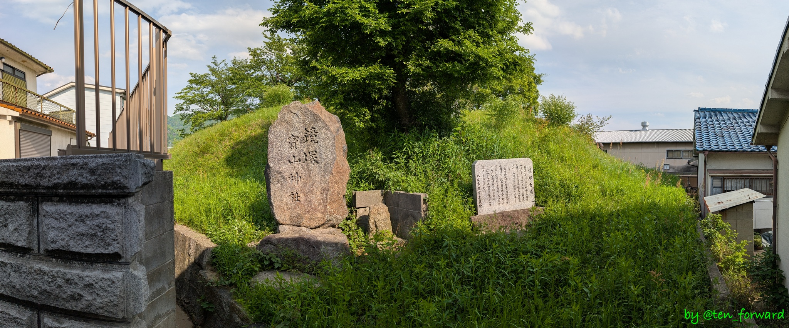
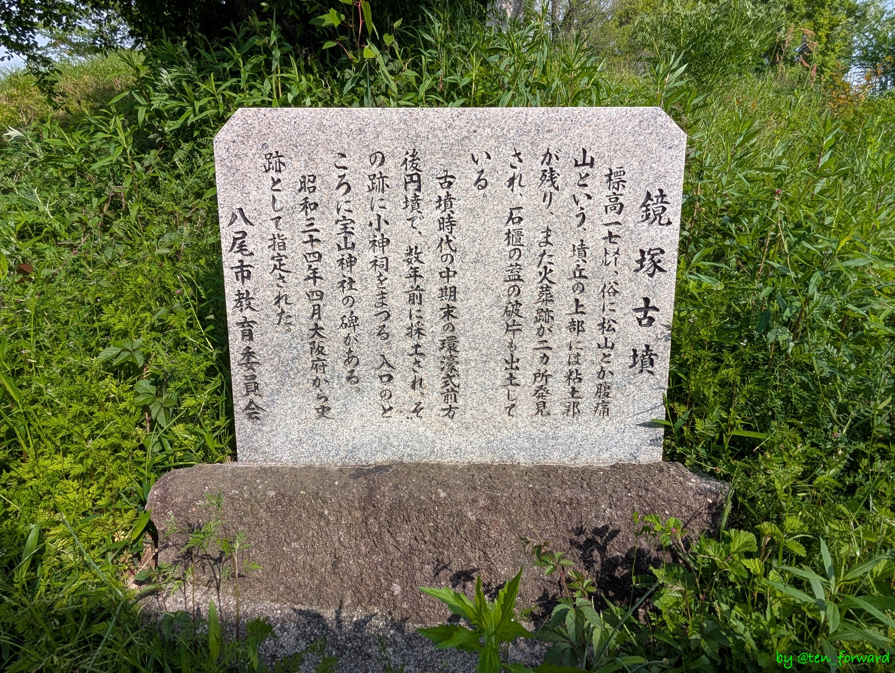
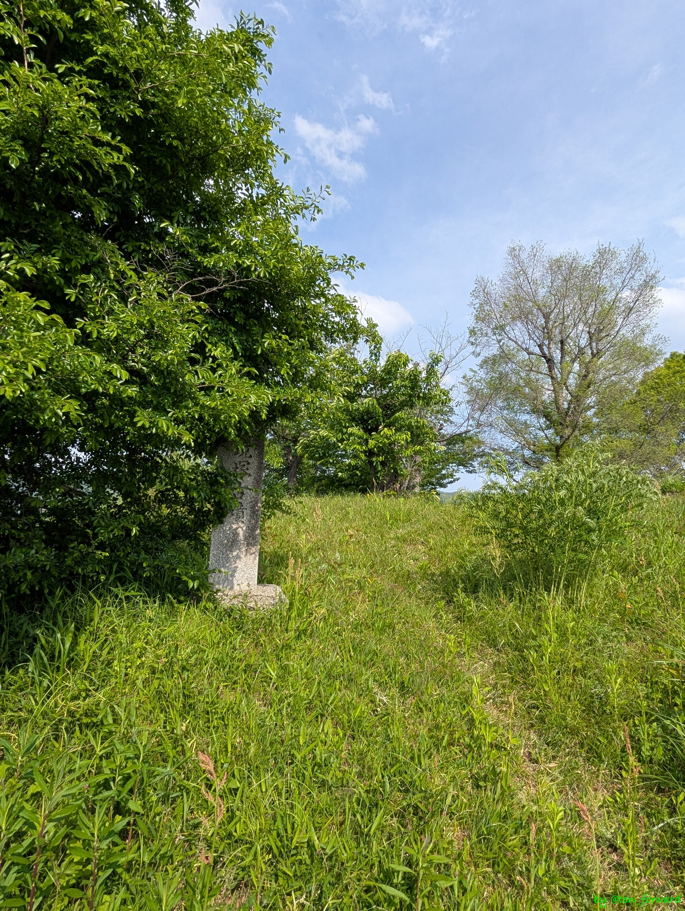
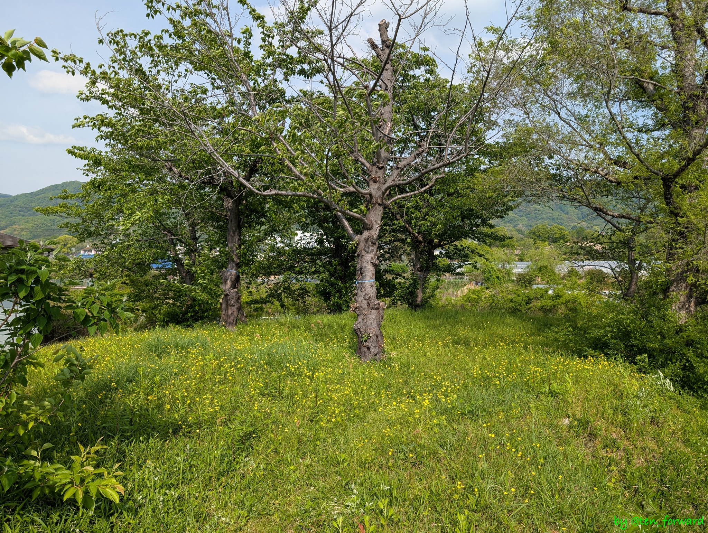

[心合寺山古墳](/post/2025-05-01_shionjiyama/)を観たあとは、散策地図に従い、まわりの古墳を見学しました。

そのうち、国道 170 号線の旧道から、しおんじやま古墳学習館へ行く道に入ってすぐの脇の道を進むとあるのが鏡塚（かがみづか）古墳です。

家の間を進む路地の奥にありました。

直径28ｍ、高さ5ｍの円墳ですが、前方後円墳とする説もあるようです。

## 参考
* [鏡塚古墳](https://www.sonicweb-asp.jp/yao/feature/27072(th_78)/2597019?theme=th_78&layers=27072(th_78)) （やおデジマップ）
