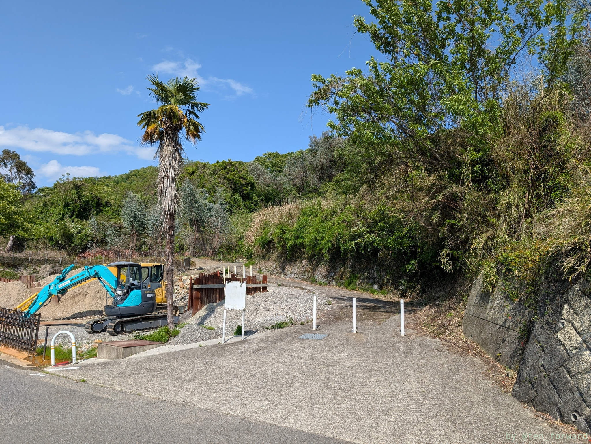
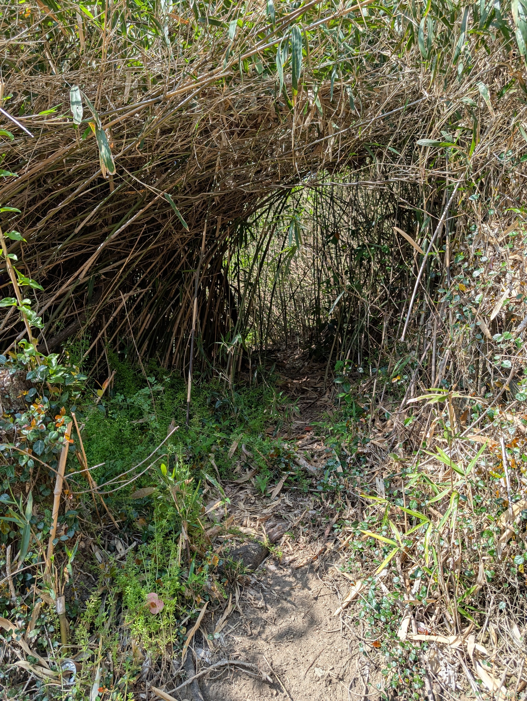
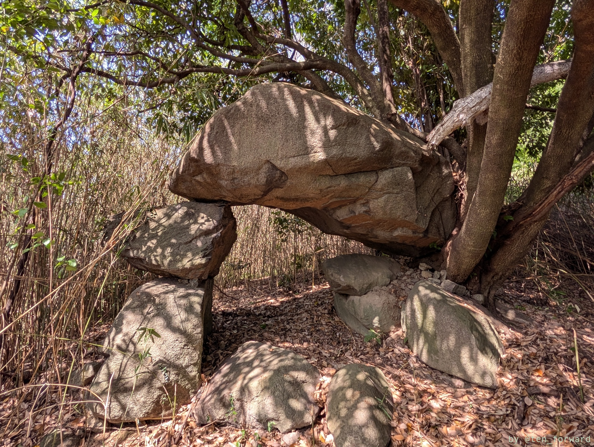
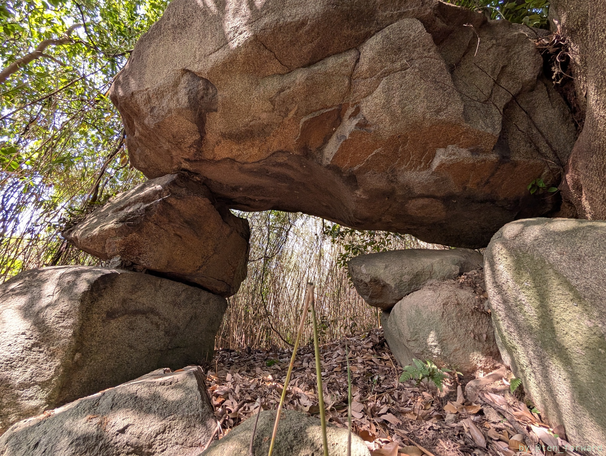
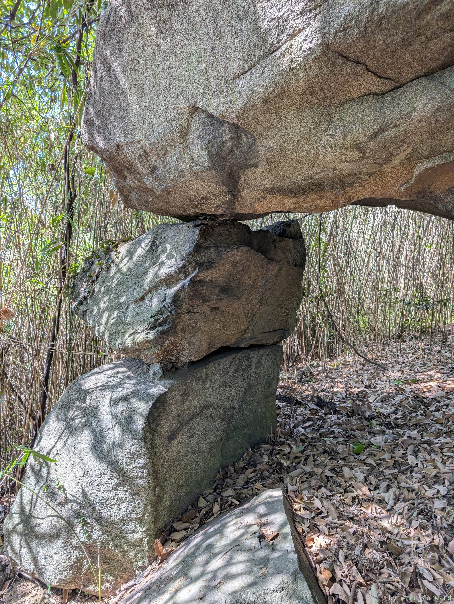
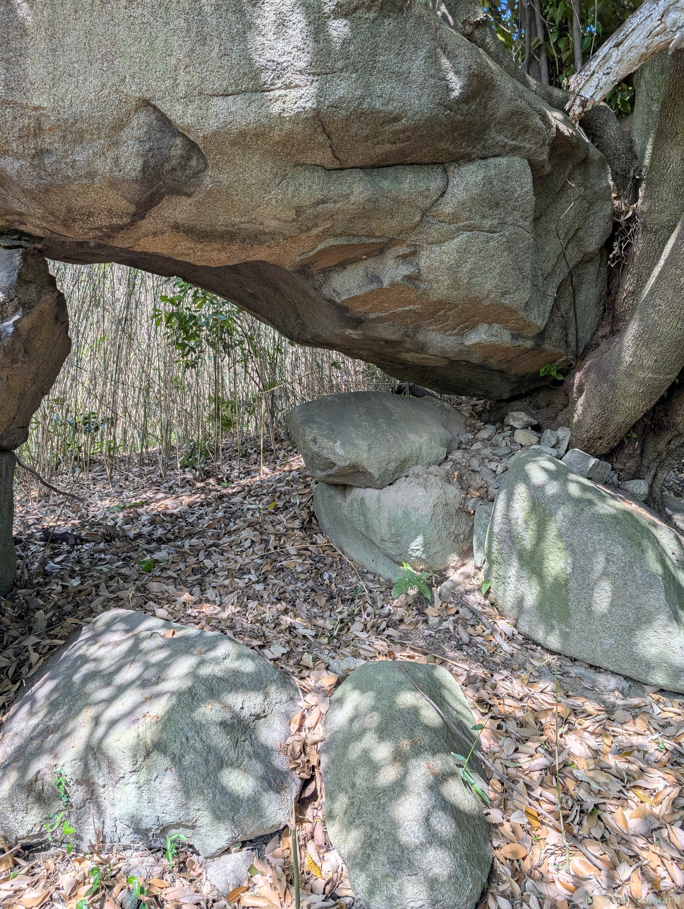
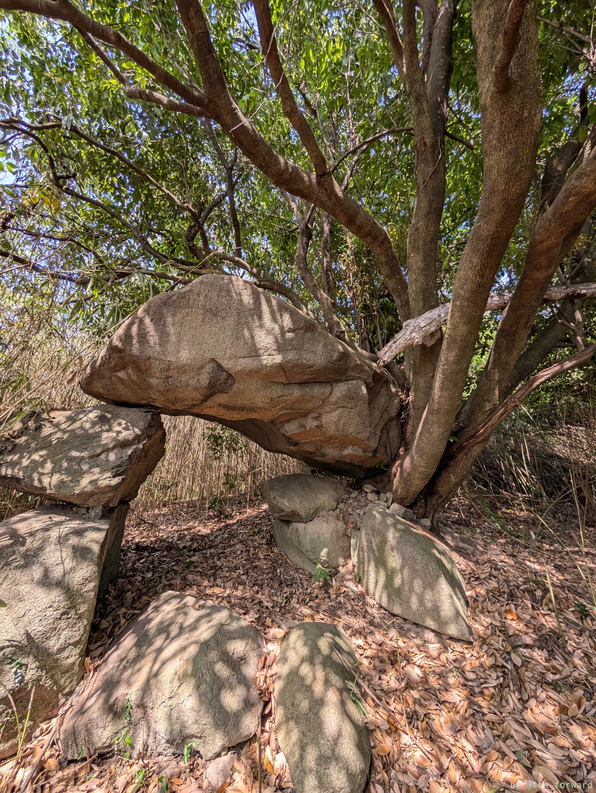
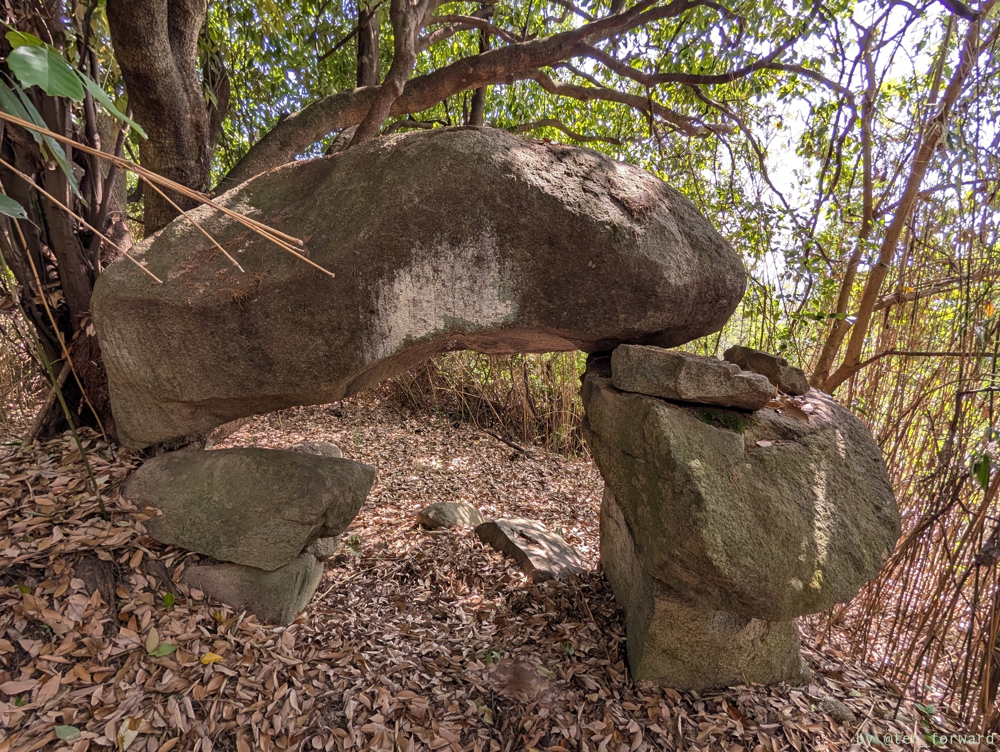

「大窪・山畑」は「おおくぼ・やまたけ」と読みます。

道は「[しおんじやま&高安千塚古墳群散策マップ](https://racco-taiken.com/sionji/coloringbook/sionjimap1takayasu2020.pdf)を見るとわかりやすいでしょう。

## 俊徳丸鏡塚古墳（大窪・山畑 27 号墳）

----
こんな感じの道を歩いていきます。

少し太い農道に出るとこんな擁壁があり、その裏側にあります。開口部が少し見つけづらいかも?

----

## 大窪・山畑 39 号墳

## 大窪・山畑 36 号墳（河内ドルメン）

[ドルメン](https://ja.wikipedia.org/wiki/%E6%94%AF%E7%9F%B3%E5%A2%93)風なので「河内ドルメン」という名前があるようですが、墳丘が失われて、羨道の一部が残っている古墳のようです。

シュロの木と白いポールが立っているのが目印で、ポールを越えて上がっていきます。すると、左側に薮があるものの、少しトンネルのように道っぽくなっているところを入っていきます。結構ちゃんと進むべき方向がわかるので難易度は低いですが、夏は無理かもしれません。晩秋〜冬〜春にかけていきましょう。

薮のトンネルをくぐると急に視界が開けて、大きな石組みが現れます。すごい迫力!!

