近鉄瓢箪山駅すぐの瓢箪山稲荷神社脇にある瓢箪山古墳（山畑 52 号墳）に行ってきました。車で行ったのですが、大阪東部にありがちな細い道で、最後曲がり角は大きな車だと結構ギリギリな感じでした。（このあと近くのカフェに行こうとしてあまりにも道が細くて断念w）

神社前の駐車場に車を止めて見学です。

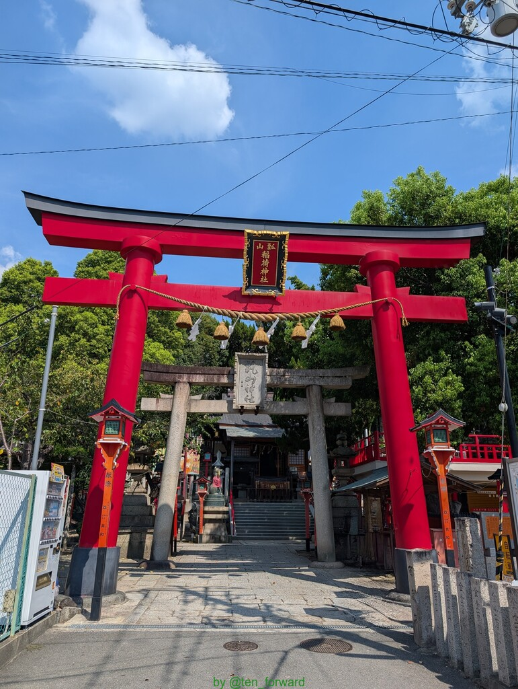
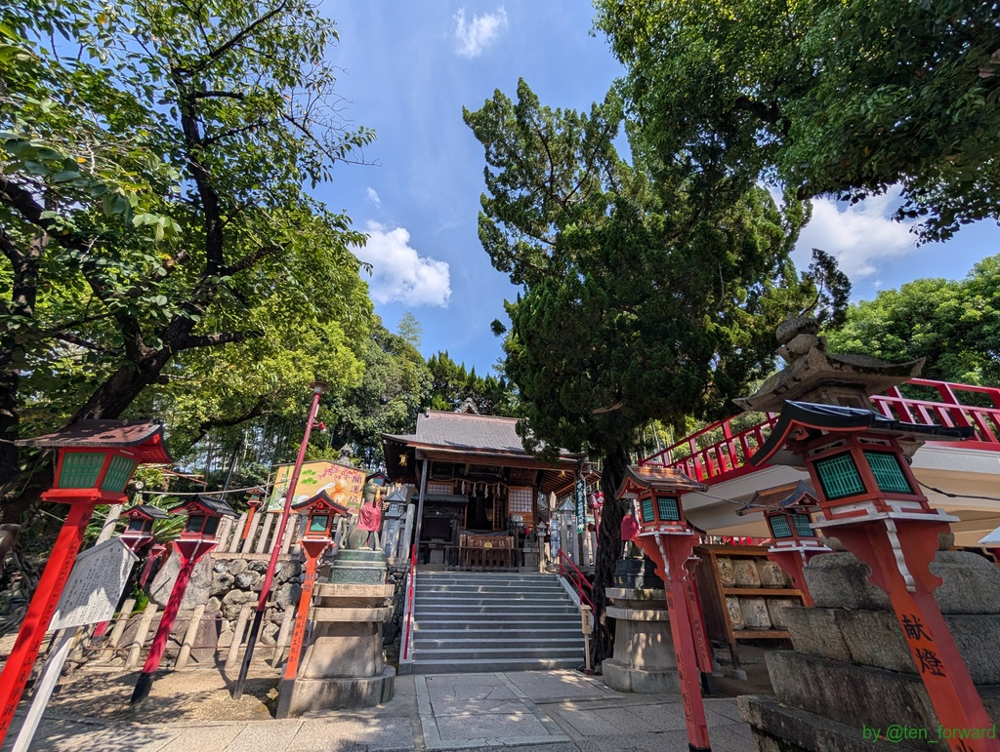

この古墳、双円墳という珍しい形で、そのくびれ部分に神社があるという感じです。古墳自体には上がれなくて、ぐるっと一周回って見学です。

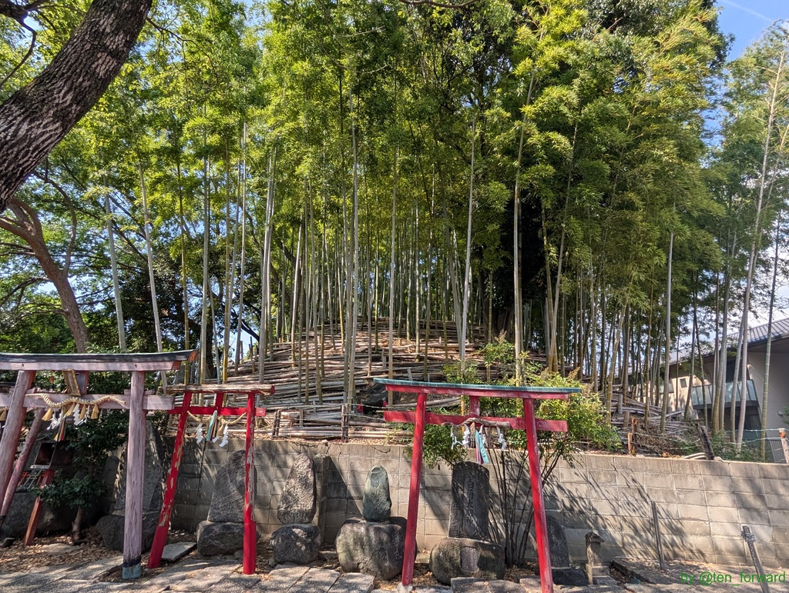
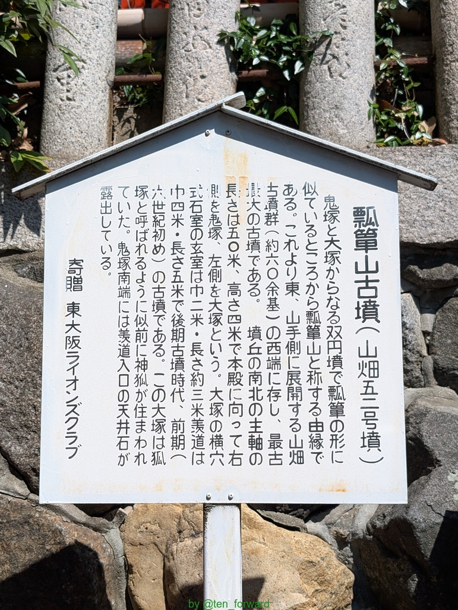

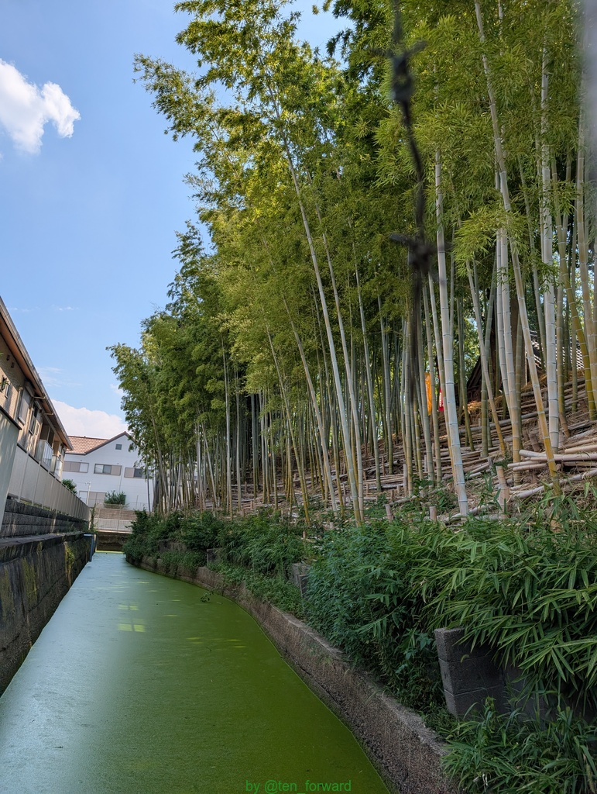
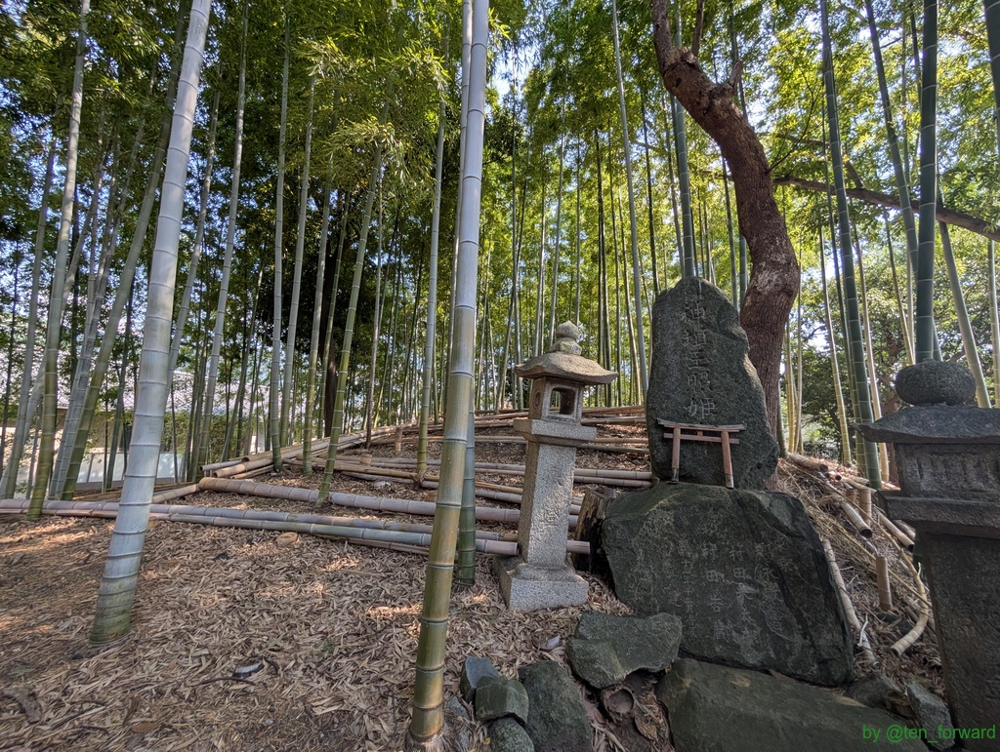

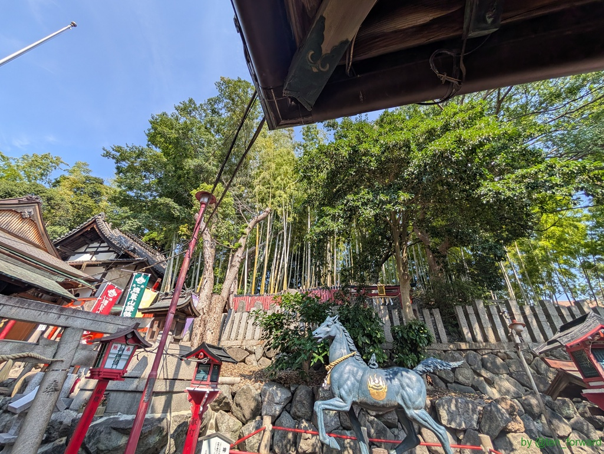
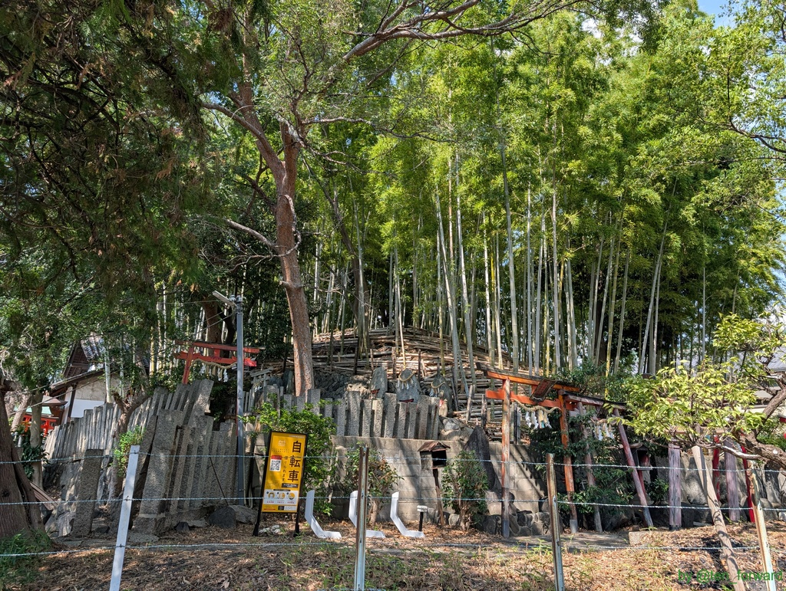

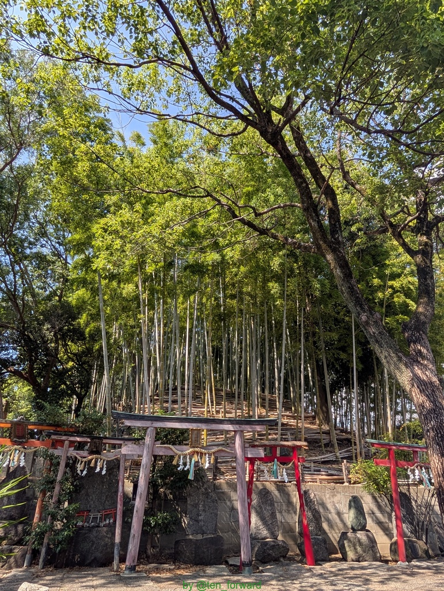
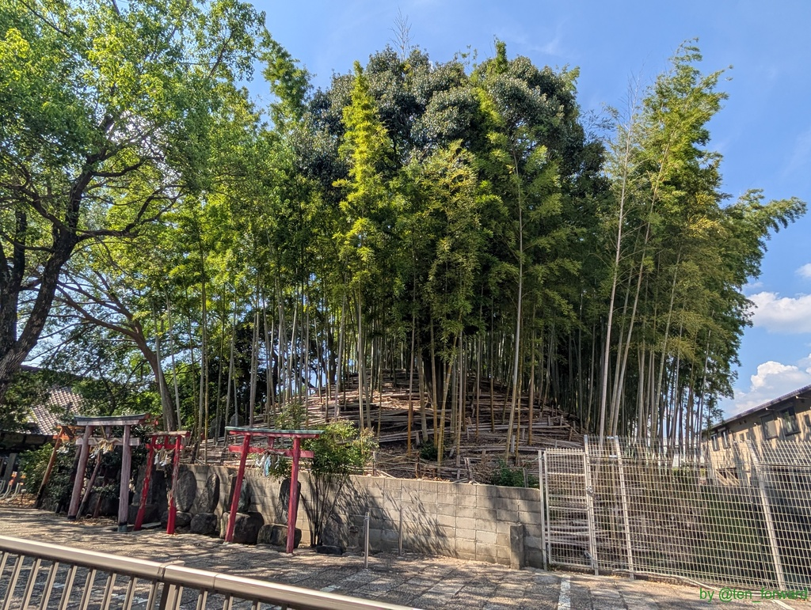
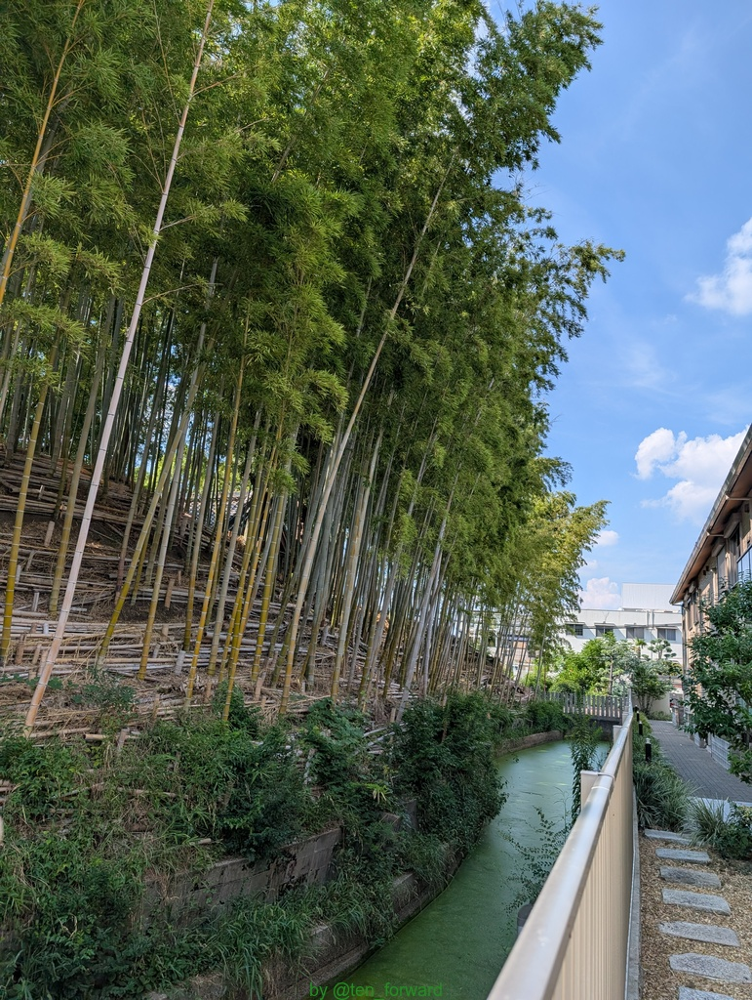
