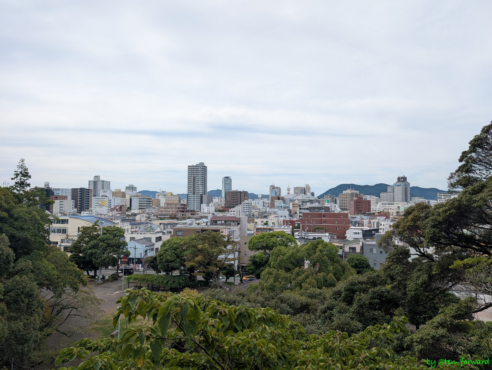
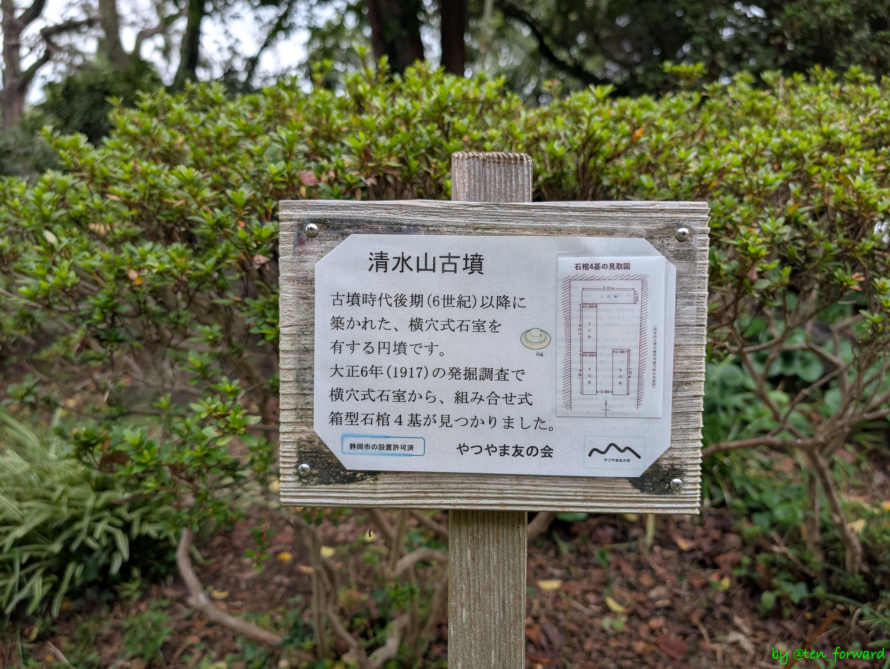
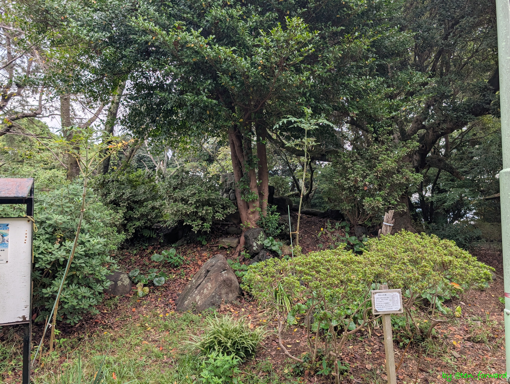
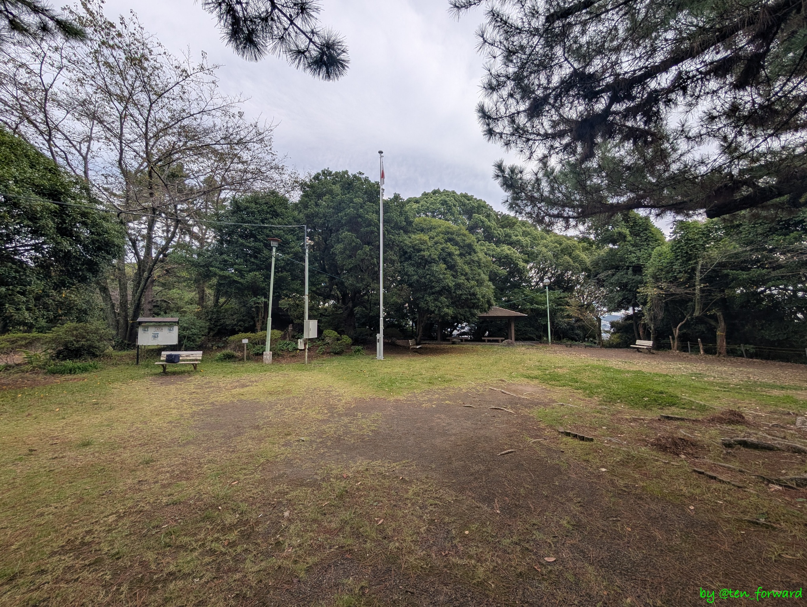
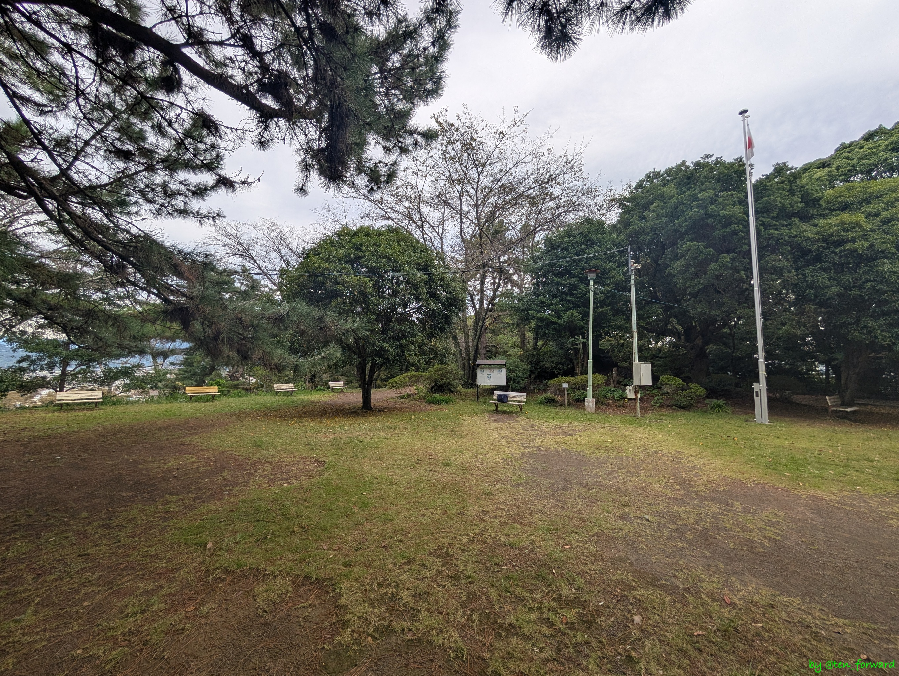

この日は[フェス](https://magma.progrock.jp/music/?p=9241)に参加するために静岡にいました。朝、ホテルをチェックアウトしたあと、さわやかの予約を取ると 1 時間半ほどあとになったので、スマホで検索すると電車で一駅のところに古墳があるっぽいので行ってみました。

フェスに参加するために同じく静岡にいて、さわやかの予約を一緒に取った T さんもご一緒していただきました。

新静岡駅から一駅の音羽町駅で降りて、少し歩くと清水山公園があり、そこの中の小山を登ると古墳がありました。

墳頂には石碑が立っていました（って写ってないなw）。

