京都府南丹市にある園部黒田古墳に行ってきました。京都縦貫自動車道の園部 IC を降りて少し車を走らせるとあります。

古墳自体は工場の隣で工場へのアクセス道に沿ってあります。駐車場はないので、近くの道路に止めるしかないです。

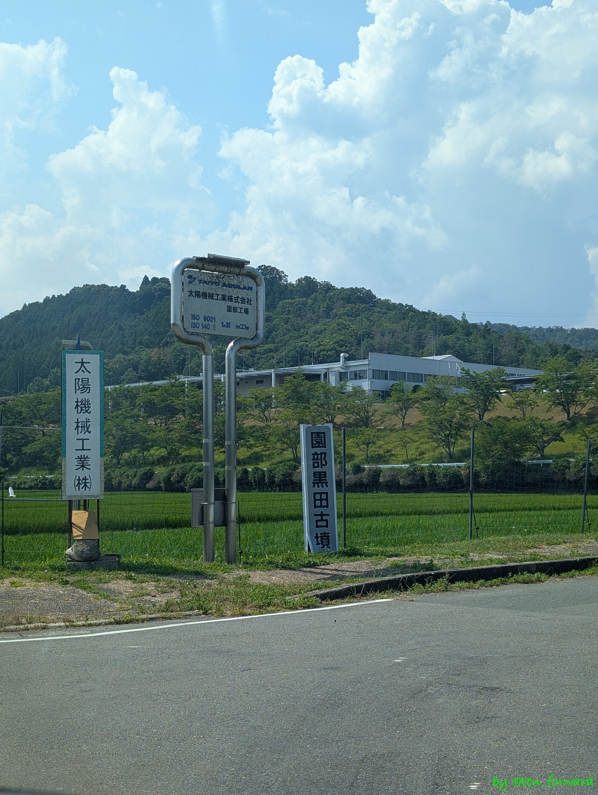
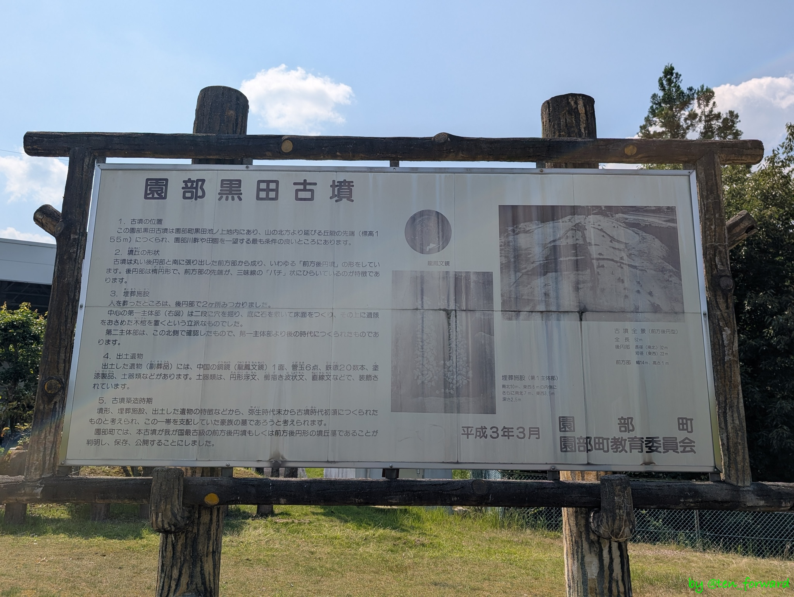

交差点で曲がって少し進むと立派な古墳が見えてきます。古墳は後円部が北東向きに、前方部が南西に向いています。全長 52m の前方後円墳です。

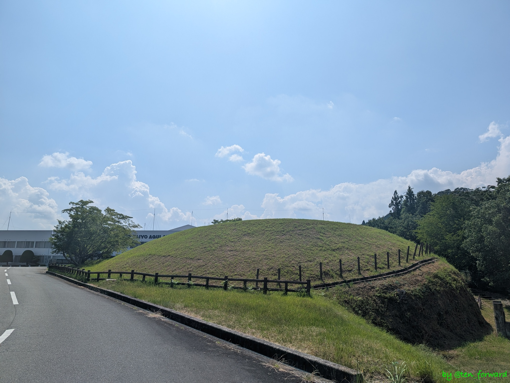
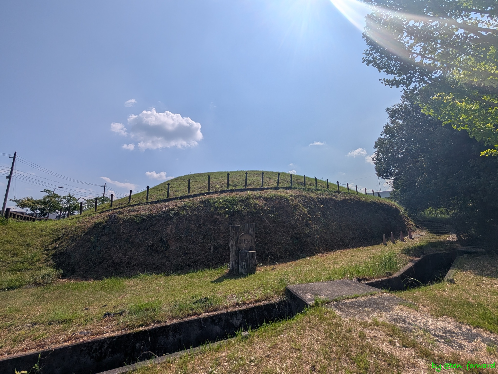

築造は 3 世紀前半〜中頃と結構古いようですね。古墳からは 2 世紀の中国製の鏡が出土しています。

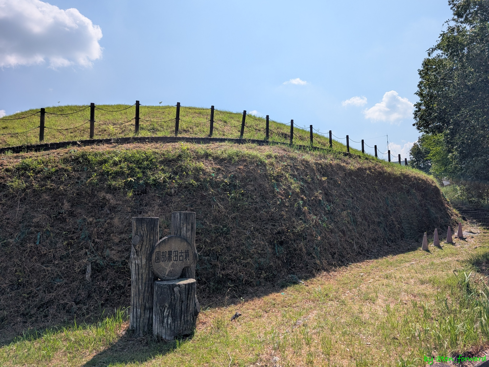
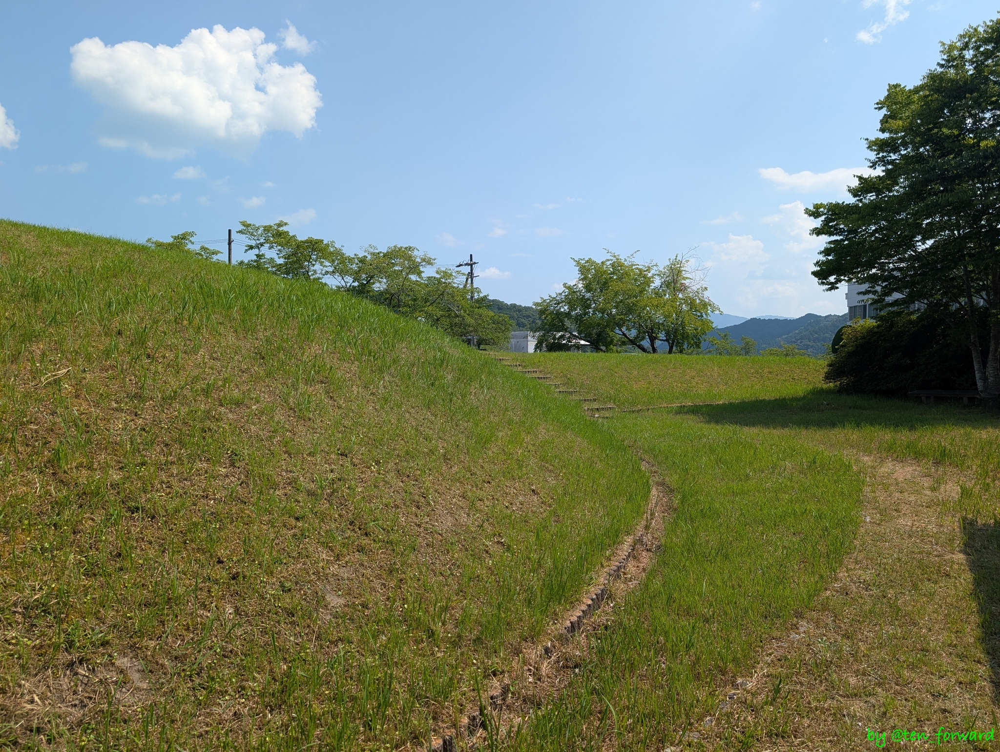

古墳をぐるっと回れますし、登ることもできます。

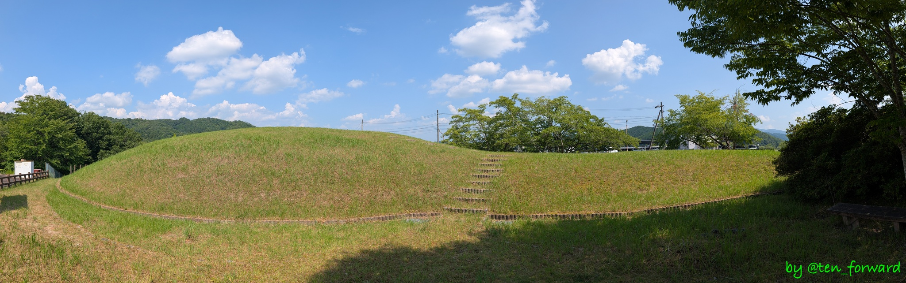
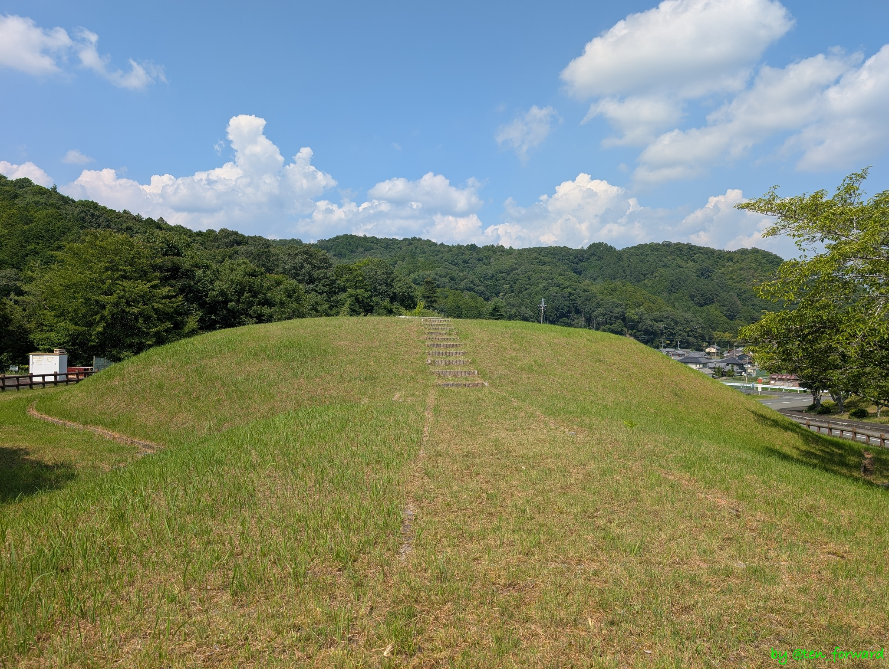

うーん、いい形です。

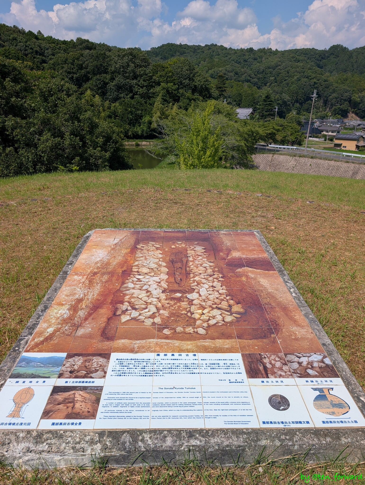
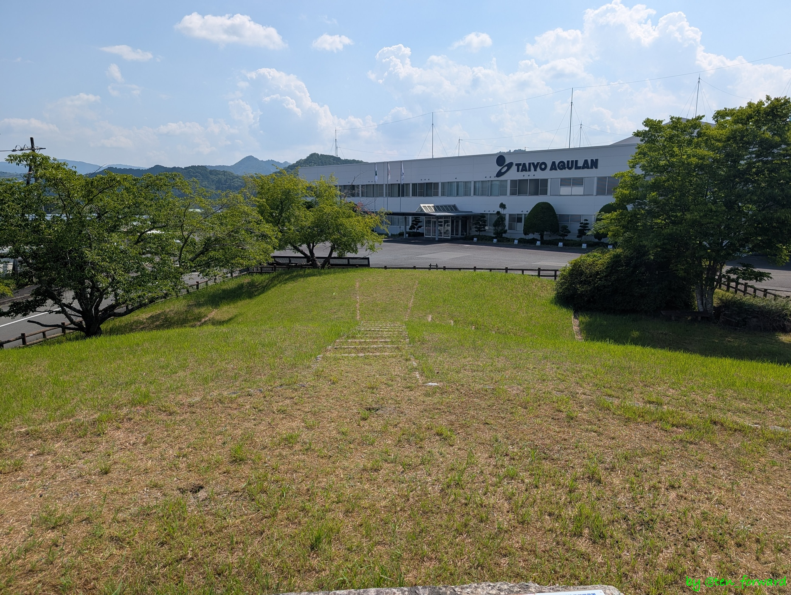

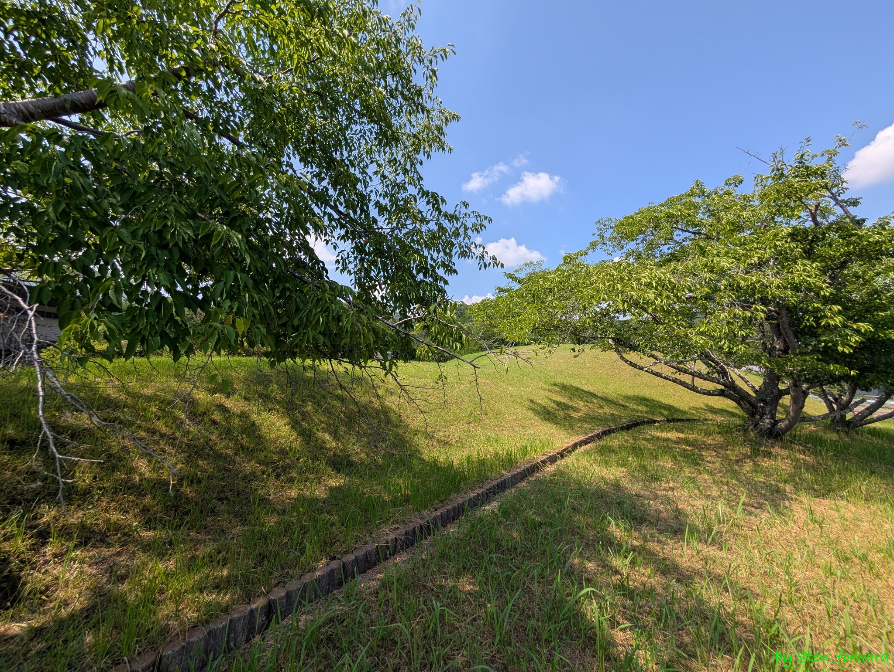
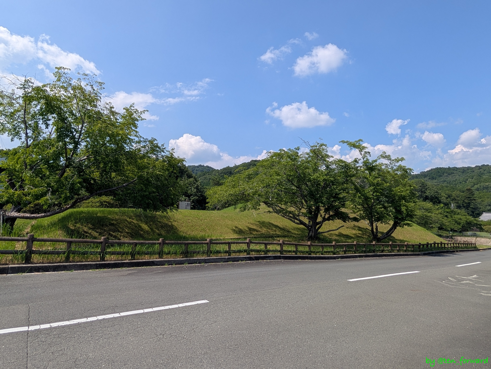

良い古墳でした。
